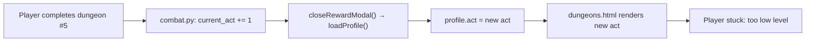
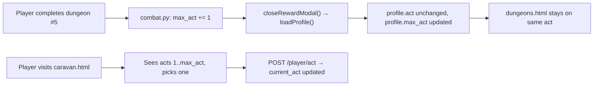

# Act System & Shop Fixes

## Problem analysis

### Act auto-switching

In `[services/combat.py](src/waifu_bot/services/combat.py)` lines 1022-1023, completing dungeon #5 immediately increments `player.current_act`. Then `closeRewardModal()` in `app.js` calls `loadProfile()` and re-renders the dungeon list for the new act — but the player may not be high enough level to play any dungeon there.

`caravan.html` currently contains only a placeholder; there is no act-switching API or UI implemented yet.

The root cause: `current_act` serves two conflicting roles — "which act is unlocked" (access control) and "which act the player is currently playing" (display/selection). These must be separated.

### Data flow (current, broken)




### Data flow (target)




---

## Changes

### 1. DB model — `[db/models/player.py](src/waifu_bot/db/models/player.py)`

Add `max_act` column (default = current_act value):

```python
max_act: Mapped[int] = mapped_column(Integer, default=1, nullable=False)  # highest act unlocked
```

`current_act` remains as the player's selected/displayed act.

### 2. Alembic migration — new file `alembic/versions/0020_add_max_act.py`

```python
op.add_column('players', sa.Column('max_act', sa.Integer(), nullable=False, server_default='1'))
# Back-fill: max_act = current_act for all existing rows
op.execute("UPDATE players SET max_act = current_act")
```

### 3. `[services/combat.py](src/waifu_bot/services/combat.py)` — line 1023

Change from incrementing `current_act` to incrementing `max_act`:

```python
# BEFORE
player.current_act = min(5, int(player.current_act) + 1)
# AFTER
player.max_act = min(5, int(player.max_act) + 1)
```

### 4. `[services/dungeon.py](src/waifu_bot/services/dungeon.py)` — line 219

Access control should allow any unlocked act (up to `max_act`), not just the currently selected one:

```python
# BEFORE
if pl <= 0 and dungeon.act > player.current_act:
# AFTER
if pl <= 0 and dungeon.act > player.max_act:
```

### 5. `[api/schemas.py](src/waifu_bot/api/schemas.py)`

Add `max_act` to `ProfileResponse`:

```python
max_act: int = 1
```

### 6. `[api/routes.py](src/waifu_bot/api/routes.py)`

- In `GET /profile` (line 628): add `max_act=player.max_act`
- Add new endpoint:

```python
@router.post("/player/act")
async def set_player_act(act: int, ...):
    # Validate: 1 <= act <= player.max_act
    player.current_act = act
```

### 7. `[webapp/caravan.html](src/waifu_bot/webapp/caravan.html)`

Replace the placeholder section with an act-selection grid showing acts 1–5. Each act card: locked/unlocked state (based on `max_act`), name, description, "Отправиться" button (active only if unlocked). Currently selected act highlighted.

### 8. `[webapp/app.js](src/waifu_bot/webapp/app.js)`

- Add `populateCaravanPage(profile)` function: renders act cards from profile
- Add `travelToAct(act)` function: calls `POST /player/act`, reloads profile
- Wire caravan.html `onload` to the new populate function
- `closeRewardModal()`: no change needed — `current_act` no longer changes, so the dungeon list stays on the same act automatically

---

## Shop changes

### 9. `[webapp/shop.html](src/waifu_bot/webapp/shop.html)`

**Refresh button**: remove the bottom `<section>` (lines 94-96), move the button into the `.tabs` div after the gamble tab:

```html
<div class="tabs">
  <button class="tab active" ...>Купить</button>
  <button class="tab" ...>Продать</button>
  <button class="tab" ...>🎲 Gamble</button>
  <button class="secondary shop-refresh-btn" onclick="WaifuApp.refreshShopDebug()">🔄</button>
</div>
```

### 10. `[webapp/styles.css](src/waifu_bot/webapp/styles.css)`

**Compact shop grid** — scope to the shop page only:

```css
/* Shop item grids: 2x compact vs default grid-3 */
#shop-items,
#sell-inventory {
  grid-template-columns: repeat(auto-fill, minmax(70px, 1fr));
}
#shop-items .item-card .item-icon,
#sell-inventory .item-card .item-icon {
  width: 36px;
  height: 36px;
  font-size: 22px;
}
```

**Refresh button alignment in tabs row** — push it to the right:

```css
.shop-refresh-btn {
  margin-left: auto;
  padding: 8px 10px;
  font-size: 15px;
}
```

