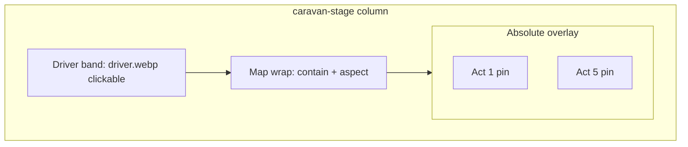

# Караван: карта, точки актов, золото, AI-совет

## Текущее состояние

- Вёрстка: `[caravan.html](src/waifu_bot/webapp/caravan.html)` — фон `#caravan-bg-img`, погонщица в `.caravan-merchant-zone` (слева, `pointer-events: none`), список актов в `.caravan-acts-col` с кнопками «В путь».
- Логика: `[app.js](src/waifu_bot/webapp/app.js)` — `ACT_META`, `populateCaravanPage`, `applyCaravanStageImages`, `travelToAct` → `POST /player/act`.
- API: `[routes.py](src/waifu_bot/api/routes.py)` `set_player_act` — только проверка `1..max_act`, **золото не списывается**.
- OpenRouter уже используется (например `[expedition_events_ai.generate_shop_merchant_line](src/waifu_bot/services/expedition_events_ai.py)` + `[POST /shop/merchant-line](src/waifu_bot/api/routes.py)`).

## Целевая композиция (как на референсе)

1. **Колонка**: `caravan-stage` → `flex-direction: column`; сверху узкая полоса под погонщицу (ограничить `max-height` ~22–28vh), ниже — блок карты на оставшуюся высоту (`flex: 1; min-height: 0`).
2. **Карта**: один слой изображения с `object-fit: contain` и `width: 100%` внутри `position: relative` контейнера, чтобы пропорции совпадали с артом; фон по-прежнему из цепочки `[applyCaravanStageImages](src/waifu_bot/webapp/app.js)` (`/static/caravan/act-{N}/caravan.background.webp`, …).
3. **5 точек**: абсолютно позиционированные узлы поверх карты (`left/top` в `%`, `transform: translate(-50%,-50%)`). Координаты задать под финальный `act-1` арт; в `[static/caravan/README.md](static/caravan/README.md)` кратко описать, что при смене фона по акту раскладка считается общей (при сильном расхождении арта позже можно вынести per-act CSS или данные).
4. **Содержимое точки** (сверху вниз): подпись золота `🪙 N` (или «—» для текущего акта / «🔒» для закрытого), иконка акта (см. ниже), кнопка «В путь» или «Здесь» / замок — по тем же правилам, что сейчас (`unlocked`, `isCurrent`).

## Изображения точек актов

- Договорённое именование файлов (как у фона/погонщицы): например `/static/caravan/act-{n}/map-pin.webp` (или `waypoint.webp`) + fallback на эмодзи из `ACT_META`, по аналогии с `attachCaravanImage`.
- Расширить `ACT_META` в `app.js` опциональным списком URL (или собирать URL в `populateCaravanPage`), без дублирования бизнес-логики.

## Золото: отображение и списание (выбрано вами — списание на бэкенде)

1. **Константы**: в `[game/constants.py](src/waifu_bot/game/constants.py)` завести, например, `CARAVAN_TRAVEL_GOLD_TO_ACT: tuple[int, ...]` из 5 значений — стоимость **переезда в акт с номером i** (индекс `act - 1`). Для текущего акта в UI цену не показываем как оплату (уже «Здесь»). Пороговые значения — заглушки, легко правятся в одном месте.
2. `**set_player_act`** (`[routes.py](src/waifu_bot/api/routes.py)`): если `act == player.current_act` — без списания, успех; иначе взять стоимость из константы; при `player.gold < cost` — `HTTPException(400, detail="not_enough_gold"` или структурированный detail с `required`/`gold` как в других эндпоинтах); иначе `player.gold -= cost`, выставить `current_act`, `commit`, вернуть в JSON хотя бы `gold` (и `act`) для обновления чердака.
3. **Профиль**: в `[ProfileResponse](src/waifu_bot/api/schemas.py)` добавить поле `caravan_travel_costs: list[int]` (длина 5) — те же числа, что и на сервере, чтобы UI не дублировал таблицу. Проставить в обоих `return ProfileResponse(...)` ветках `get_profile` (успех и fallback при ошибке — нули или константы).
4. **Фронт**: в `populateCaravanPage` читать `p.caravan_travel_costs` (с fallback на нули, если старый бэкенд); отрисовывать цену над точкой; после успешного `travelToAct` по-прежнему вызывать `loadProfile()` — обновятся и золото, и `badge-gold`.

## Клик по погонщице → AI-совет

1. **Сервис**: в `[expedition_events_ai.py](src/waifu_bot/services/expedition_events_ai.py)` добавить `async def generate_caravan_driver_tip(*, current_act: int, max_act: int, gold: int) -> Optional[str]` — короткий совет 2–4 предложения, роль «погонщица каравана», без ломания баланса (без точных формул), на русском; при отсутствии ключа OpenRouter — `None` (как у других генераторов).
2. **Роут**: например `POST /caravan/driver-tip` (tags `caravan`), `Depends(get_player_id)` + загрузка `Player` для контекста (act, max_act, gold), вызов генератора, ответ `{ "text": str | null, "error": str | null }` по образцу `/shop/merchant-line`.
3. **Фронт**: убрать `pointer-events: none` у зоны погонщицы; обернуть изображение в `button` или `role="button"` с `tabindex="0"`; `onclick` → async `apiFetch`, индикатор загрузки, вывод текста в лёгком модальном/боттомшите на странице каравана (новый блок в HTML + минимальные стили, закрытие по кнопке/оверлею).

## Файлы для правок (ожидаемый набор)

| Область                              | Файлы                                                                                              |
| ------------------------------------ | -------------------------------------------------------------------------------------------------- |
| Вёрстка/стили                        | `[src/waifu_bot/webapp/caravan.html](src/waifu_bot/webapp/caravan.html)`                           |
| Рендер карты, цены, клики, вызов tip | `[src/waifu_bot/webapp/app.js](src/waifu_bot/webapp/app.js)`                                       |
| Константы цен                        | `[src/waifu_bot/game/constants.py](src/waifu_bot/game/constants.py)`                               |
| Схема профиля                        | `[src/waifu_bot/api/schemas.py](src/waifu_bot/api/schemas.py)`                                     |
| Профиль + смена акта + новый роут    | `[src/waifu_bot/api/routes.py](src/waifu_bot/api/routes.py)`                                       |
| Генерация текста                     | `[src/waifu_bot/services/expedition_events_ai.py](src/waifu_bot/services/expedition_events_ai.py)` |
| Документация ассетов                 | `[static/caravan/README.md](static/caravan/README.md)`                                             |

## Риски и примечания

- **Выравнивание пинов** при смене `caravan.background.webp` между актами: первая итерация — одни `%` для всех; при необходимости позже — `data-act-bg="{n}"` и разные классы.
- **Тесты**: при наличии тестов на `/player/act` — добавить кейс недостаточного золота и успешного списания.

