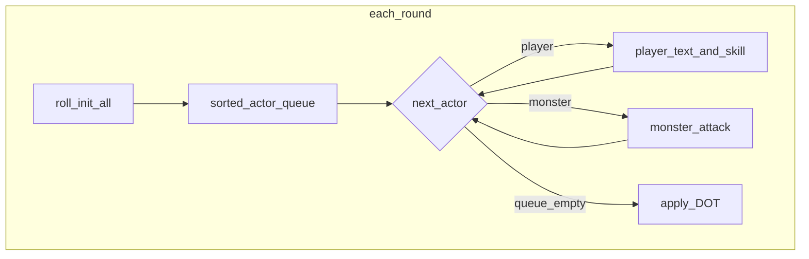

# План: инициатива, эффекты в БД, лут GD v1, команды группы

## Контекст (текущее состояние)

- Раунд симулируется в `[src/waifu_bot/services/gd_round_engine.py](src/waifu_bot/services/gd_round_engine.py)`: сначала **все** живые игроки (текст + один медиа-навык), затем DOT, затем **все** монстры по убыванию HP (не инициатива).
- Длительные эффекты: DOT живёт в `battle_state_json["effects"]`; прочие (`BUFF_CRIT_NEXT`, `BUFF_PARTY_DAMAGE`, `DEBUFF_MONSTER_ARMOR`, `SHIELD_PARTY`, `REFLECT`, `REGEN`, `EVASION_PARTY`, `GOLD_BONUS`) в основном только в `actions_log` — таблица `[gd_active_effects](src/waifu_bot/db/models/gd_cycle.py)` не используется в симуляции.
- Награды v1: `[finalize_gd_v1_rewards_and_notify](src/waifu_bot/services/gd_v1_worker.py)` — золото/опыт, `items_json` не заполняется.
- Соло-референс для предмета: `[CombatService._handle_monster_defeated](src/waifu_bot/services/combat.py)` (финал подземелья) — `DropRule` по `act`, веса редкости, `ItemService.generate_inventory_item(...)`.
- Команды группы размазаны по `[bot_handlers.py](src/waifu_bot/services/bot_handlers.py)`; меню BotFather — `[docs/BOT_COMMANDS_FOR_BOTFATHER.md](docs/BOT_COMMANDS_FOR_BOTFATHER.md)` (нет `gd_join`, нет разделения legacy/v1).

---

## 1. Инициатива: единая очередь 1d20+ЛОВ / 1d20 у монстров, каждый раунд

**Правило:** в **каждом** раунде (номер `round_num` из `collecting_for_round`) один раз бросается инициатива для всех актёров с HP > 0: игрок — `random.randint(1, 20) + int(agility из snapshot)`, монстр — `random.randint(1, 20)` без бонуса (поле `agility` в JSON монстра не участвует в броске, чтобы соответствовать ТЗ).

**Алгоритм в `process_gd_round`:**

1. После подготовки списков `party` / `monsters` (и до применения действий) собрать список ходов: записи вида `("player", user_id, ref)` и `("monster", monster_id, ref)`.
2. Для каждого актёра вычислить `initiative_score`; при равенстве — детерминированный tie-break (например `user_id` / `monster id`, или второй бросок).
3. Отсортировать по убыванию `initiative_score`.
4. **По очереди** для каждого актёра:
  - **Игрок:** тот же смысл, что сейчас «фаза игрока» для этого `user_id`: суммарный текстовый урон за раунд (из буфера) + не более **одного** первого подходящего медиа-навыка вне КД. Если в буфере нет ключа пользователя — ход пропускается (как сейчас для «не писавших»), опционально пометить `silent` в логе при первом проходе.
  - **Монстр:** один удар как сейчас (таунт, `skip_next`, урон через `_monster_damage_raw`).
5. **DOT** применять **после** полного прохода очереди (как шаг 6 в ТЗ), чтобы не смешивать порядок с тиками DoT.

**Важно:** вынести текущую логику «игрок наносит текст + навык» в функцию `execute_player_turn(...)`, логику «монстр бьёт» в `execute_monster_turn(...)`, чтобы не дублировать код.

**Стычка:** при смене волны (`trash` → `boss`) можно очищать только **боевые** эффекты, относящиеся к предыдущей волне (см. п. 2), и заново кидать инициативу в первом раунде новой волны автоматически, т.к. это новый набор монстров.

---

## 2. `gd_active_effects`: хранение баффов/дебаффов на время боя с «текущим» набором монстров

**Цель:** длительные эффекты жить в БД и в симуляции одинаково; при перезапуске воркера состояние восстанавливается.

**Подход:**

- **Загрузка** в начале `process_gd_round`: `SELECT` из `gd_active_effects` для `cycle_id` где `expires_round >= round_num`, слить в рабочую структуру (или напрямую читать при применении урона/хода монстра).
- **Запись** при применении навыка: для каждого эффекта с `effect_duration > 1` или для типов, которые должны влиять на механику несколько раундов (`BUFF_PARTY_DAMAGE`, `DEBUFF_MONSTER_ARMOR`, `REGEN`, `BUFF_CRIT_NEXT`, `SHIELD_PARTY`, `REFLECT`, `EVASION_PARTY`, `DEBUFF_MONSTER_INITIATIVE` и т.д.) — `INSERT` в `gd_active_effects` с полями `target_type` (`player`/`monster`), `target_id` (`user_id` или `monster id` из JSON), `effect_type`, `effect_value`, `expires_round`, `source_user_id`.
- **Синхронизация с `battle_state_json`:** либо (A) постепенно убрать дублирование и оставить только БД + минимальный кэш в state, либо (B) по-прежнему держать `state["effects"]` для DOT и зеркалить в БД в конце раунда. Рекомендация: **один источник истины — БД**, DOT перевести на те же строки (тип `DOT`, `target_id` = id монстра).
- **Очистка:** в конце раунда `DELETE` (или пометка) записей с `expires_round < round_num`; при переходе волны `trash` → `boss` — удалить эффекты с `target_type='monster'` для старых `target_id` или все монстры-таргеты текущей волны (проще: `DELETE FROM gd_active_effects WHERE cycle_id = ? AND target_type = 'monster'` при смене `state["wave"]`).
- **Применение в бою:** расширить `_apply_skill_effect` и расчёт урона/защиты:
  - `BUFF_CRIT_NEXT` — флаг на игрока до следующего его текстового удара.
  - `DEBUFF_MONSTER_ARMOR` — множитель/игнор брони при расчёте урона по этому монстру.
  - `SHIELD_PARTY` / `EVASION_PARTY` / `REFLECT` — уменьшение или отмена входящего урона монстра (хранить остаток поглощения в `effect_value`, уменьшать при срабатывании).
  - `REGEN` — тик в фазе после очереди (аналог DOT для союзников).
  - `GOLD_BONUS` — накапливать множитель в `battle_state_json["loot_modifiers"]` или отдельной таблице до финала.

Файлы: `[gd_round_engine.py](src/waifu_bot/services/gd_round_engine.py)`, при необходимости небольшой модуль `[gd_effects.py](src/waifu_bot/services/gd_effects.py)` с `load_active_effects`, `apply_passive_modifiers`, `expire_effects`.

---

## 3. Лут предметов: аналог соло + раздача участникам

**Источник логики:** повторить блок с `DropRule` + редкость + `item_level` из `[combat.py](src/waifu_bot/services/combat.py)` (строки ~1244–1280) в хелпер, например `gd_loot.roll_gd_item(session, act: int, avg_level: int, boss: bool) -> InventoryItem | None`, вызывая существующий `[ItemService.generate_inventory_item](src/waifu_bot/services/item_service.py)`.

**Когда кидать дроп:**

- При **смерти** экземпляра монстра в раунде (`hp` → 0): с шансом из `game_config` (новый ключ, напр. `gd_item_drop_chance_normal` / `gd_item_drop_chance_boss`) или по правилам шаблона монстра; для босса — гарантированный 1 предмет (как «гарантия за подземелье» в духе ТЗ §7.2) или вес из `DropRule.boss_only`.
- `act` брать из `[GDDungeonTemplate](src/waifu_bot/db/models/group_dungeon.py)` если добавите поле `act`, иначе дефолт `1` или из среднего уровня партии через маппинг tier→act.

**Кому выдавать:**

- Предмет создаётся в инвентаре **конкретного** `player_id`: выбрать получателя — например взвешенный случай по `contribution` за цикл или по урону в последнем раунде убийства; для простоты v1 — **случайный живой участник** на момент смерти монстра, для босса — топ-1 по `scores` или тот же случайный с повышенным весом лидера.

**Персистенция:**

- Накопить в `battle_state_json["loot_awards"]`: список `{user_id, item_summary, inventory_item_id}`.
- В `finalize_gd_v1_rewards_and_notify` заполнить `GDRewardRow.items_json` (и строку DM §7.4: «Предмет: …» если есть).

Файлы: новый `[gd_loot.py](src/waifu_bot/services/gd_loot.py)`, правки `[gd_v1_worker.py](src/waifu_bot/services/gd_v1_worker.py)`, `[gd_round_engine.py](src/waifu_bot/services/gd_round_engine.py)` (вызов при `m["hp"] == 0` до удаления из логики волны).

---

## 4. Система команд группового чата (описание)

**Сделать:**

1. Обновить `[docs/BOT_COMMANDS_FOR_BOTFATHER.md](docs/BOT_COMMANDS_FOR_BOTFATHER.md)`:
  - Добавить `gd_join` в блоки default и group.
  - Кратко разделить: **GD v1** (цикл, раунды, `/gd_join`) vs **legacy GD** (`/gd_start`, engage, события HP).
  - Указать, что при активном v1-цикле сообщения идут в буфер раунда, а не в legacy-урон.
2. Обновить текст `/help` в `[bot_handlers.py](src/waifu_bot/services/bot_handlers.py)` (тот же список и 1–2 строки про поведение в группе).
3. Опционально: короткий комментарий в начале блока GD-хендлеров в `bot_handlers.py` (таблица команд → уровень доступа), чтобы не плодить отдельный markdown, если не нужен отдельный файл.

**Сводка для документации (включить в plan execution):**

| Команда                    | Режим       | Назначение                                         |
| -------------------------- | ----------- | -------------------------------------------------- |
| `/gd_join`                 | группа      | Регистрация в GD v1 (недельный цикл)               |
| `/gd_start`                | группа      | Legacy: мгновенная GD-сессия по сообщениям         |
| `/engage`, `/gd_engage`    | группа      | Legacy: цепочка заданий при активной legacy-сессии |
| `/gd_debug`, `/gd_logs`, … | группа, dev | Отладка legacy GD (как сейчас)                     |

---

## Порядок внедрения

1. Рефакторинг раунда: очередь инициативы + вынос ходов игрока/монстра.
2. Слой эффектов: загрузка/запись `gd_active_effects`, перенос DOT, реализация механики для ключевых `effect_type`.
3. Лут: хелпер дропа, вызовы при смерти монстра, финализация в DM и `items_json`.
4. Документация команд: BotFather + help.

## Риски и тесты

- Инициатива меняет **порядок** применения урона внутри раунда — возможны краевые случаи (монстр убивает до хода последнего игрока): это ожидаемо для пошаговой модели.
- Лут и опыт на вайфу: сейчас опыт в v1 начисляется в финале; предметы — сразу при генерации в инвентарь — согласовать с UX текста DM.
- Прогон: сценарий 2 игрока, trash wave, смерть монстра с дропом, смена на босса, проверка очистки monster-target эффектов.

