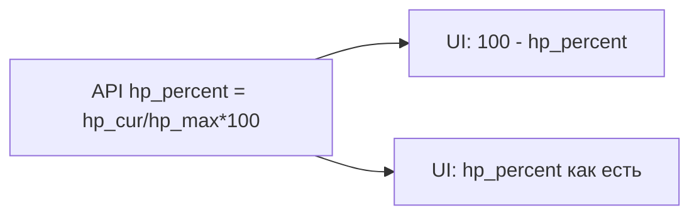

# План: цветовая схема GD и подпись HP

## 1. Исправление процента здоровья (баг)

**Причина:** в `[_gd_v1_monster_hp_display](src/waifu_bot/api/routes.py)` поле `hp_percent` считается как `round(100 * hp_cur / hp_max)` — это **доля оставшегося HP** (91% при 561/616).

**Ошибка:** в `[renderDungeonDetails](src/waifu_bot/webapp/app.js)` выводится `100 - (dungeon.hp_percent || 0)`, из‑за чего при 91% показывается «9% осталось».

**Действие:** заменить на отображение фактического процента, например:

- `~${Math.round(Number(dungeon.hp_percent) || 0)}% HP` или явно «осталось ~91%» через тот же `Math.round(...)` **без** вычитания из 100.

Других вхождений `100 - hp_percent` для GD в webapp нет (проверено по репозиторию).

---

## 2. Приведение UI групповых подземелий к общей схеме

Текущие отличия сосредоточены в `[styles.css](src/waifu_bot/webapp/styles.css)` (блок ~2415–2670): отдельный «фиолетовый» градиент (#667eea / #764ba2), белый текст на карточке, жёстко заданные красные полосы HP и градиентные кнопки/бейджи в модалке — это не совпадает с базовыми токенами `:root` / `.theme-light` (`--bg`, `--card`, `--text`, `--muted`, `--accent`, `--border`) и с карточками соло-подземелий (`.dungeon-card`, `.btn-primary` с `var(--accent)`).

**Целевое направление:**

| Элемент                                                                       | Сейчас                             | Цель                                                                                                                                                                                                                       |
| ----------------------------------------------------------------------------- | ---------------------------------- | -------------------------------------------------------------------------------------------------------------------------------------------------------------------------------------------------------------------------- |
| `[.gd-dungeon-card.dungeon-card](src/waifu_bot/webapp/styles.css)`            | Градиент, `color: #fff`, свои тени | Как обычная карточка: `background: var(--card)`, `border: 1px solid var(--border)`, `color: var(--text)`; hover — лёгкое поднятие + `border-color: var(--accent)` (как у `[.card:hover](src/waifu_bot/webapp/styles.css)`) |
| Шрифты/стадия на карточке GD                                                  | Подстройка под белый фон           | Использовать `var(--text)` / `var(--muted)`; бейдж стадии — полупрозрачный фон от `var(--border)` или акцентная обводка, без принудительного белого                                                                        |
| `.dungeon-card .hp-fill` внутри GD (вложенные правила под `.gd-dungeon-card`) | Оранжево-красный градиент          | Совпасть с монстром на странице подземелий: тот же градиент, что у `[.page-dungeons .hp-fill-monster](src/waifu_bot/webapp/styles.css)` (либо вынести в один общий селектор / класс, чтобы не дублировать hex)             |
| `[.gd-session-hp-bar .gd-hp-fill](src/waifu_bot/webapp/styles.css)`           | Красный градиент                   | Тот же паттерн, что и для монстра на `.page-dungeons`                                                                                                                                                                      |
| `[.gd-modal-content .hp-bar-large .hp-fill](src/waifu_bot/webapp/styles.css)` | Красный градиент                   | Аналогично                                                                                                                                                                                                                 |
| `[.gd-modal-content .btn-primary](src/waifu_bot/webapp/styles.css)`           | Фиолетовый градиент                | Как основные кнопки приложения: `background: var(--accent)`, `color: #fff` (или как у `.dungeon-start-btn`), hover через `opacity` / лёгкая тень без фирменного «индиго» градиента                                         |
| `[.gd-modal-content .effect-badge](src/waifu_bot/webapp/styles.css)`          | Градиент                           | `background: var(--accent)` или мягкий `color-mix` с `--accent` + `var(--border)` для читаемости в light theme                                                                                                             |
| `[.gd-modal-content .stage-dot](src/waifu_bot/webapp/styles.css)`             | Жёсткие #22c55e / #3b82f6          | Для «active» — `var(--accent)`; для «completed» — приглушённый зелёный или нейтральный `var(--muted)` на `var(--border)`, чтобы не вводить новые глобальные токены без необходимости                                       |

**Файлы:** правки в основном в `[src/waifu_bot/webapp/styles.css](src/waifu_bot/webapp/styles.css)`. При необходимости добавить класс на fill полосы HP в `[app.js](src/waifu_bot/webapp/app.js)` (`createGdDungeonCard` / разметка модалки), если проще переиспользовать существующий класс `.hp-fill-monster` вместо дублирования градиента в CSS.

**Не трогать без нужды:** `[dungeons.html](src/waifu_bot/webapp/dungeons.html)` — разметка GD уже использует общие классы; блок `[.gd-info](src/waifu_bot/webapp/styles.css)` уже на токенах.

**Проверка:** визуально в тёмной и светлой теме (`.theme-light`): карточка GD читается как остальные карточки, кнопка «Перейти в чат» совпадает с остальными primary, полоса HP монстра визуально согласована с соло-экраном подземелий.