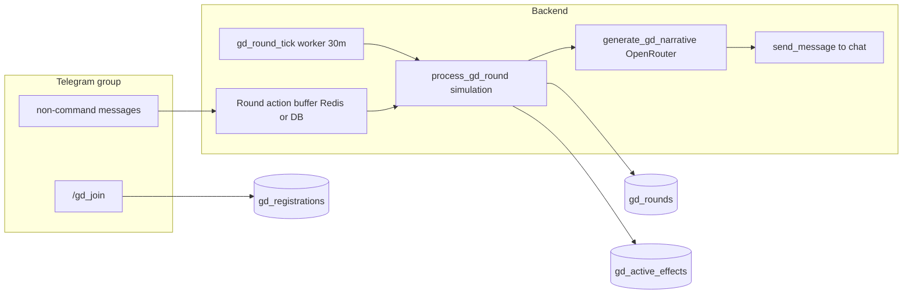

# План: новая система групповых подземелий (GD Specification v1.0)

## Исходные документы и расхождения с кодом

- Полное ТЗ: [info/GD_Specification_v1.0.docx](info/GD_Specification_v1.0.docx) (разделы 1–10 совпадают с вашим оглавлением).
- Текущая реализация: [src/waifu_bot/services/group_dungeon.py](src/waifu_bot/services/group_dungeon.py), [src/waifu_bot/services/bot_handlers.py](src/waifu_bot/services/bot_handlers.py), [src/waifu_bot/main.py](src/waifu_bot/main.py).
- **Celery в проекте отсутствует** (поиск по репо пустой). Задачу «каждые 30 мин» нужно реализовать **аналогом существующего фона** в `main.py` (`asyncio` + `get_session()`), либо отдельным systemd/cron, вызывающим скрипт — в плане ниже заложен **asyncio worker** с интервалом из `gd_round_duration_minutes`.
- В SQL ТЗ для `gd_cycles` указано `REFERENCES dungeon_templates(id)` — для этого бота логичнее **FK на `gd_dungeon_templates.id`** (как сейчас в `GDSession`), чтобы не смешивать сольные шаблоны и GD. Зафиксировать это в миграции и комментарии к таблице.
- Матрица навыков в §4.2 даёт **7×4 = 28** строк в `gd_class_skills`; в §10 упомянуты «35 навыков» — при сидировании сверить с таблицей в документе и зафиксировать фактическое число строк.

---

## Фаза 0 — Приоритет 1: баги существующей GD (§9 / задачи 1.1–1.3, частично 10.4)

Делать **до или параллельно** с новой архитектурой, чтобы не копить долг; изменения локальны в [group_dungeon.py](src/waifu_bot/services/group_dungeon.py) и [main.py](src/waifu_bot/main.py).

| Задача         | Суть                                                                                                                                                                                                                                                                                                                                                                                                                   | Файлы                                                                                                                                           |
| -------------- | ---------------------------------------------------------------------------------------------------------------------------------------------------------------------------------------------------------------------------------------------------------------------------------------------------------------------------------------------------------------------------------------------------------------------- | ----------------------------------------------------------------------------------------------------------------------------------------------- |
| **1.1**        | Инкремент `events_completed` для участников сессии: после успешного engage-chain (все три задания) и после завершения `boss_unique` по числу участников. Нужно обновлять **всех** `GDPlayerContribution` с данным `session_id` или только завершивших — в ТЗ не уточнено; разумный дефолт: **все зарегистрированные в сессии вкладчики** или те, кто в `participants` для события — зафиксировать одно правило в коде. | `group_dungeon.py`; для boss_unique — цепочка из [bot_handlers.py](src/waifu_bot/services/bot_handlers.py) после `apply_event_effect_and_clear` |
| **1.2**        | При вызове `_advance_gd_stage` из [run_background_tick](src/waifu_bot/services/group_dungeon.py) не отбрасывать `rewards`: вынести рассылку DM в общую функцию (например `_send_gd_reward_dms(bot, rewards)`), вызывать из `process_message_damage` и из тика. Потребуется **доступ к Bot** в фоне — сейчас `main.py` не передаёт бота в GD; добавить получение через существующий `get_bot()` / инъекцию сервиса.     | `group_dungeon.py`, `main.py`                                                                                                                   |
| **1.3**        | В `_check_hp_events`: при выборе события для босса — сначала искать `GDEventTemplate` с `dungeon_event_key == template.unique_event_key`, иначе случайный `boss_unique`.                                                                                                                                                                                                                                               | `group_dungeon.py`                                                                                                                              |
| **10.4 / 9.4** | Тематический множитель: после `base_damage`, если `waifu.class_id` в `template.thematic_bonus_class_ids` — умножить на `gd_thematic_bonus_mult` из [game_config](src/waifu_bot/db/models/game_config.py) или `settings`.                                                                                                                                                                                               | `group_dungeon.py`, сид/миграция ключей конфига                                                                                                 |

---

## Фаза 1 — Схема БД (§8, задача 2.1)

- Одна Alembic-миграция (или две: таблицы + сиды), модели SQLAlchemy в новом модуле, например `src/waifu_bot/db/models/gd_cycle.py`, экспорт в [models/**init**.py](src/waifu_bot/db/models/__init__.py).
- Таблицы как в ТЗ: `gd_class_skills`, `gd_cycles`, `gd_registrations`, `gd_rounds`, `gd_active_effects`, `gd_skill_cooldowns`, `gd_rewards` + индексы `idx_gd_cycles_chat`, `idx_gd_rounds_cycle`, `idx_gd_effects_cycle`.
- **Правка:** `gd_cycles.dungeon_template_id` → `ForeignKey("gd_dungeon_templates.id")` (не `dungeon_templates`).
- Сид SQL/Python: строки `gd_class_skills` строго по §4.2 (class_id как строка `"knight"` или числовой enum — единообразно с `waifu_snapshot`); поля `effect_type`, `effect_value`, `effect_duration`, `target`, `cooldown_rounds` из матрицы и §4.3.
- Параметры из §10.6 и §7.2 завести в `game_config`: `gd_max_party_size`, `gd_min_party_size`, `gd_round_duration_minutes`, `gd_cooldown_after_finish_hours`, `gd_monster_hp_scale`, `gd_thematic_bonus_mult`, `gd_ai_timeout_seconds`, `gd_revive_hp_pct`, `gd_base_exp_reward`, `gd_base_gold_reward`, `gd_boss_exp_bonus`, `gd_boss_gold_bonus`, и т.д.

---

## Фаза 2 — Жизненный цикл цикла (§1–2)

- **Состояния** `gd_cycles.status`: `registration` | `active` | `finished` | `cancelled`.
- **Окно регистрации:** «до пн 06:00 МСК» — реализовать планировщиком: при создании цикла выставлять `registration_closes` на ближайший дедлайн; отдельный тик (можно тот же 30-мин worker с веткой) закрывает регистрацию, проверяет `COUNT(registrations) >= gd_min_party_size`; если меньше — `cancelled` и сообщение в чат; иначе переход в `active`, снимок партии зафиксирован.
- `**/gd_join`** ([bot_handlers.py](src/waifu_bot/services/bot_handlers.py)): только `group`/`supergroup`; активный цикл с `registration` для `chat_id`; `INSERT gd_registrations` с `waifu_snapshot` (class, race, level, stats, equipment, passive_skills — сериализация как в API/моделях `MainWaifu` + экипировка); **если HP ОВ = 0**, в snapshot писать `current_hp: 1`, **без** изменения строки вайфу в БД (§2.1).
- **Старт похода:** после перехода в `active` — сформировать `structured_context` для анонса (§2.2), вызвать ИИ (тот же сервис, что раунд), `send_message` в чат; инициализировать первую волну монстров по §5 (HP, число, тир, аффиксы — переиспользовать [MonsterTemplate](src/waifu_bot/db/models/dungeon.py) и существующую логику аффиксов из соло **только чтением**, без изменения соло-потоков).

---

## Фаза 3 — Сбор действий за раунд (§3.2–3.3, ввод перед симуляцией)

Пока цикл `active`, сообщения в группе должны **не** проходить через старый «каждое сообщение = урон» для этого чата (иначе двойная механика). Стратегия:

- Feature-flag или правило: если для `chat_id` есть `gd_cycles.status == 'active'`, маршрутизировать в **накопитель раунда**; иначе — текущая ветка GD/соло.
- Накопитель: Redis (ключ `cycle_id:round_number`) или JSON-поле черновика — список действий: user_id, тип медиа, длина текста (суммирование текстов), флаг «навык засчитан», `skill_on_cooldown`, `silent`. Один навык с медиа за раунд — первый подходящий тип вне КД (§3.2).

---

## Фаза 4 — `process_gd_round` (§3.3–3.5, задачи 2.3, 2.5)

Новый модуль, например `src/waifu_bot/services/gd_round_engine.py` (или расширение `group_dungeon.py`, если хотите один файл — предпочтительнее отдельный для читаемости):

1. Загрузка слепков из `gd_registrations` + состояние монстров из последнего `gd_rounds` или из `gd_cycles` JSON state (если вынесете текущую волну туда).
2. Инициатива: `rand(1,20) + agility` для игроков (из snapshot) и монстров (§5.3); общая очередь по убыванию.
3. Для каждого актора с HP > 0: атака/навык по правилам; монстр бьёт случайную цель или таунт (§5.4); урон монстра — **вызов существующей соло-формулы** из [combat.py](src/waifu_bot/services/combat.py)/[formulas.py](src/waifu_bot/game/formulas.py) в режиме «только расчёт», без прогресса соло-подземелья.
4. Смерти, DoT после ходов, лут (§3.3 шаг 6–7) — лут по `monster_templates` как в ТЗ §7.2.
5. `round_outcome`: `victory` | `ongoing` | `party_wiped` (§3.4); тон для ИИ передаётся в контексте.
6. Таргетинг навыков — полная матрица §3.5 (приоритет highest HP для большинства DAMAGE/DEBUFF, lowest % для HEAL/REGEN, и т.д.).
7. `apply_gd_skill`: все **18** `effect_type` из §4.3; длительность > 1 раунда → `gd_active_effects`; кулдауны → `gd_skill_cooldowns`; флаги `revive_no_target`, `heal_no_target` в `context_json` для ИИ.
8. Запись строки в `gd_rounds` (все JSON-поля + `round_outcome`); обновить состояние монстров/игроков для следующего раунда.

---

## Фаза 5 — ИИ-нарратив (§6, задача 2.4)

- Новый сервис `src/waifu_bot/services/gd_narrative_ai.py` (по образцу [expedition_events_ai.py](src/waifu_bot/services/expedition_events_ai.py)): `httpx`, OpenRouter, `_openrouter_headers`, разбор `content`/`reasoning`.
- **System prompt** и **шаблон user prompt** — **дословно** из §6.2–6.3 документа (плейсхолдеры `{dungeon_name}`, `{round_outcome}`, списки действий, молчуны, `boss_next`, `low_hp`).
- Параметры §6.4: model из настроек (как у экспедиций), `max_tokens=400`, `temperature=0.85`, таймаут из `gd_ai_timeout_seconds` (15 с); при ошибке — текст-заглушка в чат, `ai_narrative=NULL` в `gd_rounds`, логирование.
- Отдельный вызов для **финала** §7.3 (эпилог + MVP/«балласт») — второй prompt или флаг `phase=finale` в контексте.

---

## Фаза 6 — Награды и DM (§7, задача 2.6)

- `compute_gd_rewards`: формула §7.1 (`contribution_score` из text/skill/healing/rounds_participated; нормализация `player_share`; exp с множителем от доли раундов; gold; босс-множители §7.2).
- Персистенция в `gd_rewards` с `dm_sent=false`.
- `send_gd_reward_dms`: шаблон §7.4; после успеха `dm_sent=true`; retry при ошибках Telegram.
- Вызывать при финальном завершении цикла и при любом форс-завершении (согласовать с фазой 0.1.2 для старой системы — та же идея «одна функция рассылки»).

---

## Фаза 7 — Интеграция API/WebApp (минимально)

- Расширить или добавить эндпоинты рядом с [routes.py](src/waifu_bot/api/routes.py) `/gd/*` для статуса **текущего `gd_cycle`** (для [webapp/dungeons.html](src/waifu_bot/webapp/dungeons.html)), не ломая старые `/gd/session/{chat_id}` до миграции UI.

---

## Что не трогать (§10.5)

- Сольные подземелья и экспедиции — без изменений контрактов.
- Не удалять `GDSession` / `GDPlayerContribution`; старый режим можно отключить флагом после стабилизации нового.
- Redis-метрики активности чата для старого `/gd_start` — оставить.

---

## Порядок внедрения (рекомендуемый)

1. Задачи **1.1–1.3** + **тематический множитель** (быстрый выигрыш).
2. Миграция + модели + сид `gd_class_skills` + `game_config` ключи.
3. `/gd_join` + создание/закрытие цикла регистрации.
4. Накопитель действий + отключение старого урона для чата с активным циклом (флаг).
5. `process_gd_round` + запись `gd_rounds` / эффекты / КД.
6. OpenRouter-нарратив + отправка в чат.
7. Награды + DM + финальный ИИ-текст.
8. Полировка: совместимость `GDSession.stage_monsters` при необходимости переноса волновой логики (§8.8).

