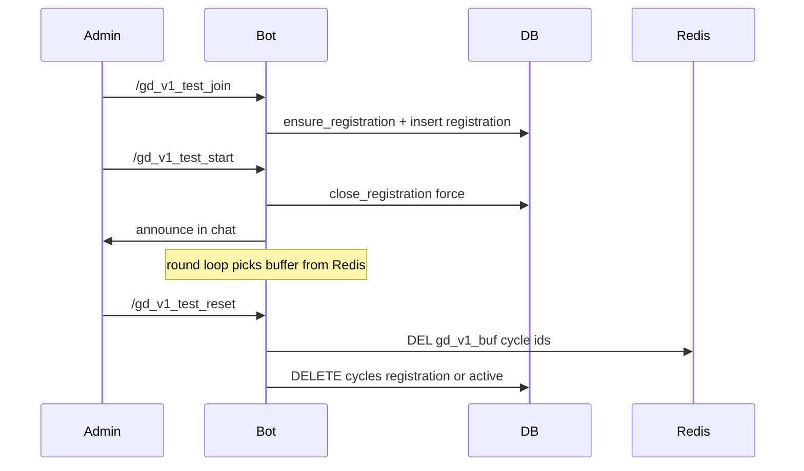

# План: ручной тест GD v1 для админа 305174198

## Цель

В **групповом чате** дать одному фиксированному пользователю (`305174198`) возможность без ожидания понедельника и без второго игрока:

1. **Вступление** — открыть цикл регистрации (если нужно) и записать вызывающего в `gd_registrations` (аналог `/gd_join`).
2. **Старт** — немедленно закрыть регистрацию и перевести цикл в `active` с инициализацией `battle_state_json`, как при дедлайне (как в [gd_cycle_service.py](src/waifu_bot/services/gd_cycle_service.py) `close_registration_and_maybe_start`).
3. **Сброс** — убрать «зависшее» состояние v1 в этом `chat_id`: циклы в статусах `registration` / `active`, с каскадным удалением зависимых строк и с очисткой Redis-ключей буфера раунда.

Команды **не** трогают legacy GD (`GDSession`, `/gd_start`).

## Доступ

- Проверка: `message.from_user.id == 305174198` (жёстко по ТЗ). Опционально расширить позже через `settings.admin_ids` или новый список в [config.py](src/waifu_bot/core/config.py) / константу в [game/constants.py](src/waifu_bot/game/constants.py) — в плане зафиксировать константу `GD_V1_MANUAL_TEST_USER_IDS = frozenset({305174198})` в одном месте, чтобы не дублировать магическое число по файлам.

## Проблема минимума партии

`[close_registration_and_maybe_start](src/waifu_bot/services/gd_cycle_service.py)` при `len(regs) < gd_min_party_size` ставит `cancelled`. Для одиночного теста админа добавить параметр, например `force: bool = False`: при `force=True` считать условие старта выполненным, если есть **хотя бы одна** регистрация (`len(regs) >= 1`), иначе ответ с ошибкой «сначала /gd_v1_test_join».

## Изменения по слоям

### 1. Сервис `[GDCycleService](src/waifu_bot/services/gd_cycle_service.py)`

- `close_registration_and_maybe_start(..., *, force: bool = False)` — если `force`, не сравнивать с `min_p`, а требовать только `len(regs) >= 1`; иначе текущее поведение без изменений для воркера.
- Новый метод `reset_v1_cycles_for_chat(session, chat_id)`:
  - Выбрать все `GDCycle` с `chat_id == chat_id` и `status.in_(("registration", "active"))`.
  - Для каждого `cycle.id` удалить Redis ключ `gd_v1_buf:{cycle_id}` (`[_buf_key](src/waifu_bot/services/gd_cycle_service.py)`).
  - `await session.delete(cycle)` (каскад снимет `gd_registrations`, `gd_rounds`, `gd_active_effects`, `gd_skill_cooldowns`, `gd_rewards` согласно миграции [0046](alembic/versions/0046_gd_v1_cycles_and_class_skills.py)).
- Опционально вынести текст стартового сообщения, дублируемый с [gd_v1_worker.py](src/waifu_bot/services/gd_v1_worker.py) `process_gd_registration_deadlines`, в маленькую функцию `gd_v1_announce_start_message()` или константу, чтобы `/gd_v1_test_start` и воркер не расходились.

### 2. Хендлеры `[bot_handlers.py](src/waifu_bot/services/bot_handlers.py)`

Только `group` / `supergroup`, в начале хендлера — guard по `GD_V1_MANUAL_TEST_USER_IDS`.

| Команда             | Действие                                                                                                                                                                                                                                                                                                                                  |
| ------------------- | ----------------------------------------------------------------------------------------------------------------------------------------------------------------------------------------------------------------------------------------------------------------------------------------------------------------------------------------- |
| `/gd_v1_test_join`  | `register_join(session, chat_id, user_id)` + `commit`, ответ как у `/gd_join` (успех/ошибка).                                                                                                                                                                                                                                             |
| `/gd_v1_test_start` | Найти цикл: открытая регистрация для чата (`get_registration_cycle` **или** последний `registration` по `id` даже если `registration_closes` уже в прошлом — см. ниже). Вызвать `close_registration_and_maybe_start(..., force=True)`. Отправить в чат то же по смыслу сообщение, что при старте из воркера («Поход начался…»). `commit`. |
| `/gd_v1_test_reset` | `reset_v1_cycles_for_chat` + `commit`, краткий ответ «сброшено N циклов».                                                                                                                                                                                                                                                                 |

**Нюанс «просроченная регистрация»:** если дедлайн уже прошёл, `get_registration_cycle` возвращает `None`, хотя строка в БД ещё `registration`. Для тест-старта нужно получать цикл явно, например:

`select(GDCycle).where(chat_id, status=="registration").order_by(id.desc()).limit(1)`.

Если такого нет — ответ «нет цикла в регистрации, сначала join или reset».

### 3. Документация

- В [docs/BOT_COMMANDS_FOR_BOTFATHER.md](docs/BOT_COMMANDS_FOR_BOTFATHER.md) в блок для разработчиков (или отдельная строка «только ID …»): три команды с пометкой, что они **не для публичного меню** и работают только у владельца теста.

## Порядок ручного сценария

## Риски

- **Удаление цикла** сотрёт историю раундов/наград этого незавершённого прогона — приемлемо для тест-сброса.
- Если после `active` не вызывать reset, обычный воркер продолжит тики — сброс нужен перед повторным «чистым» тестом.

## Что не делать

- Не менять условия `/gd_join` и фоновые тики для обычных пользователей (только новый параметр `force` с дефолтом `False`).
- Не смешивать с legacy `/gd_test_start`.

