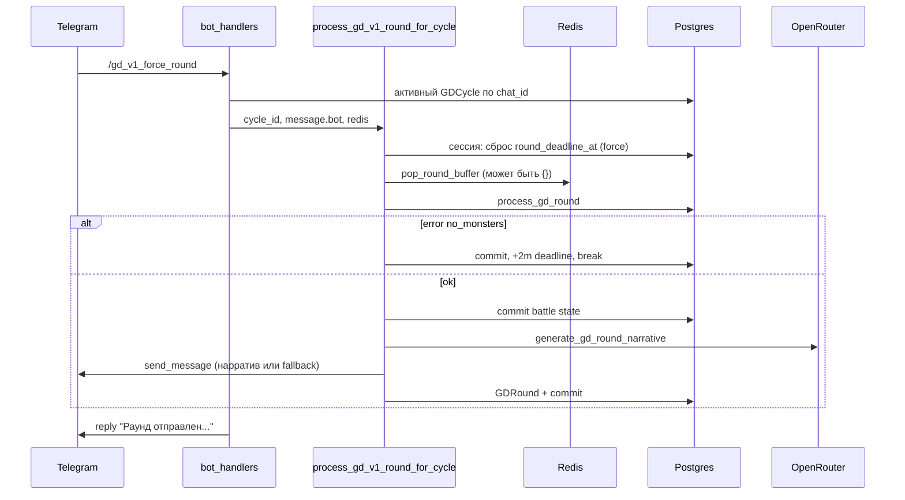

# GD v1: стартовый нарратив и `/gd_v1_force_round`

## Комментарии по пункту 1 (старт, «воин» вместо ангел/маг)

**Откуда берутся данные.** Вступление строится в `[send_gd_v1_group_start_narrative](src/waifu_bot/services/gd_v1_worker.py)`: `party = (cycle.battle_state_json or {}).get("party")`, затем `[generate_gd_start_narrative` → `build_user_prompt_start](src/waifu_bot/services/gd_narrative_ai.py)`. Состав при старте цикла заполняется в `[close_registration_and_maybe_start](src/waifu_bot/services/gd_cycle_service.py)` из `**GDRegistration.waifu_snapshot`**, который фиксируется в момент `[register_join` → `build_waifu_snapshot](src/waifu_bot/services/gd_cycle_service.py)` (там же есть `class_id`, `race_id`, `level`).

**Почему модель может «угадать воина».**

1. **В промпт уходят только числовые id**, без расшифровки. Модель не обязана знать вашу схему enum; она часто заполняет типичный фэнтези-образ по умолчанию («меч», «воительница»).
2. **Коллизия смыслов для ангел-мага:** в `[WaifuRace](src/waifu_bot/db/models/waifu.py)` `ANGEL = 4`, в `WaifuClass` `**MAGE = 4`**. В строке промпта получается «класс id 4, раса id 4» — для LLM это легко читается как одна неоднозначная метка, а не два разных поля.
3. **Уровень «пропал» в тексте:** в коде уровень передаётся как `p.get('level', '?')`. Если в снимке в БД нет ключа `level` (старые записи / ручное изменение JSON), в промпте будет `?`. Если ключ есть, но модель в ответе не использует цифры (часто игнорирует «без статов» из системного промпта раунда — для старта отдельного ограничения нет), визуально кажется, что «уровня нет».
4. **Устаревший snapshot:** если игрок сменил класс/расу после записи в поход, в `battle_state_json` останутся старые `class_id`/`race_id` до следующей регистрации — это реже, но возможно.

**Вывод:** вероятнее всего проблема не в «не читается ОВ из БД», а в **формате промпта (только id)** и **дублировании числа 4**; вторично — целостность snapshot и явное требование использовать уровень в тексте.

**Направление исправления:** в `build_user_prompt_start` (и по желанию в `build_user_prompt_round` для единообразия) добавить **человекочитаемые** `class_name` / `race_name` (маппинг из `WaifuClass` / `WaifuRace`), явно подписать «класс: …, раса: …», опционально короткую строку «атака: физ./маг.» из уже существующей логики `[_attack_type_for_class](src/waifu_bot/services/gd_round_engine.py)`. В user-тексте старта явно потребовать: *не выдумывать другой класс; оружие соответствует классу*. При необходимости перед стартом **пересобрать** элементы party из актуального `MainWaifu` по `user_id` (или обновить snapshot при закрытии регистрации) — узкий продуктовый выбор.

---

## Комментарии по пункту 2 (`/gd_v1_force_round` — только «отправлено», нет нарратива)

**Цепочка сейчас (упрощённо):**

**Почему пользователь видит «успех», но не видит нарратива:**

1. **Исключения глотаются:** в `[process_gd_v1_round_for_cycle](src/waifu_bot/services/gd_v1_worker.py)` внешний `except Exception` (стр. 261–272) делает rollback и логирование, **не пробрасывает** ошибку. Обработчик в `[cmd_gd_v1_force_round](src/waifu_bot/services/bot_handlers.py)` после `await process_gd_v1_round_for_cycle(...)` **всегда** отвечает «Раунд отправлен на обработку…», даже если внутри всё упало (БД, движок раунда, и т.д.).
2. **Ранний `break` без нарратива:** если цикл не `active`, нет строки `cycle`, или `[result["error"] == "no_monsters"](src/waifu_bot/services/gd_v1_worker.py)` (например, **повторный форс после победы**: `wave == "done"`, пустые монстры — см. `[process_gd_round](src/waifu_bot/services/gd_round_engine.py)` стр. 604–614), обработка заканчивается **без** вызова ИИ и **без** сообщения в чат — снаружи это неотличимо от «успеха».
3. **Redis:** при `redis_client is None`, `[pop_round_buffer](src/waifu_bot/services/gd_cycle_service.py)` возвращает `{}` — раунд всё равно считается, нарратив должен уйти, если дошли до ИИ; это не главная причина «тишины», но **буфер действий пустой** (нет `raw_buffer_users`), что бьёт по качеству, а не по факту отправки.
4. `**bot`:** если бы передали `None`, не было бы ни основного, ни fallback-сообщения; в команде передаётся `message.bot`, обычно ок.

**Вывод:** главный дефект UX/диагностики — **отсутствие возвращаемого статуса** и **ложноположительный ответ** в хендлере; отдельно стоит обработать ветку «поход уже завершён / нет монстров» явным текстом в чат или в ответе на команду.

---

## Ваше предложение: два шага (лог → нарратив)

**Сейчас уже есть:** сырой буфер раунда в Redis (`record_round_action` / `pop_round_buffer`), агрегация в `[_build_ai_context](src/waifu_bot/services/gd_round_engine.py)` как `raw_buffer_users` + `actions_log` / `outcomes_`* в `[build_user_prompt_round](src/waifu_bot/services/gd_narrative_ai.py)`.

**Идея разделить команды** имеет смысл, если нужно:

- **аудит** и ручная правка таблицы событий перед ИИ;
- отдельный **LLM-pass** «нормализовать чат в таблицу урона» (дороже и рискованнее по детерминизму, но возможно для RP-групп).

**Минимальный шаг без второй команды:** после исправления статусов и промпта часто достаточно одной команды, которая честно сообщает: «раунд обработан / ошибка / поход завершён / буфер пуст».

---

## План реализации (приоритеты)

1. **Стартовый промпт:** расширить `[build_user_prompt_start](src/waifu_bot/services/gd_narrative_ai.py)` (вспомогательная функция маппинга enum → русские названия, рядом с моделями или в `game/constants`) — **класс и раса словами**, явное разделение полей, при желании одна фраза про тип атаки; усилить инструкцию «не менять класс и не приписывать меч магу».
2. **Опционально освежить данные отряда** перед `[generate_gd_start_narrative](src/waifu_bot/services/gd_narrative_ai.py)`: в `[send_gd_v1_group_start_narrative](src/waifu_bot/services/gd_v1_worker.py)` для каждого `user_id` перечитать `MainWaifu` и обновить только отображаемые поля (или весь snapshot при `close_registration` — выбрать одно поведение).
3. `**process_gd_v1_round_for_cycle`:** ввести структурированный результат (например `dataclass` / `TypedDict`): `ok`, `skipped_reason` (`not_active`, `no_cycle`, `no_monsters`, `already_finished`, …), `error`, `narrative_sent`, `telegram_message_id`. **Не глотать** неожиданные исключения наружу (или логировать и re-raise для админ-команды).
4. `**cmd_gd_v1_force_round`:** ответ в Telegram зависит от результата: успех / «поход не активен» / «раунд не обработан: …» / «поход уже завершён, монстров нет»; при `no_monsters` — не обещать нарратив.
5. **Диагностика:** краткий `logger.info` с `cycle_id`, `skipped_reason`, длина буфера — чтобы по логам сразу видеть ветку.
6. **Фаза 2 (по желанию):** команда «показать/зафиксировать лог раунда» (чтение Redis до `pop` или сохранение последнего буфера в JSON в `GDRound` / отдельное поле); вторая команда «сгенерировать нарратив по сохранённому контексту» — только если нужен ручной контроль; иначе достаточно п. 3–4.

Файлы-якоря: `[src/waifu_bot/services/gd_narrative_ai.py](src/waifu_bot/services/gd_narrative_ai.py)`, `[src/waifu_bot/services/gd_v1_worker.py](src/waifu_bot/services/gd_v1_worker.py)`, `[src/waifu_bot/services/bot_handlers.py](src/waifu_bot/services/bot_handlers.py)`, `[src/waifu_bot/services/gd_cycle_service.py](src/waifu_bot/services/gd_cycle_service.py)`, `[src/waifu_bot/db/models/waifu.py](src/waifu_bot/db/models/waifu.py)`.