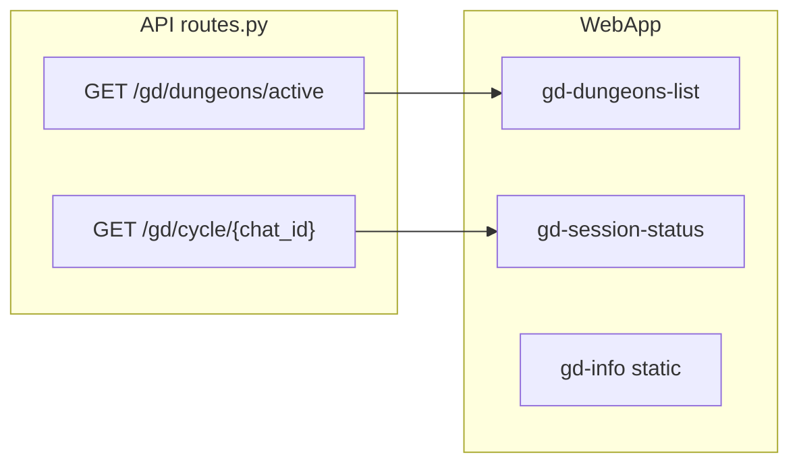

# Соответствие логики GD v1: бэкенд и вкладка «Групповые» в dungeons.html

## Архитектура сейчас

- Список карточек: `[GET /gd/dungeons/active](src/waifu_bot/api/routes.py)` → `[_gd_v1_dungeon_card_dict](src/waifu_bot/api/routes.py)` → `[loadActiveGdDungeons` / `createGdDungeonCard](src/waifu_bot/webapp/app.js)`.
- Блок по `?chat_id=`: только `[GET /gd/cycle/{chat_id}](src/waifu_bot/api/routes.py)` → `[updateGdSessionUI](src/waifu_bot/webapp/app.js)`.
- Статический текст правил: `[dungeons.html](src/waifu_bot/webapp/dungeons.html)` `#tab-group .gd-info`.

## Выявленные расхождения

### 1. Номер «раунда» (важно)

- В карточке и в `/gd/cycle/` в поле `stage` / `current_round` используется `**GDCycle.current_round_number**` — это номер **последнего записанного в БД** раунда (после коммита симуляции), см. `[_persist_round](src/waifu_bot/services/gd_v1_worker.py)`.
- В бою в состоянии есть `**collecting_for_round`** (`[process_gd_round](src/waifu_bot/services/gd_round_engine.py)`) — «на какой раунд идёт сбор»; между закрытием раунда и записью в журнал пользователь видит **другую** цифру, чем в чате/логике буфера.
- **Вывод:** фронт может показывать «раунд 2», пока в чате уже «сбор на раунд 3» — логическое несоответствие, не баг рендера.

**Рекомендация:** в `_gd_v1_dungeon_card_dict` и в ответе `/gd/cycle/{chat_id}` для `status === "active"` добавить поле вроде `collecting_for_round` (и при желании `wave`) из `cycle.battle_state_json`; во фронте подписать явно: «завершён раунд N» / «сбор на раунд M» (или одну строку «раунд M (сбор)»).

### 2. Копирайт в dungeons.html не совпадает с движком

| Утверждение в UI                                       | Факт в коде                                                                                                                                                                                                                              |
| ------------------------------------------------------ | ---------------------------------------------------------------------------------------------------------------------------------------------------------------------------------------------------------------------------------------- |
| «4 этапа (3 монстра + босс)»                           | GD v1: волна **trash** (несколько мобов) → волна **boss** (`[process_gd_round](src/waifu_bot/services/gd_round_engine.py)`), не фиксированные «4 этапа».                                                                                 |
| «Урон по монстру наносится автоматически» от сообщений | Урон считается **при закрытии раунда** из Redis-буфера + симуляция, не как в соло «каждое сообщение = удар».                                                                                                                             |
| «Нет поражения» + «адаптивная регрессия ХП»            | Есть `**party_wiped`** с подъёмом HP ~15% и продолжением (`[gd_round_engine.py](src/waifu_bot/services/gd_round_engine.py)`); отдельной «адаптивной регрессии» под низкую активность в GD v1 не найдено — формулировка завышена/неверна. |
| Список тематических подземелий                         | Имена берутся из `**GDDungeonTemplate**` в БД; жёсткий список в HTML может не совпадать.                                                                                                                                                 |

**Рекомендация:** переписать абзац и список в `[dungeons.html](src/waifu_bot/webapp/dungeons.html)` под фактическую механику (волны, раунды по таймеру/форсу, буфер в чате, wipe → восстановление), убрать или заменить «регрессию», темы описать обобщённо или подтягивать с API (опционально, тяжелее).

### 3. Подпись «вклад (раунды)» и `joined_at_stage`

- В `[createGdDungeonCard](src/waifu_bot/webapp/app.js)` для `v1` выводится `contribLabel = "вклад (раунды)"`, но `[total_damage](src/waifu_bot/api/routes.py)` — это сумма `**text` + `skill`** из `contribution`, не число раундов.
- `joined_at_stage` для v1 всегда **1** в бэкенде — вторая колонка статистики почти бесполезна.

**Рекомендация:** заменить подпись на «урон (сообщения+навыки)» или «условный урон»; опционально отдельно отдавать `contrib.rounds` из того же словаря и показывать второй ряд, если нужно.

### 4. Блок `gd-session-status` и разметка в HTML

- В `[dungeons.html](src/waifu_bot/webapp/dungeons.html)` размечены `#gd-session-dungeon-name`, монстр, HP-бар.
- `[updateGdSessionUI](src/waifu_bot/webapp/app.js)` при успехе **полностью заменяет** `innerHTML` карточки текстом без монстра/HP — разметка в HTML фактически мёртвая.
- `/gd/cycle/{chat_id}` не отдаёт имя подземелья, монстров, HP (в отличие от карточки списка).

**Рекомендация (минимум):** удалить или упростить неиспользуемую разметку в HTML, чтобы не вводить в заблуждение. **Расширение:** расширить `/gd/cycle/{chat_id}` теми же вычисляемыми полями, что и карточка (или реюзнуть `_gd_v1_dungeon_card_dict` с `player_id` из query/initData — потребует авторизации), и снова заполнять HP-бар в сессии.

### 5. Активные эффекты

- `[_gd_v1_dungeon_card_dict](src/waifu_bot/api/routes.py)` всегда отдаёт `"active_effects": []`. В модалке всегда «Нет активных эффектов».

**Рекомендация:** для v1 скрыть секцию «Активные эффекты» или пометить «в веб-приложении не отображаются»; либо в будущем тянуть эффекты из БД (`GDActiveEffect`) — отдельная задача.

### 6. Прочее (низкий приоритет)

- Ссылка «Перейти в чат»: `t.me/c/` после снятия префикса `-100` — норма для супергрупп; для обычных групп (другой формат id) может не работать — при жалобах уточнить сценарии.
- Обновление списка и сессии каждые 15 с — достаточно для статуса; дедлайн раунда в UI не показывается — опционально добавить из `round_deadline_at` в API.

## Предлагаемый порядок работ

1. **API:** добавить в payload v1 `collecting_for_round` и `wave` (active), при необходимости `round_deadline_at` ISO; синхронизировать `/gd/cycle/{chat_id}`.
2. **app.js:** обновить `gdV1StageBadge`, детали модалки и `updateGdSessionUI` под новые поля и понятные подписи; исправить `contribLabel` / вторую статистику.
3. **dungeons.html:** привести текст вкладки к реальной механике GD v1; убрать/согласовать «мёртвую» разметку сессии или восстановить её через API.
4. **Опционально:** скрыть пустые эффекты для v1; расширить `/gd/cycle` данными карточки для полноценного блока сессии.

После этого пройтись ручным чек-листом: игрок в регистрации / активный trash / активный boss / после завершённого раунда до следующего тика — цифры раунда и HP на карточке и в блоке `chat_id` согласованы с бэком.