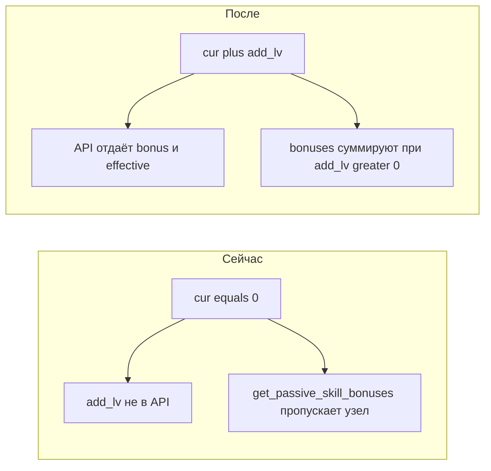

# План: кап 60 + кривая опыта + пассивы от предметов в UI

## 1. Уровень 60 и опыт

**Факты из кода**

- Шаг опыта до уровня `L`: `EXP_BASE * L ** 2` (`[src/waifu_bot/game/formulas.py](src/waifu_bot/game/formulas.py)`); сейчас `EXP_BASE = 50`, `MAX_LEVEL = 50` (`[src/waifu_bot/game/constants.py](src/waifu_bot/game/constants.py)`).
- Последний шаг до 50-го: `50 × 50² = 125 000` XP; суммарно к 50 уровню ~**2,15M** — при ~**4000** XP за данж это десятки забегов на уровень.
- Лимит уровня в БД: `CheckConstraint("level >= 1 AND level <= 50")` у `[MainWaifu](src/waifu_bot/db/models/waifu.py)` (нужна миграция).

**Целевая прогрессия**

- Оставить формулу **той же формы** (`EXP_BASE * level²`), чтобы не трогать `calculate_total_experience_for_level` и цикл левелапа в `[combat.py](src/waifu_bot/services/combat.py)` / `[group_dungeon.py](src/waifu_bot/services/group_dungeon.py)`.
- Снизить `**EXP_BASE`** с `50` до **~16** (подобрать 15–17 при желании): тогда шаг **49→50** ≈ `16 × 50² = 40 000` XP — близко к **10 × 4000**; шаг к 60-му останется того же порядка (~58k), что всё ещё разумно.
- Установить `**MAX_LEVEL = 60`**.

**Изменения по файлам**

| Место                                                   | Действие                                                                                                                                                                                            |
| ------------------------------------------------------- | --------------------------------------------------------------------------------------------------------------------------------------------------------------------------------------------------- |
| `[constants.py](src/waifu_bot/game/constants.py)`       | `MAX_LEVEL = 60`, `EXP_BASE` ≈ 16 (и краткий комментарий «ориентир: ~10 высоких данжей на уровень»).                                                                                                |
| Новая ревизия Alembic                                   | Заменить constraint на `main_waifus`: `level <= 60` (drop old `check_level_range`, add new).                                                                                                        |
| `[waifu.py` (модель)](src/waifu_bot/db/models/waifu.py) | Обновить строку constraint под 60.                                                                                                                                                                  |
| `[app.js](src/waifu_bot/webapp/app.js)`                 | Вынести **те же** числа, что в Python: константы уровня/базы опыта; обновить `expForLevel` / `totalExpForLevel` (сейчас захардкожено `50` в `[expForLevel](src/waifu_bot/webapp/app.js)` ~772–775). |
| `[app.js](src/waifu_bot/webapp/app.js)`                 | При желании: строка `[ACT_META](src/waifu_bot/webapp/app.js)` для акта V `levelRange: "41–50"` → **"41–60"** (косметика каравана).                                                                  |

**Поведение для уже существующих игроков**

- При той же сумме `experience` уровень **пересчитается** при следующем левелапе/логике боя; из‑за более низкого `EXP_BASE` многие «старые» 50-е окажутся выше по уровню или быстрее дойдут до 60 — это ожидаемо при смягчении кривой. Явной миграции значений `experience` не требуется.

---

## 2. Пассивы от предметов: бонусы без очков в узле + UI

**Проблема**

- `[get_passive_skill_tree](src/waifu_bot/services/passive_skills.py)`: `add_lv` и `equipment_level_bonus` считаются **только если `cur > 0`** → фронт не видит бонус на непрокачанных узлах.
- `[get_passive_skill_bonuses](src/waifu_bot/services/passive_skills.py)`: в выборку попадают только строки с `PlayerPassiveSkill.level > 0` → **чисто предметный** бонус к узлу **не даёт эффекта** в бою/профиле.

**Бэкенд**

1. В `**get_passive_skill_bonuses`**: после загрузки `bundle` пройти **все** узлы `PassiveSkillNode` (один `select`), для каждого:
  - `cur` из карты изученных (0, если нет строки);
  - `add_lv = nodes[id] + branches[branch] + all_nodes`;
  - если `cur <= 0` и `add_lv <= 0` — пропуск;
  - `eff_lv = cur + add_lv` (для `cur = 0` остаётся только предмет; `extrapolate_passive_effect_value` уже требует `level >= 1` — ок, если предмет даёт ≥1 уровень).
  - суммировать эффекты как сейчас (учесть `armor_and_reduce` и т.д.).
2. В `**get_passive_skill_tree`**: всегда считать `add_lv` из `bundle` (без условия `cur > 0`); выставлять:
  - `equipment_level_bonus = add_lv` при `add_lv > 0`;
  - `effective_level = cur + add_lv`;
  - `effective_effect_value` через `extrapolate_passive_effect_value`, если `**cur > 0 или add_lv > 0**` (и `eff_lv >= 1`);
  - при `cur == 0` и `add_lv > 0` можно оставить `current_effect_value: null` — модалка будет опираться на effective.

**Фронт (`[app.js](src/waifu_bot/webapp/app.js)` + при необходимости `[styles.css](src/waifu_bot/webapp/styles.css)`)**

- **Карточка узла**: класс `passive-skill-cell--equip-bonus` при `**eq > 0`** (уже есть зелёная рамка в `[.page-training .passive-skill-cell--equip-bonus](src/waifu_bot/webapp/styles.css)`) — заработает для `cur === 0`, когда API начнёт отдавать `equipment_level_bonus`.
- **Вместо пиксельной полосы** (`[renderPassivePixelBar](src/waifu_bot/webapp/app.js)` + разметка в `[renderPassiveNodeCard](src/waifu_bot/webapp/app.js)`): показывать **цифры** `cur / max` (и при `eq > 0` — компактно эффективный уровень, например отдельной строкой «эфф. N» или `N (M от предм.)` — на ваш вкус в рамках «цифры вместо блоков»).
- Убрать/не использовать жёсткий clamp `50` в `[renderPassivePixelBar](src/waifu_bot/webapp/app.js)` (7344–7346), если функция останется для чего-то ещё — опираться на `max` узла.
- **Модалка** `[openPassiveSkillModal](src/waifu_bot/webapp/app.js)`: если `eq > 0` и `cur === 0`, показывать блок «От предметов» / «Эффективный уровень» и **текущий эффект** из `effective_effect_value` (подправить `[formatPassiveEffect](src/waifu_bot/webapp/app.js)`, чтобы при нулевом `cur` не отбрасывать только effective).
- Секция «Бонус по уровням» (slash по таблице) можно оставить; при необходимости добавить одну строку «Сейчас (с учётом предметов)» даже при `cur = 0`.

**Регрессии**

- Кэш `_SESSION_PASSIVE_EXTRA_CACHE_KEY` в `get_passive_skill_bonuses` не меняется по смыслу.
- Логика «можно прокачать» (`can_learn`) по-прежнему от **изученных** очков и золота — предметы не открывают узел без требований по ветке/уровню ОВ.

---

## 3. Порядок внедрения

1. Миграция БД + `constants` + модель + Python-формулы (фактически константы).
2. `passive_skills.py`: дерево + бонусы.
3. `app.js` + при необходимости мелкие правки CSS для типографики строки уровня.
4. Прогнать быстрый ручной сценарий: экипировка с `passive_node_level_add:`* / веткой / all — узел 0/5 с зелёной рамкой, эффект в бою/профиле; данж даёт ожидаемую долю уровня на высоком L.

