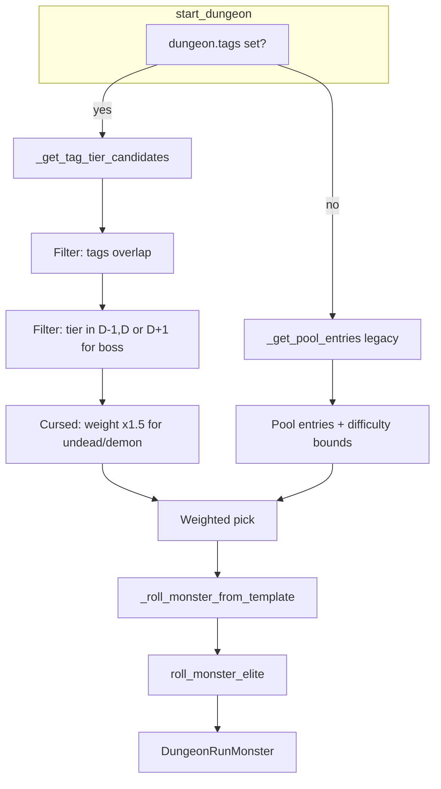

# План: обновлённая система монстров (биом-теги + тир)

## 1. Схема БД и миграции

### 1.1. Добавить поле `tier` в `monster_templates`

- Новая Alembic-миграция после `0019_update_monster_templates_names`.
- Колонка: `tier INTEGER NOT NULL DEFAULT 1`, CHECK (tier BETWEEN 1 AND 5).
- Файл: `[src/waifu_bot/db/models/dungeon.py](src/waifu_bot/db/models/dungeon.py)` — добавить `tier: Mapped[int]` в `MonsterTemplate`.

### 1.2. Добавить поле `tags` в `dungeons`

- Колонка: `tags JSON NULLABLE` — массив строк биом-тегов (cave, forest, ruins, crypt, abyss, fortress, swamp, volcano, sea_depth, tundra, desert, sky, cursed).
- Колонка: `tier INTEGER NOT NULL DEFAULT 1` — тир подземелья (1–5), по умолчанию = act.
- Миграция: добавить обе колонки; заполнить `tags` из `location_type`: `["cave"]`, `["forest"]` и т.д. (маппинг из 0006: 1→cave, 2→forest, 3→ruins, 4→crypt, 5→abyss).
- `location_type` оставить для обратной совместимости (API, сиды); новый код будет использовать `tags`.

### 1.3. Константа cursed-множителя

- Добавить в `[src/waifu_bot/game/constants.py](src/waifu_bot/game/constants.py)`: `CURSED_TAG_WEIGHT_MULTIPLIER = 1.5`.
- ТЗ: "Параметр multiplier для cursed выносится в переменную БД" — на первом этапе константа; при необходимости позже вынести в `game_config`/настройки.

---

## 2. Импорт шаблонов из CSV

### 2.1. Размещение CSV

- Файл: `scripts/data/monster_templates.csv` (создать директорию `scripts/data` при необходимости).
- Формат: заголовок из ТЗ, 285 строк. Поле `tags` — JSON-массив строк (в CSV экранированные кавычки).

### 2.2. Миграция импорта

- Новая миграция `0020_monster_system_tag_tier.py`:
  1. Добавить `tier` в `monster_templates`.
  2. Добавить `tags`, `tier` в `dungeons`.
  3. Очистить `monster_templates` (TRUNCATE CASCADE или DELETE; учесть FK из `dungeon_pool_entries` и `dungeon_run_monsters` — последние ссылаются на template_id, можно SET NULL или оставить старые ID).
  4. Импорт: читать CSV через Python `csv`/`pandas`, парсить `tags` из JSON-строки, bulk_insert в `monster_templates`.
- Важно: `dungeon_run_monsters.template_id` — nullable; старые забеги сохраняют имя/статы в строке, ссылка на шаблон может быть NULL.
- `dungeon_pool_entries`: при переходе на tag-based выбор пулы не используются; можно очистить записи (или оставить для fallback). В плане — очистить `dungeon_pool_entries`, пулы оставить (таблицы не трогать для совместимости).

### 2.3. Нормализация формата `tags`

- Текущий формат в 0006: `{"tags": ["cave", "ruins"]}`.
- CSV/ТЗ: `["crypt", "ruins", "cursed"]`.
- Хранить в БД как массив `["cave","ruins"]` для упрощения запросов. При импорте парсить JSON-строку из CSV и записывать массив.

---

## 3. Логика выбора монстров (tag-based + tier-based)

### 3.1. Новая функция выбора кандидатов

- В `[src/waifu_bot/services/dungeon.py](src/waifu_bot/services/dungeon.py)` добавить `_get_tag_tier_candidates(session, dungeon, is_boss, target_diff, total_monsters)`:
  - Берёт `dungeon.tags` (если NULL — fallback на `[dungeon.location_type]`).
  - Берёт `dungeon.tier` (если NULL — `dungeon.act`).
  - D = dungeon.tier. Фильтр по tier монстров:
    - Обычные: tier IN (D-1, D) (слабые + основные).
    - Босс: tier = D+1, `boss_allowed=true`.
  - Фильтр по тегам: пересечение `dungeon.tags` и `template.tags` не пусто. Для PostgreSQL: `template.tags ?| dungeon_tags_array` (overlap) или эквивалент через SQLAlchemy/raw SQL.
  - Фильтр по уровню: `level_min <= target_level <= level_max` (для Dungeon+ level может превышать level_max — допустить).
  - Cursed: если `"cursed" in dungeon.tags` и `template.family in ("undead","demon")`, то `weight *= CURSED_TAG_WEIGHT_MULTIPLIER`.
  - Возвращает список `(MonsterTemplate, effective_weight)`.

### 3.2. Интеграция в `start_dungeon`

- Если `dungeon.tags` задан (не пустой массив) — использовать `_get_tag_tier_candidates` вместо `_get_pool_entries`.
- Иначе — fallback на текущую pool-based логику (для старых данжей без tags).
- Подбор уровня монстра: как сейчас (dungeon.level или 50 + (plus_level-1)*5), с учётом `level_min`/`level_max` шаблона.

---

## 4. Обновление данжей под теги

### 4.1. Маппинг существующих данжей

- Текущий `location_type` по dungeon_number (из 0006): 1→cave, 2→forest, 3→ruins, 4→crypt, 5→abyss.
- Миграция заполнит `tags = [location_type]` и `tier = act` для всех существующих записей.
- Для составных локаций (Пещера разбойников = cave+fortress) — обновить вручную или отдельным сидом/миграцией после базового импорта.

### 4.2. Примеры составных локаций (опционально)

- Добавить в сид или отдельную миграцию примеры: e.g. "Пещера разбойников" с `tags = ["cave","fortress"]`, "Проклятая крепость" с `tags = ["fortress","cursed"]` и т.д. — по желанию, можно отложить на второй этап.

---

## 5. Совместимость с аффиксами элитных монстров

- Система аффиксов (`monster_affixes`, `roll_monster_elite`) остаётся без изменений.
- `MonsterAffix.allowed_families` / `forbidden_families` уже привязаны к `family` шаблона — новые семейства (fae и т.д.) будут работать, если аффиксы не ограничивают их явно.
- Проверить, что `allowed_families` в сидах 0018 не исключают fae; при необходимости добавить fae в разрешённые или оставить null (= все).

---

## 6. Удаление/отмена миграции 0019

- Миграция `0019_update_monster_templates_names` переименовывала "X N" → "X-N". Поскольку мы полностью заменяем шаблоны из CSV (новые имена уже без суффиксов 1/2/3), 0019 можно:
  - **Вариант A**: оставить в цепочке, но после TRUNCATE/замены данных она не влияет.
  - **Вариант B**: откатить 0019 (downgrade) и не включать в 0020 — если 0020 идёт после 0019, то 0019 уже применена; при полной замене данных результат тот же.
- Рекомендация: оставить 0019, 0020 выполняет полную замену `monster_templates` из CSV.

---

## 7. Файлы и порядок изменений

| Шаг | Файл                                               | Действие                                                                      |
| --- | -------------------------------------------------- | ----------------------------------------------------------------------------- |
| 1   | `src/waifu_bot/db/models/dungeon.py`               | Добавить `tier` в MonsterTemplate; `tags`, `tier` в Dungeon                   |
| 2   | `src/waifu_bot/game/constants.py`                  | Добавить `CURSED_TAG_WEIGHT_MULTIPLIER = 1.5`                                 |
| 3   | `scripts/data/monster_templates.csv`               | Создать, вставить 285 строк из ТЗ                                             |
| 4   | `alembic/versions/0020_monster_system_tag_tier.py` | Миграция: tier, tags, tier в dungeons, импорт CSV, маппинг location_type→tags |
| 5   | `src/waifu_bot/services/dungeon.py`                | `_get_tag_tier_candidates`, интеграция в `start_dungeon`                      |
| 6   | `src/waifu_bot/api/schemas.py`                     | Добавить `tags`, `tier` в DungeonResponse (если нужно для UI)                 |
| 7   | `src/waifu_bot/api/routes.py`                      | При отдаче данжей — включать `tags`/`tier` при наличии                        |

---

## 8. Диаграмма потока выбора монстра

