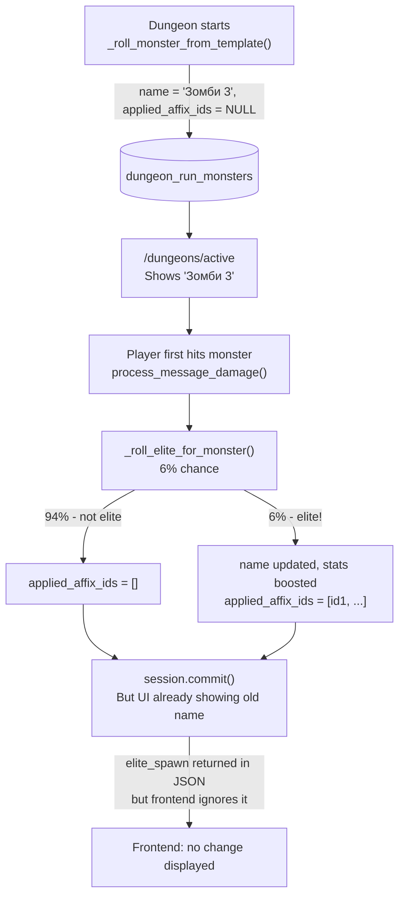

# Monster Affix System Fix

## Diagnosis

Current state confirmed by DB inspection:

- 803 `dungeon_run_monsters`, all with `applied_affix_ids IS NULL` — the elite roll has never persisted
- Active run 110: positions 1-2 defeated via old code (before the `/dungeons/continue` fix), position 3 is current but unhit
- `monster_affixes` table: 48 affixes fully seeded and valid
- `_roll_elite_for_monster()` in `[services/combat.py](src/waifu_bot/services/combat.py)` (line 430) is implemented correctly — it fires on first hit but has never actually run on committed data yet




**Root causes:**

1. Elite roll fires on first hit, not at dungeon creation — initial UI always shows unmodified name
2. `defense_add` and `evade_add` affix fields are stored but never read in combat damage calculation
3. Frontend has no handling for `elite_spawn` in the `continueBattle()` response, and `/dungeons/active` does not return `is_elite`/`elite_color`/affix names
4. Behavior flags (`BERSERK`, `REGEN`, `REFLECT`, etc.) — defined in data, not yet executable

---

## Fix Plan

### 1. Move elite roll to dungeon creation time

File: `[services/dungeon.py](src/waifu_bot/services/dungeon.py)`, method `_roll_monster_from_template()` (around line 357).

After creating the `DungeonRunMonster` record, call a synchronous version of the affix picker using the player's luck stat (passed in from `start_dungeon`). This way the name and stats are set at dungeon start — the player sees the modified name immediately on the dungeon card.

Key change: remove the lazy sentinel pattern for new runs (set `applied_affix_ids` at creation, never `None`). The lazy path in `_roll_elite_for_monster` can remain as a fallback for legacy monsters.

Luck needs to be passed into `_roll_monster_from_template` — currently only `template` and `position` are passed.

### 2. Wire `defense_add` and `evade_add` into combat damage

File: `[services/combat.py](src/waifu_bot/services/combat.py)`, `process_message_damage()`.

After fetching `run_monster`, load its applied affixes and compute:

- `monster_defense_pct`: sum of `defense_add` from affixes — reduces incoming player damage
- `monster_evade_pct`: sum of `evade_add` — gives the monster a chance to dodge attacks

Apply `monster_defense_pct` to the damage formula before hitting the monster:

```python
if monster_defense_pct > 0:
    damage = int(damage * (1 - monster_defense_pct / 100))
```

Apply `monster_evade_pct` as a dodge roll before applying damage.

### 3. Add elite status to `/dungeons/active` response

File: `[api/routes.py](src/waifu_bot/api/routes.py)`, `active_dungeon` endpoint (line 1524).

After fetching `get_active_dungeon()`, if it's a run-based monster, query its affix records and add:

- `is_elite: bool`
- `elite_color: str | None` (`"blue"`, `"gold"`, `"red"`)
- `applied_affixes: list[str]` — affix names for display

Alternatively, enrich directly in `dungeon_service.get_active_dungeon()`.

### 4. Update frontend UI for elite monsters

Files: `[webapp/app.js](src/waifu_bot/webapp/app.js)`, `[webapp/styles.css](src/waifu_bot/webapp/styles.css)`.

In `renderSoloActiveProgress()`: add an elite color indicator (left border or badge) based on `active.elite_color`. Show affix names as small chips below the monster name.

In `continueBattle()`: if the response contains `elite_spawn`, add a log message showing the elite reveal.

Example UI addition in `renderSoloActiveProgress`:

```js
const eliteBadge = active.is_elite
  ? `<span class="elite-badge elite-${active.elite_color}">${active.applied_affixes?.join(' ') ?? ''}</span>`
  : '';
```

CSS classes `.elite-badge`, `.elite-blue`, `.elite-gold`, `.elite-red` with corresponding border/text colors.

---

## Scope boundary

Behavior flags (`BERSERK`, `REGEN`, `REFLECT`, `SPLIT`, `UNDYING`, `CURSE`, `BUFF_NEXT`, `ANTI_CRIT`) are out of scope for this fix — the data model is complete, but the combat execution logic for each flag is a separate multi-session task. The plan covers what makes affixes visually and mechanically observable (stat affixes + UI display).