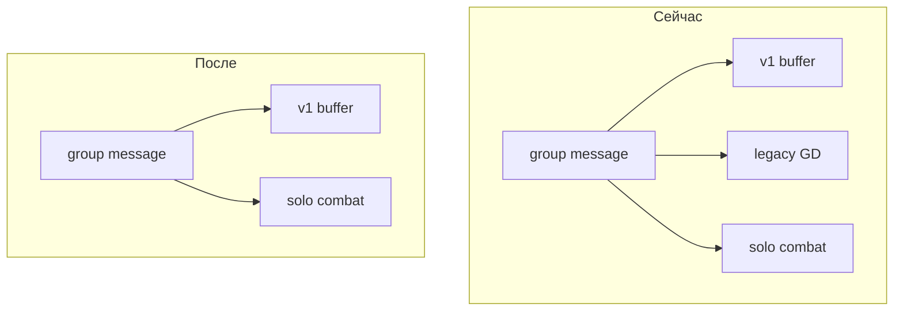

# План: отключение legacy групповых подземелий (переход на GD v1)

## Затрагиваемые области

| Область            | Сейчас                                                                                                      | После                                                                                                                                               |
| ------------------ | ----------------------------------------------------------------------------------------------------------- | --------------------------------------------------------------------------------------------------------------------------------------------------- |
| Сообщения в группе | v1 буфер → **legacy урон** → соло                                                                           | v1 буфер → соло (`[bot_handlers.py](src/waifu_bot/services/bot_handlers.py)` `group_message_damage`)                                                |
| Фон                | `_gd_background_loop` + `run_background_tick` (`[main.py](src/waifu_bot/main.py)`)                          | Удалить цикл legacy                                                                                                                                 |
| HTTP API           | `/gd/session`, `/gd/dungeons/active` через `[GroupDungeonService](src/waifu_bot/services/group_dungeon.py)` | Только v1: расширить `[/gd/cycle/{chat_id}](src/waifu_bot/api/routes.py)` при необходимости; список походов — запрос к `GDCycle` + `GDRegistration` |
| WebApp             | `[app.js](src/waifu_bot/webapp/app.js)`: v1 через `/gd/cycle`, затем fallback `/gd/session`                 | Убрать fallback; обновить пустой стейт списка (`/gd_start` → `/gd_join`) и карточку списка под поля v1                                              |
| Скрытые навыки     | `[hidden_skills.py](src/waifu_bot/services/hidden_skills.py)` `_active_group_chat_ids` по `GDSession`       | Тот же смысл по **активному** `GDCycle` + `GDRegistration.user_id`                                                                                  |

## 1. Удалить сервис и команды legacy

- **Удалить файл** `[src/waifu_bot/services/group_dungeon.py](src/waifu_bot/services/group_dungeon.py)` целиком (или оставить заглушку только если понадобится временный shim — предпочтительно полное удаление).
- `**[bot_handlers.py](src/waifu_bot/services/bot_handlers.py)`**:
  - Убрать импорты `GroupDungeonService`, `ENGAGE_CHAIN_*`, `push_gd_log` / блок `gd_debug` (если после чистки не останется вызовов — удалить и `[gd_debug.py](src/waifu_bot/services/gd_debug.py)` при желании, либе оставить файл для будущего v1-логирования без хендлеров).
  - Удалить хендлеры: `cmd_gd_start`, `cmd_engage`, `cmd_gd_engage`, весь блок L1–L4 (`gd_debug`, `gd_logs`, `gd_test_start`, `gd_complete`, `gd_skip`, `gd_hp`, `gd_event`, `gd_sim`, `gd_rewards_test`, `gd_reset`, `gd_env`, `gd_snap`), вспомогательные `_update_chain_timer`, `_render_chain_message`, `_send_event_visual_block` если больше нигде не используются.
  - В `group_message_damage`: убрать `gd_service.record_chat_message`, ветки engage-chain и event participation, ветку `active_gd` / `process_message_damage`; оставить проверку активного v1 цикла → `record_round_action`, иначе соло `combat_service.process_message_damage`.
- `**[main.py](src/waifu_bot/main.py)**`: удалить `_gd_background_loop` и импорт `GroupDungeonService` / константы тика, если использовались только там (`GD_SAVE_INTERVAL_SECONDS` для GD — проверить, не используются ли ещё где).

## 2. API

- `**[routes.py](src/waifu_bot/api/routes.py)**`:
  - Удалить `gd_service_api` и импорт `GroupDungeonService`.
  - `**GET /gd/session/{chat_id}**`: варианты (выбрать один): (A) удалить маршрут и обновить только webapp; (B) оставить совместимый ответ `{"active": false, "legacy": false}` или тонкий прокси на данные v1 из `battle_state_json` (дороже). Минимум — **удалить** и перейти на `/gd/cycle` + при необходимости новый `GET /gd/cycle/{chat_id}/state` с кратким срезом партии/монстров для карточки.
  - `**GET /gd/dungeons/active`**: переписать без `GroupDungeonService`: `select` по `GDRegistration` + `GDCycle`, где `user_id == player_id` и `GDCycle.status.in_(('registration','active'))`, join `GDDungeonTemplate` для имени. Сформировать JSON, совместимый с `[createGdDungeonCard](src/waifu_bot/webapp/app.js)` **или** явно добавить флаг `v1: true` и упростить поля (раунд, статус, имя шаблона), обновив рендер в `app.js`.

## 3. WebApp

- `[app.js](src/waifu_bot/webapp/app.js)`: в функции загрузки карточки по `chat_id` убрать вызов `/gd/session/...` после блока v1.
- `loadActiveGdDungeons` / `renderGdDungeonsList`: текст «запустите /gd_start» заменить на регистрацию v1 (`/gd_join`); при смене формата ответа API — подправить `createGdDungeonCard`.

## 4. Модели и БД

- `**[db/models/group_dungeon.py](src/waifu_bot/db/models/group_dungeon.py)`**: **не удалять** классы `GDDungeonTemplate`, `GDEventTemplate` — они нужны v1 и сидам (`[scripts/seed_gd_content.py](scripts/seed_gd_content.py)`).
- Классы `**GDSession`**, `**GDPlayerContribution**`, `**GDCompletion**` (и прочие только legacy) можно оставить в коде для совместимости с существующей БД **без использования в рантайме**, либо удалить модели и добавить **отдельную миграцию** `DROP TABLE` (риск: потеря истории). Рекомендация плана: **фаза 1** — остановить код; **фаза 2 (опционально)** — миграция удаления legacy-таблиц после бэкапа.
- `**[alembic/env.py](alembic/env.py)`**: при удалении моделей из `models` — убрать импорты для autogenerate.

## 5. Прочее

- `**[game/constants.py](src/waifu_bot/game/constants.py)**`: по желанию убрать неиспользуемые константы legacy GD (этапы, engage, regression и т.д.), если grep не находит ссылок.
- `**[docs/BOT_COMMANDS_FOR_BOTFATHER.md](docs/BOT_COMMANDS_FOR_BOTFATHER.md)**` и **текст `/help`**: удалить описания `gd_start`, `engage`, `gd_engage`, dev-команд legacy; оставить v1 и `gd_v1_test_*`.
- **Конфиг** (`[config.py](src/waifu_bot/core/config.py)`): комментарии про `GD_DEV_ADMIN_ANY_CHAT` / отладку legacy — обновить или сузить под будущее v1.

## 6. Риски и проверки

- Старые **активные** `GDSession` в БД перестанут обновляться; игроки должны завершить вручную или вы выполните SQL/скрипт завершения до деплоя.
- Убедиться, что нет других импортов `group_dungeon` (уже проверено: `[bot_handlers](src/waifu_bot/services/bot_handlers.py)`, `[main](src/waifu_bot/main.py)`, `[routes](src/waifu_bot/api/routes.py)`, `[hidden_skills](src/waifu_bot/services/hidden_skills.py)`).

