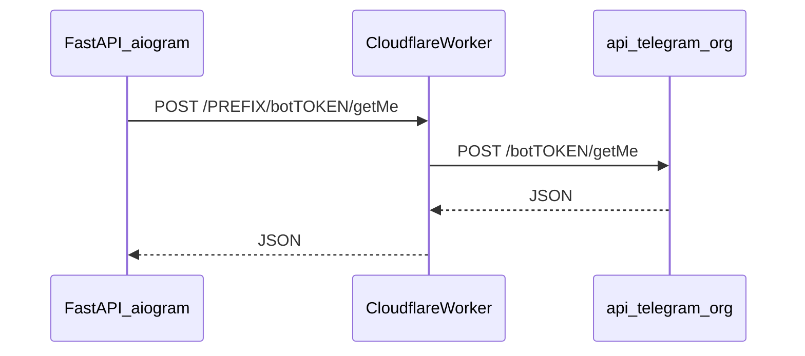

# Вариант 2: Cloudflare Worker для исходящих вызовов Bot API

## Что такое `id` в VLESS (для варианта 1 «про запас»)

Это **UUID пользователя** в ссылке вида `vless://XXXXXXXX-....@сервер:порт?...` — строка между `vless://` и `@`. Её выдаёт панель/провайдер (не путать с Telegram user id). Когда будет полная ссылка или экспорт из HAPP — копируешь UUID в `users[0].id` и `pbk` в `realitySettings.publicKey` в `[/usr/local/etc/xray/config.json](file:///usr/local/etc/xray/config.json)`.

## Идея варианта 2

VPS ходит не на `api.telegram.org`, а на **твой Worker** на `*.workers.dev` (или кастомный домен). Worker делает `fetch` на `https://api.telegram.org` с тем же путём и query (`/bot<token>/<method>`, `/file/bot<token>/...`). Исходящий трафик с VPS идёт только до Cloudflare, что обычно обходится легче, чем прямой Telegram.

## Безопасность Worker

Открытый Worker без проверки превратится в **публичный прокси** к Bot API. В плане: **обязательный секретный префикс пути**, хранимый в Worker (`SECRET_PREFIX` в Wrangler secrets), совпадающий с тем, что в базовом URL на VPS.

- База для aiogram: `TelegramAPIServer.from_base("https://<worker>/<SECRET_PREFIX>")` → запросы на `https://<worker>/<SECRET_PREFIX>/bot{token}/{method}` и `.../file/bot{token}/{path}` (`[aiogram/client/telegram.py](file:///usr/local/lib/python3.12/dist-packages/aiogram/client/telegram.py)` — `from_base`).
- Worker: если `pathname` не начинается с `/<SECRET_PREFIX>/`, отвечать `404`; иначе убрать префикс и проксировать на `https://api.telegram.org` + тот же `pathname` (после префикса) + `search`.
- При проксировании **не** пересылать заголовок `Host` от клиента; для `fetch(upstream)` Host задаётся целевым URL.

## Изменения в приложении

1. `**[src/waifu_bot/core/config.py](src/waifu_bot/core/config.py)`**
  - Новое опциональное поле, например `telegram_api_base_url: str | None` с алиасом `TELEGRAM_API_BASE_URL` (полный URL **включая** секретный префикс, без завершающего `/`, например `https://tg-proxy.xxx.workers.dev/myRandomPrefix`).
2. `**[src/waifu_bot/services/webhook.py](src/waifu_bot/services/webhook.py)`** — функция `_build_bot()`
  - Если задан `telegram_api_base_url`: создать `AiohttpSession(api=TelegramAPIServer.from_base(base))` (при необходимости совместить с существующим `TELEGRAM_BOT_PROXY`: зафиксировать приоритет в коде и в комментарии — **рекомендуется**: если задан `TELEGRAM_API_BASE_URL`, прокси для Bot API не использовать, т.к. трафик уже идёт на Cloudflare).  
  - Импорт: `from aiogram.client.telegram import TelegramAPIServer`.
3. `**[.env.example](.env.example)`**
  - Пример закомментированной строки `TELEGRAM_API_BASE_URL=...` и краткая пометка про взаимоисключение с `TELEGRAM_BOT_PROXY`.

## Артефакты Worker (в репозитории, без секретов)

- Добавить каталог, например `[scripts/cloudflare-telegram-proxy/](scripts/cloudflare-telegram-proxy/)`:  
  - `worker.js` (или `src/index.js`) с логикой выше.  
  - `wrangler.toml` с `name`, `main`, `compatibility_date`.  
  - Короткий **README только в этом каталоге** (как задеплоить: `wrangler secret put SECRET_PREFIX`, `wrangler deploy`, проверка `curl` на `getMe`).

Проверка после деплоя (с реальным токеном только локально, не в логах репозитория):

`curl -sS "https://<worker>/<PREFIX>/bot<TOKEN>/getMe"`

Ожидается JSON с `"ok":true`.

## Эксплуатация

- В `.env` на VPS: `TELEGRAM_API_BASE_URL=https://.../PREFIX`, убрать/не задавать `TELEGRAM_BOT_PROXY` для этого сценария.  
- Перезапуск приложения; убедиться, что `get_me` в логах старта проходит.  
- Xray на VPS можно **не отключать** — просто не использовать для бота, пока работает Worker.

