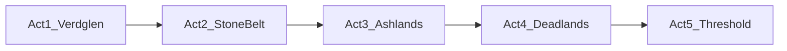

# План: сеттинг по актам и названия подземелий

## Контекст в коде и БД

- Базовая сетка: **5 актов × 5 соло-подземелий**, ключ `(act, dungeon_number)` (`[Dungeon](src/waifu_bot/db/models/dungeon.py)`).
- Сейчас `**dungeon_number` жёстко кодирует «тип локации»** во всём мире: 1=пещера, 2=лес, 3=руины, 4=склеп, 5=бездна — это заложено в [0007_seed_base_dungeons.py](alembic/versions/0007_seed_base_dungeons.py) и в названиях [0031_dungeon_unique_names.py](alembic/versions/0031_dungeon_unique_names.py).
- Подбор монстров в процедурной части опирается на `**Dungeon.tags`** (fallback — `[location_type]`) и пересечение с тегами шаблонов (`[dungeon.py](src/waifu_bot/services/dungeon.py)` `_get_tag_tier_candidates`). Смена только **имени** безопасна; массовая смена `**location_type` / `tags` под один тег на весь акт** потребует проверки покрытия тегами в `monster_templates` (иначе пустые кандидаты).

## Предлагаемый общий сеттинг

Одна сквозная арка: **путь от окраин живого мира к «Грани»** (зоне катастрофы / падения старой империи). Каждый акт — **одна крупная полоса земли** с узнаваемым биомом и настроением; подземелья — **разные места внутри этой полосы** (не пять разных климатов на одном акте).

---

## Акт 1 — **Вердгленд** (низинные леса и пограничье)

**Биом и тон:** влажный лес, ручьи, остатки сторожевых укреплений на границе цивилизации. Спокойное фэнтези, «первая глава».

| №   | Название                           | Роль в регионе                    |
| --- | ---------------------------------- | --------------------------------- |
| 1   | **Трёхдубовая нора**               | Пещера у корней, логово тварей    |
| 2   | **Старая кряжа**                   | Заросшая чаща, лабиринт из ветвей |
| 3   | **Развалины приозёрного бастиона** | Башни и валы у воды               |
| 4   | **Курган первых стражей**          | Захоронения у дороги              |
| 5   | **Расщелина утреннего тумана**     | Узкий провал, вниз уходит холод   |

**Технические теги (без смены логики спавна):** сохранить текущую схему `cave` / `forest` / `ruins` / `crypt` / `abyss` для слотов 1–5 — нарративно всё остаётся «лесной маркой».

---

## Акт 2 — **Каменный пояс** (горы и перевалы)

**Биом и тон:** сырость камня, обвалы, шахты, заброшенные обители в скалах. Тяжелее и опаснее.

| №   | Название                        |
| --- | ------------------------------- |
| 1   | **Затопленная выработка**       |
| 2   | **Тропа камнепада**             |
| 3   | **Обитель сломанного колокола** |
| 4   | **Склеп стражей перевала**      |
| 5   | **Провал седых скал**           |

**Теги:** как сейчас по слотам 1–5 (та же пятерка типов), интерпретируемые как горные варианты.

---

## Акт 3 — **Пепельные степи** (выжженная полоса бывшей империи)

**Биом и тон:** пепел, ветер, остовы дорог и городов, «сухая смерть».

| №   | Название                                      |
| --- | --------------------------------------------- |
| 1   | **Щебнистые норы**                            |
| 2   | **Костяной лес** (сухостой, не «лес чудовищ») |
| 3   | **Пепельный форум**                           |
| 4   | **Мавзолей пепельного легиона**               |
| 5   | **Разлом серых ветров**                       |

**Теги:** по-прежнему слоты 1–5 → те же пять `location_type` для совместимости; в описаниях подчеркнуть пепельно-степной антураж.

---

## Акт 4 — **Мёртвые земли** (некротическая полоса у Грани)

**Биом и тон:** застой, тьма, нежить и проклятые места; без смешения с «обычным лесом акт 1».

| №   | Название                      |
| --- | ----------------------------- |
| 1   | **Норы падших**               |
| 2   | **Лес сухих корней**          |
| 3   | **Перекрёсток чёрных дорог**  |
| 4   | **Саркофаг безымянного царя** |
| 5   | **Провал безлуния**           |

**Теги:** опционально позже добавить `cursed` в `tags` для усиления веса undead/demon (уже поддержано в коде) — **после** проверки, что кандидаты не схлопнутся.

---

## Акт 5 — **Преддверье Грани** (финал арки)

**Биом и тон:** искажение реальности, смешение руин и «неба», финальная бездна.

| №   | Название                                                         |
| --- | ---------------------------------------------------------------- |
| 1   | **Своды преддверия**                                             |
| 2   | **Роща деревьев-знаков** (или **Древо в никуда** — более мрачно) |
| 3   | **Трон сломанной звезды**                                        |
| 4   | **Зал вечного суда**                                             |
| 5   | **Врата Грани**                                                  |

**Примечание:** для слота 5 осознанно оставлено финальное имя в духе кульминации (вместо нейтральной «бездны» в лоре — именно врата).

---

## Что менять в репозитории (после утверждения плана)

1. **Новая Alembic-миграция** (рекомендуется): `UPDATE dungeons SET name = ..., description = ... WHERE act = ? AND dungeon_number = ? AND dungeon_type = 1` для всех 25 пар — аналогично структуре `DUNGEON_NAMES` в [0031_dungeon_unique_names.py](alembic/versions/0031_dungeon_unique_names.py).
2. **Описания (`description`)** — по 1–2 предложения на данж, явно привязать к региону акта (для UI и единообразия).
3. **[scripts/seed_dungeons.py](scripts/seed_dungeons.py)** — сейчас зашит только **акт 1**; имеет смысл либо вынести полный список в `scripts/data/dungeons.json`, либо явно указать в комментарии, что **источник правды для полной сетки — миграции**, чтобы не расходилось с продом.
4. **Опционально (фаза 2):** пересмотр `location_type` / `tags` по акту под «настоящий» один биом — только после выборки по БД: какие теги есть у `monster_templates` для `act_min`/`act_max` и `tier`.

## Риски и как их снять

- **Только переименование** — низкий риск, геймплей монстров не меняется.
- **Смена тегов под один биом на акт** — высокий риск пустых пулов; нужен аудит SQL по `monster_templates.tags` и при необходимости дозаполнение шаблонов.

