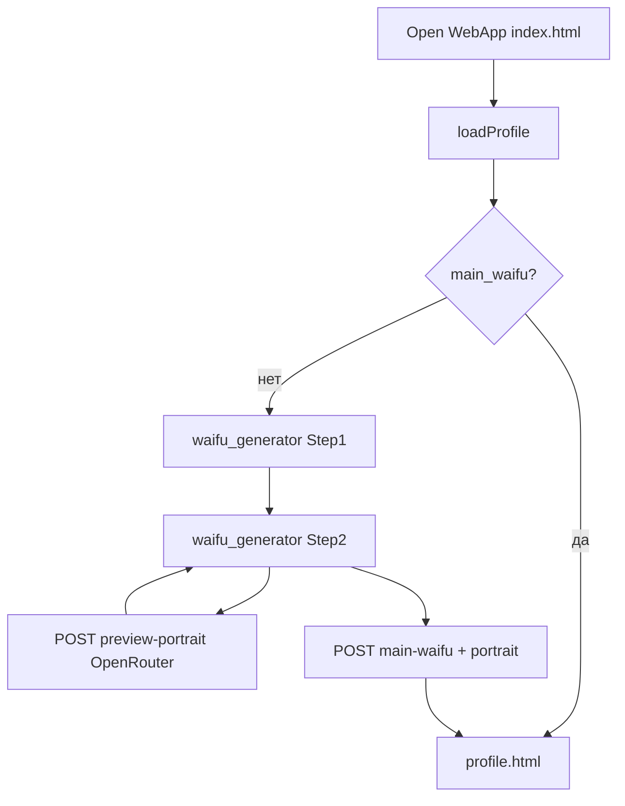

# План: стартовый экран и двухэтапная генерация ОВ с портретом

## Текущее состояние

- [index.html](src/waifu_bot/webapp/index.html) мгновенно редиректит на `profile.html` ([строки 7–16](src/waifu_bot/webapp/index.html)); тело страницы с карточками города фактически не используется.
- [app.js](src/waifu_bot/webapp/app.js): `populateProfile` при отсутствии `main_waifu` отправляет на `waifu_generator.html` ([6494–6499](src/waifu_bot/webapp/app.js)); создание — `POST /profile/main-waifu` с `name`, `race`, `class` ([7060–7086](src/waifu_bot/webapp/app.js)).
- Бэкенд: [create_main_waifu](src/waifu_bot/api/routes.py) создаёт [MainWaifu](src/waifu_bot/db/models/waifu.py) без полей изображения (в отличие от [HiredWaifu.image_*](src/waifu_bot/db/models/waifu.py)).
- Генерация портрета наёмниц: [generate_hire_waifu_image](src/waifu_bot/services/expedition_events_ai.py) — OpenRouter, `modalities: ["image"]`, `aspect_ratio: "2:3"`, промпт из `_RACE_VISUAL` / `_CLASS_VISUAL`.

## 1. Стартовый экран (index.html)

- Убрать meta-refresh и `location.replace` на profile.
- Разметка: полноэкранный фон `background.webp` (положить в [src/waifu_bot/webapp/assets/](src/waifu_bot/webapp/assets/) или согласованный путь, например `assets/title/`), сверху webp-логотип/название игры.
- Меню (кнопки в стиле профиля/магазина — те же CSS-переменные и паттерн `body.page-`*, см. [profile.html](src/waifu_bot/webapp/profile.html)): **Настройки** → `./settings.html`, **Информация** → простая модалка/страница с кратким текстом (без новых больших документов — 1 экран текста в HTML или существующая справка).
- **Логика кнопки главного действия** (по вашему уточнению):
  - После `loadProfile()` (уже есть в `bootstrapPage`): если `main_waifu` есть — показать **«Продолжить»** → `profile.html`; если нет — показать **«Новая игра»** → `waifu_generator.html` (не обе сразу).
- Подключить `app.js`, `initPage('index')` или лёгкий `bootstrapPage('index', initTitleScreen)` без тяжёлого SSE, если не нужен на титуле (можно вызвать только `applyTheme`, `tg.ready`, `loadProfile` для ветвления кнопки).

**Точка входа WebApp:** URL кнопки меню в BotFather должен вести на `.../webapp/index.html` (или корень `/webapp/`, если настроен `index.html` как default). Обновить формулировку в [docs/BOT_COMMANDS_FOR_BOTFATHER.md](docs/BOT_COMMANDS_FOR_BOTFATHER.md) при необходимости.

## 2. Маршрутизация profile / generator

- В `populateProfile`: убрать автоматический редирект на `waifu_generator.html` при отсутствии ОВ. Игрок без ОВ заходит в игру через index → «Новая игра». Прямой заход на `profile.html` без ОВ: показать короткое сообщение + ссылку «На главный экран» → `index.html` (избегать циклов).
- Опционально: ссылки «Профиль» в нижней навигации с других страниц для пользователя без ОВ вести на `index.html` вместо `profile.html` — иначе они попадут на пустой профиль; это можно сделать одной проверкой в общем обработчике или оставить редкий кейс с баннером на profile.

## 3. UI waifu_generator: шаг 1 и шаг 2

**Общий стиль:** класс страницы `body.page-waifu-gen` (или аналог), те же шрифты/attic/chips что у [profile.html](src/waifu_bot/webapp/profile.html); при необходимости вынести общие title-screen стили в [styles.css](src/waifu_bot/webapp/styles.css).

**Шаг 1** (уже почти есть): имя, класс, раса, блок статов с `recalc()` ([7015–7057](src/waifu_bot/webapp/app.js)), стартовый набор. Кнопка **«Далее»** (не создаёт персонажа в БД), валидность как сейчас (имя не пустое).

**Шаг 2 — портрет:**

- Центр: контейнер **2:3** (CSS `aspect-ratio: 2/3`), плейсхолдер до генерации.
- По бокам (адаптивно: на узком экране — блоки под/над портретом): подписанные `<select>` (предзаданные опции на русском, значения — ключи для промпта):
  - цвет волос, цвет глаз, прическа, форма одежды (броня / casual / купальник), аксессуары (да/нет или уровень), головной убор (да/нет).
- Снизу **«Сгенерировать»**: вызывает новый API (ниже). После ответа — вставить `data:image/...;base64,...` в центр.
- **Лимит 3 генераций:** счётчик в `sessionStorage` (ключ с привязкой к `player_id` из профиля или к сессии вкладки) + дизейбл кнопки и подсказка «Лимит вариантов исчёрпан»; три превью (миниатюры) с радиовыбором «какой взять в персонажа».
- Финальная кнопка **«Создать персонажа»** (или «Готово»): `POST /profile/main-waifu` с полями шага 1 + выбранный `portrait_base64` (или отдельное поле в JSON). Если портрет не сгенерирован — либо запретить создание, либо создать без картинки (продуктовое решение; разумный дефолт: разрешить без картинки при ошибке API, но UI по ТЗ ориентирован на генерацию).

## 4. Бэкенд: превью портрета и сохранение

**Новый endpoint** (например `POST /profile/main-waifu/preview-portrait`, тег `profile`):

- Тело: `race`, `class` (int), плюс строковые/enum поля косметики (сервер не доверяет произвольному тексту — только whitelist опций).
- Сервис: функция рядом с `generate_hire_waifu_image`, например `generate_main_waifu_portrait(...)`, строит **англоязычный** anime-промпт: база из `_RACE_VISUAL` / `_CLASS_VISUAL` + фрагменты из маппингов «опция UI → короткий тег для промпта» (hair, eyes, hairstyle, outfit type, accessories, headwear). Тот же `settings.openrouter_model_image`, таймаут как у найма.
- Ответ: `{ "image_base64": "...", "mime": "image/webp" }` (без записи в БД).

**Строгий лимит на сервере (рекомендация):** опционально считать превью на игрока за сутки (Redis/таблица) — иначе обход через обновление страницы; минимум — клиентский лимит как в ТЗ.

**Миграция Alembic:** в `main_waifus` добавить `image_data` (Text), `image_mime` (String), `image_generated_at` (DateTime TZ) — по аналогии с наёмницами.

**Расширить** [MainWaifuCreateRequest](src/waifu_bot/api/schemas.py): опциональное `portrait_base64` (валидация размера декодированных байт, например ≤ 2–4 МБ).

**create_main_waifu:** после `flush` записать `image_`* если передан валидный base64.

**Profile GET:** при сборке [MainWaifuProfile](src/waifu_bot/api/schemas.py) добавить опциональное поле `image_url` или `portrait_url` (как у наёмниц в [_to_hired_waifu](src/waifu_bot/api/routes.py) ~3109–3112) — чтобы [renderProfilePortrait](src/waifu_bot/webapp/app.js) подхватил картинку без изменений логики UI.

## 5. Диаграмма потока

## 6. Файлы (ожидаемые изменения)

| Область   | Файлы                                                                                                            |
| --------- | ---------------------------------------------------------------------------------------------------------------- |
| Старт     | [index.html](src/waifu_bot/webapp/index.html), [app.js](src/waifu_bot/webapp/app.js)                             |
| Генератор | [waifu_generator.html](src/waifu_bot/webapp/waifu_generator.html), [styles.css](src/waifu_bot/webapp/styles.css) |
| API       | [routes.py](src/waifu_bot/api/routes.py), [schemas.py](src/waifu_bot/api/schemas.py)                             |
| Модель    | [waifu.py](src/waifu_bot/db/models/waifu.py), новый `alembic/versions/...py`                                     |
| ИИ        | [expedition_events_ai.py](src/waifu_bot/services/expedition_events_ai.py) (новая функция + маппинги косметики)   |
| Док       | [docs/BOT_COMMANDS_FOR_BOTFATHER.md](docs/BOT_COMMANDS_FOR_BOTFATHER.md) — URL WebApp                            |

## 7. Риски

- **Размер ответа профиля:** base64 портрета увеличивает JSON; при проблемах — вынести портрет в отдельный `GET /profile/main-waifu/portrait` (не в scope минимального плана).
- **OpenRouter 402/таймауты:** UI с понятными ошибками и возможность пройти без картинки (если согласуете).

