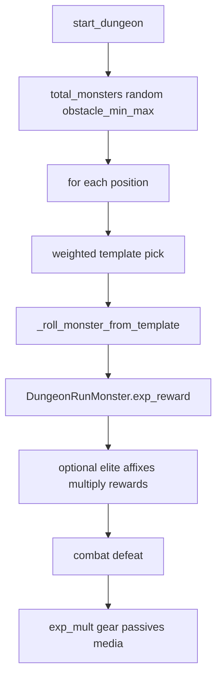

# План: разброс опыта/золота по данжам и Dungeon+ (и опционально таблица)

## Уточнённая цель (итерация)

- **Не** фиксировать жёсткий опыт «на подземелье» в коде; сохранить текущую модель «за каждого убитого монстра — из `DungeonRunMonster`».
- Понять **почему** переход акт 3 данж 1 (ур. ~~21) → тот же данж **+1** (ур. ~50) даёт сравнительно скромный прирост награды (~~1000–1500 → ~2000 XP), а **+20** на акте 5 даёт уже ~8000–9000 — и проверить гипотезу про «одного и того же зомби» в БД.

---

## Ответ: откуда берутся числа и почему разница +0 / +1 / +20 такая

### Формула награды за одного монстра (процедурный забег)

В `[_roll_monster_from_template](src/waifu_bot/services/dungeon.py)`: `exp = exp_base + exp_per_level * level`, `gold = gold_base + gold_per_level * level`; для босса — ещё `× boss_reward_mult`. Коэффициенты **из строки `monster_templates` в БД** (см. дефолты в модели `[MonsterTemplate](src/waifu_bot/db/models/dungeon.py)`: например `exp_per_level` по умолчанию 3, `gold_per_level` 2 — в импорте часто выше).

### Уровень монстра

- **База (plus_level = 0):** `level` вокруг `dungeon.level` (для акта 3, данж 1 по сиду из миграции 0007 это ~21) + `randint(0, 2)`, с зажатием в `level_min`/`level_max` шаблона.
- **Dungeon+ (plus_level > 0):** `base_lvl = 50 + (plus_level - 1) * 5`, затем `+ randint(0, 2)`; для **+1** это **50–52**, для **+20** — **50 + 95 = 145** плюс 0–2, т.е. **~145–147**. Отсюда огромный скачок суммарного XP между +1 и +20 при той же линейной формуле.

### Гипотеза «зомби 1-го и 50-го уровня почти не отличаются»

**Для одного и того же шаблона** это неверно: при `exp_per_level = 12` (как у строки «Зомби» в `[info/monster_templates_import.sql](info/monster_templates_import.sql)`) опыт с уровня 22 до 50 вырастает на `(50 - 22) × 12 = 336` за монстра; с 50 до 145 — на `95 × 12 = 1140` за монстра. Т.е. рост **линейный по уровню**, коэффициент задаётся **именно `exp_per_level` в БД**.

При этом в одном забеге **разные позиции** — **разные шаблоны** (веса/тиры/теги). Например у «Костяка» в том же файле `exp = 8 + 3 * level` — гораздо медленный рост, чем у «Зомби» `3 + 12 * level`. Итоговая сумма за данж — **смесь шаблонов** и **случайного** `obstacle_min…obstacle_max`, поэтому «в среднем» картина может выглядеть мягче, чем у одного эталонного зомби.

### Почему +1 кажется «мало награды» при сильно большей угрозе

1. **Угроза** масштабируется сильнее: для +N `hp_dmg_mult = 1 + N * 0.20` (см. `[_difficulty_params](src/waifu_bot/services/dungeon.py)`) через бюджет сложности и статы монстров.
2. **Награды** с +N **не** умножаются на `reward_mult = 1 + n*0.15 + log1p(n)*0.10` — это поле считается, но **не применяется** к `exp_reward`/`gold_reward` при создании `DungeonRunMonster`. Рост наград идёт в основном за счёт **уровня 50+** для любого +1+, а не за счёт отдельного множителя сложности.
3. Переход **21 → 50 уровня** даёт прирост `≈ 29 * exp_per_level` на монстра; при `exp_per_level ≈ 3…6` и 8–12 врагов это порядка сотен–пары тысяч XP суммарно — **согласуется** с наблюдением ~1000–1500 → ~2000, если не все слоты — «толстые» по `exp_per_level`.

### Наблюдение акт 5 данж 1 при +20 (~8000–9000)

При уровне монстра **~145** и типичных `exp_per_level` 8–12 одна только линейная часть даёт сотни–тысячи опыта **за моба**; полный зачист с боссом и возможными элитами легко укладывается в **8–9k** без отдельного «супер-множителя».

---

## Что делать дальше (по желанию)

| Действие                                                                          | Зачем                                                                                   |
| --------------------------------------------------------------------------------- | --------------------------------------------------------------------------------------- |
| SQL/скрипт: `MIN/MAX/AVG(exp_per_level)`, `gold_per_level` по `monster_templates` | Увидеть реальный разброс коэффициентов в прод-данных                                    |
| Лёгкая симуляция (Monte Carlo) по 25 данжам × +0…+30                              | Числовые диапазоны mean/p90, **без** обещания одной цифры на ячейку                     |
| Продукт: применить `reward_mult` к exp/gold при спавне                            | Если нужно, чтобы награда росла с +N сильнее, «как задумывалось» в `_difficulty_params` |

---

# (Ниже) Исходный план: полная таблица опыта по подземельям и +0…+30

## Вывод по кодовой базе

**Одной детерминированной таблицы «данж × +N» в репозитории нет** и математически она не выводится без знания содержимого БД (`dungeons`, `monster_templates`, пулов `dungeon_pool_entries`, `monster_affixes`) и без учёта случайности.

Соло-данж в основном идёт через **процедурный забег** `[DungeonRun](src/waifu_bot/db/models/dungeon.py)` + `[DungeonRunMonster](src/waifu_bot/db/models/dungeon.py)`, см. `[start_dungeon](src/waifu_bot/services/dungeon.py)`: число врагов `total = randint(obstacle_min, obstacle_max)`, для каждой позиции — **взвешенный выбор шаблона** из пула или `_get_tag_tier_candidates` / fallback, затем откат характеристик в `[_roll_monster_from_template](src/waifu_bot/services/dungeon.py)` (строки ~322–363).

Опыт за убийство в этом режиме начисляется в `[_handle_run_monster_defeated](src/waifu_bot/services/combat.py)` (~1372–1381):

- База: `exp_reward` с поля экземпляра `DungeonRunMonster` (записано при спавне).
- Множители игрока: `exp_mult = 1 + exp_bonus_pct` с вторичек брони; для босса дополнительно `× (1 + boss_reward_pct)` из пассивов; при убийстве не текстом/ссылкой — ещё `× (1 + media_kill_reward_pct)` при наличии.

**Элита:** при проке элиты `[roll_monster_elite](src/waifu_bot/services/combat.py)` (фрагмент ~116–139) награды умножаются на `exp_mult` из аффиксов.

**Важное несоответствие ожиданиям по Dungeon+:** в `[_difficulty_params](src/waifu_bot/services/dungeon.py)` (~389–401) считается `reward_mult = 1.0 + n * 0.15 + log1p(n) * 0.10`, но это значение **нигде не умножается на `exp_reward` / `gold_reward`** при создании `DungeonRunMonster` (поиск по файлу показывает использование только `hp_dmg_mult`, бюджета сложности и `drop_power_rank`). Рост опыта на **+N** идёт в основном за счёт **уровня монстра** при `plus_level > 0`: `base_lvl = 50 + (pl - 1) * 5`, затем `+ randint(0, 2)` и формула шаблона `exp = exp_base + exp_per_level * level` (и множитель босса по `boss_reward_mult`).

**Legacy-ветка** (без `DungeonRun`, только строки `Monster` у данжа) даёт фиксируемые `experience_reward` по позициям — но она используется только если нет пула и нет пригодных тегов; для типичной БД после миграций это скорее исключение.

---

## Что именно может означать «полная таблица»

| Вариант                         | Содержание                                                                                                                                                                                            |
| ------------------------------- | ----------------------------------------------------------------------------------------------------------------------------------------------------------------------------------------------------- |
| **A. Базовая (рекомендуется)**  | Для каждой пары (данж, +N): **ожидаемый** суммарный XP за полный зачист, **без** бонусов экипировки/пассивов/медиа (множитель 1.0), элита по среднему шансу (или отдельные колонки mean / p50 / p90). |
| **B. С бонусами игрока**        | Те же ячейки, но с фиксированным профилем (например +0% / +10% / +25% к опыту) — отдельные блоки таблицы.                                                                                             |
| **C. Детерминированный legacy** | Только данжи на чистых `Monster`-рядах: сумма `experience_reward` по позициям — применимо не ко всем инсталляциям.                                                                                    |

Для **25 соло-данжей × 31 уровень (+0…+30)** вариант A обычно делают **Монте-Карло** (много стартов с разными `seed`) или детерминированный перебор seeds в разумных пределах — итог экспортируется в CSV/Markdown.

---

## Шаги реализации таблицы (после утверждения)

1. **Зафиксировать допущения** в шапке артефакта: без вторичек и пассивов на опыт; удача для элиты = X (из констант/конфига `roll_monster_elite`); только процедурный путь (или явно пометить legacy).
2. **Реиспользовать игровую логику**, чтобы не расходиться с продом:
  - вынести из `[start_dungeon](src/waifu_bot/services/dungeon.py)` генерацию списка монстров для `(dungeon_id, plus_level, seed)` в чистую функцию **или**
  - вызывать существующий сервис в тестовой сессии AsyncSession, откатывая транзакцию.
3. **Цикл:** для каждого из 25 данжей (по `act`, `dungeon_number`, `dungeon_type=1`) и `pl in 0..30` выполнить `S` прогонов (например 2000–10000), суммировать XP по всем монстрам (как в бою с множителем 1.0), записать mean/min/max или перцентили.
4. **Артефакт:** `info/dungeon_xp_table.md` или `scripts/output/dungeon_xp_plus0_30.csv` (по желанию не коммитить CSV, только скрипт + пример).

Опционально: отдельная колонка «если бы применялся `reward_mult` из `_difficulty_params`» — как гипотетическое сравнение (потребует явного решения продукта, править ли код).

---

## Зависимости

- Актуальная БД с `dungeons`, `monster_templates`, пулами и аффиксами — числа таблицы **привязаны к данным**, а не только к коду.
- В коде **нет жёсткого потолка +30** для `plus_level`; +30 — граница таблицы по запросу, не ограничение движка.

