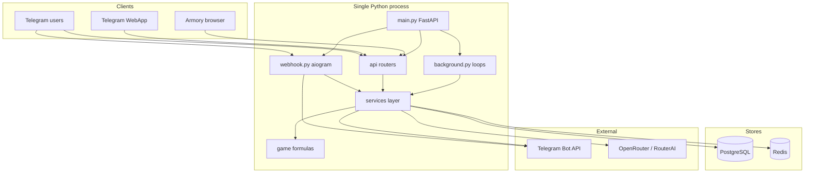
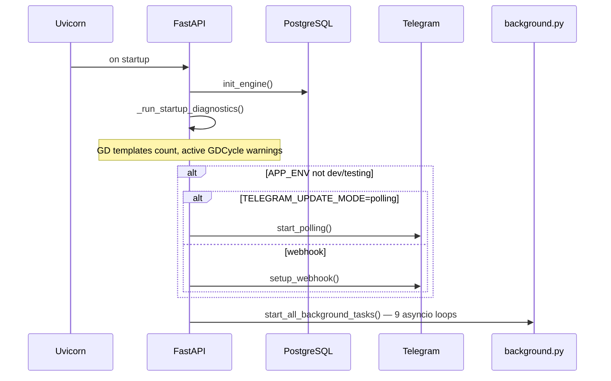
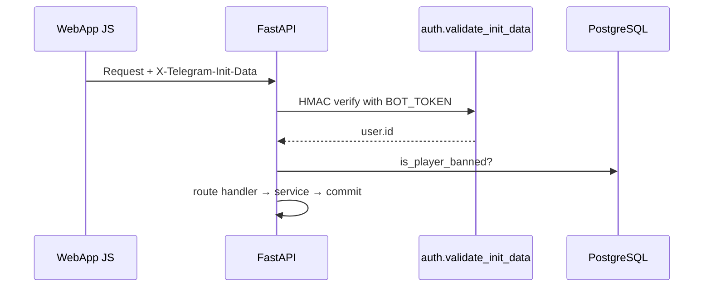
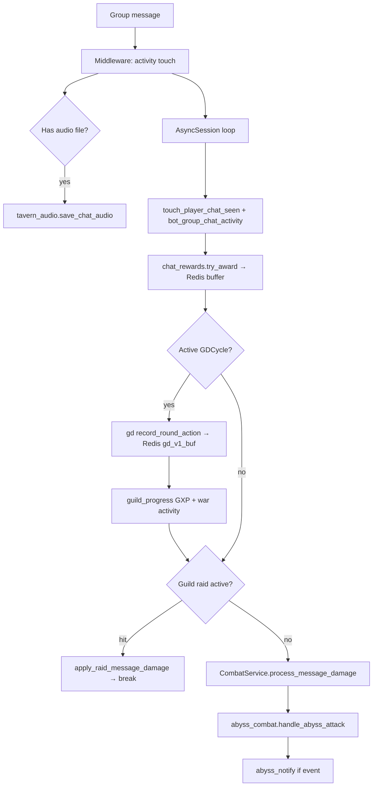
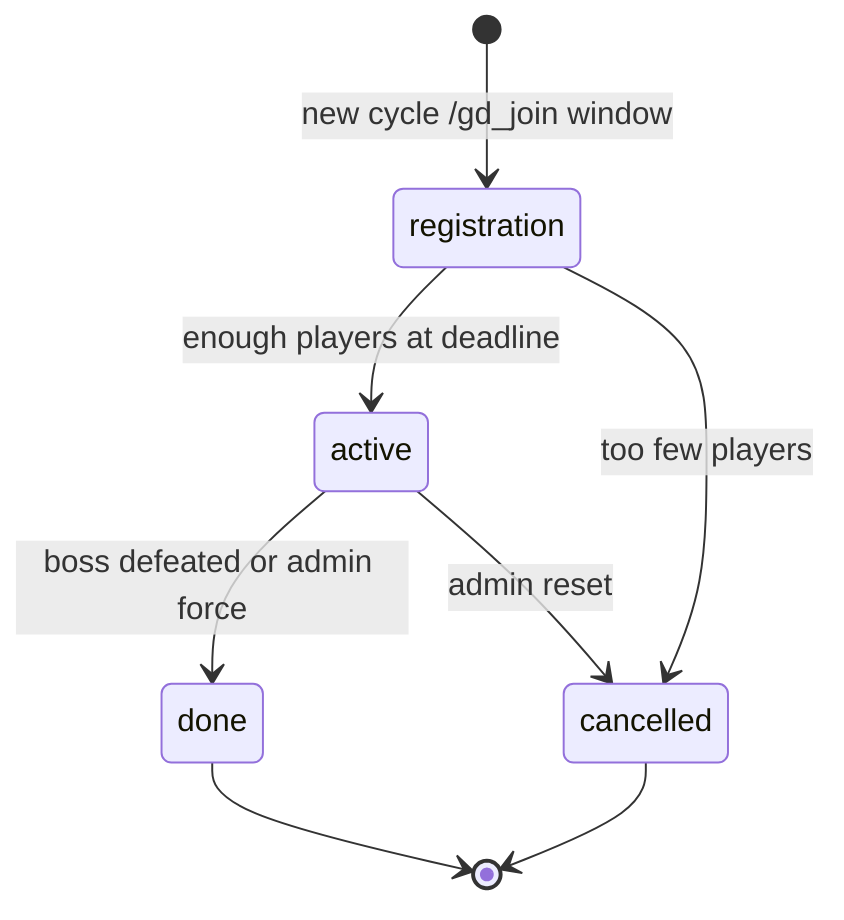
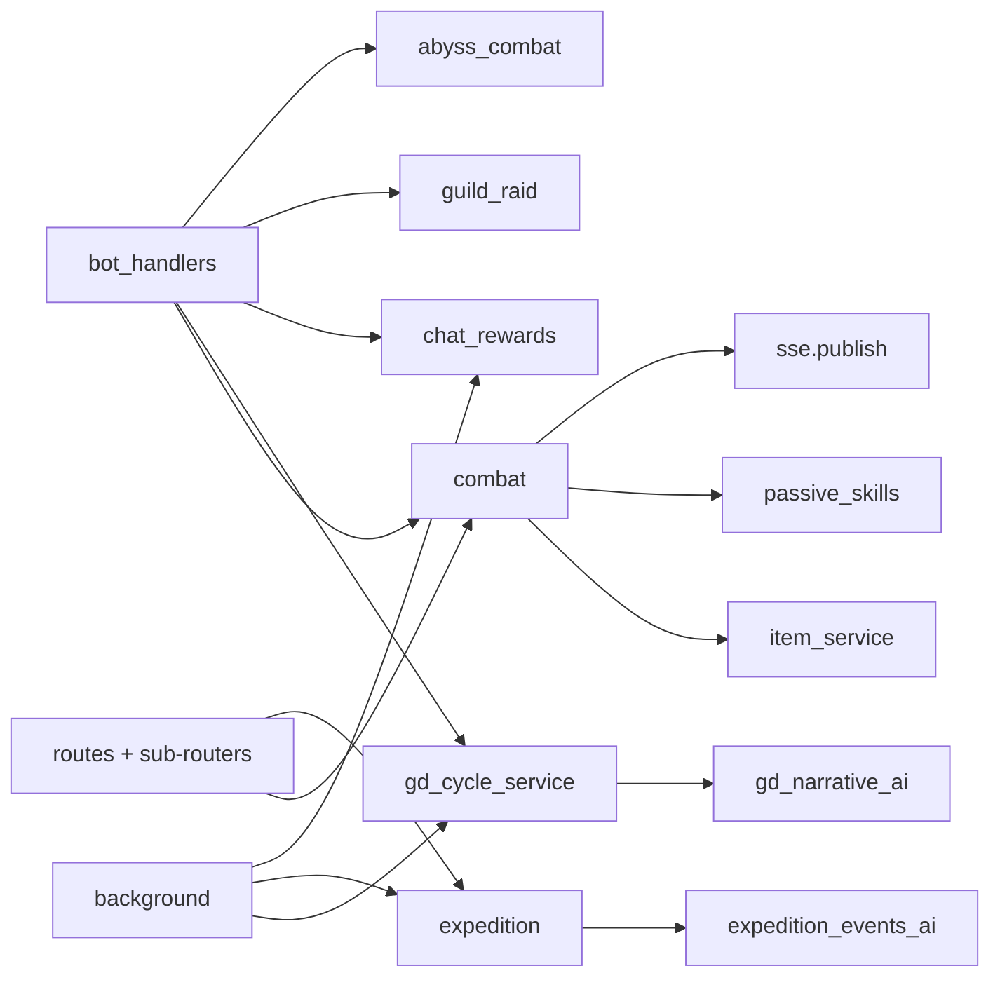

# Waifu Bot REBORN — System Architecture and Interactions

> **Purpose:** Exhaustive runtime reference for performance tuning, reliability analysis, and onboarding.  
> **Scope:** Architecture, data flows, APIs, background work, Redis/PostgreSQL touchpoints, and operational hotspots.  
> **Formulas / balance:** See linked domain docs ([COMBAT_FORMULAS.md](COMBAT_FORMULAS.md), [technical_spec.md](technical_spec.md)); this document does not duplicate numeric tables.  
> **Generated from codebase audit:** 2026-06-03. All HTTP paths are prefixed with `/api` unless noted.

---

## Table of contents

1. [Executive overview](#1-executive-overview)
2. [Process model and startup](#2-process-model-and-startup)
3. [Ingress channels](#3-ingress-channels)
4. [Aiogram bot layer](#4-aiogram-bot-layer)
5. [Critical interaction chains](#5-critical-interaction-chains)
6. [FastAPI API catalog](#6-fastapi-api-catalog)
7. [Background task scheduler](#7-background-task-scheduler)
8. [Services layer map](#8-services-layer-map)
9. [Game logic layer](#9-game-logic-layer)
10. [Data layer](#10-data-layer)
11. [Redis key catalog](#11-redis-key-catalog)
12. [External integrations](#12-external-integrations)
13. [Frontends](#13-frontends)
14. [Performance and reliability appendix](#14-performance-and-reliability-appendix)
15. [Operations and deployment](#15-operations-and-deployment)
16. [Cross-reference index](#16-cross-reference-index)

---

## 1. Executive overview

**Waifu Bot REBORN** is a Telegram-native IDLE RPG:

- **Solo dungeons** — message-based damage in group chats and via WebApp
- **Expeditions** — timed off-line runs with AI narrative ticks
- **Group Dungeons v1 (GD v1)** — weekly group runs with 15-minute registration and round windows
- **Abyss** — endless tower with group attacks and weekly leaderboards
- **Guilds** — bank, skills, raids, wars (including LLM war narratives)
- **Economy** — procedural items, shop, gamble, enchanting, chat activity rewards
- **Clients:** Telegram group/DM bot, Telegram WebApp (`/webapp`), browser **Armory** admin/stats SPA (`/armory`)

### Technology stack

| Layer | Technology | Location |
|-------|------------|----------|
| HTTP / API | FastAPI 0.115, Uvicorn | `src/waifu_bot/main.py`, `src/waifu_bot/api/` |
| Telegram bot | aiogram 3.13 | `src/waifu_bot/services/webhook.py`, `bot_handlers.py` |
| Database | PostgreSQL + SQLAlchemy 2 async + Alembic | `src/waifu_bot/db/`, `alembic/versions/` (~95 migrations) |
| Cache / pub-sub | Redis (`redis.asyncio`) | `src/waifu_bot/core/redis.py` |
| Pure game math | Python modules (no I/O) | `src/waifu_bot/game/` |
| LLM / images | OpenRouter (+ RouterAI 402 fallback) | `src/waifu_bot/services/llm_client.py` |
| Armory UI | Vue 3 + Vite → `static/armory/` | `armory_frontend/` |

**Not present:** Discord, Celery/RQ workers, Docker Compose in-repo, repository/DAO layer (services query ORM directly).

### High-level architecture



---

## 2. Process model and startup

### Entry points

| Entry | Command / target | Role |
|-------|------------------|------|
| Production app | `uvicorn waifu_bot.main:app` | Serves HTTP + starts bot + background loops |
| CLI | `python -m waifu_bot.cli` | `run`, `migrate`, `webhook`, `backfill-group-chats` |
| Migrations | `./run_migrate.sh` or `cli migrate` | `alembic upgrade heads` |
| Lazy export | `from waifu_bot import create_app` | `__getattr__` in `__init__.py` |

### HTTP mounts (`main.create_app`)

| Mount | Path | Source |
|-------|------|--------|
| API router | `/api` | `api/routes.py` aggregator |
| WebApp static | `/webapp` | `src/waifu_bot/webapp/` |
| Game assets | `/static` | `static/` (items, monsters, UI) |
| Armory SPA | `/armory`, `/armory/assets` | `static/armory/` (Vue build) |
| Health | `/health` | Inline handler |
| OpenAPI | `/api/docs`, `/api/openapi.json` | FastAPI auto |

### Startup sequence



**Shutdown:** `stop_polling()`, `cancel_all_background_tasks()`.

**Dev/testing:** Telegram webhook/polling is **not** started when `APP_ENV` is `dev` or `testing` (API and background loops still run).

### Environment variables (primary consumers)

| Variable | Consumer | Purpose |
|----------|----------|---------|
| `BOT_TOKEN` | aiogram, `auth.validate_init_data` | Bot API + WebApp HMAC |
| `WEBHOOK_SECRET` | `/api/webhook` | Request authentication |
| `PUBLIC_BASE_URL` | webhook setup, asset URLs | Telegram webhook URL base |
| `TELEGRAM_UPDATE_MODE` | `webhook.get_update_mode()` | `webhook` or `polling` |
| `TELEGRAM_API_BASE_URL` | `_build_bot()` | Cloudflare Worker proxy for Bot API |
| `TELEGRAM_BOT_PROXY` | `_build_bot()` | SOCKS/HTTP proxy (mutually exclusive with base URL) |
| `POSTGRES_DSN` | `db/session.py` | Async SQLAlchemy engine |
| `REDIS_URL` | `core/redis.py` | Singleton Redis client |
| `APP_ENV` | Many | `dev` / `testing` / `stage` / `prod` behavior gates |
| `ADMIN_IDS` | `deps.require_admin`, GD admin cmds | Admin Telegram user IDs |
| `OPENROUTER_*`, `ROUTERAI_*` | `llm_client.py` | Text + image generation |
| `ARMORY_*` | `armory_session`, CORS middleware | Browser portal auth |
| `TELEGRAM_TRACE_LOG` | `telegram_trace.py` | Verbose update logging |
| `TELEGRAM_COMMAND_DEBUG_DM` | `command_debug_dm.py` | Echo commands to admin DMs |
| `DEV_BROWSER_TOKEN`, `DEV_USER_IDS` | `deps.get_player_id` | Browser dev bypass |
| `REPO_ROOT` | `paths.repository_root` | Admin writes to `static/game` |

**Configured but unused in code:** `TOGETHER_API_KEY`, `REPLICATE_API_TOKEN`.

Full template: [`.env.example`](../.env.example). Settings class: [`src/waifu_bot/core/config.py`](../src/waifu_bot/core/config.py).

---

## 3. Ingress channels

Three independent client surfaces share one process and PostgreSQL, but use different authentication.

| Channel | Ingress | Authentication | Primary workloads |
|---------|---------|----------------|-------------------|
| **Telegram updates** | `POST /api/webhook` or long polling | `X-Webhook-Secret` on HTTP; bot token for outbound | Commands, group message damage, callbacks |
| **Telegram WebApp** | Static HTML/JS → `GET/POST /api/*` | `X-Telegram-Init-Data` (HMAC-SHA256) | Profile, dungeons, shop, guild hall UI |
| **Armory SPA** | `/armory` → `GET/POST /api/armory/*` | Telegram OIDC JWT + Redis session JTI + CSRF cookie | Public profiles, admin tools |

### 3.1 Telegram webhook / polling

**Files:** [`services/webhook.py`](../src/waifu_bot/services/webhook.py), [`api/routes.py`](../src/waifu_bot/api/routes.py) (`POST /api/webhook`).

Flow:

1. HTTP body → `Update.model_validate`
2. `_dp.feed_update(bot, update)` → middleware chain → `bot_handlers` router
3. Outbound replies via `Bot.send_message` / `message.reply`

Bot construction supports `TELEGRAM_API_BASE_URL` (Worker) or `TELEGRAM_BOT_PROXY`.

### 3.2 WebApp authentication

**Files:** [`api/deps.py`](../src/waifu_bot/api/deps.py), [`services/auth.py`](../src/waifu_bot/services/auth.py).



**Dev bypasses:**

- `APP_ENV=dev`: header `X-Player-Id` alone
- Any env with `DEV_BROWSER_TOKEN`: `X-Player-Id` + matching `X-Dev-Token`
- Query `initData` accepted as alternative to header

### 3.3 Armory authentication

**Files:** [`api/armory_routes.py`](../src/waifu_bot/api/armory_routes.py), [`services/armory_session.py`](../src/waifu_bot/services/armory_session.py).

1. `GET /api/armory/auth/login-url` — OIDC redirect URL
2. User completes Telegram Login in browser popup
3. `POST /api/armory/auth/telegram` — validate `id_token` against JWKS (`TELEGRAM_OIDC_JWKS_URL` or Worker)
4. Issue JWT cookie; store `armory:session:{tg_id}:{jti}` in Redis
5. Mutating admin routes require `verify_csrf` + session JTI still in Redis

**CORS:** `ArmoryCORSMiddleware` in `main.py` — only `ARMORY_PUBLIC_ORIGIN` allowed for `/api/armory/*`.

---

## 4. Aiogram bot layer

**Single router:** [`services/bot_handlers.py`](../src/waifu_bot/services/bot_handlers.py)  
**Dispatcher:** [`services/webhook.py`](../src/waifu_bot/services/webhook.py)

### Middleware order (outer → inner)

| Order | Class | File | Effect |
|-------|-------|------|--------|
| 1 | `PlayerTelegramActivityMiddleware` | `player_activity.py` | Updates `Player.last_active`, syncs Telegram identity on any update |
| 2 | `TelegramUpdateTraceMiddleware` | `telegram_trace.py` | Logs in/out if `TELEGRAM_TRACE_LOG=true` |
| 3 | `CommandDebugDmMiddleware` | `command_debug_dm.py` | Mirrors `/commands` to `ADMIN_IDS` DMs if enabled |

### Command addressing filter

`command_addressed_to_this_bot`:

- **Private chat:** any `/command`
- **Group/supergroup:** only `/command@ThisBotUsername` (prevents hijacking when multiple bots are in chat)

### Handler inventory

| Handler | Trigger | Services / side effects |
|---------|---------|-------------------------|
| `cmd_start` | `/start` | Static greeting |
| `cmd_help` | `/help` | Command list (GD v1 hints) |
| `on_bot_chat_member` | `my_chat_member` | `bot_group_chats.record_bot_chat_member_update` → `bot_group_chats` |
| **`group_message_damage`** | Group non-command messages (text/media/sticker/…) | **See §5.1** — highest traffic |
| `cmd_gd_join` | `/gd_join` | `GDCycleService.register_join` |
| `cmd_gd_party` | `/gd_party` | Party roster from DB |
| `cmd_gd_v1_test_join` | test users only | Same as join |
| `cmd_gd_v1_test_start` | test | `close_registration_and_maybe_start`, group narrative |
| `cmd_gd_v1_force_round` | admin/test | `_process_gd_v1_round_for_cycle_locked` |
| `cmd_gd_v1_peek_round_buffer` | admin/test | Redis buffer peek |
| `cmd_gd_v1_battle_status` | admin/test | Status report |
| `cmd_gd_v1_admin_force_victory` | admin/test | Force win + rewards |
| `cmd_gd_v1_test_reset` | test | Reset cycles + clear Redis buffers |
| `cmd_private_unknown_slash` | unknown DM command | Static reply |
| `cmd_group_unknown_slash` | unknown group @bot command | Hint reply |
| `handle_expedition_abort` | callback `expedition_abort_{id}` | `ExpeditionService.abort_early`, edit DM |
| `handle_solo_dungeon_retry` | callback `sd_retry_{dungeon}_{plus}` | `DungeonService.start_dungeon`, edit DM |

### Error handling

`_telegram_error_handler` logs traceback and attempts a user-visible fallback message (common failure: bot lacks permission to post in group).

### Module-level singletons in `bot_handlers.py`

```python
combat_service = CombatService(redis_client=redis_core.get_redis())
gd_v1_cycle_service = GDCycleService(redis_core.get_redis())
```

Both are created at import time and reused for every group message.

---

## 5. Critical interaction chains

### 5.1 Group message damage (hot path)

**Handler:** `group_message_damage`  
**Design note (explicit in code):** During an **active** GD v1 cycle, messages are buffered for GD **and** still run solo combat, guild raid, and abyss logic. Solo combat no-ops if the player has no active `DungeonRun`.



**Step-by-step:**

| Step | Function | Storage | Notes |
|------|----------|---------|-------|
| 1 | `_media_type_from_message` | — | Maps Telegram media → combat coef (text/sticker/photo/gif/audio/video/voice/link) |
| 2 | `tavern_audio.save_chat_audio_from_message` | `chat_audio_tracks` + Telegram file download | Best-effort; non-voice audio only |
| 3 | `touch_player_chat_seen` | `player_chat_first_seen` / player chats | Group chats only (`chat_id < 0`) |
| 4 | `touch_bot_group_chat_activity` | `bot_group_chats` | Armory admin visibility |
| 5 | `chat_rewards.try_award_chat_message` | Redis `chat_reward:*`, later DB via flush | Per-message; see §5.7 |
| 6 | `get_active_v1_cycle` | `gd_cycles` where `status=active` | |
| 7 | `record_round_action` | Redis `gd_v1_buf:{cycle_id}` JSON per player | Coalescing in `coalesce_round_action` |
| 8 | `guild_progress.apply_gd_chat_gxp` / `apply_war_activity` | Guild GXP / war score tables | Commits before solo branch if GD active |
| 9 | `apply_raid_message_damage` | `guild_raids` | If raid active in this chat, **breaks** loop (skips solo) |
| 10 | `process_message_damage` | `dungeon_runs`, monsters, items, battle_logs, Redis `spam:{player_id}` | Publishes SSE on meaningful events |
| 11 | `handle_abyss_attack` | `abyss_progress` | Mutually exclusive with solo dungeon at service level |
| 12 | `abyss_notify.notify_abyss_event` | — | Telegram group/DM |

**WebApp equivalent:** `POST /api/battle/message` and `POST /api/dungeons/continue` → same `CombatService.process_message_damage` ([`dungeon_routes.py`](../src/waifu_bot/api/dungeon_routes.py)).

### 5.2 GD v1 lifecycle

**Status machine (`gd_cycles.status`):**



| Phase | Duration (defaults) | Driver |
|-------|---------------------|--------|
| `registration` | `GD_REGISTRATION_WINDOW_MINUTES` (15 min) | User `/gd_join`; background `gd_v1_registration` every 30s closes deadline |
| `active` | Rounds of `GD_ROUND_DURATION_MINUTES` (15 min) | Messages buffered; `gd_v1_round` every 20s processes due rounds |
| Terminal | — | `done` / `cancelled`; rewards via worker + DMs |

**Registration chain (`/gd_join`):**

1. `GDCycleService.register_join` — requires `MainWaifu`, snapshot in `gd_registrations`
2. If no open registration cycle, may create one tied to `gd_dungeon_templates`
3. `commit` → reply in group

**Round processing chain (background or `/gd_v1_force_round`):**

1. `run_gd_v1_round_tick_poll` / `_process_gd_v1_round_for_cycle_locked`
2. Pop/coalesce Redis buffer `gd_v1_buf:{cycle_id}`
3. `gd_round_engine.process_gd_round` — deterministic combat simulation, writes `gd_rounds`, effects
4. `gd_narrative_ai.generate_gd_round_narrative` — LLM (OpenRouter)
5. `gd_loot` on monster deaths — `item_service` drops
6. Telegram: group narrative + participant DMs
7. On finale: rewards rows in `gd_rewards`, cycle `status=done`

**Key files:** `gd_cycle_service.py`, `gd_v1_worker.py`, `gd_round_engine.py`, `gd_narrative_ai.py`, `gd_scaling.py`, `gd_effects.py`, `gd_loot.py`, `gd_battle_log.py`.

### 5.3 Solo dungeon

| Step | API / trigger | Service |
|------|---------------|---------|
| List / pick dungeon | `GET /api/dungeons`, WebApp | `DungeonService` |
| Start | `POST /api/dungeons/{id}/start` | Creates `dungeon_runs`, spawns monsters |
| Damage | Group message or `POST /api/battle/message` | `CombatService.process_message_damage` |
| End | Monster HP → 0 or wipe | `dungeon_notify` → DM with `sd_retry_{dungeon_id}_{plus}` inline keyboard |
| Retry | Callback `sd_retry_*` | `DungeonService.start_dungeon`, edits DM |

**Outbound:** [`dungeon_notify.py`](../src/waifu_bot/services/dungeon_notify.py).

### 5.4 Expedition

| Step | Trigger | Service |
|------|---------|---------|
| Start | `POST /api/expeditions/start` (in `routes.py`) | `ExpeditionService.start` |
| DM button | Same | Bot sends DM with `expedition_abort_{active_id}` |
| Mid-run ticks | Background `expedition_tick` 30s | `expedition_ticks.process_due_ticks`, may call LLM |
| Finish notify | Background `expedition_notify` 30s | DM on completion; Redis `exp_notified:{id}:final` dedup |
| Abort | Callback or API cancel | `ExpeditionService.abort_early` |

**LLM:** [`expedition_events_ai.py`](../src/waifu_bot/services/expedition_events_ai.py) (narrative, portraits, caravan tips).

### 5.5 Abyss

- **Enter/attack:** `abyss_routes` + group `handle_abyss_attack`
- **Combat:** [`abyss_combat.py`](../src/waifu_bot/services/abyss_combat.py) — one message → one attack; uses combat formulas without Redis spam tracker path used in solo
- **Resets:** `abyss_daily_reset` (MSK midnight checkpoints), `abyss_weekly_reset` (leaderboard + shard rewards + DMs)
- **Notify:** [`abyss_notify.py`](../src/waifu_bot/services/abyss_notify.py)

### 5.6 Guild raid and war

- **Raid v2 (weekly chronicle):** `guild_raid_v2_service` — muster, chat log, MSK daily pipeline (04:50/05:00/08:00), tactic resolve
- **Raid admin (ADMIN_IDS):** `/raid_admin_narrative_generate`, `_deliver`, `_resolve`; `/raid_admin_stop` (abort) or `/raid_admin_stop defeat`; `/raid_admin_add_player <id>` — in group chat or DM with `guild_id`/`chat_id` arg
- **Raid chat log:** `apply_raid_message_damage` logs v2 messages for narrative (does not block solo combat)
- **War phases / raid timeout:** `background._guild_tick_fn` every 60s
- **Hourly online war GXP:** `guild_war_hourly` 3600s
- **AI war narrative batch:** `guild_war_narrative` 900s — **skipped** in `dev`/`testing`

### 5.7 Chat activity rewards

Per group message (if eligible):

1. `try_award_chat_message` — points from text length + media; cooldown `chat_reward:cd:{player_id}`
2. `buffer_chat_reward` — accumulates gold/exp/points in Redis `chat_reward:buf:{player_id}:{day}`
3. Background flush every **30s** → `player_chat_reward_wallets`, daily/total tables
4. Player claims chests: `POST /api/chat-rewards/claim`

See [CHAT_ACTIVITY_REWARDS.md](CHAT_ACTIVITY_REWARDS.md).

### 5.8 Armory session (browser)

See §3.3. Admin mutations (`wipe`, `ban`, `grant-gold`) log to `armory_admin_action_log` and may call `player_new_game_reset` (scans Redis keys for player).

---

## 6. FastAPI API catalog

**Router hub:** [`api/routes.py`](../src/waifu_bot/api/routes.py) — `APIRouter()` includes sub-routers then defines core WebApp routes inline.

**Total registered routes:** 189 (expedition endpoints live in `routes.py` only).

**Auth patterns:**

| Dependency | Routes |
|------------|--------|
| `get_player_id` | Most WebApp player APIs |
| `require_admin` | `/api/admin/*` |
| Armory session + CSRF | `/api/armory/admin/*` mutating |
| Webhook secret header | `POST /api/webhook` |
| Public / search | Some Armory `GET` with rate limit |

**OpenAPI:** `/api/openapi.json` — authoritative machine-readable list.

All paths below are relative to **`/api`** prefix.


### abyss_routes
| Method | Path |
|--------|------|
| `GET` | `/abyss/status` |
| `POST` | `/abyss/enter` |
| `POST` | `/abyss/exit` |
| `POST` | `/abyss/grace/choose` |
| `GET` | `/abyss/leaderboard` |
| `GET` | `/abyss/shop` |
| `POST` | `/abyss/shop/buy` |
| `POST` | `/abyss/revive` |

### admin_routes
| Method | Path |
|--------|------|
| `POST` | `/admin/add-gold` |
| `POST` | `/admin/dungeons/kill-monster` |
| `POST` | `/admin/dungeons/complete` |
| `POST` | `/admin/dungeons/simulate-damage` |
| `POST` | `/admin/dungeons/simulate-retaliation` |
| `POST` | `/admin/waifu/restore` |
| `POST` | `/admin/waifu/levelup` |
| `POST` | `/admin/waifu/add-stat` |
| `POST` | `/admin/waifu/add-stat-points` |
| `GET` | `/admin/debug/effective-stats` |
| `POST` | `/admin/waifu/reset-stat-spend` |
| `GET` | `/admin/spawn-item/catalog` |
| `POST` | `/admin/inventory/spawn-item` |
| `POST` | `/admin/items/clear` |
| `POST` | `/admin/player/reset-new-game` |
| `POST` | `/admin/tavern/refresh` |
| `POST` | `/admin/expeditions/refresh` |
| `POST` | `/admin/expedition-art/generate` |
| `POST` | `/admin/item-art/generate` |
| `POST` | `/admin/monster-art/generate` |
| `POST` | `/admin/story-boss-art/generate` |

### armory_routes
| Method | Path |
|--------|------|
| `GET` | `/armory/auth/login-url` |
| `GET` | `/armory/auth/telegram-callback` |
| `POST` | `/armory/auth/telegram` |
| `POST` | `/armory/auth/logout` |
| `GET` | `/armory/auth/me` |
| `GET` | `/armory/players/search` |
| `GET` | `/armory/players/{tg_id}` |
| `GET` | `/armory/players/{tg_id}/inventory` |
| `GET` | `/armory/players/{tg_id}/stats` |
| `GET` | `/armory/players/{tg_id}/statistics` |
| `GET` | `/armory/players/{tg_id}/skills` |
| `GET` | `/armory/players/{tg_id}/dungeons` |
| `GET` | `/armory/players/{tg_id}/expeditions` |
| `GET` | `/armory/players/{tg_id}/battles` |
| `GET` | `/armory/players/{tg_id}/events` |
| `GET` | `/armory/players/{tg_id}/guild` |
| `GET` | `/armory/leaderboards/{kind}` |
| `GET` | `/armory/admin/stats` |
| `GET` | `/armory/admin/players` |
| `GET` | `/armory/admin/players/{tg_id}/full` |
| `POST` | `/armory/admin/players/{tg_id}/wipe` |
| `POST` | `/armory/admin/players/{tg_id}/ban` |
| `POST` | `/armory/admin/players/{tg_id}/unban` |
| `POST` | `/armory/admin/players/{tg_id}/grant-gold` |
| `POST` | `/armory/admin/players/{tg_id}/restore-hp` |
| `POST` | `/armory/admin/players/{tg_id}/grant-paperdoll-generation` |
| `GET` | `/armory/admin/group-chats` |
| `POST` | `/armory/admin/group-chats/refresh` |
| `GET` | `/armory/admin/actions` |

### chat_rewards_routes
| Method | Path |
|--------|------|
| `GET` | `/chat-rewards/status` |
| `POST` | `/chat-rewards/claim` |

### dungeon_routes
| Method | Path |
|--------|------|
| `GET` | `/gd/dungeons/active` |
| `GET` | `/gd/cycle/{chat_id}` |
| `GET` | `/gd/cycles/{cycle_id}/battle-log` |
| `GET` | `/dungeons` |
| `GET` | `/dungeons/plus/status` |
| `POST` | `/dungeons/{dungeon_id}/start` |
| `GET` | `/dungeons/active` |
| `POST` | `/dungeons/continue` |
| `POST` | `/dungeons/exit` |
| `POST` | `/battle/message` |

### expeditions (in `routes.py`)
| Method | Path |
|--------|------|
| `GET` | `/expeditions/slots` |
| `GET` | `/expeditions/active` |
| `POST` | `/expeditions/start` |
| `POST` | `/expeditions/cancel` |
| `POST` | `/expeditions/claim` |
| `GET` | `/expeditions/waifus` |

### guild_routes
| Method | Path |
|--------|------|
| `POST` | `/guilds` |
| `GET` | `/guilds/search` |
| `POST` | `/guilds/{guild_id}/join` |
| `POST` | `/guilds/leave` |
| `POST` | `/guilds/deposit/gold` |
| `POST` | `/guilds/withdraw/gold` |
| `POST` | `/guilds/deposit/item` |
| `POST` | `/guilds/withdraw/item` |
| `GET` | `/guilds/bank/items` |
| `GET` | `/guilds/me` |
| `POST` | `/guilds/me/icon` |
| `POST` | `/guilds/icon` |
| `POST` | `/guilds/me/banner` |
| `POST` | `/guilds/skill/upgrade` |
| `POST` | `/guilds/skill/reset` |
| `POST` | `/guilds/raid/start` |
| `POST` | `/guilds/raid/leave` |
| `GET` | `/guilds/raid/loot` |
| `POST` | `/guilds/raid/distribute` |
| `GET` | `/guilds/war/targets` |
| `POST` | `/guilds/war/declare` |
| `POST` | `/guilds/war/respond` |

### inventory_routes
| Method | Path |
|--------|------|
| `GET` | `/inventory` |
| `GET` | `/inventory/{item_id}` |
| `POST` | `/inventory/sell` |
| `POST` | `/inventory/{item_id}/enchant` |
| `GET` | `/inventory/{item_id}/enchant-preview` |
| `GET` | `/inventory/{item_id}/dismantle-preview` |
| `POST` | `/inventory/{item_id}/dismantle` |
| `GET` | `/inventory/{item_id}/craft-enchant-preview` |
| `POST` | `/inventory/{item_id}/craft-enchant` |

### library_routes
| Method | Path |
|--------|------|
| `GET` | `/library/bestiary` |
| `GET` | `/library/bestiary/{template_id}` |
| `GET` | `/library/items` |
| `GET` | `/library/items/{base_template_id}` |
| `GET` | `/library/affixes` |

### mail_routes
| Method | Path |
|--------|------|
| `GET` | `/mail/inbox` |
| `GET` | `/mail/unread-count` |
| `GET` | `/mail/badge` |
| `GET` | `/mail/sent` |
| `GET` | `/mail/{mail_id}` |
| `POST` | `/mail/send` |
| `POST` | `/mail/{mail_id}/claim` |
| `DELETE` | `/mail/{mail_id}` |

### player_notification_routes
| Method | Path |
|--------|------|
| `GET` | `/player/statistics` |

### player_profile_routes
| Method | Path |
|--------|------|
| `GET` | `/player/profile` |
| `PATCH` | `/player/profile` |
| `POST` | `/player/avatar/upload` |
| `GET` | `/player/campaign-progress` |
| `GET` | `/player/{target_player_id}/profile` |

### routes
| Method | Path |
|--------|------|
| `POST` | `/webhook` |
| `GET` | `/webhook/status` |
| `POST` | `/webhook/re-register` |
| `GET` | `/sse/ping` |
| `GET` | `/sse/stream` |
| `GET` | `/profile` |
| `GET` | `/waifu/equipment` |
| `POST` | `/waifu/equipment/equip` |
| `POST` | `/waifu/equipment/unequip` |
| `GET` | `/waifu/equipment/available` |
| `POST` | `/profile/main-waifu` |
| `DELETE` | `/profile/main-waifu` |
| `GET` | `/waifu/acts/current` |
| `POST` | `/player/act` |
| `POST` | `/player/caravan-driver-tip` |
| `GET` | `/player/secret-echo-boss` |
| `GET` | `/expeditions/catalog` |
| `GET` | `/expeditions/roster` |
| `GET` | `/expeditions/slots` |
| `GET` | `/expeditions/daily-slots` |
| `GET` | `/expeditions/active` |
| `POST` | `/expeditions/preview` |
| `POST` | `/expeditions/start` |
| `POST` | `/expeditions/claim` |
| `POST` | `/expeditions/{expedition_id}/claim` |
| `POST` | `/expeditions/cancel` |
| `POST` | `/expeditions/{expedition_id}/abort` |
| `GET` | `/expeditions/perks` |
| `GET` | `/expeditions/affixes` |
| `POST` | `/waifu/stats/spend` |
| `GET` | `/waifu/statistics` |

### shop_routes
| Method | Path |
|--------|------|
| `GET` | `/shop/inventory` |
| `POST` | `/shop/merchant-line` |
| `POST` | `/shop/buy` |
| `POST` | `/shop/buy-protection-stone` |
| `POST` | `/shop/sell` |
| `POST` | `/shop/gamble` |
| `GET` | `/shop/gamble/offers` |
| `POST` | `/shop/gamble/buy` |
| `POST` | `/shop/refresh` |
| `GET` | `/shop/refresh` |

### skill_routes
| Method | Path |
|--------|------|
| `GET` | `/skills/available` |
| `GET` | `/skills/hidden` |
| `GET` | `/skills/passive/tree` |
| `POST` | `/skills/passive/learn` |
| `POST` | `/skills/passive/reset/{branch}` |
| `POST` | `/skills/passive/admin-max-all` |
| `POST` | `/skills/{skill_id}/upgrade` |

### tavern_routes
| Method | Path |
|--------|------|
| `GET` | `/tavern/available` |
| `GET` | `/tavern/bgm/tracks` |
| `POST` | `/tavern/keeper-banter` |
| `POST` | `/tavern/hire` |
| `GET` | `/tavern/squad` |
| `GET` | `/tavern/reserve` |
| `GET` | `/tavern/hired-waifus/{waifu_id}/portrait` |
| `POST` | `/tavern/squad/add` |
| `POST` | `/tavern/squad/remove` |
| `POST` | `/tavern/heal` |
| `POST` | `/tavern/upgrade-perk` |
| `POST` | `/tavern/dismiss` |

### tutorial_routes
| Method | Path |
|--------|------|
| `GET` | `/tutorial/state` |
| `POST` | `/tutorial/complete` |
| `POST` | `/tutorial/skip` |
| `POST` | `/tutorial/reset` |


### Route → service quick map

| Module | Primary services |
|--------|------------------|
| `routes.py` | webhook, sse, profile, equipment, expeditions, waifu gen, act/caravan |
| `dungeon_routes.py` | `DungeonService`, `CombatService`, GD status |
| `inventory_routes.py` | `item_service`, `enchanting`, `dismantle`, `craft_enchant` |
| `shop_routes.py` | `ShopService`, `GambleService` |
| `tavern_routes.py` | `TavernService`, `tavern_audio`, LLM banter |
| `guild_routes.py` | `guild`, `guild_raid_service`, `guild_war_service`, skills ops |
| `abyss_routes.py` | `abyss_service`, `abyss_combat` |
| `skill_routes.py` | `skills`, `passive_skills`, `hidden_skills` |
| `mail_routes.py` | `player_mail_service` |
| `chat_rewards_routes.py` | `chat_rewards` |
| `library_routes.py` | `bestiary`, `item_codex` |
| `tutorial_routes.py` | `tutorial` |
| `player_profile_routes.py` | `player_profile_service` |
| `admin_routes.py` | combat/dungeon admin, art generation, tavern refresh |
| `armory_routes.py` | `armory_service`, `armory_session`, `player_statistics`, admin |

---

## 7. Background task scheduler

**File:** [`services/background.py`](../src/waifu_bot/services/background.py)  
**Invocation:** `start_all_background_tasks()` from FastAPI startup.

**No Celery** — all scheduling is `asyncio.create_task` + infinite `while True: sleep(interval); await fn()`.

| Task name | Interval (s) | Handler | skip_in_dev | External I/O |
|-----------|--------------|---------|-------------|--------------|
| `chat_rewards_flush` | 60 | `chat_rewards.flush_buffer_to_db` | no | PostgreSQL |
| `gd_v1_registration` | 30 | `process_gd_registration_deadlines` | no | DB, Telegram, Redis |
| `gd_v1_round` | 20 | `run_gd_v1_round_tick_poll` | no | DB, Telegram, Redis, **LLM** |
| `expedition_notify` | 30 | finished expedition DMs | no | DB, Telegram, Redis dedup |
| `expedition_tick` | 30 | `process_due_ticks` | no | DB, Telegram, **LLM** |
| `guild_war_hourly` | 3600 | `hourly_war_online_bonus` | no | DB |
| `guild_tick` | 60 | raid timeouts + war phase ticks | no | DB |
| `guild_war_narrative` | 900 | AI war narrative DMs | **yes** | DB, LLM, Telegram |
| `abyss_daily_reset` | 300 poll | MSK midnight checkpoint reset | no | DB |
| `abyss_weekly_reset` | 300 poll | weekly ranks + rewards + DMs | no | DB, Telegram |

**Failure model:** Each iteration wraps `fn()` in try/except; logs exception; loop continues (no crash of process).

**Approximate wake-ups per minute (prod):**

- chat_rewards: 1
- gd_registration: 2
- gd_round: 3
- expedition_notify + tick: 4
- guild_tick: 1
- abyss polls: 0.67 each
- guild_war_hourly: negligible
- guild_war_narrative: 0.067

**Total:** ~12+ timer wake-ups/minute per process (excluding request-driven work).

---

## 8. Services layer map

84 Python modules under [`src/waifu_bot/services/`](../src/waifu_bot/services/). Pattern: **stateless service classes + module functions**, `AsyncSession` passed from handlers/loops.

### 8.1 Telegram / bot ingress

| Module | Responsibility | Called by | Depends on |
|--------|----------------|-----------|------------|
| `webhook.py` | Bot, Dispatcher, webhook/polling, `process_update` | `routes`, `main` | aiogram, `bot_handlers` |
| `bot_handlers.py` | All Telegram handlers | Dispatcher | combat, GD, guild, abyss, chat_rewards, expedition |
| `bot_group_chats.py` | Track groups bot joined | handlers, Armory admin | `bot_group_chats`, Telegram API |
| `player_activity.py` | Activity middleware | Dispatcher | `players` |
| `telegram_trace.py` | Debug trace middleware | Dispatcher | settings |
| `command_debug_dm.py` | Admin command echo | Dispatcher | settings |
| `auth.py` | WebApp initData HMAC | `deps` | cryptography |

### 8.2 Combat and dungeons

| Module | Responsibility | Redis | Key DB tables |
|--------|----------------|-------|---------------|
| `combat.py` | Solo message combat core | `spam:{player_id}` | `dungeon_runs`, `monsters`, `items`, `battle_logs` |
| `dungeon.py` | Start/continue dungeon runs | — | `dungeons`, `dungeon_runs`, templates |
| `dungeon_notify.py` | Solo outcome DMs | — | — (Telegram) |
| `combat_regen.py` | HP/energy regen policies | — | `main_waifus` |
| `combat_contributions.py` | Damage attribution | — | battle log JSON |
| `combat_damage_trace.py` | Step traces for admins | — | — |
| `legendary_combat.py` | Legendary bonus hooks | — | `legendary_bonuses` |
| `elite_affix_combat.py` | Elite affix behavior | — | affix tables |
| `monster_abilities.py` | DoT/debuff templates | — | `monster_ability_templates` |
| `bestiary.py` | Codex kills / bonuses | — | `player_monster_codex` |
| `energy.py` | Regen over time | — | player/waifu |
| `waifu_hp.py` | Max HP sync | — | `main_waifus` |

### 8.3 GD v1

| Module | Role |
|--------|------|
| `gd_cycle_service.py` | Registration, cycle CRUD, Redis buffer read/write |
| `gd_v1_worker.py` | Deadline polling, round orchestration, Telegram sends |
| `gd_round_engine.py` | Round combat simulation |
| `gd_narrative_ai.py` | LLM round/finale text |
| `gd_scaling.py` | Challenge level from chat activity |
| `gd_effects.py` | Persist buffs/debuffs between rounds |
| `gd_loot.py` | Death loot via `item_service` |
| `gd_battle_log.py` | Human-readable logs for API/Web |

Package re-export: `services/gd/__init__.py`.

### 8.4 Expedition

| Module | Role |
|--------|------|
| `expedition.py` | Slots, start/claim/cancel, rewards |
| `expedition_ticks.py` | Periodic damage/events during run |
| `expedition_events_ai.py` | LLM narratives, portraits, bios |
| `expedition_art_generation.py` | Location watercolor images |

### 8.5 Items and economy

| Module | Role |
|--------|------|
| `item_service.py` | Procedural generation, affixes, drops |
| `shop.py` / `gamble.py` | Merchant purchases |
| `enchanting.py` / `craft_enchant.py` | +EN, dust rerolls |
| `dismantle.py` | Salvage to dust |
| `inventory_payload.py` | API serialization helpers |
| `item_art.py` / `item_art_generation.py` | Static + AI icons |
| `starter_gear.py` | New player gear grant |

### 8.6 Waifu, tavern, skills

| Module | Role |
|--------|------|
| `tavern.py` | Hire, squad, reserve |
| `tavern_audio.py` | Cache group audio as BGM tracks |
| `skills.py` / `passive_skills.py` / `hidden_skills.py` | Skill trees; hidden uses Redis counters |
| `tutorial.py` | Onboarding flags |

### 8.7 Guild

| Module | Role |
|--------|------|
| `guild.py` | CRUD, bank, membership |
| `guild_progress.py` | GXP, levels |
| `guild_raid_service.py` | Raid damage from messages |
| `guild_war_service.py` | War declare/respond, LLM narrative |
| `guild_skills_ops.py` / `guild_skill_effects.py` | Guild skill bonuses |
| `guild_contribution.py` / `guild_activity.py` | Weekly stats, feed |

Packages: `guild_ops/`, `expedition_ops/`.

### 8.8 Abyss

`abyss_service.py`, `abyss_combat.py`, `abyss_rewards.py`, `abyss_notify.py`.

### 8.9 Armory and player ops

`armory_service.py` (heavy aggregations), `armory_session.py`, `armory_rate_limit.py`, `armory_access.py`, `player_statistics.py`, `player_ban.py`, `player_mail_service.py`, `player_profile_service.py`, `player_notification_prefs.py`, `player_chats.py`, `player_new_game_reset.py`, `event_log.py`.

### 8.10 AI and infra

| Module | Role |
|--------|------|
| `llm_client.py` | Unified OpenRouter + RouterAI HTTP |
| `ai_narrative_rewrite.py` | Sanitize LLM output |
| `narrative.py` | Lore context from JSON files |
| `sse.py` | Redis pub/sub → SSE clients |
| `game_config_service.py` | KV from `game_config` table |
| `background.py` | Scheduler |

### 8.11 Dependency hub (simplified)



---

## 9. Game logic layer

**Directory:** [`src/waifu_bot/game/`](../src/waifu_bot/game/) — **no database or network I/O**.

| Module | Purpose |
|--------|---------|
| `formulas.py` | Damage, HP, crit, dodge |
| `constants.py` | Media coefs, spam limits (`MAX_MESSAGES_PER_WINDOW=3`, `SPAM_WINDOW_SECONDS=3`), economy constants |
| `effective_stats.py` | Equipped stat resolution for combat/profile |
| `drop_tables.py` / `monster_power.py` | Loot and monster scaling |
| `expedition_data.py` / `expedition_redesign.py` | Expedition catalogs and perks |
| `legendary_bonuses/` | Engine + handlers for curated legendary effects |

Combat and item services import game modules; keeping formulas here avoids circular imports and enables unit tests (`tests/unit/test_formulas_*.py`).

---

## 10. Data layer

### 10.1 Architecture

- **ORM:** SQLAlchemy 2 declarative, async sessions ([`db/session.py`](../src/waifu_bot/db/session.py))
- **Migrations:** Alembic `alembic/versions/` (0001 … 0095+)
- **No repository layer** — services use `AsyncSession` directly

### 10.2 Entity catalog (ORM model → table)

| Model file | Class | Table | Domain |
|------------|-------|-------|--------|
| `player.py` | `Player` | `players` | Account, gold, act, tutorial |
| `waifu.py` | `MainWaifu`, portraits, paperdoll, `HiredWaifu` | `main_waifus`, … | Characters |
| `item.py` | `Item`, `InventoryItem`, templates, codex, `ShopOffer` | `items`, … | Equipment economy |
| `dungeon.py` | `Dungeon`, `DungeonRun`, `Monster`, templates, codex | many | Solo dungeons |
| `endless.py` | `PlayerDungeonPlus`, `ItemBase`, affix families | — | Dungeon+ and item bases |
| `gd_cycle.py` | `GDCycle`, `GDRegistration`, `GDRound`, effects, rewards | `gd_*` | GD v1 |
| `group_dungeon.py` | `GDDungeonTemplate`, events, completions | — | GD content |
| `expedition.py` | `ExpeditionSlot`, `ActiveExpedition`, affixes | — | Expeditions |
| `guild.py` / `guild_extended.py` | `Guild`, raids, wars, skills, logs | `guild_*` | Guilds |
| `abyss.py` | `AbyssProgress`, leaderboard, shop | `abyss_*` | Abyss |
| `tavern.py` / `tavern_audio.py` | hire slots, `ChatAudioTrack` | — | Tavern |
| `skill.py` / `passive_skill.py` / `hidden_skill.py` | skills | — | Progression |
| `chat_reward.py` | wallets, daily, total activity | `player_chat_reward_*` | Chat rewards |
| `player_mail.py` | `PlayerMail` | `player_mail` | Mail |
| `armory.py` | event log, admin log, bans | — | Armory |
| `bot_group_chat.py` | `BotGroupChat` | `bot_group_chats` | Known groups |
| `battle.py` | `BattleLog` | `battle_logs` | Combat history |
| `game_config.py` | `GameConfig` | `game_config` | Tunable KV |
| `legendary_bonus.py` | `LegendaryBonus` | — | Legendary defs |
| `gamble_offer.py` | `GambleOffer` | — | Shop gamble |
| `story_boss.py` / `story_seen.py` | story progression | — | Narrative bosses |

### 10.3 Service → primary tables (matrix)

| Service | Writes (typical) | Reads (typical) |
|---------|------------------|-----------------|
| `combat` | `dungeon_runs`, `monsters`, `items`, `battle_logs`, `players` | waifu, skills, guild effects |
| `gd_cycle_service` | `gd_cycles`, `gd_registrations` | templates, waifu |
| `gd_round_engine` | `gd_rounds`, `gd_active_effects`, cycle `battle_state_json` | registrations |
| `expedition` | `active_expeditions` | slots, hired waifus |
| `chat_rewards` | wallets, daily/total | `game_config` |
| `guild_raid_service` | `guild_raids`, participants | guild members |
| `armory_service` | — (mostly read) | many tables joined |
| `player_new_game_reset` | deletes across player scope | — |

---

## 11. Redis key catalog

| Pattern | TTL | Writer | Reader | Purpose |
|---------|-----|--------|--------|---------|
| `gd_v1_active:{chat_id}` | 45s | `gd_active_cache` / `GDCycleService` | `get_active_v1_cycle` | Cache-aside for active GD cycle id per chat |
| `gd_v1_buf:{cycle_id}` | round-scoped | `gd_cycle_service.record_round_action` | round worker pop | Per-player JSON action lists for GD round |
| `player_activity:touch:{user_id}` | debounce (default 300s) | `PlayerTelegramActivityMiddleware` | same | Skip redundant `players.last_active` commits |
| `bg:lock:{name}` | tick-specific (< interval) | `background_lock.try_acquire_background_tick` | background loops | Single leader per tick across uvicorn workers |
| `spam:{player_id}` | few seconds | `combat._check_spam` | combat | Max 3 msgs / 3s (`game/constants.py`); fallback in-memory if Redis down |
| `chat_reward:buf:{player_id}:{day}` | until flush | `chat_rewards.buffer_chat_reward` | flush loop | Buffered gold/exp/points |
| `chat_reward:cd:{player_id}` | cooldown | `chat_rewards` | try_award | Min seconds between scoring messages |
| `chat_reward:daily_pts:{player_id}:{day}` | daily | chat_rewards | cap enforcement | Daily points cap |
| `chat_authors:{chat_id}:{day}` | daily | chat_rewards | milestone logic | Distinct authors per chat for chest milestones |
| `sse:{player_id}` | pub/sub channel | `sse.publish_event` | `GET /api/sse/stream` | WebApp live updates |
| `exp_notified:{active_id}:final` | dedup | `background._expedition_notify_tick` | same | Prevent duplicate finish DMs |
| `hidden:*` (many) | varies | `hidden_skills` | achievement checks | Streaks, hoarder, marathon, etc. |
| `armory:session:{tg_id}:{jti}` | session TTL | `armory_session` | auth middleware | Invalidate logout |
| `armory:tg_login_hash:{hash}` | short | OIDC flow | callback | One-time login |
| `armory:rl:{key}` | window | `armory_rate_limit` | Armory APIs | IP/user rate limits |

**Player wipe** (`player_new_game_reset`): deletes `spam:{id}`, `hidden:first_hit:{id}`, scans `hidden:early_bird_day:{id}:*`.

Redis is **not** a job queue — only buffer, cache, rate limit, pub/sub, ephemeral state.

---

## 12. External integrations

| System | Config | Implementation | Failure behavior |
|--------|--------|----------------|------------------|
| Telegram Bot API | `BOT_TOKEN`, proxy URLs | aiogram `Bot`, file downloads | Webhook setup logs warning; handler fallback message |
| OpenRouter | `OPENROUTER_API_KEY`, models | `llm_client.py` | Missing key → template fallbacks in some flows |
| RouterAI | `ROUTERAI_*` | `llm_client` on HTTP 402 | Secondary provider |
| Cloudflare Worker | `TELEGRAM_API_BASE_URL` | `scripts/cloudflare-telegram-proxy/` | Optional; OIDC JWKS via same host |
| Armory OIDC | `TELEGRAM_OIDC_CLIENT_ID`, JWKS URL | `armory_routes` JWT verify | 401 on bad token |

**LLM call sites (performance-sensitive):**

- GD round/finale narratives (`gd_narrative_ai`)
- Expedition tick events (`expedition_events_ai`, `expedition_ticks`)
- Guild war narrative batch (`guild_war_service`, 15 min cadence)
- Tavern keeper banter, caravan tips, waifu bio/portrait (API-triggered)
- Admin art generation endpoints (`item_art_generation`, `monster_art_generation`, `expedition_art_generation`)

---

## 13. Frontends

### 13.1 Telegram WebApp

**Root:** [`src/waifu_bot/webapp/`](../src/waifu_bot/webapp/)

| Page | File | API usage |
|------|------|-----------|
| Hub | `index.html`, `app.js` | Profile, routing by act |
| Player / profile | `player.html`, `profile.html` | `/api/profile`, equipment |
| Battle | `battle.html` | `/api/battle/message`, SSE |
| Dungeons | `dungeons.html`, `pages/dungeons.js` | `/api/dungeons/*` |
| Tavern | `tavern.html`, `pages/tavern.js` | `/api/tavern/*` |
| Shop / caravan / guild / mail / settings | respective HTML | matching `/api` prefixes |

**SSE client:** subscribes to `GET /api/sse/stream?player_id=…` (see `routes.py`).

**Service worker:** `sw.js` (cache strategy for static assets).

### 13.2 Armory (Vue 3)

**Source:** [`armory_frontend/src/`](../armory_frontend/src/)

| Area | Files |
|------|-------|
| Pages | `Home`, `Login`, `Player`, admin `Dashboard`, `Players`, `PlayerDetails`, `Actions`, `GroupChats` |
| State | `stores/auth.ts` |
| API | `api/client.ts` → `/api/armory/*` |
| Build | `npm run build` → `static/armory/` |

Vite `base: '/armory/'`; dev proxy to `/api/armory`.

---

## 14. Performance and reliability appendix

### 14.1 Hottest code paths

1. **`group_message_damage`** — one DB session per message; may commit mid-handler for GD; always attempts combat + abyss.
2. **`CombatService.process_message_damage`** — large function graph: stats, affixes, legendary hooks, drops, SSE publish, spam gate.
3. **`chat_rewards.try_award_chat_message`** — Redis read/write per eligible message.
4. **`gd_v1_round` loop** — every 20s global poll; LLM + mass Telegram sends on round close.
5. **`armory_service` player full profile** — wide joins (admin only, but heavy).

### 14.2 Dual-path hazard (GD + solo)

When `gd_cycles.status=active` for a chat, **solo damage still runs** by default for participants with an active `DungeonRun` (dual-path). Optional `game_config` key `gd_v1_skip_group_solo_while_active=1` skips solo combat and Abyss in that chat while GD is active (guild raid and chat rewards unchanged). Active cycle lookup uses Redis cache `gd_v1_active:{chat_id}` (45s TTL, invalidated on status change). Startup logs warn about stuck active cycles ([`main._run_startup_diagnostics`](../src/waifu_bot/main.py)). Mitigation: `/gd_v1_test_reset` or admin SQL `status='done'`.

When **guild raid** is active, handler **breaks** before solo combat — raid takes precedence.

### 14.3 DB session patterns

- Telegram handlers: `async for session in get_session():` — single iteration with `break`
- FastAPI: `Depends(get_db)` yields one session per request
- Background loops: open session per tick, often `break` after one pass
- Risk: long transactions on hot handlers if commit delayed — GD branch commits before solo path when cycle active

### 14.4 Redis vs PostgreSQL latency

- Chat rewards: up to **30s** delay before wallet reflects buffered points (`CHAT_REWARDS_FLUSH_INTERVAL`); `get_status` exposes `buffer_pending`; claim flushes buffer first
- `game_config`: process-local TTL cache 45s (`game_config_service`)
- Player activity: debounced `last_active` writes (Redis NX, default 300s)
- GD actions: durable in Redis until round processes; loss if Redis flushed without DB backup strategy
- SSE: fire-and-forget publish; on disconnect `app.js` reconnects and debounces `refreshBattleState` / `loadProfile` (300ms)

### 14.5 Spam and abuse controls

- Solo combat: `spam:{player_id}` — 3 messages / 3 seconds
- GD buffer: `coalesce_round_action` merges rapid messages per player per round
- Chat rewards: cooldown + daily cap from `game_config`
- Armory: `armory:rl:*` rate limits

### 14.6 Observability

| Tool | Location |
|------|----------|
| `/health` | liveness |
| `/api/docs` | OpenAPI |
| `TELEGRAM_TRACE_LOG` | inbound/outbound Telegram |
| Startup diagnostics | GD templates empty, active cycles |
| `scripts/measure_webapp_api.py` | API latency sampling |
| `LOGS_ANALYSIS_REPORT.md` | prior log analysis notes |

### 14.7 Implemented optimizations (phase 1–2)

| Area | Module | Behavior |
|------|--------|----------|
| GD active cycle | `gd_active_cache.py` | Redis cache-aside; SQL on miss / Redis failure |
| Game config | `game_config_service.py` | 45s in-process TTL; `invalidate_game_config_cache()` |
| Activity touch | `player_activity.py` | Redis debounce before DB commit |
| Abyss group path | `abyss_combat.py` | `has_active_abyss_session` before `FOR UPDATE` |
| Tavern audio | `bot_handlers.py` | `asyncio.create_task` wrapper |
| Background ticks | `background_lock.py` | Redis NX leader lock per tick name |
| LLM | `llm_client.py` | `asyncio.Semaphore(2)` on completions |
| GD reward DMs | `gd_v1_worker.py` | Parallel `send_message` after DB work |

See [PERFORMANCE_RUNBOOK.md](PERFORMANCE_RUNBOOK.md) for monitoring and rollback.

### 14.8 Suggested profiling order

1. Load-test `POST /api/battle/message` and simulated group updates through `process_message_damage`
2. Monitor Redis memory for `gd_v1_buf:*` and `gd_v1_active:*` on busy group chats
3. Trace OpenRouter latency on `gd_v1_round` and `expedition_tick` windows
4. PostgreSQL slow query log on `armory_service` admin full export
5. Confirm `bg:lock:*` prevents duplicate background work with multiple workers

---

## 15. Operations and deployment

| Task | Command / script |
|------|----------------|
| Run server | `uvicorn waifu_bot.main:app --host 0.0.0.0 --port 8000` or `cli run` |
| Migrate | `python -m waifu_bot.cli migrate` / `./run_migrate.sh` |
| Set webhook | `python -m waifu_bot.cli webhook` |
| Backfill groups | `./run_backfill_group_chats.sh` |
| Deploy | `scripts/deploy.sh`, `scripts/restart_bot.sh` |
| Cron (host) | `scripts/setup_cron.sh` — `pg_backup.sh`, `auto_push.sh` |
| Seed GD | `python scripts/seed_gd_content.py` (required or `/gd_join` fails) |
| Secret scan | `python scripts/check_secrets.py` |
| Performance ops | [PERFORMANCE_RUNBOOK.md](PERFORMANCE_RUNBOOK.md) — Redis AOF/replica, `gd_v1_buf` / stuck `gd_cycles`, alerts |

**Redis production:** enable persistence (AOF recommended) for chat reward buffers and GD round buffers; monitor memory on `gd_v1_buf:*`. Alert on `gd_cycles.status='active'` older than a few hours (stuck cycle).

**Security:** [SECURITY.md](../SECURITY.md); bans via `player_bans` checked in `get_player_id`.

---

## 16. Cross-reference index

### 16.1 Domain documentation (`docs/`)

| Doc | Topics |
|-----|--------|
| [technical_spec.md](technical_spec.md) | Product spec, entities, formulas overview |
| [COMBAT_FORMULAS.md](COMBAT_FORMULAS.md) | Damage, stats, regen |
| [CHAT_ACTIVITY_REWARDS.md](CHAT_ACTIVITY_REWARDS.md) | Chat reward economy |
| [GROUP_DUNGEONS_ANALYSIS_AND_PLAN.md](GROUP_DUNGEONS_ANALYSIS_AND_PLAN.md) | GD design history |
| [GD_DEBUG_SYSTEM.md](GD_DEBUG_SYSTEM.md) | GD admin/debug commands |
| [GROUP_CHAT_SOLO_AND_GD_DIAGNOSTICS.md](GROUP_CHAT_SOLO_AND_GD_DIAGNOSTICS.md) | Group silence / dual-path debugging |
| [PERFORMANCE_RUNBOOK.md](PERFORMANCE_RUNBOOK.md) | Post-optimization monitoring and rollback |
| [OPTIMIZATION_STAGES_ANALYSIS.md](OPTIMIZATION_STAGES_ANALYSIS.md) | Stage 1 (small online) vs Stage 2 roadmap analysis |
| [STAGE1_INFRA.md](STAGE1_INFRA.md) | PgBouncer, Redis AOF, alert checklist |
| [STAGE1_WORKERS_DECISION.md](STAGE1_WORKERS_DECISION.md) | When to adopt Dramatiq / LLM worker |
| [STAGE2_GATE.md](STAGE2_GATE.md) | Entry criteria for microservices (Stage 2) |
| [BOT_COMMANDS_FOR_BOTFATHER.md](BOT_COMMANDS_FOR_BOTFATHER.md) | Public bot commands |
| [REGEN_HP_ENERGY_SPEC.md](REGEN_HP_ENERGY_SPEC.md) | Regen rules |
| [ENDLESS_DUNGEON_PLUS_SCHEMA.md](ENDLESS_DUNGEON_PLUS_SCHEMA.md) | Dungeon+ schema |
| Item/affix docs | `ITEM_SYSTEM_*.md`, `AFFIX_*.md`, `DIABLO_*.md` |

### 16.2 Unit tests by domain (`tests/unit/`)

| Test file prefix | Domain |
|------------------|--------|
| `test_combat_*`, `test_formulas_*` | Combat math |
| `test_gd_*`, `test_game_config_cache.py`, `test_gd_active_cache.py`, `test_player_activity_debounce.py` | GD buffer, rounds, config/GD cache, activity debounce |
| `test_armory_*` | Armory auth, rate limit, aggregates |
| `test_chat_rewards_*` | Chat rewards formulas |
| `test_abyss.py` | Abyss |
| `test_expedition_*` | Expeditions |
| `test_guild_*` | Guild progression, skills |
| `test_enchanting_*`, `test_dismantle_*` | Items |
| `test_llm_*`, `test_openrouter_*` | LLM client |

### 16.3 Related repository paths

| Path | Role |
|------|------|
| `scripts/seed_*.py` | Content seeding |
| `scripts/import_*.py` | Template CSV/JSON import |
| `scripts/cloudflare-telegram-proxy/` | Telegram API + OIDC proxy Worker |
| `info/` | Design mocks, plans, perf baselines |
| `.cursor/plans/` | Implementation plans |

---

*End of architecture reference. For behavioral changes, update code first, then refresh the relevant section of this document.*
