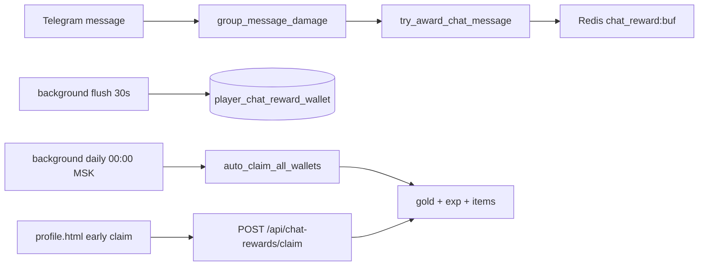

# Награды за активность в групповом чате

Игрок получает **золото**, **опыт основной вайфу (ОВ)** и **сундуки на вехах** за сообщения в групповом/супергрупповом чате с ботом. Награды начисляются **параллельно** существующим механикам (GD v1, рейд гильдии, соло-бой).

## Поток данных



## Формула баллов

За одно засчитываемое сообщение:

```
base = media_coef + min(text_chars / chars_per_point, max_text_bonus)
points = min(points_per_msg_cap, round(base))
gold = round(points * gold_per_point * gold_mult)
exp  = round(points * exp_per_point * exp_mult)
```

### Коэффициенты медиа

| Тип | Баллы |
|-----|-------|
| TEXT, STICKER, LINK | 1 |
| PHOTO, GIF | 2 |
| VIDEO, VOICE, AUDIO | 3 |

Ключи баланса — в `game_config` (`chat_reward.*`).

## Ограничения

- Мин. длина **текста** (TEXT/LINK): `chat_reward.min_chars` (по умолчанию 3).
- Кулдаун между засчитываемыми сообщениями: `chat_reward.min_seconds_between_msgs` (8 с).
- Дневной cap баллов (**MSK**): `chat_reward.daily_points_cap` (600).

## Множители

1. **Статы ОВ**: УДЧ → золото (`LCK_GOLD_COEFF`), ИНТ → опыт (`INT_EXP_BONUS_COEFF`), ОБА + уникальные авторы в чате за час.
2. **Пассивки**: `sa_chatter` (`chat_gold_pct`), `sh_lurker` (`chat_exp_pct`).
3. **Гильдия**: «Светская гильдия» (`chat_reward_pct`), «Легенда гильдии» (`global_reward_pct`).
4. **Раса/класс**: таблицы в `main_waifu_base_stats.py`.

## Сундуки (вехи)

Каждые `chat_reward.chest_milestone_step` (1000) lifetime-баллов — +1 сундук в кошелёк. Редкость растёт с числом открытых сундуков.

## Как получить награды

### Автоматически (основной способ)

Каждый день в **00:00 МСК** фоновая задача `chat_rewards_daily_claim`:

1. Сливает Redis-буферы в БД.
2. Зачисляет накопленное золото, опыт и предметы из сундуков **всем игрокам с непустым кошельком** — **без уведомлений**.

Заход в бота **не требуется** — достаточно писать в групповом чате. При следующем открытии профиля игрок увидит уже прокачанную ОВ, золото и предметы в инвентаре.

### Досрочно (опционально)

1. Откройте **Профиль** в веб-приложении.
2. Кнопка-мешок на портрете ОВ (если есть накопленное).
3. **«Забрать досрочно»** → `POST /api/chat-rewards/claim`.

Накопление из Redis сливается в БД фоновой задачей каждые **30 с**.

## API

- `GET /api/chat-rewards/status` — кошелёк, день, lifetime, множители.
- `POST /api/chat-rewards/claim` — досрочная выдача gold/exp/предметов.

## FAQ

**Считаются ли команды `/help`?** Нет — только не-командные сообщения (как в `group_message_damage`).

**Работает ли во время GD/рейда/соло?** Да, хук вызывается до веток боя.

**Почему 0 наград?** Дневной cap, кулдаун, слишком короткий текст или нет Redis (буфер не пишется).

**Нужно ли заходить в бота?** Нет для накопления и авто-начисления в полночь — уведомлений нет, эффект виден при открытии профиля. Кнопка claim нужна только для досрочного получения до полуночи.
