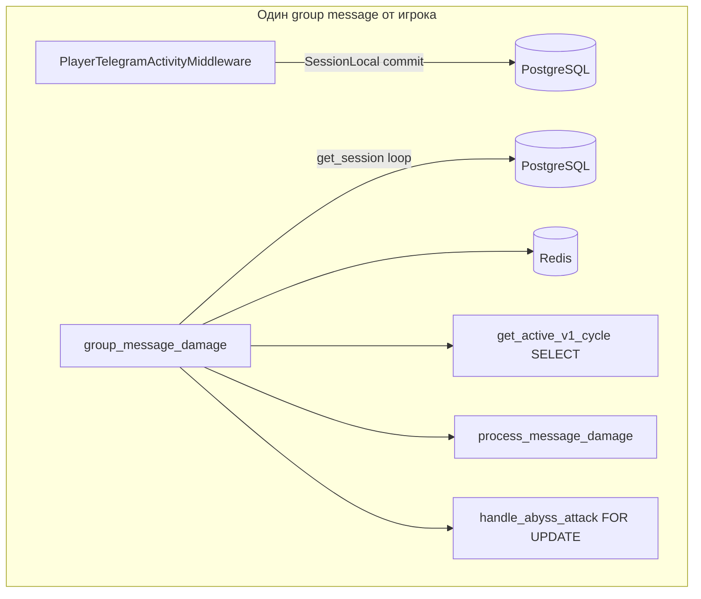

# Анализ FIX_OPTIMISATION.md vs реальный код

> **Дата:** 2026-06-03  
> **Источник тезисов:** [FIX_OPTIMISATION.md](FIX_OPTIMISATION.md)  
> **Сверка с:** кодом `src/waifu_bot/`, [ARCHITECTURE_AND_INTERACTIONS.md](ARCHITECTURE_AND_INTERACTIONS.md)  
> **Цель:** проверить каждое утверждение документа об оптимизации, уточнить нагрузку на «холодном» и «горячем» путях, сформулировать выводы для приоритизации работ.

---

## Содержание

1. [Введение](#1-введение)
2. [Сводная матрица верификации](#2-сводная-матрица-верификации)
3. [Детальный разбор пунктов 1–12](#3-детальный-разбор-пунктов-112)
4. [Дополнительные находки (не в FIX_OPTIMISATION)](#4-дополнительные-находки-не-в-fix_optimisation)
5. [Сопоставление с ARCHITECTURE_AND_INTERACTIONS](#5-сопоставление-с-architecture_and_interactions)
6. [Итоговые выводы и приоритеты](#6-итоговые-выводы-и-приоритеты)
7. [Метрики для проверки после изменений](#7-метрики-для-проверки-после-изменений)
8. [Ссылки](#8-ссылки)

---

## 1. Введение

### 1.1 Что такое FIX_OPTIMISATION.md

[FIX_OPTIMISATION.md](FIX_OPTIMISATION.md) — короткий диагностический обзор (~90 строк), сгруппированный по критичности:

- **Критические (3):** горячий путь групповых сообщений, dual-path GD+solo, LLM в event loop
- **Серьёзные (4):** монопроцесс, audio в handler, `game_config` без кэша, middleware на каждый update
- **Умеренные (5):** Redis durability, SSE, chat_rewards lag, Armory joins, мёртвый `expedition_routes.py`

В конце документа — приоритеты «быстрые wins / среднесрочно / архитектурно» без конкретных тикетов в коде.

Документ явно опирается на раздел 14 [ARCHITECTURE_AND_INTERACTIONS.md](ARCHITECTURE_AND_INTERACTIONS.md) (Performance appendix) и цепочку §5.1 (`group_message_damage`).

### 1.2 Методология

Для каждого пункта FIX:

1. Цитата тезиса
2. Проверка в репозитории (файл, функция)
3. Статус: **Подтверждено** / **Частично** / **Преувеличено** / **Операционное**
4. Холодный vs горячий путь (что реально выполняется)
5. Рекомендация и приоритет

### 1.3 Ограничения

- В репозитории **нет** production-метрик (p95 latency, RPS). Оценки вроде «50–100 DB-сессий/мин при 20 участниках» — **эвристика**, не замер.
- Анализ относится к **текущей** ветке кода; после рефакторинга разделы нужно перепроверить.

---

## 2. Сводная матрица верификации

| # | Тезис FIX_OPTIMISATION | Вердикт | Ключевое уточнение |
|---|------------------------|---------|-------------------|
| 1 | Перегруз `group_message_damage` | **Подтверждено** | 2 DB-сессии на сообщение (middleware + handler); combat не всегда полный граф; abyss — `SELECT … FOR UPDATE` на каждое сообщение |
| 2 | Dual-path GD + solo | **Подтверждено (by design)** | Задумано в коде; не баг, а trade-off нагрузки в пик GD |
| 3 | LLM в том же event loop | **Частично** | Async I/O не блокирует поток; tail latency от LLM + последовательных `send_message` реальна |
| 4 | Монопроцесс без воркеров | **Подтверждено** | 9 asyncio loops; второй процесс = гонки фоновых задач (GD lock только in-process) |
| 5 | Audio download в handler | **Частично** | Только для `message.audio`; остальные сообщения — early return |
| 6 | `game_config` без кэша | **Подтверждено** | Full `SELECT` таблицы на каждый вызов `get_game_config_map` |
| 7 | Middleware DB на каждый update | **Подтверждено** | Отдельный `SessionLocal` + `commit` до handler |
| 8 | Redis durability GD buffer | **Операционное** | В коде нет PG-fallback для `gd_v1_buf:*` |
| 9 | SSE без восстановления | **Частично** | Reconnect есть; автоматический refetch состояния — нет |
| 10 | chat_rewards lag 60s | **Подтверждено** | Redis сразу, wallet в PG — до 60 с |
| 11 | Armory heavy joins | **Подтверждено (ограниченно)** | Тяжело в основном `admin/.../full`; публичные GET легче |
| 12 | Dead `expedition_routes.py` | **Подтверждено** | Не подключён в `routes.py` |



---

## 3. Детальный разбор пунктов 1–12

### Пункт 1 — Горячий путь `group_message_damage`

**Тезис FIX:** на каждое групповое сообщение — middleware DB, touch чатов, chat_rewards, `get_active_v1_cycle`, GD buffer, guild GXP, полный combat, abyss всегда; 50–100 DB-сессий/мин в активном чате; `get_active_v1_cycle` не кэшируется.

**Код:**

| Шаг | Файл | Функция |
|-----|------|---------|
| Middleware | `services/player_activity.py` | `PlayerTelegramActivityMiddleware` L56–89 |
| Handler | `services/bot_handlers.py` | `group_message_damage` L233–407 |
| GD cycle | `services/gd_cycle_service.py` | `get_active_v1_cycle` L170–173 |
| Combat | `services/combat.py` | `process_message_damage` L538+ |
| Abyss | `services/abyss_combat.py` | `handle_abyss_attack` L230+ |

**Вердикт: Подтверждено**, с уточнениями.

**Что подтверждается полностью:**

- Цепочка шагов в `group_message_damage` совпадает с FIX и [ARCHITECTURE §5.1](ARCHITECTURE_AND_INTERACTIONS.md#51-group-message-damage-hot-path).
- `get_active_v1_cycle` — SQL каждый раз:

```170:173:src/waifu_bot/services/gd_cycle_service.py
    async def get_active_v1_cycle(self, session: AsyncSession, chat_id: int) -> GDCycle | None:
        ...
            .where(GDCycle.chat_id == chat_id, GDCycle.status == "active")
```

- `handle_abyss_attack` вызывается **безусловно** после combat (L380–404 в `bot_handlers.py`).

**Уточнения (холодный vs горячий путь):**

| Ветка | Что реально происходит |
|-------|------------------------|
| **Combat, игрок не в данже** | Redis spam check → `_get_active_run` → при отсутствии run `_get_active_progress` → `return {"error": "no_active_battle"}` (L560–571). Полный расчёт урона, дропы, SSE **не** выполняются. |
| **Combat, игрок в данже** | Полный граф combat + возможный SSE publish — как в FIX. |
| **Abyss, игрок не в бездне** | Всё равно вызывается `get_progress_for_update` с **`with_for_update()`** (L91–95 `abyss_service.py`), затем `no_session` — это дороже лёгкого `has_active_abyss_session` (L118–125). |
| **GD active** | Дополнительно: Redis buffer, guild GXP, **commit** до solo-ветки (L325). |

**Двойная DB-сессия (усиливает п.1 и п.7):** middleware открывает **свой** `SessionLocal` и делает `commit` **до** входа в `group_message_damage`, который открывает **вторую** сессию через `get_session()`. На одно сообщение — минимум **два** round-trip к PostgreSQL только на activity.

**Риск:** при 20 активных пользователях и 3 msg/min на человека → ~60 handler-сессий + ~60 middleware commits/min **на один чат**, без учёта других групп.

**Рекомендация (согласно FIX):** P0 — Redis/in-memory кэш `gd_v1_active:{chat_id}` TTL 30–60 с; P1 — ранний `has_active_abyss_session` до `FOR UPDATE`; объединить или debounce activity-writes.

---

### Пункт 2 — Dual-path GD + Solo

**Тезис FIX:** при активном `GDCycle` сообщение идёт в GD buffer **и** в solo combat + abyss; нагрузка удваивается в пик; решение только ручной сброс.

**Код:** `bot_handlers.py` L296–330 — после буферизации GD **нет** `break`; явный комментарий:

```326:330:src/waifu_bot/services/bot_handlers.py
                # NOTE: do NOT break here. Damage must be counted everywhere at once:
                # a GD participant's message contributes to the GD round AND still deals
                # solo-dungeon damage, while chat members who are not in the GD keep dealing
                # their own solo damage. process_message_damage no-ops cleanly when the player
                # has no active solo run, so non-dungeon users are unaffected.
```

**Вердикт: Подтверждено (архитектурное решение, не дефект).**

- FIX и [ARCHITECTURE §14.2](ARCHITECTURE_AND_INTERACTIONS.md#142-dual-path-hazard-gd--solo) описывают поведение верно.
- Startup в `main.py` предупреждает о «зависших» `gd_cycles.status=active` — см. [GROUP_CHAT_SOLO_AND_GD_DIAGNOSTICS.md](GROUP_CHAT_SOLO_AND_GD_DIAGNOSTICS.md).

**Нагрузка:** удвоение затрагивает **участников GD с активным solo run** и **всех** по ветке abyss (см. п.1). Игроки без данжа получают лишний SELECT combat + abyss, но не полный combat.

**Рекомендация:** P2 — продуктовое решение: флаг «в GD solo отключён» vs текущая модель; оперативно — мониторинг зависших циклов.

---

### Пункт 3 — LLM в том же event loop

**Тезис FIX:** `gd_v1_round` (20 с), `expedition_tick` (30 с), `guild_war_narrative` (900 с) вызывают OpenRouter в общем loop с FastAPI/aiogram; 1–5+ с блокируют WebApp; после GD LLM — пачка `send_message`.

**Код:**

- Планировщик: `services/background.py` — `start_all_background_tasks()`, интервалы L313–320.
- LLM: `services/gd_narrative_ai.py` → `llm_client.post_chat_completions` (async httpx).
- Рассылка: `gd_v1_worker.py` L426–452, L896 — последовательные `await bot.send_message`.

**Вердикт: Частично.**

| Утверждение FIX | Реальность |
|-----------------|------------|
| Один процесс / один event loop | **Да** |
| HTTP через httpx «блокирует поток» на I/O | **Нет** — await отдаёт управление; блокировка CPU возможна при разборе большого JSON |
| WebApp «встаёт» на 1–5 с | **Возможно под пиком** — конкуренция за loop time + DB pool + Telegram rate, не классический blocking I/O |
| Массовые DM после раунда GD | **Подтверждено** — последовательные `send_message` |

`guild_war_narrative` в dev/testing **пропускается** (`skip_in_dev=True` в `background._loop`).

**Рекомендация:** FIX «среднесрочно» — отдельный worker/Celery; минимальный шаг — не увеличивать параллелизм LLM в том же процессе без лимитера (semaphore).

---

### Пункт 4 — Монопроцессная архитектура

**Тезис FIX:** FastAPI + aiogram + 9 фоновых петель; нет Celery/RQ; второй инстанс = гонки; падение = всё down.

**Код:** `main.py` startup; `background.py` — 9 задач; GD in-process lock `_gd_v1_processing_cycle_ids` в `gd_v1_worker.py` L52–69 (только **внутри одного процесса**).

**Вердикт: Подтверждено.**

- Горизонтальное масштабирование uvicorn workers **не** решено для фоновых loops (каждый worker запустит свои 9 петель → дублирование GD ticks, expedition notify и т.д.).
- Для текущего масштаба (малый MAU) — приемлемо; FIX про «500+ активных» — разумный порог пересмотра архитектуры.

---

### Пункт 5 — Сохранение аудио в handler

**Тезис FIX:** `save_chat_audio_from_message` скачивает файл из Telegram внутри handler — нужен `create_task`.

**Код:** `bot_handlers.py` L249–255 — `await save_chat_audio_from_message`; `tavern_audio.py` L62–102 — download через `bot.get_file` / `download_file`, отдельная сессия БД.

**Вердикт: Частично.**

- На **текст/стикер/фото** — `message.audio` нет, функция сразу return (L68–70 `tavern_audio.py`). FIX не применим к большинству сообщений.
- На **audio** в группе — полный download + запись на диск + INSERT; latency и конкуренция за loop **реальны**.

**Рекомендация:** P1 — `asyncio.create_task` + обработка ошибок в task; дедуп по `file_unique_id` уже есть (L88–92).

---

### Пункт 6 — `game_config` без кэша

**Тезис FIX:** каждый combat читает `game_config` из БД без кэша.

**Код:**

```8:10:src/waifu_bot/services/game_config_service.py
async def get_game_config_map(session: AsyncSession) -> dict[str, str]:
    rows = (await session.execute(select(GameConfig))).scalars().all()
    return {r.key: r.value for r in rows}
```

В hot path: `bot_handlers.py` L278 — для chat_rewards; `combat.py` — в глубине активного боя; `abyss_combat.py` L255 — при активной сессии бездны.

**Вердикт: Подтверждено.**

- Кэша (LRU, Redis, TTL) в модуле **нет**.
- Таблица `game_config` обычно мала — стоимость одного SELECT невелика, но **умножается** на каждое групповое сообщение (chat_rewards) и на активный combat.

**Рекомендация:** P1 — process-local cache 30–60 с с инвалидацией при admin-изменениях (если появятся).

---

### Пункт 7 — `PlayerTelegramActivityMiddleware`

**Тезис FIX:** UPDATE `last_active` + identity sync на **каждый** update; 300 writes/min при 10×30 msg/min; нужен debounce 5–10 мин через Redis.

**Код:** `player_activity.py` L77–86 — `async with SessionLocal()`, `touch_player_last_active`, `sync_player_telegram_identity`, `commit` на message/edited_message/callback.

**Вердикт: Подтверждено.**

- Срабатывает **раньше** handler, в **отдельной** сессии — см. п.1.
- Оценка 300 commits/min — арифметика FIX корректна при заданных допущениях.

**Рекомендация:** P0 — `SET activity:touch:{user_id} NX EX 300` в Redis; UPDATE в PG только при отсутствии ключа.

---

### Пункт 8 — Redis durability для GD-буфера

**Тезис FIX:** `gd_v1_buf:{cycle_id}` только в Redis; без AOF/реплики потеря Redis = потеря раунда.

**Код:** `gd_cycle_service.py` — `REDIS_GD_V1_BUF = "gd_v1_buf:"`; запись в Redis, flush в раунд через worker. Postgres хранит состояние **цикла**, но не пошаговый буфер сообщений до pop.

**Вердикт: Операционное (вне приложения).**

- Код не документирует и не обеспечивает durability Redis.
- Риск **валиден** для ops; mitigations — AOF, replica, или дублирование критичных action в PG (не реализовано).

---

### Пункт 9 — SSE без восстановления состояния

**Тезис FIX:** pub/sub без истории; клиент должен refetch; иначе пропуск конца боя/экспедиции.

**Код:**

- Сервер: `services/sse.py` — publish в `sse:{player_id}`.
- Клиент: `webapp/app.js` L1442–1466 — `EventSource`, `onSseEvent`, при ошибке reconnect через 3 с.

**Вердикт: Частично.**

| FIX | Факт |
|-----|------|
| Нет replay буфера | **Да** |
| Нет refetch при reconnect | **Да** — только переподключение SSE |
| События теряются офлайн | **Да**, если страница не обработала `onSseEvent` |

Reconnect снижает **длительный** простой канала, но не восстанавливает пропущенные события — FIX верен по сути.

**Рекомендация:** при reconnect вызывать `GET /api/dungeons/active` / profile refresh (улучшение UX, не perf).

---

### Пункт 10 — Задержка chat_rewards 60 с

**Тезис FIX:** буфер в Redis, flush в PG раз в 60 с → пустой кошелёк в UI.

**Код:** `background.py` `CHAT_REWARDS_FLUSH_INTERVAL = 60`; `chat_rewards.py` — `BUF_PREFIX`, flush в `flush_buffer_to_db`.

**Вердикт: Подтверждено.**

- Это **задуманная** схема batching, не баг.
- UX-несогласованность (Redis уже начислил points, PG wallet отстаёт) — справедливое замечание.

**Рекомендация:** уменьшить интервал до 15–30 с или отдавать «pending» в `GET /api/chat-rewards/status` из Redis.

---

### Пункт 11 — Armory full profile

**Тезис FIX:** `armory_service` — тяжёлые join; admin-only пока; без кэша.

**Код:** `GET /api/armory/admin/players/{tg_id}/full` — `armory_routes.py` L538–553: `build_public_summary`, `build_stats_detail`, `build_inventory_list`, `build_event_feed` (до 20 событий).

Публичные эндпоинты (`/armory/players/{tg_id}`, search) — меньше агрегации.

**Вердикт: Подтверждено (ограниченно).**

- Производственный риск сейчас — **редкие** admin-запросы.
- FIX верно предупреждает о масштабировании, если публичный профиль повторит `full`.

---

### Пункт 12 — Мёртвый `expedition_routes.py`

**Тезис FIX:** 6 роутов не подключены; живые маршруты в `routes.py`; 189 роутов всего.

**Код:** `api/routes.py` — `include_router` для admin, inventory, guild, … **без** expedition. Expedition: 15+ эндпоинтов в `routes.py` (catalog, start, claim, …). Отдельный файл `expedition_routes.py` — дубликат API surface.

**Вердикт: Подтверждено.**

- Не perf, а **maintainability risk** — FIX корректен.

**Рекомендация:** удалить или подключить один router; не два источника правды.

---

## 4. Дополнительные находки (не в FIX_OPTIMISATION)

| Находка | Где | Влияние |
|---------|-----|---------|
| **Две DB-сессии на сообщение** | `player_activity` + `group_message_damage` | Удваивает pool pressure vs ожидание «одна сессия на handler» |
| **Guild raid short-circuit** | `bot_handlers.py` L344–358 — при успешном raid `break` | Solo combat **пропускается** в рейде; abyss **тоже** пропускается (выход из loop) — FIX не упоминает |
| **Spam check всегда в combat** | `combat._check_spam` Redis/in-memory до проверки run | 1 Redis op на каждое сообщение от игрока с waifu в БД |
| **GD processing lock in-process only** | `gd_v1_worker._gd_v1_processing_cycle_ids` | Второй uvicorn worker может обработать тот же cycle |
| **Middleware на callbacks** | expedition_abort, sd_retry | +commits на каждое нажатие inline-кнопки |

---

## 5. Сопоставление с ARCHITECTURE_AND_INTERACTIONS

| Тема | ARCHITECTURE | FIX_OPTIMISATION | Согласованность |
|------|-------------|------------------|-----------------|
| Цепочка group message | §5.1, диаграмма | П.1 | Полная |
| GD + solo hazard | §14.2, startup diagnostics | П.2 | Полная |
| Background intervals | §7 таблица | П.3, п.10 | Полная |
| Redis keys | §11 | П.8, п.1 | Полная |
| 189 routes, expedition pitfall | §6 | П.12 | Полная |
| Решения / метрики | §14.7 profiling order | Краткие «быстрые wins» | ARCHITECTURE глубже по ops, FIX — по приоритетам fix |

**Вывод:** FIX_OPTIMISATION — **сжатое и в целом точное** резюме ARCHITECTURE §14 + §5 для принятия решений; не содержит расхождений с кодом по проверенным пунктам.

**Что ARCHITECTURE даёт дополнительно:** полный каталог API, модели БД, все сервисы — для FIX не требуется повторять.

---

## 6. Итоговые выводы и приоритеты

### 6.1 Главный вывод

Документ **FIX_OPTIMISATION.md в целом соответствует реальной кодовой базе**. Критические замечания наиболее актуальны для:

- **активных групповых чатов** (много сообщений/мин);
- **окон GD v1** (активный цикл + LLM round + mass Telegram);
- **коррелированных пиков** (GD + chat + OpenRouter latency).

Для изолированного WebApp-трафика (профиль, магазин без группы) многие пункты (1, 2, 7) **почти не проявляются**.

Формулировка «огромный граф combat на **каждое** сообщение» — **слегка преувеличена**: холодный путь `no_active_battle` дешевле, но **abyss FOR UPDATE** и **двойная сессия** остаются на каждом сообщении.

### 6.2 Когда текущая архитектура достаточна

- MAU невелик, 1–3 группы, GD редко
- Redis и PostgreSQL стабильны, нет зависших `gd_cycles`
- p95 WebApp приемлем вне окон `gd_v1_round`

### 6.3 Когда нужны срочные изменения

- Рост msg/min в основной группе (лаг ответов бота, рост DB connections)
- Зависшие `status=active` GD (solo+GD dual path без конца)
- Таймауты OpenRouter в логах, совпадающие с `:20`/` :30` сек tick
- Память Redis растёт на `gd_v1_buf:*`

### 6.4 Приоритеты (согласованы с FIX, уточнены по верификации)

| Приоритет | Действие | Ожидаемый эффект |
|-----------|----------|------------------|
| **P0** | Кэш `get_active_v1_cycle` per `chat_id` (Redis/memory, TTL 30–60 s) | −1 SELECT × N msg/min в чате |
| **P0** | Debounce `PlayerTelegramActivityMiddleware` (Redis NX, 5–10 min) | −сотни `commits` на `players.last_active` |
| **P1** | `create_task` для `save_chat_audio_from_message` | Снять tail latency на audio |
| **P1** | Abyss: `has_active_abyss_session` до `get_progress_for_update` | −`FOR UPDATE` на не-abyss игроках |
| **P1** | TTL cache `game_config` (30–60 s) | −full table scan на hot path |
| **P2** | Политика GD+solo (skip solo при active GD) — product | −нагрузка combat/abyss в пик GD |
| **P2** | LLM + mass DM → отдельный worker/queue | Масштаб при росте MAU |
| **Ops** | Redis AOF/replica; алерт на stuck `gd_cycles` | Durability + ops safety |
| **Maint** | Удалить/слить `expedition_routes.py` | Меньше путаницы, не perf |

Предложения FIX «быстрые wins / среднесрочно / архитектурно» **обоснованы** результатами сверки с кодом.

---

## 7. Метрики для проверки после изменений

| Метрика | Зачем |
|---------|--------|
| p95 время обработки `group_message_damage` (лог + span) | П.1, 5, 6, 7 |
| PostgreSQL: `commits/sec` на `players` UPDATE | П.7 |
| Частота `SELECT` на `gd_cycles` WHERE `status='active'` | П.1 |
| Redis: ops/sec `spam:*`, `chat_reward:*`, `gd_v1_buf:*` | П.1, 8, 10 |
| Concurrent in-flight HTTP к OpenRouter во время `gd_v1_round` | П.3 |
| WebApp p95 `POST /api/battle/message` vs фон GD tick | П.3 |
| Размер Redis keys `gd_v1_buf:{id}` | П.8 |

Инструменты в репозитории: `scripts/measure_webapp_api.py`, [LOGS_ANALYSIS_REPORT.md](../LOGS_ANALYSIS_REPORT.md).

---

## 8. Ссылки

| Документ | Назначение |
|----------|------------|
| [FIX_OPTIMISATION.md](FIX_OPTIMISATION.md) | Исходные тезисы |
| [ARCHITECTURE_AND_INTERACTIONS.md](ARCHITECTURE_AND_INTERACTIONS.md) | Полная runtime-архитектура (EN) |
| [GROUP_CHAT_SOLO_AND_GD_DIAGNOSTICS.md](GROUP_CHAT_SOLO_AND_GD_DIAGNOSTICS.md) | Диагностика групп / GD / solo |
| [CHAT_ACTIVITY_REWARDS.md](CHAT_ACTIVITY_REWARDS.md) | Экономика chat rewards |
| [COMBAT_FORMULAS.md](COMBAT_FORMULAS.md) | Формулы боя (не perf) |

---

*Конец отчёта. При изменении hot path в `bot_handlers.py` или middleware — обновить §3 и матрицу §2.*
