# GAME_AGENT_BRIEF — Waifu Bot REBORN

> Презентационный бриф для ИИ-агента и миграции WebApp → Steam.  
> Сгенерировано: 2026-06-15 15:58 UTC · commit `0447cdb` · preset `expert`  
> Без числовых балансов и схем БД. Runtime-справка: [ARCHITECTURE_AND_INTERACTIONS.md](ARCHITECTURE_AND_INTERACTIONS.md)

## Оглавление

- [0. Введение](#0-введение)
- [1. Сквозной игровой цикл](#1-сквозной-игровой-цикл)
- [02. Клиенты и каналы взаимодействия](#2-клиенты-и-каналы-взаимодействия)
- [03. Основная вайфу и профиль](#3-основная-вайфу-и-профиль)
- [04. Предметы и аффиксы](#4-предметы-и-аффиксы)
- [05. Пассивные и скрытые навыки](#5-пассивные-и-скрытые-навыки)
- [06. Соло-подземелья](#6-соло-подземелья)
- [07. Экспедиции](#7-экспедиции)
- [08. Групповые подземелья GD v1](#8-групповые-подземелья-gd-v1)
- [09. Бездна (Abyss)](#9-бездна-abyss)
- [10. Гильдия](#10-гильдия)
- [11. Экономика и социальные системы](#11-экономика-и-социальные-системы)
- [12. AI-слой и нarrativ](#12-ai-слой)
- [13. Steam-миграция](#13-steam-миграция)
- [14. Карта взаимодействий](#14-карта-взаимодействий)
- [Приложение A. Справочник](#приложение-a-справочник)

---

## 0. Введение

О проекте

Waifu Bot REBORN — это многопользовательская IDLE RPG, действие которой происходит внутри экосистемы Telegram. Игрок управляет Основной Вайфу (ОВ) — уникальной героиней, которую он создаёт, экипирует и отправляет в опасные подземелья. Ключевая особенность игры: боевая система активируется через активность в групповых чатах Telegram, где каждое текстовое сообщение участников наносит урон монстрам, а медиа-сообщения запускают особые навыки. Интерфейс управления персонажем, снаряжением и прогрессией реализован в виде HTML WebApp, встроенного в Telegram Mini App.

Данный документ является презентационным брифом игровых механик, а не технической спецификацией или инструкцией по эксплуатации. Его цель — предоставить ИИ-агенту или разработчику целостное, абстрактное представление об игровом цикле, системах и взаимодействиях для последующей адаптации игры на платформу Steam. Документ намеренно избегает числовых балансов, схем баз данных, списков API-роутов и конкретных параметров конфигурации (детали баланса можно найти в COMBAT_FORMULAS и game_config, которые не включены в этот документ).

Сеттинг и тон

Сеттинг игры балансирует на грани фэнтези и самоиронии. Мир, полный магии и клинков, населён «вайфу» — харизматичными героинями разных рас и классов, которые не прочь подшутить над собой и ситуацией. Это не эпическое полотно в духе высокого фэнтези, а скорее юмористический аниме-сериал, где пафосные атаки чередуются с неловкими моментами, а основным местом действия часто выступают групповые чаты, словно герои обсуждают свои приключения в мессенджере. Тон игры — лёгкий, ироничный, местами абсурдный, рассчитанный на аудиторию, которая ценит юмор и «культуру вайфу».

Роль настоящего документа

Бриф служит точкой входа для понимания общей архитектуры игры:
- Описывает сквозной игровой цикл — путь игрока от первой сессии до эндгейм-активностей.
- Вводит систему ключевых понятий через глоссарий, унифицируя терминологию для команды переноса.
- Очерчивает границы механик, не углубляясь в их числовую реализацию, что позволяет на этапе переноса на Steam принимать взвешенные решения об изменении платформенно-зависимых аспектов (например, замена триггеров из чата Telegram на механизмы Steam).

Глоссарий

Ниже приведена таблица основных сокращений и терминов, используемых в проекте.

| Сокращение | Полное название (русский контекст) | Краткое описание |
| :--- | :--- | :--- |
| ОВ | Основная Вайфу | Главный персонаж игрока, которого он прокачивает, экипирует и отправляет в бой. |
| GD v1 | Group Dungeon (v1) | Актуальная версия механики группового подземелья, проходимого в рамках гильдии или общего чата. (Legacy-версии `/gd_start` и `/engage` исключены из рассмотрения). |
| SSE | Server-Sent Events | Технология односторонней передачи данных от сервера к WebApp-клиенту для обновления интерфейса в реальном времени (например, прогресс боя, логи). |
| Armory | Портал статистики | Браузерное SPA (Vue) вне WebApp: публичные профили, рейтинги, поиск игроков. Не путать с экипировкой в profile.html. |
| Act | Акт | Глава сюжетной кампании. Каждый акт открывает новый набор подземелий, монстров, предметов снаряжения и повышает планку сложности. |
| Tier | Уровень предмета/навыка | Ступень качества или силы сущности. Применяется к снаряжению, пассивным навыкам, наёмницам и гильдийным умениям. |
| Affix | Аффикс | Магическое свойство, придающее предмету снаряжения дополнительные бонусы (например, к силе атаки или защите). Предметы могут иметь несколько аффиксов разной редкости. |
| Резерв | Резерв | Хранилище нанятых, но не используемых в данный момент наёмниц. Используется для смены активного состава отряда. |
| GXP | Guild Experience | Очки опыта гильдии, зарабатываемые в гильдийных активностях и расходуемые на изучение гильдийных навыков. |


## 1. Сквозной игровой цикл

Путь игрока в Waifu Bot REBORN — это постоянное чередование коротких, но насыщенных игровых сессий, построенных вокруг центрального цикла «бой-лут-усиление». Этот цикл обрастает параллельными активностями и мета-прогрессией по мере продвижения от первого запуска к эндгейму.

1.1. Рождение героини: от титульного экрана к созданию персонажа

Игрок начинает свой путь с запуска WebApp (index.html), который служит точкой входа. Первый экран предлагает начать новую игру или продолжить существующую. Выбор «Новая игра» активирует waifu_generator — пошаговый процесс создания Основной Вайфу (ОВ). Игрок здесь не просто выбирает параметры из списка, а формирует уникальную героиню:

1.  Выбор расы и класса: Эти два фундаментальных выбора определяют как визуальный стиль, так и базовые боевые архетипы (например, склонность к ближнему бою, дальнему бою или заклинаниям).
2.  Генерация портрета и биографии: На основе выбранных параметров система генерирует уникальный визуальный портрет и краткую историю персонажа. Это придаёт ОВ индивидуальность и эмоциональную привязку с первых минут игры.

После завершения создания, игрок попадает в основной интерфейс — так называемый «лагерь» или «город», откуда открывается доступ ко всем ключевым зданиям (страницам WebApp).

1.2. Центральный цикл: соло-поход в подземелье

Основа геймплея — это прохождение подземелий. Процесс запускается из здания, соответствующего текущему акту.

1.  Выбор акта и старт: Игрок выбирает доступный акт и начинает соло-поход. Подземелье представляет собой последовательность комнат со случайными событиями и монстрами.
2.  Бой в групповом чате: Как только начинается сражение с монстром, игровой процесс перемещается в привязанный групповой чат Telegram.
    -   Каждое текстовое сообщение участников чата наносит базовый урон монстру.
    -   Медиа-сообщения (фото, видео, стикеры) активируют специальные, более мощные атаки или навыки, связанные с экипировкой и классом ОВ.
    -   Бой заканчивается либо победой над монстром, либо ранением и таймаутом. Прогресс боя и логи в реальном времени транслируются в WebApp через SSE-канал.
3.  Результаты похода: После завершения подземелья (или выхода из него) игрок получает награду: золото, опыт для прокачки уровня ОВ и, самое главное, случайные предметы снаряжения (лут).

1.3. Петля усиления: лут, экипировка, прокачка

Добытый лут — это топливо для прогрессии. Полученные предметы направляются в инвентарь, и игрок взаимодействует с ними через Оружейную (Armory):

-   Экипировка: Игрок сравнивает характеристики найденных предметов (включая случайные аффиксы и их уровни — Tier) и надевает лучшие на ОВ, напрямую увеличивая её боевую мощь.
-   Усиление и модификация: В оружейной доступны механики улучшения предметов, позволяющие повышать их Tier или изменять аффиксы.

Параллельно, по мере накопления опыта и золота, игрок развивает пассивные навыки ОВ, которые дают постоянные бонусы в различных аспектах игры. Этот процесс замыкает петлю: прокачанный персонаж способен проходить более сложные акты, получая лут лучшего качества и Tier’а.

1.4. Параллельные активности и расширение геймплея

По мере прогресса по актам, игровой мир раскрывает новые возможности, которые существуют параллельно с основным циклом соло-забегов.

-   Таверна и наёмницы: Игрок может тратить золото на найм других вайфу. Они не являются основным персонажем, но могут отправляться в экспедиции — автономные миссии, приносящие ресурсы с течением времени. Наёмницы имеют свой уровень редкости (Tier) и могут находиться в активном отряде или резерве.
-   Гильдии и GD v1: Вступление в гильдию открывает доступ к социальным механикам. Главная из них — Group Dungeon (GD v1). Это битва с мощным боссом, требующая скоординированной активности всех членов гильдии в специальном чате. Успешное прохождение приносит гильдийный опыт (GXP) и уникальные награды. Гильдии также могут изучать особые навыки, усиливая всех своих членов.
-   Бездна: Высокоуровневая активность, представляющая собой бесконечное или очень глубокое подземелье со всё возрастающей сложностью, предназначенное для проверки максимальных возможностей прокачанного персонажа и его экипировки.
-   Магазин: Место для покупки базовых предметов и расходных материалов за игровую валюту.

1.5. Мета-прогрессия и путь к эндгейму

Долгосрочная цель игрока — продвижение по сюжетным актам, каждый из которых знаменует новая главу в развитии мира и открывает доступ к более качественному снаряжению и новым испытаниям. Символом этого путешествия является караван — метафора или визуальное представление продвижения игрока по глобальной карте актов.

Эндгейм-состояние игрока характеризуется:
-   Прохождением последних, самых сложных актов.
-   Максимальным развитием пассивных навыков.
-   Охотой за предметами высочайшего Tier’а с идеальными комбинациями аффиксов.
-   Активным участием в гильдийных рейдах и войнах (PvPvE-активности гильдий).
-   Покорением глубоких уровней Бездны и коллекционированием редчайших наёмниц.

1.6. Блок-схема типичной игровой сессии

Следующая диаграмма иллюстрирует логику действий игрока в рамках одной игровой сессии после завершения этапа создания персонажа.

```mermaid
flowchart TD
    A[Старт сессии. Вход в лагерь] --> B{Проверить таверну}
    B --> C[Собрать ресурсы с экспедиций наёмниц]
    C --> D{Проверить гильдию}
    D --> E[Участие в GD v1 / Войне]
    D --> F[Изучение/улучшение гильдийных навыков]
    E --> G{Основная цель: Прогресс по акту}
    F --> G
    G --> H[Выбрать акт и начать соло-подземелье]
    H --> I[Бой через чат Telegram (текст/медиа)]
    I --> J[Прохождение подземелья, получение лута]
    J --> K[Посещение Оружейной: экипировка/улучшение лута]
    K --> L[Прокачка пассивных навыков (если есть опыт)]
    L --> M{Достаточно ресурсов?}
    M -- Да --> H
    M -- Нет --> N[Завершение сессии]
```

---

## 2. Клиенты и каналы взаимодействия

Взаимодействие с игровой вселенной Waifu Bot REBORN обеспечивается тремя основными клиентскими каналами: Telegram WebApp, Telegram Bot и Armory. Каждый обслуживает специфические сценарии игрока и опирается на изолированный от транспорта слой игровой логики. При миграции на Steam стратегия взаимодействия перестраивается так, чтобы сохранить все функции поверх нового клиента, не затрагивая ядро.

### 2.1 Telegram WebApp — основное игровое окно

WebApp реализован как набор из 13 HTML-страниц, встроенных в интерфейс Telegram Mini App. Игрок перемещается между страницами с помощью навигации в подвале и «Основного чердака» (ОЧ) — верхней панели, служащей хабом для доступа ко всем ключевым механикам. Страницы охватывают:
- бой и подземелья (включая endless-режимы),
- инвентарь, экипировку, крафтинг, зачарование,
- здания и их улучшения,
- экспедиции,
- гильдейские функции,
- групповые события (Global Dungeon, бездна).

Каждая страница взаимодействует с FastAPI backend через HTTP-запросы. Для боевого процесса используется Server-Sent Events (SSE) — real-time канал, по которому сервер пушит состояние боя (логи атак, здоровье, эффекты) без постоянного поллинга. Это позволяет реализовать динамичный пошаговый бой прямо внутри мессенджера.

### 2.2 Telegram Bot — социальное и уведомительное измерение

Помимо визуального WebApp, бот выполняет роль асинхронного управления и уведомлений в групповых чатах и личных сообщениях:
- Групповые чаты: совместные механики — глобальный урон (Global Dungeon), бездна, награды за активность (chat rewards). Бот публикует сводки о ходе GD, объявляет о появлении мини-боссов, распределяет поощрения за участие в беседе. Социальная среда телеграм-групп становится частью геймплея.
- Личные сообщения: персональные уведомления о завершении экспедиций, изменении статуса GD, важных событиях гильдии и личных квестах. Через ЛС также может приходить информация для модераторов и администраторов.

Вся обработка команд бота происходит через aiogram-диспетчер, который после фильтрации делегирует вызовы в универсальное игровое ядро (`core/`), не содержащее знаний о Telegram.

### 2.3 Armory — публичная браузерная статистика

Armory — это внешнее одностраничное приложение (Vue SPA), доступное по адресу `https://shimmirpgbot.ru/armory`. Оно выполняет роль «зала славы»: публичные профили игроков, рейтинги (PvE, гильдии, достижения), поиск по нику и сравнение сборок. Авторизация происходит через виджет Telegram Login, поэтому приложение остаётся тесно связанным с учётными записями игроков, но не зависит от WebApp-интерфейса. Armory обращается к отдельной группе API-методов, агрегирующих игровые данные, обслуживая исключительно read-нагрузку.

### 2.4 Транспортный слой vs игровое ядро

Принципиальная архитектурная идея: Telegram является лишь транспортным уровнем, а вся игровая логика сосредоточена в изолированном модуле `core/`. Это позволяет заменить канал доставки, не переписывая ни одной строчки в механиках боя, лута, экспедиций и т.д.

```
┌──────────────────────────────────────────────┐
│                   Клиенты                     │
│  Telegram WebApp / Bot / Armory / Steam       │
└───────┬──────────────┬──────────────┬─────────┘
        │              │              │
        ▼              ▼              ▼
┌────────────────────────────────────────────────┐
│                API / SSE слои                  │
│  • REST-эндпоинты для игровых действий         │
│  • SSE-канал боя                               │
│  • Аутентификация                              │
└─────────────────────┬──────────────────────────┘
                      │
                      ▼
┌────────────────────────────────────────────────┐
│          core/ — игровая логика                │
│  battle.py dungeon.py loot.py expedition.py    │
│  character.py skills.py openrouter.py          │
└────────────────────────────────────────────────┘
```

В текущей реализации запросы от WebApp и Bot приходят через вебхуки Telegram, обрабатываются FastAPI-роутами и направляются в нужный модуль `core/`. Для Steam транспортным слоем станет локальный HTTP/SSE или WebSocket, поднимаемый Electron-приложением, которое запускает тот же FastAPI-инстанс на `localhost`. Боевой SSE при этом либо сохраняется, либо заменяется на локальный WebSocket — в обоих случаях устраняются ограничения Telegram-инфраструктуры.

### 2.5 Маршрутизация страниц и миграция на Steam

Ключевой шаг миграции — отображение текущих WebApp-страниц на аналогичные UI-компоненты в Steam-клиенте. Таблица показывает назначение страницы, концептуальную привязку к модулям `core/` и предполагаемую замену.

| WebApp-страница | Назначение | Backend-сервис (core/модуль) | Замена в Steam |
|-----------------|------------|------------------------------|----------------|
| Бой (PvE / подземелья) | Пошаговый бой с монстрами, endless-режимы | `battle.py`, `dungeon.py` | Окно боя в Electron, интерактивный интерфейс, локальный SSE / WebSocket |
| Инвентарь / Экипировка | Управление предметами, экипировка | `character.py`, `loot.py`, `skills.py` | Панель инвентаря, drag-and-drop, локальные REST-запросы |
| Здания | Улучшение построек, бонусы | `character.py` (расширение) | Вкладка «База» или внутриигровое меню |
| Экспедиции | Отправка отряда, получение наград | `expedition.py` | Окно экспедиций, push-уведомления через Steamworks |
| Крафтинг / Зачарование | Создание и улучшение предметов | `loot.py`, `skills.py` | Интерфейс крафта, локальные API-вызовы |
| Гильдии | Гильдейские навыки, доски | `guild.py` (часть core) | Панель гильдии во внутриигровом браузере |
| Global Dungeon / Бездна | Кооперативный урон, рейтинги | `battle.py`, `dungeon.py` | Окно GD, синхронизация через API |
| Чат-события (chat rewards) | Награды за активность в чате | `chat_rewards.py` (адаптируется) | В Steam — интеграция со встроенным Steam Chat или гибридное решение на переходный период |
| Профиль / Статистика | Локальный просмотр статов | `character.py`, агрегация | Внутриигровой профиль; публичная часть вынесена в Armory |

Таким образом, для каждой страницы WebApp будет создан либо отдельный оверлейный виджет в Electron, либо интегрированный экран. Вместо внешнего бота и WebApp игрок взаимодействует с единым приложением, которое напрямую обращается к тем же `core`-сервисам через локальный FastAPI.

Групповые социальные механики (GD, бездна, chat rewards) либо переносятся во внутриигровой чат Steam, либо остаются доступными в Telegram для гибридной аудитории на переходный период. Сам бот продолжает работу параллельно, делегируя все действия тем же API, что и Steam, — это гарантирует синхронизацию состояния игры.

### 2.6 Архитектурный сдвиг (схема)

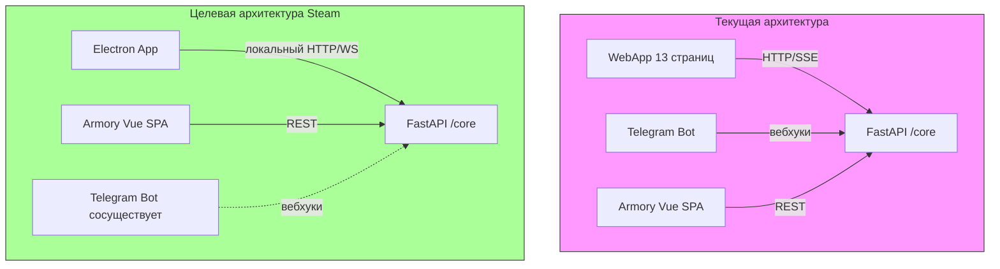

В целевой схеме транспортный слой меняется с внешних Telegram вебхуков на локальное взаимодействие, но игровое ядро остаётся тем же. Клиент на Electron загружает UI, аналогичный WebApp-страницам, но исполняет его в собственном веб-окне, обеспечивая более отзывчивое управление и независимость от ограничений Telegram Mini Apps.

### 2.7 Итоговый контекст для миграции

Все каналы взаимодействия проектируются с расчётом на дальнейшее разделение: транспортный слой (Telegram API → локальный HTTP) заменяется полностью, слой представления (HTML-страницы, SPA) адаптируется под стиль Steam, а игровые сервисы (`core/`) остаются нетронутыми. Детали баланса боевых механик, лута и экспедиций вынесены в отдельные документы (COMBAT_FORMULAS, game_config), не включённые в этот обзор. Архитектура гарантирует, что один и тот же сеанс игрока может одновременно обслуживаться через Telegram и Steam без десинхронизации, а все ключевые сценарии сохранятся при переходе на новую платформу. Все изменения в дизайне интерфейсов должны соответствовать архитектурным ограничениям, изложенным в ARCHITECTURE.md.

---

## 3. Основная вайфу и профиль

3.1. Основная вайфу и наёмницы  
Центральный персонаж игры — основная вайфу (ОВ). Она получает опыт, развивается, экипируется и участвует во всех боевых и социальных активностях: от атак в чате до гильдейских рейдов и войн. Прогресс игрока полностью завязан на силе и развитии ОВ.  
Наёмницы — вспомогательные спутницы с собственными фиксированными или ограниченно растущими характеристиками. Они нанимаются через таверну, дают пассивные бонусы основной вайфу либо влияют на групповые расчёты в рейдах и караванах, но не заменяют её личного прогресса.

3.2. Характеристики, жизненная сила и развитие  
Основная вайфу обладает четырьмя базовыми характеристиками, определяющими боевую эффективность:  
- Сила (STR) — увеличивает физический урон и способность пробивать броню.  
- Ловкость (AGI) — повышает вероятность уклонения, скорость атаки и точность.  
- Интеллект (INT) — усиливает магический урон, эффективность заклинаний и восстановление энергии.  
- Удача (LUCK) — увеличивает шанс критического удара, качество выпадающей добычи и вероятность успеха в событийных проверках.  

Производные жизненные показатели:  
- HP (здоровье) — исчерпание означает поражение; восстанавливается в таверне, расходными предметами или со временем.  
- Энергия — ресурс для специальных атак и заклинаний, расходуется при активации навыков.  

Развитие происходит за счёт опыта (EXP), получаемого за монстров, квесты и рейды. При достижении порога уровень повышается: автоматически растут базовые HP и энергия, а также выдаются очки характеристик, которые игрок распределяет вручную между STR, AGI, INT и LUCK. Никаких автоматических начислений — билд полностью контролируется владельцем.

3.3. Профиль игрока и система экипировки  
Основной интерфейс управления персонажем — страница profile.html. Она содержит три вкладки:  
- Краткая информация — эффективные характеристики (с учётом экипировки и пассивок), полосы HP и энергии, опыт до следующего уровня, доступные очки характеристик, кнопки смены экипировки и повышения уровня.  
- Инвентарь — полный список предметов рюкзака с возможностью надеть, продать или разобрать вещь.  
- Статистика — общее число уничтоженных монстров, пройденных подземелий, смертей, максимальный урон, рейтинг в войнах гильдии.  

Центральный элемент профиля — paperdoll, визуальное представление вайфу в надетых предметах. Поддерживаются два режима отображения:  
- Compact — силуэт с иконками слотов для быстрой оценки.  
- Expanded — детальный показ каждого предмета и его ключевых характеристик (атака, защита, бонусы к статам), включая информацию об улучшениях и слотах под камни/руны.  

Система экипировки оперирует шестью слотами: основное оружие (правая рука), дополнительное оружие (левая рука, опционально для dual-wield), голова, тело, кисти, ноги и аксессуар. При использовании парного оружия левая рука наносит бонусный урон в размере части своего дамага; если dual-wield не нужен, слот остаётся пустым, и все атаки идут от основной руки.

3.4. Генератор вайфу и распределение очков характеристик  
Инструмент первичной кастомизации — waifu_generator.html. Он позволяет создать образ основной вайфу в начале игры, а позже — наёмниц в таверне. Игрок получает случайный, но сбалансированный набор визуальных черт (причёска, глаза, наряд) и начальных характеристик; результат можно перегенерировать несколько раз. Для основной вайфу выбор фиксируется однократно, для наёмниц генерация многократная.  

Распределение очков характеристик после повышения уровня выполняется через отдельное всплывающее окно, доступное из вкладки «Краткая информация». В нём отображаются текущие эффективные значения параметров и количество неизрасходованных очков. Игрок вручную увеличивает нужные характеристики и применяет изменения нажатием кнопки — случайные траты исключены.

3.5. Секретный босс эха  
В эндгейме появляется особая механика — секретный босс эха. Это точная зеркальная копия основной вайфу, копирующая все её статы, экипировку и пассивные навыки, но усиленная множителем. Сражение активируется не по расписанию, а при выполнении скрытых условий: критическое здоровье, ношение полного комплекта особых предметов или триггер скрытого квеста. Победа над собственным отражением служит проверкой сбалансированности билда и приносит уникальные награды — эксклюзивную косметику, титулы, доступ к скрытым веткам навыков, а также self-модифицирующиеся предметы или ресурсы для крафта легендарной экипировки.

---

## 4. Предметы и аффиксы

Предметная система является фундаментом прогрессии персонажа, определяя боевую мощь и гибкость билдостроения. При переходе с Telegram WebApp на Steam система сохраняет иерархическую структуру, адаптируясь под расширенные возможности интерфейса и детализацию данных.

### 4.1 Типология и иерархия предметов
Все игровые предметы классифицируются по типу экипировки, редкости и уровню силы.

   Типы и слоты:
       Оружие: Основная рука и опциональный слот левой руки (offhand). Оружие отвечает за базовый урон и может быть одноручным или двуручным; offhand дает дополнительную броню или специальный атакующий бонус.
       Броня: Шлем, нагрудник, поножи, перчатки, обувь. Каждый элемент вносит вклад в общую защиту персонажа.
       Аксессуары: Кольца и амулеты. Являются ключевым источником вторичных характеристик (fraction-бонусов), которые определяют уникальные синергии, но напрямую не влияют на базовый урон или защиту.
   Иерархия:
       Rarity (Редкость): Определяет потенциал предмета, количество и силу аффиксов. Градация от обычных (common) до легендарных (legendary).
       Tier (Уровень предмета): Отражает «мощность» предмета внутри одной редкости (1–10). Чем выше Tier, тем больше базовые характеристики и тем выше потолок для улучшения через зачарование. Предметы высокого Tier требуют соответствующего уровня персонажа или доступа к сложному контенту.

Детали формирования базовых характеристик описаны в `COMBAT_FORMULAS` и `game_config`.

### 4.2 Аффиксы: префиксы, суффиксы и вторичные бонусы
Аффиксы — это динамические модификаторы, определяющие уникальность каждого экземпляра.

   Классификация:
       Основные аффиксы (префиксы/суффиксы): Прямые модификаторы урона, защиты или характеристик (сила, ловкость и т.д.), которые формируют название предмета (например, «Стальной меч Остроты»).
       Вторичные бонусы (Fraction-бонусы): Процентарные модификаторы, влияющие на критический урон, уклонение, снижение урона, бонусы к опыту, золоту или поиск магии (magic find). Они делятся на два подтипа:
### 1. Основной вторичный бонус (Passive): Фиксированное свойство, заданное шаблоном, которое не меняется от заточки.
### 2. Дробный вторичный бонус (Fraction): Присутствует на аксессуарах и некоторых легендарных предметах. Именно его можно улучшать через зачарование и заточку.
   Отображение в UI: Система использует двухуровневое отображение. Основные характеристики и префиксы/суффиксы всегда видны в карточке предмета. Вторичные бонусы могут быть сгруппированы во вкладке «Подробно», чтобы не перегружать интерфейс, но оставаться легкодоступными.

### 4.3 Легендарные предметы
Легендарные предметы (Rarity 5) делятся на два типа:

### 1. Curated Legendary: Содержат фиксированные уникальные бонусы (unique effects), которые кардинально меняют стиль игры (например, механики воскрешения, гарантированные критические удары, синергии при ношении нескольких легендарных предметов). При генерации легендарного предмета приоритет всегда отдается Curated-шаблонам.
### 2. Generic Legendary: Обладают повышенными базовыми показателями, но не имеют уникальных способностей.

Уникальные бонусы привязаны к шаблону, не генерируются случайно и не зависят от заточки, что делает их ценными на любом этапе игры. Игрок может отслеживать свои находки через внутриигровой Codex.

### 4.4 Зачарование и кузнечное дело
Система усиления предметов в кузнице разделена на две ветки:

   Заточка (+1...+10):
       Увеличивает один числовой показатель: урон (оружие), защиту (броня/offhand) или текущий дробный бонус (аксессуары).
       На высоких уровнях (+8 и выше) появляется риск неудачи и отката. Риск минимизируется расходными материалами.
       Пробуждение: При первой успешной заточке аксессуара или легендарного предмета, не имеющего дробного бонуса, предмет получает случайный fraction-бонус, открывая новые возможности для кастомизации.
   Зачарование (Craft):
       Позволяет добавлять, изменять (reroll) или улучшать дробные fraction-бонусы.
       Требует специальный ресурс — «пыль зачарования».
       Система учитывает Tier предмета, устанавливая верхний предел (cap) для величины бонуса для сохранения баланса прогрессии.

### 4.5 Разбор и экономика предметов
Механика разбора (dismantle) позволяет конвертировать ненужную экипировку в пыль зачарования. Количество ресурса зависит от редкости и Tier предмета и не зависит от уровня заточки или наличия бонусов. Это создает замкнутый цикл: игрок добывает снаряжение, разбирает излишки и использует пыль для улучшения лучших образцов через зачарование.

### 4.6 Получение предметов
Существует два основных источника экипировки:

   Генерация в подземельях: Основной источник высокоуровневых предметов. Качество дропа коррелирует со сложностью контента и показателем «поиск магии» (magic find) персонажа.
   Gamble (Азартная игра): Позволяет потратить золото у специального NPC для получения случайного предмета, вплоть до легендарного. Это альтернативный способ быстрого обновления слота экипировки без прохождения подземелий.

### 4.7 Codex предметов
Codex служит внутриигровой энциклопедией, отслеживающей прогресс игрока. В нем отображается список всех открытых базовых шаблонов снаряжения, информация о легендарных уникальных бонусах и возможных аффиксах. Codex хранит информацию о шаблонах, а не о конкретных выпавших экземплярах.

Примечание для разработчика ИИ-агента: при реализации логики `inventory_items` необходимо учитывать Snapshot-природу хранения вторичных бонусов (см. `inventory_payload` в архитектуре данных). Детали формул разбора, лимиты зачарования и веса шаблонов хранятся в `game_config` и `SECONDARY_BONUSES` и должны подтягиваться динамически.*

---

## 5. Пассивные и скрытые навыки

Система прогрессии персонажа опирается на два взаимодополняющих механизма: открытое пассивное дерево навыков, управляемое игроком, и скрытые навыки, отражающие стиль игры и накопленный опыт. Обе системы предоставляют постоянные бонусы к бою, экономике и взаимодействию с миром, не требуя ручной активации, и synergируют с экипировкой и классом персонажа.

5.1. Пассивное дерево навыков
Пассивное дерево навыков представляет собой структурированную систему развития, разделенную на три тематические ветки: Воин (Warrior), Тень (Shadow) и Мудрец (Sage). Выбор узлов не ограничен классом персонажа, что позволяет создавать гибридные билды. Визуально дерево реализовано как сеть узлов, требующих последовательной разблокировки (родительский узел должен быть изучен).

Типы эффектов и их применение. Бонусы от пассивных узлов делятся на три категории:
   Профильные (статические): Всегда активны и отображаются в карточке персонажа. Включают прирост атаки (ближней, дальней, магической), брони, максимального HP, шанс критического удара, уклонение, снижение входящего урона, а также плоский бонус к основным характеристикам (`main_stats_flat`) и получаемому опыту.
   Боевые (ситуативные): Срабатывают непосредственно в бою. Сюда входят общий процент к урону, бонус к урону активных навыков, шанс нанести гарантированный крит на определённом ударе комбо-атаки, снижение расхода умений, а также специальный множитель для VN-сражений (`media_fight_dmg`).
*   Экономические: Влияют на активность вне боя. Примеры: узел «Болтун» (`sa_chatter`, ветка Sage) увеличивает награду золотом за общение в групповых чатах, а «Теневой собеседник» (`sh_lurker`, ветка Shadow) повышает количество опыта ОВ за ту же активность.

Механика развития и интерфейс. Игрок получает очки пассивных навыков (`skill_points`) при повышении уровня своей Основной Вайфу (ОВ). Количество очков за уровень — фиксированный параметр из `game_config`. Тренировочный зал (`training_hall.html`) служит веб-интерфейсом для осмотра и покупки узлов. Игрок видит стилизованное дерево на тёмном фоне, где каждый узел показывает текущий бонус, стоимость изучения и эффект следующего уровня. Изучение происходит по нажатию на узел. Предусмотрен сброс всей ветки или отдельных узлов с возвратом очков (стоимость сброса регулируется `game_config`), что позволяет адаптировать билд под актуальные вызовы, например, переход от PvE-фарма к PvP. На той же странице вкладка «?» отображает уже открытые скрытые навыки.

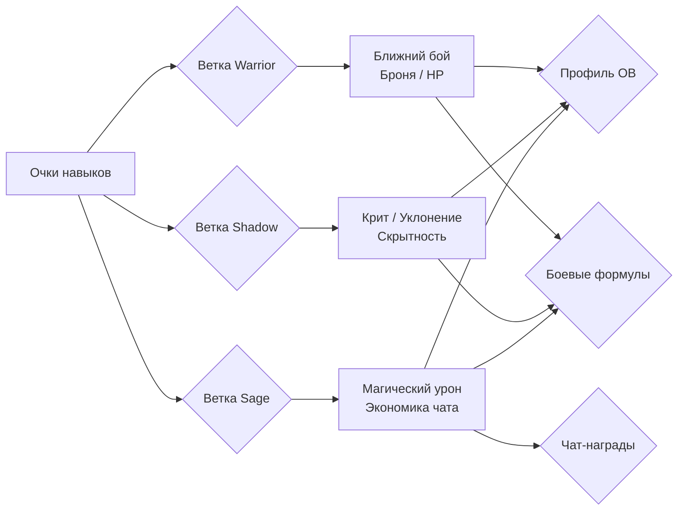

5.2. Скрытые навыки (Hidden Skills)
Скрытые навыки — это динамическая система достижений, которые открываются и прокачиваются автоматически при выполнении определённых игровых действий, без затрат очков навыков. Система включает 29 перков, каждый из которых имеет от 1 до 5 уровней с линейно или ступенчато усиливающимся эффектом.

Категории и условия открытия. Скрытые навыки группируются по источнику прогресса:
### 1. Активность (7 навыков): Завязаны на частоту взаимодействия (ранние/поздние входы в игру, отправка сообщений, длительность онлайна). Счётчики срабатывают в фоне при совершении событий.
### 2. Убийства (8 навыков): Учитывают тип поверженного противника или особые условия (финишеры, убийства одноручным/двуручным оружием, магией, в одиночку). Прогресс фиксируется из логов боя при завершении сражения.
### 3. Крафт / Экономика (4 навыка): Открываются за использование мастерской, накопление и трату золота. Могут снижать стоимость крафта или давать бонусы к находимым предметам.
### 4. Социальные / Особые (10 навыков): Связаны с гильдийными рейдами, экспедициями, событиями в таверне («Пивной живот»), чтением лора. Некоторые имеют уникальные триггеры, например, бонус к урону первым ударом в час (`first_hit_hour`), использующий кэш-ключ с TTL для предотвращения злоупотреблений.

API и Визуализация. Данные о скрытых навыках доступны через эндпоинт `GET /skills/hidden`. API возвращает текущий прогресс по каждому навыку, список всех эффектов с их значениями, суммарный текстовый бонус и URL иконки. В бою каждый применяемый бонус логируется отдельным полем в `damage_breakdown`.

Связь с классом и экипировкой. Скрытые навыки косвенно тяготеют к определённым классам через требования к стилю игры (воину проще качать убийства в ближнем бою, магу — магические финишеры), но формальных ограничений нет. Ряд навыков требует соблюдения условий экипировки (например, конкретный тип оружия) для активации бонуса. Каждый навык обладает статусом жизненного цикла (от «Активен» до «В разработке»), что позволяет модульно подключать новые механики.

5.3. Связь с экипировкой и классом
Система пассивных навыков не существует в вакууме. При расчете итоговых характеристик (`compute_details`) учитывается аддитивная и мультипликативная связь между:
### 1. Базовыми атрибутами (СИЛ, ЛОВ и др.).
### 2. Бонусами от надетой экипировки.
### 3. Пассивными узлами дерева навыков.
### 4. Активными бонусами от скрытых навыков.
Эта связка обеспечивает «мягкую» кастомизацию: если игрок выбирает класс, ориентированный на магию, пассивные навыки «Мудреца» и скрытые бонусы к магическому урону будут синергировать с соответствующей экипировкой, создавая выраженную специализацию персонажа.

5.4. Гильдейские навыки
Помимо индивидуальных навыков, игроки имеют доступ к Гильдейским навыкам (детальное описание см. в §10). Они действуют как глобальные модификаторы для всех участников гильдии, дополняя персональный билд игрока и стимулируя командное взаимодействие. Эти навыки не требуют микро-менеджмента от игрока и лишь накладываются общим пулом поверх персональных бонусов, что делает выбор гильдии важным стратегическим решением.

Примечание: Для глубокого анализа влияния навыков на конкретные механики боя необходимо обратиться к `COMBAT_FORMULAS` и актуальному `game_config`.

---

## 6. Соло-подземелья

Соло-подземелья — это ключевой PvE-режим, рассчитанный на индивидуальное прохождение. Игрок в одиночку сражается с последовательностью монстров, путешествуя по актам и биомам. Механика намеренно допускает два параллельных канала нанесения урона: традиционный для Telegram — сообщения в групповом чате, и интерактивный WebApp-бой с SSE-событиями. Такая архитектура позволяет вовлекать игрока как в текстовое общение, так и в прямое взаимодействие с интерфейсом.

### 6.1 Мировая прогрессия: акты и биомы

Все подземелья организованы в несколько актов, каждый из которых представляет собой тематическую главу сюжета со своим набором биомов. Биом определяет визуальное окружение, список доступных монстров-шаблонов и общие условия прохождения. Переход между актами обычно требует победы над сюжетным боссом, что гарантирует постепенное усложнение контента.

Продвижение линейно, но вариативность возникает за счёт процедурной компоновки встреч. В рамках одного биома игрок может столкнуться с разными комбинациями обычных, элитных врагов и случайными аффиксами, поэтому повторные забеги не становятся рутиной.

### 6.2 Запуск подземелья через WebApp

Интерфейс для выбора и старта реализован на странице `dungeons.html`. Игрок видит карту актов, доступные биомы и может регулировать уровень сложности с помощью механики Dungeon Plus («+»). Повышение сложности усиливает монстров, но пропорционально увеличивает награды и шанс выпадения редких предметов. Настройка сложности доступна только до начала забега.

После запуска создаётся активная сессия забега, фиксируется выбранный уровень сложности и формируется цепочка монстров на основе шаблонов текущего пула. Прогресс сохраняется сразу, поэтому прерывание связи или закрытие WebApp не приводит к потере состояния.

### 6.3 Нанесение урона

Уникальность соло-подземелий — поддержка двух независимых каналов атаки. Они могут использоваться одновременно и не блокируют друг друга, что позволяет игроку комбинировать общение в чате с прямыми действиями в интерфейсе.

### 6.3.1 Урон из группового чата Telegram

Любое осмысленное сообщение в супергрупповом чате (где бот является участником) может трансформироваться в урон по текущему монстру. Система анализирует текст и вложения:

- базовая величина урона растёт с длиной текста (количеством символов);
- наличие изображений, стикеров или видеосообщений умножает вклад;
- короткие или командные сообщения (например, `/help`) отфильтровываются и не засчитываются.

Действует защита от спама (spam gate): у каждого игрока есть скрытый кулдаун и дневной лимит засчитываемых сообщений. Превышение лимита не даёт урона, но и не наказывает — сообщение просто обрабатывается как обычное.

Урон применяется мгновенно: обновляется текущее здоровье монстра в активной сессии забега. Если здоровье падает до нуля, засчитывается победа, и игрок продвигается к следующему противнику.

### 6.3.2 Бой в WebApp (SSE‑канал)

Альтернативный путь — встроенный боевой интерфейс `battle.html`, работающий через Server-Sent Events (SSE). Игрок видит анимированную сцену боя с полосами здоровья, таймерами способностей и логами событий. Основные элементы управления:

- ручные атаки (обычный удар, специальные умения);
- автоматический режим для пассивного прохождения;
- визуальное отображение входящих событий от сервера (урон, срабатывание аффиксов, применение способностей монстра).

SSE‑поток в реальном времени сообщает клиенту обо всех изменениях: урон от основной вайфу, ответные атаки врага, эффекты статусов. Такой подход сохраняет единый источник истины на сервере и не требует от клиента постоянного опроса.

Прямой WebApp-бой и чат-урон суммируются — игрок может «добить» монстра текстовым сообщением, даже если в интерфейсе сейчас не активен.

### 6.4 Монстры: аффиксы, элиты и способности

Каждый монстр генерируется из шаблона, задающего базовые характеристики, а затем обогащается случайными элементами:

- Обычные мобы получают от одного до нескольких аффиксов — свойств-модификаторов, которые изменяют поведение или добавляют пассивные эффекты (например, усиление брони, отражение урона, вампиризм).
- Элитные версии отличаются повышенными параметрами и гарантированным набором особых аффиксов. Элиты встречаются реже, но дают значительно лучшие награды.
- Способности — активные или реактивные умения монстра. Они могут срабатывать по таймеру (например, мощная атака раз в 10 секунд) или при определённых условиях (порог здоровья, критическое попадание игрока). Способности описаны в шаблонах и частично зависят от выбранного уровня сложности.

Таким образом, даже знакомый по предыдущим забегам биом способен преподнести сюрпризы за счёт новой комбинации аффиксов на элитном враге.

### 6.5 Награды и добыча

После победы над монстром игрок немедленно получает золото и опыт основной вайфу. Дополнительно срабатывает система дропа предметов. Правила выдачи опираются на таблицы дропа, привязанные к шаблону монстра и текущему уровню сложности (Dungeon Plus). Предметы могут включать:

- экипировку (оружие, броня, аксессуары) с различной редкостью;
- расходуемые предметы (зелья, свитки);
- сундуки различных категорий, которые открываются отдельно через инвентарь.

Уровень сложности напрямую влияет на шансы получения редких и эпических предметов, благодаря чему опытные игроки сознательно рискуют, выбирая высокие значения «+».

### 6.6 Активность в чате как дополнительный доход

Параллельно с соло-подземельем работает система наград за активность в чате (`chat activity rewards`). Даже если игрок не находится в активном забеге, его сообщения приносят баллы, которые накапливаются в специальном кэш-буфере.

- Баллы рассчитываются по аналогичному с чат-уроном принципу: вклад текста и медиа, фильтрация команд и учёт дневного лимита.
- Фоновый процесс каждые 30 секунд сбрасывает буфер в постоянное хранилище.
- В полночь по московскому времени происходит автоматический клейм всех накопленных баллов: игрок получает золото, опыт основной вайфу и, при пересечении определённых вех, сундуки.
- Игрок может забрать награды досрочно через кнопку в профиле, не дожидаясь полуночи.

Эта механика работает независимо от текущего контента: во время рейда гильдии, обычного общения или активного соло-забега. Важно, что сообщения в чате одновременно приносят и мгновенный урон (если активен забег), и баллы активности. Система сама определяет, когда применить прямой урон по монстру, а когда только увеличить счётчик общего прогресса.

### 6.7 Конкуренция каналов: GD и Solo

В текущей архитектуре GD (Group Dungeon v1) и соло-подземелье являются взаимоисключающими режимами по одной причине: у игрока может быть только одна активная боевая сессия. Если игрок состоит в гильдейском рейде GD, запуск соло-забега потребует выхода из GD, и наоборот. Ограничение продиктовано необходимостью чётко интерпретировать входящий чат-урон: каждое сообщение должно направляться либо в GD-событие, либо в текущего соло-монстра. Двусмысленность исключена, когда активен только один режим.

Однако ничто не мешает игроку чередовать сессии: завершить дневной лимит GD, а затем отправиться в соло-подземелье (или наоборот). Обе механики пользуются общей инфраструктурой накопления chat‑активности, поэтому переключение не обнуляет прогресс буфера.

### 6.8 Steam-адаптация: трекинг ввода вместо чата

На платформе Steam отсутствует концепция «группового чата с ботом», следовательно механика чат-урона в её текущем виде неработоспособна. Для сохранения сути «активность → боевой вклад» планируется замена на систему отслеживания ввода (input tracker). Основная идея:

- Каждое нажатие клавиш атаки, использование способностей, а также определённый уровень активности мыши (или контроллера) генерируют события урона.
- Эти события, аналогично сообщениям в Telegram, проходят спам-гейт (защита от автокликеров и макросов) и применяются к текущему монстру или пополняют буфер наград.
- Вместо Telegram-хуков используется клиент-серверный WebSocket‑канал: игровой клиент непрерывно сообщает серверу о пользовательском вводе, сервер обрабатывает и возвращает обновлённое состояние боя.

Графическая реализация боя в WebApp (SSE) может быть сохранена в рамках оверлея Steam-клиента или встроена непосредственно в игру как часть интерфейса. Chat-activity rewards преобразуются в «награды за игровую активность», по-прежнему начисляясь фоново и выдаваясь один раз в сутки либо по запросу через игровое меню.

Таким образом, основная механика «игрок генерирует урон через действия вне прямого боя» остаётся, но адаптируется под реалии десктопной платформы без использования внешних мессенджеров.

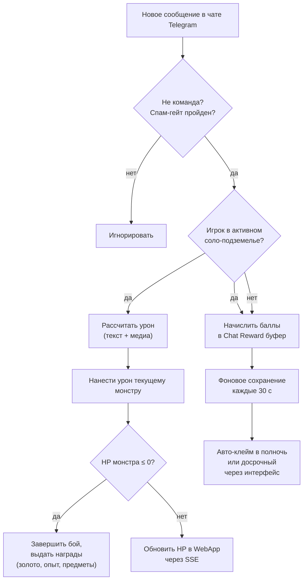

---

## 7. Экспедиции

Экспедиции — это асинхронный PvE-режим, в котором игрок отправляет отряд из нескольких наёмниц на задание. В отличие от пошаговых подземелий, экспедиция протекает в фоновом режиме реального времени: после старта игра автоматически генерирует события (тики), наносящие урон и требующие реакции отряда. Финальный исход зависит от синергии класса, расы и перков наёмниц с испытаниями конкретного слота.

Ежедневные слоты  
Каждый игровой день (обновление в 00:00 МСК) игроку становится доступно три слота экспедиций. Слоты обновляются автоматически — старые удаляются, и генерируется новая тройка. Каждый слот представляет собой уникальную карту со своим набором параметров:

- Narrative archetype — стиль повествования ИИ (deranged, cosmic horror, military, gag и др.), определяющий тон брифингов и описаний событий.  
- Biome / Setting — биом слота (пещера, руины, болото, храм, пустыня, крепость, город и т.д.), к которому привязаны визуальные эмодзи и генерация иллюстраций.  
- Affixes (префикс/суффикс) — пара модификаторов, каждый из которых принадлежит к одной из DB-категорий (`elemental`, `enemy`, `hazard`, `cursed`, `blessed`). Аффиксы имеют уровень (I–V) и определяют, какие категории испытаний будут доминировать.  
- Affix tags — система тегов на аффиксах для предварительного просмотра сложности: слот получает `active_tags` (ключевые угрозы), а наёмницы своими пассивными свойствами могут `covered_tags` перекрывать, снижая эффективную опасность.

Сложность слота  
Каждый слот получает расчётный параметр сложности, который визуализируется через звёзды или цветовую индикацию. На сложность влияют:

### 1. Уровни аффиксов — чем выше уровень (I → V), тем больше базовый процент урона, наносимый отряду при каждом событии.
### 2. Active tags слота — набор тегов угроз, которым отряд должен противостоять.
### 3. Рейтинг отряда — агрегированный показатель силы выбранных наёмниц, который сравнивается с требованиями слота для предпросчёта шанса на успех.

Детали балансировки см. в COMBAT_FORMULAS, не включённых в этот документ.

Выбор отряда  
Игрок выбирает отряд из числа нанятых вайфу. Каждая наёмница привносит в экспедицию:

- Расовые контр-способности — раса даёт бонус (снижение получаемого урона) против определённых категорий испытаний. Например, одни расы эффективны против `enemy` и `hazard`, другие — против `magic` и `knowledge`, третьи — против `nature` и `social` (точные маппинги рас см. в game_config).  
- Классовые контр-способности — класс аналогично даёт бонус против своего набора категорий. Расовый и классовый бонусы суммируются, создавая перекрытие.  
- Перки — наёмница может иметь экспедиционные перки, дающие прямой контр против конкретных категорий испытаний либо специальные эффекты (снижение урона от всех источников, иммунитет к критическим провалам и т.д.).  
- Система coverage — интерфейс показывает `covered_tags` (перекрытые теги) и `tag_effectiveness_pct` — насколько эффективно отряд в целом закрывает угрозы слота. Перекрытые теги визуально зачёркиваются.

Перед стартом игрок видит сводку по отряду, активные/перекрытые теги и прогнозируемый уровень опасности.

Длительность и количество событий  
Экспедиции имеют фиксированную длительность, выбираемую игроком перед стартом (несколько вариантов в минутах). Количество событий (тиков) прямо пропорционально длительности: чем дольше экспедиция, тем больше тиков, и, следовательно, выше суммарный урон и потенциальные награды.

Жизненный цикл экспедиции  
Жизненный цикл состоит из фаз: ежедневный ролл слотов, сбор отряда, фоновое выполнение с периодическими тиками и финализация.

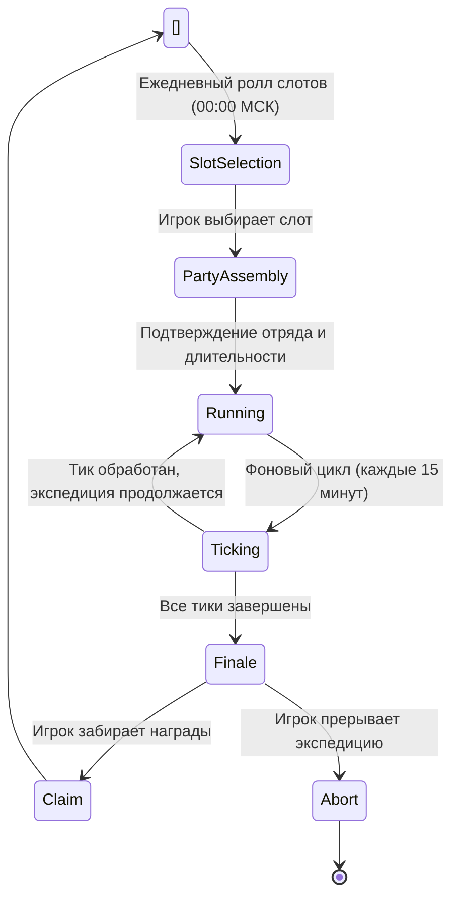

Фоновые тики  
После старта экспедиция переходит в пассивный фоновый режим. Сервер обрабатывает тики каждые 15 минут реального времени. Каждый тик включает:

### 1. Выбор события — из пула возможных событий выбирается одно, релевантное категориям аффиксов слота.
### 2. Расчёт урона — на основе категории события определяется, кто из отряда подвергается опасности. Итоговый урон вычисляется с учётом:
   - базового процента от HP отряда для уровня аффикса,
   - расовых и классовых контр-бонусов попавших под удар наёмниц,
   - перков, релевантных категории события,
   - модификаторов `covered_tags` (перекрытые теги дают частичный или полный иммунитет).  
### 3. Применение урона — HP наёмниц снижается. Если HP какой-либо наёмницы достигает нуля, она выбывает из экспедиции (не погибает навсегда, но перестаёт участвовать в оставшихся тиках и не учитывается в финале).
### 4. Генерация нарратива — ИИ создаёт короткое описание события в стиле, заданном narrative archetype слота. Текст отображается в интерфейсе экспедиции.
### 5. Уведомление игрока — сообщение содержит описание события, пострадавших, потерянные HP и текущее состояние отряда.

Финал и клейм  
Когда все тики обработаны, экспедиция переходит в статус финализированной. Игрок получает уведомление и может:

- Claim (забрать награды) — если хотя бы одна наёмница осталась с HP > 0, игрок получает награды, сгенерированные на основе слота, сложности и выживаемости отряда. Награды масштабируются пассивными бонусами наёмниц (например, перк «увеличение наград экспедиций»). После клейма слот освобождается.  
- Abort (прервать) — возможно досрочное прерывание в любой момент. При прерывании награды не выдаются, но наёмницы возвращаются с текущим уровнем HP (не погибают). Слот не возвращается, но не блокирует новый день.

Если финализированная экспедиция не забрана до сброса слотов (00:00 МСК), срабатывает авто-клейм: все незабранные экспедиции принудительно завершаются с выдачей наград.

AI-нарратив и иллюстрации  
Все текстовые описания генерируются ИИ:

- Start brief — при старте игрок видит развёрнутый брифинг: описание слота, условий, аффиксов и ощущение предстоящей миссии в выбранном narrative style.  
- Tick narratives — каждое событие тика получает короткое (2–4 предложения) описание: что произошло, как отреагировали наёмницы, какой урон получен. Стилистика варьируется от grotesque до military в зависимости от архетипа слота.  
- Finale event — финальное описание исхода: чем завершилась вылазка, какие трофеи добыты, какой ценой.

Дополнительно может генерироваться изображение (через OpenRouter) для брифинга или финала, визуализирующее сцену в стилистике биома слота. Изображения сохраняются и показываются в интерфейсе.

Лимиты и UI  
- Дневной лимит: ровно 3 слота в день, без возможности расширения за донат или другие механики.  
- Интерфейс: вкладка экспедиций расположена в `dungeons.html` как подраздел или параллельная вкладка. Для каждого слота карточка содержит:
  - эмодзи биома,
  - название нарративного архетипа,
  - сложность (звёзды/цвет),
  - активные теги с визуализацией перекрытия,
  - кнопки «Собрать отряд» / «Продолжить» / «Забрать».  
- История: игрок видит список активных и завершённых экспедиций за текущий день.

---

## 8. Групповые подземелья GD v1

GD v1 — переработанная система еженедельных групповых рейдов, работающая по фиксированному временному циклу. Она заменяет устаревшие сценарии и реализует асинхронную модель: вклад участников определяется их естественной активностью в чате, а не прямыми командами атаки.

8.1. Архитектура цикла
Цикл состоит из трёх фаз:
- Registration (Регистрация): игроки присоединяются командой `/gd_join` в групповом чате. Запись закрывается по дедлайну, после чего состав участников фиксируется.
- Active Rounds (Активные раунды): основная фаза, разбитая на фиксированные временные интервалы (стандартная длительность раунда — около 15 минут, точные значения в `game_config`). Внутри раунда сообщения участников накапливаются в кэш.
- Finale (Финал): наступает при победе над боссом или после завершения всех раундов. Проводится расчёт вклада, распределение наград и генерация эпилога.

Фазы сменяются автоматически под управлением фонового воркера; вмешательство администратора требуется только для экстренного сброса или отладки.

8.2. Цикл раунда (взаимодействие компонентов)
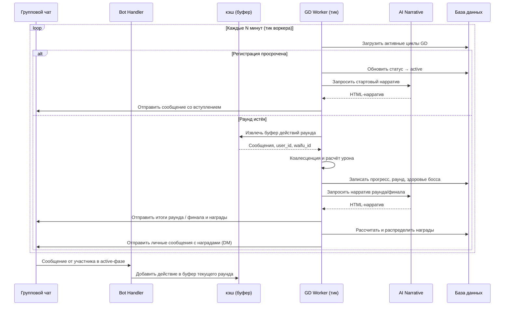

Воркер циклично проверяет необходимость смены фазы или завершения раунда. Все временные параметры и пороги задаются в `game_config`.

8.3. Механика действия и коалесценция
- Пассивное участие: любой текст, отправленный зарегистрированным участником в групповой чат во время активной фазы, считается атакующим действием. Специальные префиксы или форматы не требуются.
- Буферизация: сообщения накапливаются в кэш с привязкой к `user_id` и `waifu_id`.
- Коалесценция: при завершении раунда воркер группирует сообщения по игрокам, объединяя фрагментированный ввод и рассчитывая совокупный вклад. Это сглаживает разницу между многословными и лаконичными участниками. Конкретные коэффициенты и минимальные пороги описаны в `COMBAT_FORMULAS` и `game_config`.
- Урон и стилистика: каждое действие преобразуется в урон по боссу. Тип атаки может варьироваться в зависимости от класса вайфу (см. `COMBAT_FORMULAS`) — это добавляет разнообразие в нарратив, не требуя от игрока выбора умений.

8.4. AI-нарратив
Для создания атмосферы используется генеративный ИИ (при наличии конфигурации LLM, например, через OpenRouter). Предусмотрены три типа запросов:
### 1. Стартовый нарратив — описание подземелья, босса и завязка сюжета. Отправляется при переходе в фазу `active`.
### 2. Нарратив раунда — итоги прошедшего отрезка: состояние босса, реакция окружения, результаты действий. В промпт передаются обезличенные сводки (топ по активности, суммарный урон, оставшееся здоровье).
### 3. Финальный эпилог — подведение итогов, выделение MVP и наименее активного участника, эпическая концовка.

Все сообщения используют Telegram HTML-разметку (жирный, курсив и пр.). Тон повествования — приключенческий с элементами гротескного юмора. При недоступности LLM подставляются жёстко заданные русскоязычные заглушки, чтобы цикл не прерывался.

8.5. Взаимодействие с другими режимами
- Гильдейские рейды: имеют более высокий приоритет. Если персонаж уже участвует в гильдейском рейде, он не может быть зарегистрирован в GD v1. Попытка входа вернёт сообщение об ошибке.
- Соло-подземелья: полностью совместимы с GD v1. Игрок может одновременно иметь активный одиночный поход и участвовать в групповом рейде. Это два независимых пути прогрессии, не влияющие на лимиты друг друга.

Таким образом, GD v1 — еженедельный дополнительный контент, не исключающий обычные одиночные вылазки, но конфликтующий с внутренними рейдами гильдии.

8.6. Команды и права
Пользовательские команды:
- `/gd_join` — запись в текущий цикл GD v1. Отправляется в групповом чате. Повторная отправка безопасна: дублирования регистрации не происходит. Если цикл уже находится в фазе `active` или `finale`, бот уведомит о невозможности присоединиться.

Служебные и отладочные команды (доступны только администраторам или пользователям из списка `GD_V1_MANUAL_TEST_USER_IDS`):
- `/gd_v1_test_join` — имитация массовой регистрации.
- `/gd_v1_test_start` — принудительный немедленный старт цикла, игнорирующий таймеры и дедлайны.
- `/gd_v1_test_reset` — полный сброс цикла: очистка всех регистраций и буферов в кэш.
- `/gd_v1_force_round` — досрочное завершение текущего раунда.
- `/gd_v1_battle_status` — диагностика: вывод текущей фазы, списка участников, очков вклада и здоровья босса.
- `/gd_v1_admin_force_victory` — мгновенное объявление победы и завершение цикла с выдачей всех наград.

При расследовании нештатных ситуаций (например, отсутствие реакции бота на сообщения) следует обращаться к журналу трассировки `TELEGRAM_TRACE_LOG`, в котором фиксируется полный путь сообщения от вебхука до обработчика `process_message_damage`.

8.7. WebApp и статус GD
Мини-приложение WebApp выполняет роль информационной панели игрока. Если пользователь зарегистрирован в активном цикле GD v1, через WebApp он может:
- видеть текущий статус цикла (регистрация, активная фаза, завершён);
- просматривать данные своего вайфу, участвующего в рейде;
- отслеживать свою позицию в рейтинговой таблице и текущие очки вклада.

WebApp не подменяет собой управление рейдом — для регистрации по-прежнему используется только команда `/gd_join` в групповом чате. Задача мини-приложения — дать возможность быстро проверить состояние своего группового похода, не листая историю чата.

---

## 9. Бездна (Abyss)

### 9.1 Обзор режима
Бездна (Abyss) — это бесконечная групповая вертикальная башня, предназначенная для соревновательного эндгейм-контента. В отличие от одиночных подземелий или режима GD v1, Бездна ориентирована на непрерывный динамичный забег, где игроки совместно сражаются с волнами монстров, а каждое их сообщение в чате превращается в одну боевую атаку. Сложность этажей неуклонно растет, а еженедельный лидерборд поощряет самых упорных исследователей.

### 9.2 Механика боя и группового взаимодействия
Ключевая особенность Бездны — коллективный формат в реальном времени. После входа в активную сессию все участники видят текущее состояние этажа: здоровье монстров, наложенные модификаторы и активные усиления. Одно отправленное сообщение в чат равно одной атаке. Система мгновенно рассчитывает урон, применяет эффекты Grace (если выбраны), проверяет критические попадания и уклонения, после чего обновляет здоровье текущей волны.

Когда здоровье всех монстров на этаже исчерпано, группа автоматически переходит на следующий уровень, а каждому участнику начисляется индивидуальный вклад, влияющий на награды. Присоединиться к идущей сессии можно в любой момент без штрафов — игрок начинает с текущего этажа группы с полным запасом здоровья.

### 9.3 Сессия, прогрессия и чекпоинты
Бездна базируется на концепции бесконечного масштабирования. Монстры, их аффиксы и характеристики (power rank) динамически растут с глубиной, становясь агрессивнее за счет свойств вроде вампиризма, отражения урона или аур ослабления.

Прогресс игрока в забеге определяется состоянием сессии, которое включает:
- Текущий номер этажа.
- Активную Grace (если выбрана).
- Индикатор pending grace choices (ожидание выбора после босса).
- Накопленные за забег осколки (shards).

Особые этажи отмечены чекпоинт-боссами. Победа над ними «фиксирует» стратегический прогресс игрока. Даже после сброса прогресса восхождение начнется не с первого этажа, а с ближайшего сохраненного чекпоинта, позволяя постепенно продвигаться вглубь.

### 9.4 Божественные Дары (Graces)
Каждые десять этажей игроку предлагается выбор одной из нескольких случайных Граций — временных усилений, действующих ограниченное число этажей. Грации могут повышать урон, усиливать критический шанс, добавлять лечение при атаке или менять механику защиты. Выбор ситуативен и критически важен для эффективности группы. Если игрок не выбирает Grace в отведенное окно, предложение сгорает без активации. После истечения срока действия усиления характеристики возвращаются к базовым до получения нового предложения.

### 9.5 Ежедневный и еженедельный сбросы (МСК)
Режим работает по двум циклам перезагрузки, привязанным к московскому времени (МСК):
- Ежедневный сброс (полночь МСК): Стирает текущий прогресс этажей у всех игроков, кроме сохраненных чекпоинт-боссов. Все активные сессии завершаются, а неизрасходованные попытки обнуляются. Игроки получают уведомление в ЛС о закрытии сессии и зачислении накопленных шардов.
- Еженедельный сброс (понедельник, полночь МСК): Подводятся итоги лидерборда, награждаются лидеры, и таблица рейтинга очищается для нового цикла. Все накопленные осколки как постоянная валюта сохраняются у игроков.

### 9.6 Соревновательный аспект и награды
Бездна является основным источником фарма редких ресурсов для эндгейм-прокачки.
- Лидерборд: Ранжирует игроков по максимальному достигнутому этажу с учетом времени прохождения и суммарного урона. Таблица обновляется в реальном времени и видна всем участникам.
- Осколки (shards): Основная награда, зависящая от глубины этажа, личного вклада и модификаторов. Shards накапливаются на аккаунте и тратятся у специальных торговцев.
- Конкуренция: Групповой характер Бездны создает в чате ощущение общего присутствия, где виден прогресс других игроков, что подогревает спортивный интерес.

### 9.7 Отличия от других режимов

| Характеристика | Соло-данж (Solo Dungeon) | GD v1 | Бездна (Abyss) |
| :--- | :--- | :--- | :--- |
| Цель | Прокачка/фарм | Сюжет/баланс | Лидерство/эндгейм |
| Формат | Индивидуальный | Групповой по расписанию | Групповой в реальном времени |
| Динамика | Спокойная, пошаговая | Статичная | Высокая (сообщение = атака) |
| Прогрессия | Линейная, фиксированная | Фиксированная | Бесконечная |
| Уникальность | Базовый контент | Сюжетный босс | Стратегический выбор (Graces), чекпоинты |

### 9.8 Система уведомлений
Чтобы игроки не пропускали важные события, система отправляет персональные сообщения (ЛС) в следующих случаях:
- Вход в сессию, предложение выбрать Grace и истечение ее срока.
- Предупреждение за 10 минут до ежедневного сброса.
- Отчет о награждении шардами и сохраненном прогрессе после сброса.
- Попадание в топ лидерборда или получение редких наград.

### 9.9 Техническая реализация (концептуально)
Архитектура Бездны включает следующие группы систем:
### 1. Orchestrator: Управляет состоянием игрока (сессия, этаж, выбор Grace).
### 2. Combat Engine: Обрабатывает сообщения как атаки, применяя правила митигации, критические удары и локальные модификаторы Бездны.
### 3. Reward Service: Вычисляет и распределяет осколки и лут на основе достигнутого этажа и личного вклада.
### 4. Notification Proxy: Отправляет оповещения игроку в интерфейс (ЛС) о статусе сессии и важных событиях.

Примечание: конкретные коэффициенты урона, формулы здоровья монстров, пороги осколков и длительность Граций описаны в соответствующих документах (`COMBAT_FORMULAS`, `game_config`) и не подлежат прямому переносу без адаптации.

---

## 10. Гильдия

Гильдия — это коллективный социальный слой игры, связывающий игроков в постоянную группу для совместного развития, выполнения заданий и противостояния другим гильдиям. Доступ ко всем ключевым механикам осуществляется через интерфейс Гильдейского холла (`guild_hall.html`), куда игрок попадает из навигационной панели по иконке `🏛️`. В клиенте Steam данный интерфейс встроен в десктопное окружение, предоставляя полноценный интерактивный хаб.

Создание, вступление и роли

Игрок может создать гильдию с уникальным тегом или подать заявку в существующую. Роли в гильдии трёхуровневые:

- Лидер — обладает всеми полномочиями: начинать войны и рейды, назначать офицеров, тратить ресурсы банка на прокачку умений.
- Офицер — может приглашать/исключать рядовых участников, запускать голосование по еженедельным целям и выполнять оперативное управление в отсутствие лидера.
- Участник — вносит вклад во все коллективные активности, зарабатывая личную репутацию внутри гильдии.

Передача лидерства возможна только добровольно действующим лидером.

Гильдейский холл (Guild Hall)

Гильдейский холл — центральный узел всей гильдейской активности. Он реализован как одностраничное приложение (SPA) с переключением вкладок и динамическим обновлением данных. В холле отображаются:

- список участников с ролями и статусом (онлайн/офлайн);
- текущие гильдейские квесты (ежедневные, еженедельные и вехи);
- информация о банке гильдии и гильдейских навыках;
- активный рейд или война с кнопками участия;
- летопись последних событий (AI-нарративы по рейдам и войнам).

Для новых игроков предусмотрен встроенный туториал, объясняющий базовую навигацию и механику гильдий.

Банк гильдии и GXP

Каждая гильдия владеет общим банком, куда поступают коллективные ресурсы. Основная валюта гильдейского прогресса — Guild XP (GXP). GXP начисляется за:

- выполнение ежедневных и еженедельных гильдейских квестов всеми участниками;
- завершение вех (milestones);
- успешные фазы в гильдейских войнах;
- рейдовые операции.

GXP является общим ресурсом гильдии и не привязан к конкретному игроку. Участники могут делать личные взносы ресурсов в банк, что также конвертируется в GXP по внутренним правилам. Логирование вкладов позволяет лидерам отслеживать активность каждого участника. (Детали баланса и формулы конвертации определены в `game_config` и `COMBAT_FORMULAS`, не включённых в этот документ.)

Гильдейские навыки (Guild Skills)

GXP расходуется на прокачку специализированных умений гильдии. Навыки активируются для всех участников одновременно и усиливают типовые игровые взаимодействия: повышают эффективность экспедиций, улучшают качество предметов в караване, увеличивают шанс встреч в таверне и т.п.

Прокачка нелинейна — каждый следующий уровень требует больше ресурса, чем предыдущий. Решение о том, какой навык повышать, принимает лидер или офицер, ориентируясь на консенсус гильдии и её стратегические приоритеты. Механика стимулирует коллективное обсуждение: «качаем караван — всем больше золота, качаем таверну — быстрее отношения с вайфу».

Гильдейские квесты

Система квестов имеет три слоя, каждый со своей периодичностью и функцией (точные формулы начисления GXP и лимиты см. в `game_config`):

- Вехи (Milestones) — не сбрасываются никогда. Каждая веха состоит из 3–5 тиров с нарастающими целями, например «стикер-марафон», «битвы в данже», «голос гильдии». Прогресс накапливается пассивно по мере активности участников: отправка стикера в чат гильдии, завершение данжа, запись голосового сообщения — всё засчитывается. После завершения тира гильдия получает крупную порцию GXP и открывает следующий. Это «вечный двигатель» гильдейского прогресса.
- Ежедневные квесты — 3–4 задания, сбрасываются в 00:00 МСК. Дают умеренный GXP и начисляют личный бонус участнику (например, процент к опыту на день). Основная цель — создать точку ежедневного сбора и минимальную кооперацию: «победи N монстров в данже», «используй общий склад», «помоги другому участнику».
- Еженедельные квесты — 2–3 задачи на неделю, сброс и выдача происходят синхронно с игровыми циклами. Лидер или офицер выбирает одну цель из трёх предложенных системой с помощью голосования, что порождает внутригильдийную дискуссию и чувство собственного выбора. Еженедельный квест даёт значительный GXP и уникальную награду (редкий предмет в банк гильдии или временный глобальный баф).

Рейд гильдии v2 (Guild Raid)

Рейд — ключевое PvE-событие гильдии с недельным циклом и ежедневным тактическим конвейером.

- Muster (сбор) — в начале недели объявляется рейд на конкретную цель (босса или локацию). Количество слотов ограничено. Лидер или офицер добавляет игроков в активную группу, участники подтверждают участие.
- Chronicle и AI-нарратив — каждое действие рейда логируется в общий журнал. Специальный сервис периодически генерирует текстовый нарратив на основе этих событий (через LLM-модель с игровым промптом), превращая механическое «игрок А нанёс N урона» в батальную сцену с контекстом мира. Нарратив сохраняется в летописи и рассылается участникам.
- Ежедневный MSK-конвейер:

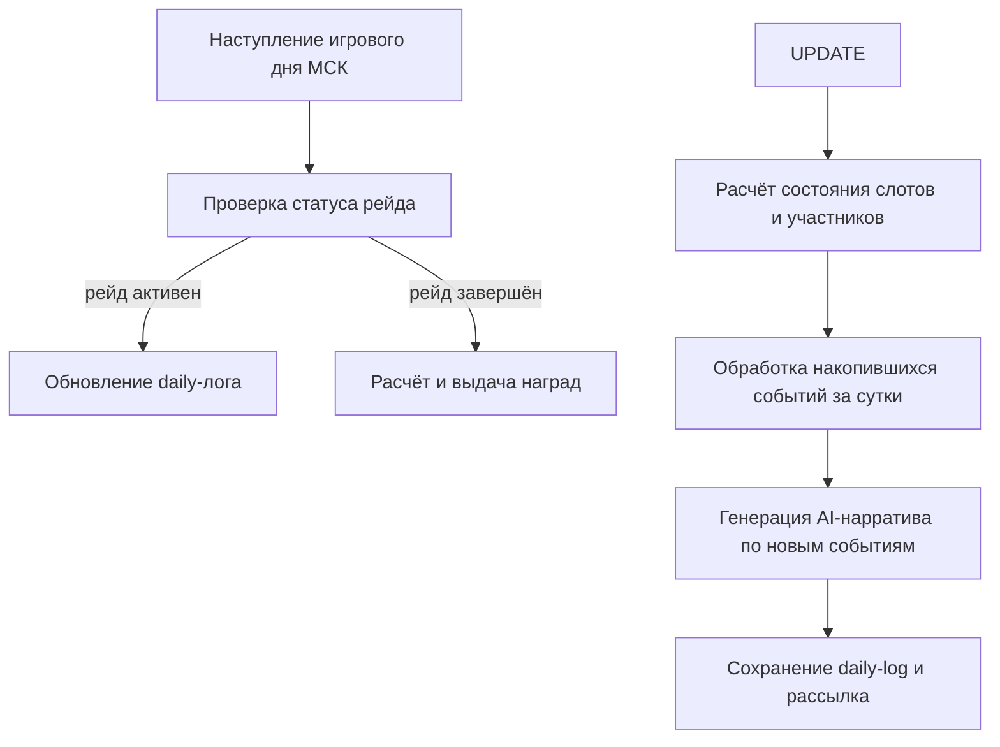

- Тактики — игроки могут предлагать тактический план на день, голосуя за варианты: агрессивный штурм, осторожная разведка, поддержка союзников. Выбранная тактика влияет на эффективность действий в текущей фазе (детали баланса в `COMBAT_FORMULAS`).
- Завершение рейда — при победе гильдия получает уникальную награду (редкие предметы, GXP, специальную косметику). При поражении награда урезана, но часть ресурсов возвращается.

Гильдейская война (Guild War)

Война — структурированное PvP-противостояние двух гильдий, проходящее через заданные фазы.

### 1. Поиск и объявление — лидер выбирает цель через систему поиска. Цель должна соответствовать критериям (уровень гильдии, количество участников — точные лимиты см. в `game_config`).
### 2. Принятие / отклонение — лидер цели получает уведомление и принимает решение.
### 3. Активная фаза — длится фиксированное время. Игроки обеих гильдий вносят вклад через обычную активность в игре (победы в данжах, выполнение квестов, отправка сообщений). Вклад конвертируется в очки войны.
### 4. Завершение и награды — по итогам победившая гильдия получает GXP и уникальный трофей в банк; проигравшая получает утешительный приз.

Часовой бонус — в определённые часы (временные окна МСК) очки войны начисляются с повышенным коэффициентом, стимулируя пики активности.

AI War Narrative — аналогично рейду, сервис генерирует текстовое описание хода войны на основе агрегированных событий. Текст включает упоминания ключевых игроков с обеих сторон, сравнение тактик и драматическую развязку. Каждый нарратив отмечен временной меткой и сохраняется в историю гильдии.

Системные команды и администрирование

Для модерации сообщества предусмотрен концептуальный набор административных команд (реализован через командный интерфейс бота/консоли; детали не раскрываются):

- Принудительный запуск ежедневных/еженедельных квестов вне расписания (для отладки или компенсации).
- Принудительный сброс или завершение активного рейда.
- Очистка и перегенерация AI-нарратива.
- Прямое зачисление/списание GXP на конкретную гильдию.
- Просмотр расширенного лога действий гильдии для расследования жалоб.

Эти команды недоступны обычным игрокам и выполняются операторами через специальный интерфейс.

Общий итог

Гильдия в своей совокупности представляет собой самоподдерживающуюся социальную экосистему: пассивные вехи мотивируют регулярную активность, ежедневные квесты создают ритуал сбора, еженедельные цели и голосование укрепляют внутреннюю коммуникацию, рейды и войны дают пиковую мобилизацию и нарративный контент. GXP и навыки замыкают петлю «активность → ресурс → усиление → более эффективная активность», делая гильдию не просто чатом, а полноценной ячейкой игрового прогресса.

---

## 11. Экономика и социальные системы

Экономика игры строится вокруг золота — основной универсальной валюты, которая связывает боевые активности, торговлю, наём вайфу, азартные игры и социальные взаимодействия. Все ключевые экономические узлы реализованы в Telegram WebApp и должны быть воссозданы в Steam-версии с сохранением оригинального духа, но с адаптацией под новые условия управления и интерфейса.

### 11.1 Золото как универсальная валюта

Золото добывается в GD v1, рейдах гильдий, соло-боях, а также через активность в групповых чатах и выполнение квестов. Тратится в магазине, таверне, на услуги каравана и в азартных играх. Экономический баланс не привязан к разовым инъекциям — все источники интегрированы в основной геймплей. Точные формулы получения и трат описаны в COMBAT_FORMULAS и game_config (не включены в этот документ).

### 11.2 Магазин (`shop.html`)

Центральная торговая площадка с тремя функциональными зонами:

- Покупка — динамический ассортимент, зависящий от текущего акта игрока. Каждый товар имеет цену, описание и иконку.
- Продажа — позволяет сбывать ненужные предметы по сниженной цене. Реализована массовая продажа с анимацией, имитирующей движение монет.
- Азартные игры (gamble) — отдельная вкладка, где игрок рискует золотом ради случайной награды: от крупной суммы золота до редких предметов. Механика опирается на серверный `GambleService` и фиксированные вероятности из game_config.

Каждое взаимодействие с магазином сопровождается репликами AI-торговца. Система с помощью LLM генерирует атмосферные фразы, соответствующие акту и характеру персонажа. При отсутствии LLM-ключа используются запасные шаблоны.

Концептуальные группы API-роутов:
- Получение текущего ассортимента.
- Покупка и продажа.
- Обновление предложений (ограничено по частоте).
- Проведение азартной игры.

### 11.3 Таверна (`tavern.html`)

Социальный и рекрутинговый центр, оформленный в тёплых пергаментных тонах с янтарными акцентами.

- Наём вайфу — ежедневно ограниченное количество слотов (детали в game_config). Каждая претендентка показывает имя, редкость, класс и краткое описание. Наём стоит золота и помещает вайфу в отряд или резерв игрока. Увольнение возможно только для вайфу, не состоящей в активном отряде.
- Трактирщик-рассказчик — AI-хранитель таверны, аналогично торговцу, генерирует уникальные приветствия и реплики через LLM в зависимости от акта и состояния игрока. Это усиливает ощущение живого мира.
- Кастомный BGM — игрок может сменить фоновую музыку в таверне, выбирая из доступных треков; механизм реализован на клиентской стороне.

API-группы Таверны:
- Получение списка доступных вайфу.
- Наём/увольнение.
- Запрос реплик трактирщика (при наличии LLM).

### 11.4 Караван (`caravan.html`)

Караван отвечает за продвижение по актам — основную форму прогрессии контента.

- Смена акта — переход совершается после выполнения условий (победа над боссом GD v1 текущего акта). Новый акт расширяет ассортимент магазина, повышает уровень вайфу в таверне и меняет врагов в подземельях.
- Водитель-повествователь — AI-персонаж, управляющий повозкой, комментирует путешествие и даёт подсказки. Генерирует реплики во время движения.
- Карта актов — визуальная линейная последовательность пройденных и доступных этапов. Точная блокировка и стоимость перехода хранятся в game_config.

API-группы Каравана:
- Информация о текущем акте и условиях перехода.
- Инициация перехода.
- Получение реплик водителя.

### 11.5 Азартные игры

Gamble-механика встроена в магазин, но может рассматриваться как независимая система. Игрок выбирает ставку и запускает случайное событие. Призовой пул включает золото и редкие предметы, а риск потери добавляет азарт. Серверный `GambleService` гарантирует честный случайный исход на основе параметров из game_config — вероятности, коэффициенты и лимиты там строго прописаны.

### 11.6 Награды за активность в групповом чате

Эта система стимулирует общение в общих и супергрупповых чатах с ботом и работает параллельно всем игровым активностям.

- Регистрация сообщений — любое не-командное сообщение обрабатывается хуком `group_message_damage` и передаётся в `try_award_chat_message`. Награды (золото, опыт основной вайфу, предметы) временно буферизируются в кэш.
- Сброс и начисление — каждые 30 секунд буфер сбрасывается в постоянное хранилище. В полночь по московскому времени ежедневный сервис автоматически распределяет накопления и выдаёт сундуки за достижение вех.
- Досрочное получение — игрок может забрать награды до полуночи через кнопку Claim в профиле или специальный API-запрос.
- Ограничения — действуют дневной лимит, кулдаун и фильтр слишком коротких сообщений. При недоступности кэш буфер не заполняется, поэтому инфраструктура должна быть надёжной. Точные лимиты и множители — game_config.

API-группы:
- Статус накопления (кошелёк, текущий день, пожизненные показатели).
- Досрочный claim.

### 11.7 Игровая почта

Система доставки сообщений от мира игры. Используется для выдачи наград, оповещений о событиях и системной коммуникации. В текущей WebApp-реализации почтовый ящик мог быть частью профиля; для Steam-версии необходимо предусмотреть отдельный интерфейс, где игрок забирает клеймы и читает важные уведомления.

### 11.8 Обучение и введение

При первом знакомстве с игрой запускается пошаговый туториал (скрипты `tutorial.js`). Он последовательно проводит игрока по главному меню, магазину, таверне, каравану и подземельям, выделяя ключевые элементы интерфейса. В Steam-версии подсказки должны быть адаптированы под управление мышью/клавиатурой, а их последовательность сохранена в соответствии с прогрессией систем.

### 11.9 Настройки (`settings.html`)

Страница персональных параметров. В текущей версии позволяет менять звуковые предпочтения, язык и, вероятно, сбрасывать определённые данные. Для Steam необходимо добавить регулировки громкости музыки/звуков, возможно, настройки AI-диалогов и графические опции, сохранив общий дух минималистичного интерфейса.

---

## 12. AI-слой и нarrativ

При переносе игры на платформу Steam архитектура взаимодействия с ИИ претерпевает изменения, направленные на повышение производительности, качества генеративного контента и стабильности работы в условиях настольного клиента. Центральным узлом является RouterAI, который обеспечивает унифицированный интерфейс для всех типов текстовых генераций.

12.1. Концепция пресетов и специализация моделей

Работа с ИИ-моделями разделена на три логических пресета, каждый из которых настроен под конкретные задачи системы:

| Функция | ИИ-функция | Пресет | Канал |
| :--- | :--- | :--- | :--- |
| Runtime (Геймплей) | Генерация событий в реальном времени | `fast` | WebApp / Steam UI |
| Content (Баланс/Имена) | Создание контента, легендарных названий | `expert` | Offline / CLI |
| Architect (Инфраструктура) | Проектирование, документация, дизайн | `architect` | CLI / Разработка |

- Fast (`fast`): Оптимизирован для высокой скорости отклика. Используется во всех игровых процессах, где требуется мгновенная реакция: описание таверны, торговые операции, отчеты об экспедициях, взаимодействия в рамках механики GD (General Dungeon) и рейдов.
- Expert (`expert`): Использует механизм `fusion` (параллельный запуск нескольких экспертных моделей с последующим судейством). Применяется для задач, требующих высокой креативной точности: генерации уникальных имен, аффиксов предметов и описаний редких сущностей.
- Architect (`architect`): Сложная система `fusion_roles`, где несколько ролей (архитектор, ведущий разработчик, QA-инженер) анализируют запрос под надзором ИИ-судьи. Применяется для генерации архитектурных решений, анализа кода и обновления проектной документации.

12.2. Runtime-генерация и Dramatiq Offload

Для обеспечения плавности игрового процесса на Steam, тяжелые операции генерации текста, которые не требуют мгновенного отклика (например, развернутые описания экспедиций, прогресс гильдейских войн или масштабные отчеты GD), выносятся за пределы основного цикла обработки запросов.

- Dramatiq Worker: Использование специализированных воркеров позволяет выполнять запросы к LLM асинхронно. Игровой сервер отправляет задачу в очередь, и результат подтягивается интерфейсом по мере готовности, что исключает блокировку основного потока отрисовки Steam-клиента.
- rhythm_rewrite: После первичной генерации текста системой включается обязательный второй проход (`rhythm_rewrite`). Это слой полировки, который адаптирует стиль текста под динамику игрового процесса, обеспечивая единообразие подачи независимо от того, какая базовая модель была использована.

12.3. Форматирование контента: Telegram vs Steam

ИИ-агент адаптирует структуру выходных данных в зависимости от целевой платформы:
### 1. Telegram WebApp: ИИ генерирует текст с использованием HTML-разметки, поддерживаемой Telegram (теги для выделения жирным, курсивом, ссылками).
### 2. Steam (Plain Text): При работе с нативным клиентом Steam, ИИ переключается на генерацию структурированного plain text с использованием кастомных разделителей. HTML-теги подавляются, чтобы обеспечить корректное отображение в игровом UI без артефактов верстки.

12.4. Обработка отказов (Fallback)

Надежность системы обеспечивается многоуровневой стратегией обработки ошибок:
- API Key Validation: При инициализации сессии система проверяет наличие `ROUTERAI_API_KEY`. Если ключ отсутствует или сервис недоступен, активируется режим «безопасного приземления» (fallback).
- Fallback-логика: В случае сбоя API игра переключается на использование предустановленных шаблонов контента (static strings), хранящихся в локальном кэше. Это позволяет избежать полного прерывания геймплея и сохраняет функциональность интерфейса, хотя и с потерей «живого» характера ИИ-генерации.
- Таймауты: Для всех сетевых запросов к ИИ установлены жесткие лимиты ожидания (настраиваются через `timeout_sec`), после которых вызывается процедура повторного запроса или переключение на статический ответ.

12.5. Схема потока AI-генерации (концептуально)

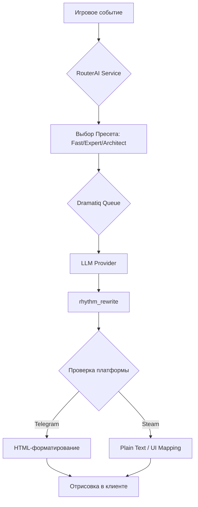

Примечание: детали баланса и конкретные формулы, влияющие на вероятность успеха экспедиций или рейдов, определяются в `game_config` и не являются частью данного ИИ-слоя.

---

## 13. Steam-миграция

Цель переноса Waifu Bot REBORN в Steam — дать игрокам PC-клиент с полноценным клавиатурно-мышиным вводом, real-time обратной связью и экосистемой Steam (авторизация, достижения, оверлей), сохраняя уже работающую игровую логику. Базовый принцип миграции — изоляция транспортного слоя: всё, что относится к механикам (бой, подземелья, экспедиции, гильдии, GD v1, бездна, предметы), остаётся в модулях `core/` и сервисах без изменений, а Telegram-специфичный код (aiogram-хендлеры, WebApp-авторизация, чат-транспорт урона) заменяется новыми PC-интерфейсами. Допускается гибридный режим, при котором единый бэкенд одновременно обслуживает и Telegram-бота, и Steam-клиент.

### 13.1 Фундамент: что остаётся неизменным

- Игровое ядро `core/` и слой сервисов — боевые расчёты, генерация предметов, механики экспедиций, гильдий, GD v1, бездны и LLM-взаимодействий (OpenRouter). Все детали баланса и формул описаны в отдельных документах (`COMBAT_FORMULAS`, `game_config`) и здесь не дублируются.  
- Единый бэкенд FastAPI — уже реализованный слой REST/WebSocket, обслуживающий Telegram Mini App. Он становится точкой входа и для Steam-клиента, без раздвоения кодовой базы.  
- Структуры данных и ORM — модель персонажа, инвентаря, прогресса подземелий и гильдий не требует изменений (конкретные имена таблиц и колонок находятся вне данного брифа).  

### 13.2 Компоненты, подлежащие изоляции или замене

| Компонент | Telegram сейчас | Steam target | Сложность |
|-----------|----------------|--------------|-----------|
| Авторизация | Проверка initData (хэш, ID чата) через aiogram | Проверка Steam-билета через Steamworks Web API / ISteamUserAuth | Средняя |
| Ввод урона | Сообщения в чате / тапы WebApp | Клавиатурно-мышиный трекер (pynput), отправка батчей на бэкенд | Низкая |
| Игровая логика | Модули battle/dungeon/expedition (через aiogram-хендлеры) | Те же модули через FastAPI-роуты (уже реализованы) | Сохраняется |
| Real-time обновления | Периодический поллинг в WebApp или апдейты через Telegram API | WebSocket-подключение из Electron, пуш состояний (HP, энергия, таймеры) | Высокая (частично реализовано) |
| Социальное взаимодействие | Групповые чаты, GD v1 через команды бота | Внутриигровое лобби (UI), интеграция Steam Friends / Steam Chat (опционально) | Высокая |
| Frontend | HTML/JS Mini App (Telegram WebView) | Переиспользованная HTML/JS кодовая база внутри Electron, адаптация под клавиатурные шорткаты и оконный режим | Низкая |
| Команды и навигация | BotFather-команды /dungeon, /expedition и т.д., клавиатуры aiogram | Игровые UI-кнопки, тулбары, окна в Electron | Средняя |
| Экономика и награды | Триггеры чат-активности, ежедневные бонусы через бота | Внутриигровые события (нажатия, фокус окна), локальные таймеры | Средняя |
| Упаковка и доставка | Не применимо | electron-builder + PyInstaller для Python-части, инсталлятор для Steam | Средняя |

### 13.3 Архитектура PC-клиента

Клиент собирается как Electron-приложение со встроенным Python-рантаймом. Electron загружает фронтенд (HTML/JS/CSS) и управляет окнами. Параллельно запускается Python-процесс с FastAPI на локальном хосте. Коммуникация между Electron и Python идёт через WebSocket (real-time события) и HTTP REST (команды).  

Клавиатурный/мышиный трекер реализуется на `pynput` (отдельный Python-тред или процесс). Он фиксирует нажатия (например, последовательности клавиш для атаки) и отправляет агрегированные батчи на FastAPI с заданным интервалом, заменяя чат-ввод урона и тапы WebApp.  

Steam-авторизация встраивается в старт клиента: Electron получает Steam ID и сессионный билет через Steamworks API (или Greenworks/Steamworks.js) и передаёт их на FastAPI, где соответствующий auth-роут проверяет билет по Steam Web API и привязывает персонажа к Steam ID. Зависимость от Telegram initData при этом полностью снимается.

### 13.4 Что теряется и приобретается

- Потеря: Групповая динамика Telegram — урон генерировался сообщениями в общих чатах, GD v1 запускался командой в группе, игра была вписана в живое общение. В Steam-клиенте эта механика заменяется внутриигровым лобби и, возможно, интеграцией Steam-чата. BotFather-команды исчезают — весь UX переносится в экранные интерфейсы (главное меню, панели, кнопки). Снижается виральность: в Telegram бот распространяется через ссылки и каталоги, тогда как Steam требует полноценной публикации и маркетинга.  
- Приобретение: Полноэкранный режим без ограничений WebView, горячие клавиши на способности, минимальные задержки ввода (локальный бэкенд), интеграция со Steam Overlay и системой достижений Steam, единый установщик без необходимости отдельной установки Python или БД.

### 13.5 Поэтапный план миграции

Фаза 0: Аудит и документирование  
- Инвентаризация всех точек входа в aiogram-хендлерах: какие функции из `core/` вызываются, как передаются параметры, где есть побочные эффекты (кеш, кэш, очереди).  
- Фиксация текущей архитектуры в `ARCHITECTURE.md`.  
- Выявление всех Telegram-зависимых участков (авторизация, отправка сообщений, inline-клавиатуры, WebApp-валидация).  
- Результат: карта зависимостей для следующих фаз.

Фаза 1: Изоляция игровой логики  
- Перенос всех хендлеров aiogram из `telegram/handlers/` в абстрактный слой вызовов: каждый обработчик заменяется на чистую Python-функцию с типизированными параметрами, без ссылок на `Message`, `CallbackQuery` и т.п.  
- Telegram-бот остаётся работоспособным: aiogram-хендлеры становятся тонкой обёрткой над вызовами `core/`.  
- Создаются Pydantic-модели запросов/ответов для последующего использования в FastAPI.  
- На этом этапе уже можно проводить миграционные тесты: вызовы через HTTP вместо хендлеров дают идентичный игровой результат.

Фаза 2: FastAPI как основной транспорт  
- Реализация (или дополнение) роутов для battle, dungeon, expedition, guild, GD v1, abyss и т.д. (концептуальные группы, полный перечень не входит в бриф).  
- Интеграция WebSocket-endpoint для real-time: пуш текущего HP, энергии, таймеров GD v1 и экспедиций.  
- Параллельный запуск Telegram-бота и FastAPI на одном экземпляре приложения: бот продолжает принимать Webhook/поллинг, FastAPI обрабатывает запросы от Mini App и будущего Steam-клиента.  
- Аутентификация для Mini App пока остаётся Telegram initData, для Steam добавляется отдельный провайдер.

Фаза 3: Electron-клиент, трекер ввода и Steamworks-интеграция  
- Создание Electron-оболочки, загружающей существующий фронтенд (HTML/JS Mini App).  
- Встраивание Python-рантайма (PyInstaller-сборка FastAPI + core) в ресурсы приложения.  
- Реализация клавиатурно-мышиного трекера на `pynput` с отправкой батчей на localhost FastAPI.  
- Подключение WebSocket в Electron для real-time обновлений HP, энергии и системных сообщений.  
- Интеграция авторизации через Steamworks (проверка билета, привязка Steam ID).  
- Замена Telegram-специфичного UI на полноэкранные игровые меню с сохранением общего JS-кода для WebView.  
- Сборка и упаковка инсталлятора с помощью electron-builder и PyInstaller, настройка деплоя в Steamworks (SteamPipe).

### 13.6 Риски и зависимости

- Совместимость упаковки: PyInstaller должен корректно собрать asyncio-приложение (uvicorn) и все зависимости (`pynput`, `fastapi`, `sqlalchemy` и др.). Ошибки упаковки могут вызывать падения на целевых системах.  
- Потеря социальной виральности: без групповых чатов и встроенной аудитории Telegram удержание игроков может снизиться. Требуется внутриигровой чат и интеграция со Steam Friends.  
- Двойная кодовая база авторизации: при параллельной поддержке Telegram и Steam необходимо чёткое разделение провайдеров, исключающее конфликты учётных записей.  
- Производительность локального Python-сервера: Electron и Python-процесс делят ресурсы на машине игрока; необходим мониторинг потребления памяти и CPU.  
- Зависимость от Steamworks SDK: публикация в Steam требует прохождения ревью, настройки достижений, облачных сохранений, что добавляет организационные и технические издержки.  
- Адаптация GD v1: если в гильдейских событиях присутствуют элементы, завязанные на чат-тайминги, их необходимо синхронизировать через серверное время, а не полагаться на локальные часы.

### 13.7 Диаграмма целевого потока данных

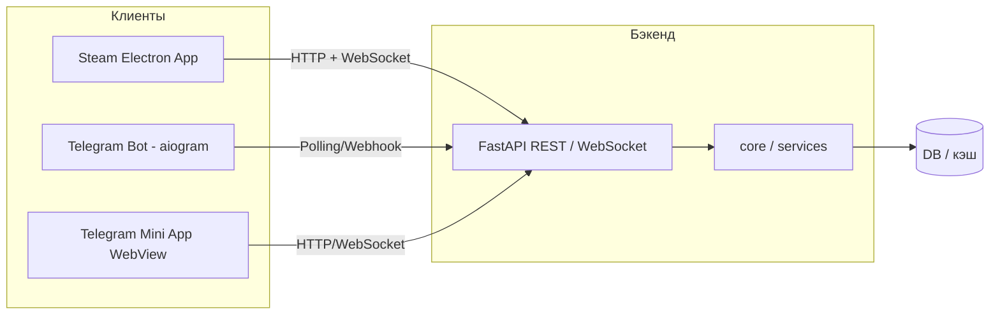

---

## 14. Карта взаимодействий

### 14.1 Соло-атака через Telegram-сообщение

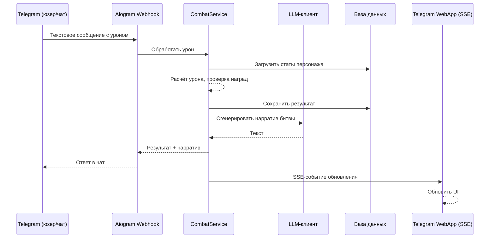

Сообщение с уроном, отправленное в групповой чат или в бот, преобразуется в боевой расчёт. Система применяет формулы, сопоставляемые с `game_config`, генерирует LLM-описание и одновременно отправляет результат через Telegram и SSE-канал WebApp. Это обеспечивает синхронизацию для всех клиентов.

### 14.2 Экспедиция (старт, тики, LLM-повествование, сбор)

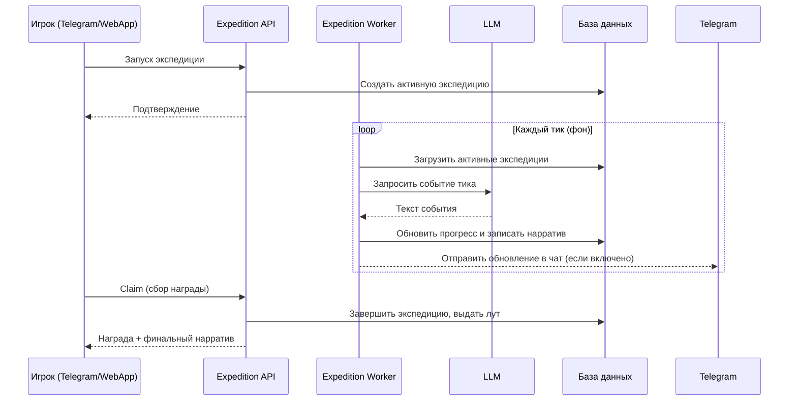

Фоновый воркер с заданным интервалом обновляет состояние всех активных экспедиций, получая нарративные вставки через LLM. Игроки наблюдают ход экспедиции в чате или в WebApp и могут прервать её досрочно или забрать итоговую награду. Детали длительности и наград настраиваются в `game_config`.

### 14.3 Раунд Group Dungeon v1

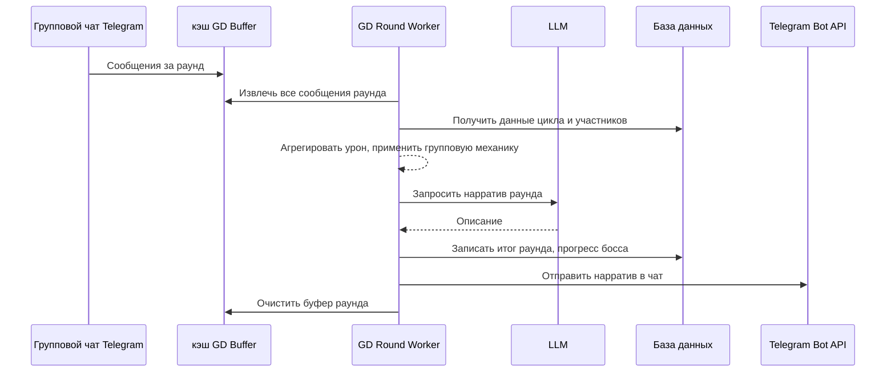

Сообщения, отправленные игроками во время активного окна GD v1, накапливаются в кэш-буфере. Специальный воркер обрабатывает буфер в конце раунда, обсчитывает совокупный урон (формулы см. `COMBAT_FORMULAS`) и формирует LLM-повествование, которое публикуется в групповом чате. Такой поток гарантирует, что ни одно сообщение не потеряется даже при высокой нагрузке.

### 14.4 Ежедневный рейд гильдии

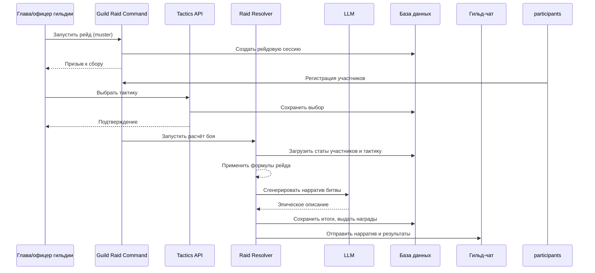

Ежедневный рейд начинается со сбора подтвердивших участие членов гильдии. Глава или офицер выбирает тактику, после чего специальный расчётчик применяет боевые формулы к агрегированным статам. LLM создаёт уникальное повествование, отражающее выбранную стратегию и общий вклад гильдии. Точные коэффициенты синхронизированы с `game_config`.

### 14.5 Покупка в магазине

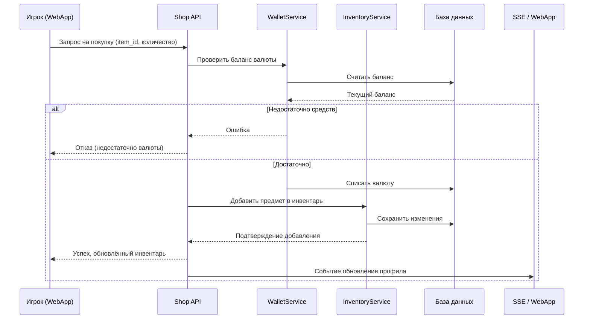

Покупка выполняется атомарно: проверка и списание валюты, выдача предмета и уведомление всех клиентов о новом состоянии инвентаря. Магазин использует те же сервисы кошелька и инвентаря, что и остальная экономика. Конкретные цены и ассортимент определяются конфигурацией магазина, но логика взаимодействия неизменна.

### 14.6 Загрузка профиля (WebApp → API → сервисы)

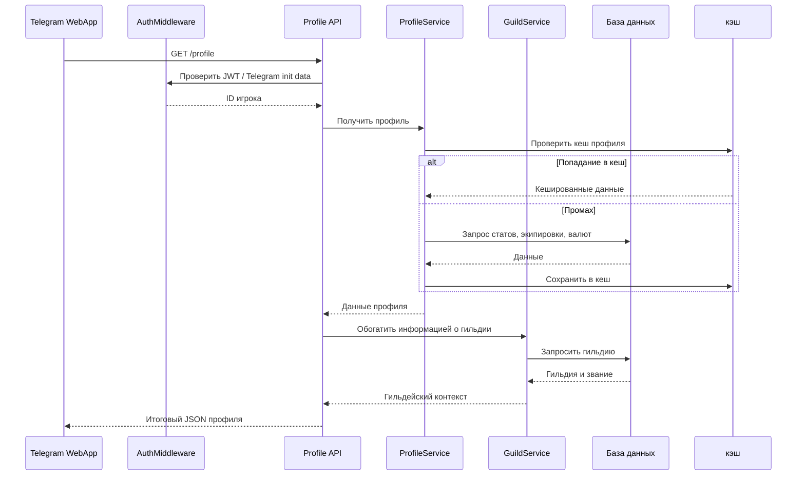

Профиль собирается из нескольких сервисов: основная боевая и экономическая информация кешируется в кэш, данные гильдии подгружаются отдельно. Это позволяет WebApp быстро отрисовать интерфейс, при этом гильдейская принадлежность обновляется реже и не задерживает первичную загрузку. Идентификация игрока ведётся через Telegram WebApp init data или JWT.

### 14.7 Целевая архитектура миграции на Steam

```mermaid
flowchart LR
    subgraph SteamClient [Steam Client / Deck]
        SC[Steam Client]
    end
    subgraph SteamPlatform [Steam Platform]
        Auth[Steam Auth]
        Leader[Steam Leaderboards]
        Stats[Steam Stats/Achievements]
        Cloud[Steam Cloud]
    end
    subgraph Backend [Game Backend (API + Worker)]
        GW[Gateway - FastAPI]
        Core[Core Game Services Python]
        DB[(База данных)]
        Cache[(кэш)]
        LLM[LLM Service]
    end
    subgraph Admin [Operators]
        Armory[Armory SPA]
        Tools[Admin Tools]
    end

    SC -->|HTTP/WS| GW
    GW --> Core
    Core --> DB
    Core --> Cache
    Core --> LLM
    Core <-->|Steamworks SDK| Auth
    Core <-->|API| Leader
    Core <-->|API| Stats
    Core <-->|Save Sync| Cloud
    Armory --> GW
    Tools --> GW
```

При миграции на Steam существующий бэкенд остаётся ядром, но обогащается слоем Steamworks-интеграции. Игровая логика, экономика и LLM-нарративы переиспользуются без изменений. Новый шлюз Steam принимает авторизацию через платформу, а достижения, лидерборды и облачные сохранения подключаются через стандартные API Steam. Это сохраняет Telegram WebApp как дополнительного клиента либо позволяет полностью переключиться на Steam.

---

## Приложение A. Справочник

Справочные материалы для ИИ-агента. При портировании на Steam страницы WebApp адаптируются под нативный UI или встроенный браузер Electron.

### WebApp-страницы (13 файлов)

| Файл | Назначение | Backend (концептуально) |
|------|------------|-------------------------|
| `index.html` | Старт: новая игра / продолжить | profile, auth |
| `waifu_generator.html` | Создание ОВ: раса, класс, портрет, био | profile, LLM bio |
| `profile.html` | Профиль ОВ: статы, инвентарь, экипировка | profile, equipment |
| `dungeons.html` | Подземелья, экспедиции, бездна (вкладки) | dungeon, expedition, abyss |
| `battle.html` | Бой в WebApp (SSE) | combat, sse |
| `shop.html` | Магазин: покупка, продажа, gamble | shop |
| `tavern.html` | Таверна: найм waifus, banter AI, BGM | tavern |
| `caravan.html` | Караван: смена акта, карта, tip AI | player/acts |
| `training_hall.html` | Пассивные навыки | passive_skills |
| `guild_hall.html` | Гильдия: банк, навыки, рейды, войны | guild |
| `mail.html` | Игровая почта | player_mail |
| `settings.html` | Настройки, уведомления | player prefs |
| `player.html` | Публичный профиль другого игрока | profile (read-only) |

**Armory** (`/armory`, Vue SPA) — отдельный браузерный портал статистики, не входит в WebApp.

### Публичные bot-команды

| Команда | Окружение | Назначение |
|---------|-----------|------------|
| `/start` | все чаты | Приветствие, вход в игру |
| `/help` | все чаты | Справка |
| `/gd_join` | группы | Запись в цикл GD v1 |

Legacy `/gd_start`, `/engage` отключены.

### Концептуальные группы API

- **profile** — данные игрока и ОВ
- **equipment** — экипировка, инвентарь
- **battle** — соло-бой, урон, награды
- **expeditions** — слоты, старт, claim, abort
- **guild** — банк, навыки, рейды, войны, квесты
- **shop / tavern / caravan** — экономика и найм
- **abyss** — башня, атаки, лидерборд
- **chat-rewards** — награды за активность в чате
- **armory** — публичная статистика (отдельный клиент)
- **sse** — real-time обновления боя

### Фоновые задачи (ticks)

| Задача | Назначение |
|--------|------------|
| `expedition_tick` | Тики экспедиций, LLM-нарратив |
| `expedition_notify` | DM о завершении экспедиции |
| `gd_v1_round` | Раунды GD, буфер, LLM |
| `guild_tick` | Рейды, войны, muster |
| `guild_war_narrative` | LLM-нарратив войны |
| `chat_rewards_flush` | Сброс буфера наград чата |
| `abyss_daily_reset` / `abyss_weekly_reset` | Сбросы бездны |

### Связанные документы

| Документ | Содержание |
|----------|------------|
| [ARCHITECTURE_AND_INTERACTIONS.md](ARCHITECTURE_AND_INTERACTIONS.md) | Runtime-архитектура |
| [COMBAT_FORMULAS.md](COMBAT_FORMULAS.md) | Боевые формулы (баланс) |
| [technical_spec.md](technical_spec.md) | Техническая спецификация |
