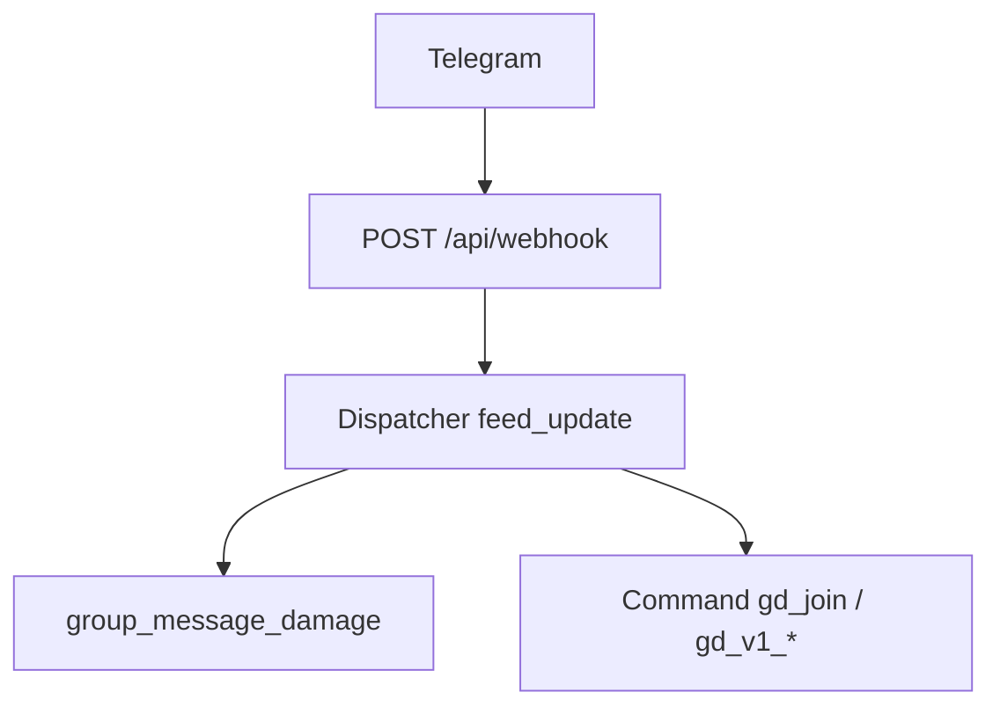

# Диагностика: групповой чат — одиночные подземелья (урон по тексту) и GD v1 (команды)

## Зафиксированные симптомы (эталон для проверки)

1. **Одиночные подземелья.** Подземелье **активно**; механика на стороне игры **работает** (например, смерть монстра через debug-кнопку «убить монстра», награда за прохождение начисляется). При этом **ввод текста в групповом чате с ботом не даёт эффекта** — урон по монстру по сообщению не регистрируется / не виден. Это указывает на разрыв именно цепочки **Telegram (группа) → входящий webhook → обработчик групповых сообщений → `process_message_damage`**, а не на «нет активного подземелья» в БД в целом.

2. **Групповые подземелья (GD v1).** Ожидается ответ в чат при debug-командах (регистрация в поход, тестовый старт и т.д.) — **ничего не возвращается**. Та же общая ветка: либо апдейты команд не доходят до процесса, либо исходящие ответы в группу не доставляются.

3. **Сравнение с экспедициями не использовать** в этом документе как аргумент «сервер жив»: достаточно констатации, что подземелья через веб/API ведут себя ожидаемо; это не заменяет проверку входящих апдейтов из группы.

## Контекст в коде

Цепочка **webhook → диспетчер → хендлеры**: [`src/waifu_bot/api/routes.py`](../src/waifu_bot/api/routes.py) (`POST /api/webhook` → `process_update`) → [`src/waifu_bot/services/webhook.py`](../src/waifu_bot/services/webhook.py) (`_dp.feed_update`). Единый роутер: [`src/waifu_bot/services/bot_handlers.py`](../src/waifu_bot/services/bot_handlers.py).

- **Соло-урон в группе:** `group_message_damage` → при отсутствии активного GD v1 — `CombatService.process_message_damage` ([`combat.py`](../src/waifu_bot/services/combat.py)).
- **GD v1:** отдельные хендлеры команд (`/gd_join`, `gd_v1_test_*`, …) в том же [`bot_handlers.py`](../src/waifu_bot/services/bot_handlers.py).
- **Награды за чат (независимо):** в начале `group_message_damage` вызывается `chat_rewards.try_award_chat_message` — золото/опыт/сундуки копятся параллельно GD, рейду и соло-бою. См. [`docs/CHAT_ACTIVITY_REWARDS.md`](CHAT_ACTIVITY_REWARDS.md).

## Логи сервера (после доработки диагностики)

| Событие | Где | Смысл |
|--------|-----|--------|
| `webhook update received ... cmd_like=True/False` | `routes.py`, каждый message-update | `cmd_like=True` — текст начинается с `/` (команда); в группе сравнивать с обычным текстом (`has_text`, `cmd_like=False`). |
| `group gd_v1 round buffer: ... cycle_id=...` | `bot_handlers.py` | Активен GD v1 в этом чате: сообщение ушло в буфер раунда, **не** в соло-`process_message_damage`. |
| `GD v1 record_round_action: Redis error` | `gd_cycle_service.py` | Ошибка Redis при записи буфера: буфер не обновлён, обработчик группы **не падает** (GXP/активность могут сохраниться). |
| `group guild raid hit` | `bot_handlers.py` | Урон ушёл в активный гильдейский рейд, не в классическое подземелье. |
| `group combat result: error=...` / `group combat hit` | `bot_handlers.py` | Соло-бой по сообщению: ошибка или урон. |
| `telegram.trace outgoing_fail` | при `TELEGRAM_TRACE_LOG=true` | Ответ в Telegram не отправился (права, сеть, прокси). |
| `Telegram bot logged in: @...` | `webhook.py` при старте | Должен совпадать с ботом в группе. |

Подробнее про трассировку: [`info/LOGGING.md`](../info/LOGGING.md), переменная `TELEGRAM_TRACE_LOG`.

---

## 1. Одиночные подземелья: текст в группе не наносит урон (при рабочем веб/debug)

Обработчик: [`group_message_damage`](../src/waifu_bot/services/bot_handlers.py) (фильтр `_group_message_eligible_for_buffer_or_solo_combat`: только `group`/`supergroup`, текст/подпись **не** начинается с `/`, либо медиа без подписи).

**По зафиксированным симптомам:** подземелье активно, монстр и награды через веб/debug ведут себя нормально — значит приоритет не гипотеза «в БД нет активного боя», а **доходит ли групповое сообщение до `process_message_damage`** и что в логах: `group combat hit` vs `group combat result: error=...` vs полное отсутствие этих строк.

### 1A. Telegram: режим приватности — **не приоритет для @shimmi_gacha_bot**

Для Waifu_bot [@shimmi_gacha_bot](https://t.me/shimmi_gacha_bot) зафиксировано: **privacy mode / Group Privacy выключены** ([описание режима](https://core.telegram.org/bots/features#privacy-mode)). Значит отсутствие апдейтов с обычным текстом **нельзя** списать на стандартное поведение privacy для этого бота.

**Если в логах нет `webhook update received` с `has_text=True` на обычный текст**, искать другое: неверный чат/другой бот в группе, webhook/secret, фильтры на стороне прокси, не тот `chat_id` (другая группа), либо редкие типы сообщений (не `message.text` / `caption` — см. фильтр хендлера).

**Справочно для других инстансов / форков:** при **включённом** Group Privacy бот в группе не получает обычные сообщения; тогда симптом «есть `/help`, нет текста» совпадает с privacy — проверка BotFather → Group Privacy → Turn off.

### 1B. Активен цикл GD v1 в этом чате (урон идёт И в ГД, И в соло по умолчанию)

Если для `chat_id` есть цикл со статусом `active`, ветка с [`get_active_v1_cycle`](../src/waifu_bot/services/gd_cycle_service.py) (с Redis-кэшем `gd_v1_active:{chat_id}`) пишет действие в буфер раунда ([`record_round_action`](../src/waifu_bot/services/gd_cycle_service.py)) и **без раннего `break`** выполнение продолжается до [`CombatService.process_message_damage`](../src/waifu_bot/services/combat.py) и [`handle_abyss_attack`](../src/waifu_bot/services/abyss_combat.py), если не сработал гильдейский рейд. В логах могут быть обе строки: **`group gd_v1 round buffer`** и **`group combat hit`** / **`group combat result: error=...`**.

Участник ГД одновременно бьёт босса ГД и свой одиночный данж; не-участники бьют только свои данжи. `process_message_damage` даёт `no_active_battle`, если у игрока нет активного боя.

**Опционально отключить соло+бездну при активном GD** (рейд по-прежнему обрабатывается): в `game_config` ключ **`gd_v1_skip_group_solo_while_active`** = `1` (по умолчанию `0` — поведение как выше). При `1` после буфера GD хендлер выходит до combat/abyss; в логах останется **`group gd_v1 round buffer`**, но не будет **`group combat hit`**.

**Проверка состояния:** таблица `gd_cycles`: `status = 'active'` и `chat_id` = id группы.

### 1C. Нет активного боя у игрока (вторичная гипотеза при описанных симптомах)

[`process_message_damage`](../src/waifu_bot/services/combat.py) возвращает `no_active_battle`, если нет активного run/progress. В группе бот **не отвечает** текстом об уроне — только логирует.

Если в UI/debug подтверждено активное подземелье, а в логах на тот же `player_id` после текста в группе — `no_active_battle`, возможны **рассинхрон сущностей** (другой `player_id` в Telegram vs аккаунт в вебе), **другой пользователь** в чате или редкий кейс БД; если же **нет вообще** строки `group combat result` на сообщение — хендлер не сработал или сессия не дошла до combat (см. 1B, чеклист п. 3).

**Проверка:** логи `group combat result: error=no_active_battle` vs `group combat hit`; сопоставить `from_user.id` из `webhook update received` с `player_id` активного прогресса подземелья в БД.

### 1D. Другие условия боя

Кратко: антиспам, `message_too_short` (минимум символов от оружия), `no_monster`, рейд гильдии (сначала [`apply_raid_message_damage`](../src/waifu_bot/services/guild_raid_service.py) — при активном рейде в фазе боя смотреть лог **`group guild raid hit`**).

---

## 2. Групповые подземелья: debug-команды не возвращают ответ в чат

Симптом: ожидается хотя бы текст регистрации / отказа / ошибки — **тишина**. Это сильнее указывает на **нет входящего апдейта** или **полный провал исходящих сообщений в эту группу**, чем на логику `register_join` (она обычно всё равно пытается ответить).

| Команда | Ограничение по пользователю |
|--------|-----------------------------|
| `/gd_join` | Все пользователи (не бот) |
| `gd_v1_test_*` | Только id из [`GD_V1_MANUAL_TEST_USER_IDS`](../src/waifu_bot/game/constants.py) (сейчас `frozenset({305174198})`) — иначе ответ с текстом отказа |
| `/gd_v1_force_round`, `/gd_v1_battle_status`, `/gd_v1_admin_force_victory` | Те же тестовые id **или** `settings.admin_ids` в конфиге |

### 2A. Апдейт не доходит до хендлера

- Неверный **secret** webhook → 403, тело не обрабатывается ([`verify_webhook_secret`](../src/waifu_bot/api/routes.py)): тогда **ни текст, ни команды** из этой группы не обрабатываются (согласуется и с соло, и с GD).
- Другой инстанс бота: `/gd_join@OtherBot` не попадёт в этот код; в логах при старте — [`log_bot_identity`](../src/waifu_bot/services/webhook.py) (`@username` текущего бота).

### 2B. Хендлер выполнился, но ответ не доставлен в группу

[`_telegram_error_handler`](../src/waifu_bot/services/webhook.py): типичная причина — **нет права отправлять сообщения** в группе. Тогда `message.reply` / `answer` падают; часть команд использует [`_send_response_traced`](../src/waifu_bot/services/bot_handlers.py) — смотреть `outgoing_fail` при `TELEGRAM_TRACE_LOG`.

**Проверка в Telegram:** права бота «Отправка сообщений»; mute; ограничения супергруппы. Если **и** команды молчат, **и** соло-текст «ничего не делает», но в логах видно `group combat hit` — картина другая (урон есть, UI не в группе); при полной тишине в чате на `/gd_join` и `/help` — сначала исходящие и доставка апдейтов.

### 2C. Ожидание vs реальность по тестовым командам

Документ [`BOT_COMMANDS_FOR_BOTFATHER.md`](BOT_COMMANDS_FOR_BOTFATHER.md) описывает актуальное поведение: для чужих user id тестовые команды возвращают текст отказа (не молчат).

### 2D. Порядок хендлеров

Команды `/...` **не** попадают в `group_message_damage` (текст начинается с `/`). Регистрация: сначала `Command("start")`/`("help")`, затем общий групповой хендлер, затем `Command("gd_join")` и остальные — конфликта с «перехватом» текста команд этим хендлером нет.

В группе бот реагирует только на команды вида `/command@username_этого_бота`; bare `/command` игнорируется (без ответа). Неизвестные `/...@бот` обрабатывает [`cmd_group_unknown_slash`](../src/waifu_bot/services/bot_handlers.py) — если до неё дошли и ответ не ушёл, снова смотреть права бота.

---

## 3. Практический чеклист (минимум)

1. **Лог входа (общий для соло-текста и GD):** на каждое сообщение в целевой группе — есть ли `webhook update received` с верным `chat_id` и `chat_type` (`group`/`supergroup`), для текста `has_text=True`, для команд — `cmd_like=True`? Нет строки → проблема до хендлеров (webhook, secret, не тот URL/инстанс, не тот бот в чате). @shimmi_gacha_bot: privacy выключен — отсутствие апдейтов **не** объясняется стандартным Group Privacy.

2. **Идентичность бота:** в группе именно @shimmi_gacha_bot; `log_bot_identity` / `BOT_TOKEN` совпадают с тем, кто добавлен в чат.

3. **Исходящие в ту же группу:** `/start` или `/help` — есть ли ответ? Нет ответа ни на help, ни на `/gd_join` → в первую очередь права бота и исходящий Bot API (прокси `TELEGRAM_API_BASE_URL` / `TELEGRAM_BOT_PROXY`).

4. **Соло (урон по тексту):** при активном подземелье (как в веб/debug) на сообщение игрока в группе — в логах есть ли `group combat hit` или `group combat result: error=...`? Нет ни того ни другого → смотреть `group gd_v1 round buffer`, `group guild raid hit`, или сообщение не дошло (п. 1).

5. **GD v1 и текст:** при `active` текст идёт в буфер раунда (**`group gd_v1 round buffer`**) и **также** в соло/бездну, если `gd_v1_skip_group_solo_while_active` = `0`. Для изолированной проверки только соло — чат без активного GD, флаг skip = `1`, или сброс тестового цикла.

6. **GD (команды):** для `/gd_join` ответ обязан быть почти всегда; для команд `gd_v1_test_*` при чужом user id — текст отказа. Полная тишина → п. 1–3; при своём user id и тишине — смотреть исключения в логах Aiogram.

7. **Трассировка:** `TELEGRAM_TRACE_LOG` — см. [`telegram_trace.py`](../src/waifu_bot/services/telegram_trace.py): `update_begin` / `message detail` / `outgoing_ok` / `outgoing_fail`.

8. **Права на debug-команды:** `from_user.id` в `ADMIN_IDS` или `GD_V1_MANUAL_TEST_USER_IDS` там, где требуется.

---

## 4. Связанные файлы (для отчёта об ошибке)

- Групповые сообщения и команды: [`src/waifu_bot/services/bot_handlers.py`](../src/waifu_bot/services/bot_handlers.py)
- Урон по сообщению: [`src/waifu_bot/services/combat.py`](../src/waifu_bot/services/combat.py) (`process_message_damage`)
- Регистрация/цикл GD: [`src/waifu_bot/services/gd_cycle_service.py`](../src/waifu_bot/services/gd_cycle_service.py)
- Webhook и ошибки Aiogram: [`src/waifu_bot/services/webhook.py`](../src/waifu_bot/services/webhook.py)
- Приём webhook: [`src/waifu_bot/api/routes.py`](../src/waifu_bot/api/routes.py)
