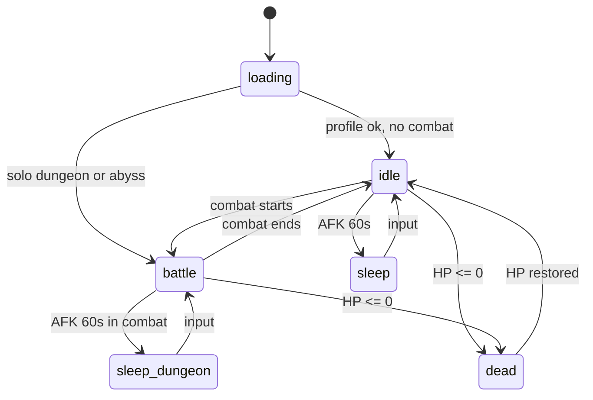

# Overlay animation spec (Steam desktop client)

Companion HUD: `overlay.html` + `pages/overlay.js` + `overlay.css`.  
Self-contained — does not load `app.js` / the webapp bundle.

## State diagram



| Root class | Condition | Portrait | Monster target |
|------------|-----------|----------|----------------|
| `state-loading` | Boot | — | hidden |
| `state-idle` | Active, no combat | `ovSway` + idle actions | hidden |
| `state-battle` | Active + solo or abyss | attack anims | visible (right of waifu) |
| `state-sleep` | AFK ≥60s, no combat | breath + Zzz | hidden |
| `state-sleep-dungeon` | AFK + combat | breath + Zzz | visible, dimmed |
| `state-dead` | HP ≤ 0 | grayscale + halo | per combat |
| `is-lowhp` | HP &lt; 25% (additive) | red pulse | — |

## Combat mode dimension

| Mode | API | Overlay |
|------|-----|---------|
| `none` | No active solo dungeon and no abyss session | Idle only |
| `solo` | `GET /api/dungeons/active` → `active: true` | Monster target + attacks |
| `abyss` | `GET /api/abyss/status` → `session_active` + `current_monster` | Same UI; `data-combat-mode="abyss"` |

Solo takes precedence when both are active (should not happen in normal play).

## Layout

```
.ov-scene
  .ov-stage                    flex row, align bottom
    .ov-portrait-wrap          waifu (left)
      .ov-paperdoll            RO layered doll when cosmetics exist
      #ov-portrait             AI portrait fallback (legacy accounts)
    .ov-monster-target         monster sprite (right, 56×56)
  .ov-monster                  HUD strip: name + HP only (visual hidden when target shown)
```

When `has_paperdoll_layers` is true, the overlay uses the RO compositor + bone runtime
instead of the portrait image. See [OVERLAY_RO_SKELETON.md](OVERLAY_RO_SKELETON.md).

Portrait / paperdoll wrap `data-*` attributes (set from lite profile + combat poll):

- `data-weapon-type` — e.g. `sword`, `unarmed`
- `data-attack-type` — `melee` | `ranged` | `magic`
- `data-combat-mode` — `none` | `solo` | `abyss`
- `data-attack-anim` — runtime key `{mode}-{attackType}-{weaponType}-{variant}`
- `data-idle-action` — `stretch` | `yawn` | `wave` | `read` | `tea`

Lite profile also returns `equipped_visuals` (costume / weapon / offhand sprite paths).
Weapon sprite is shown only while `combatActive()`; idle hides `hand_r`.
Equipped visuals are refreshed about every 12s (and on `visibilitychange`).

## Attack animation matrix

Grouped by **attack_type** (`infer_weapon_attack_type` in `effective_stats.py`):

| attack_type | weapon_type values | Default inference |
|-------------|-------------------|-------------------|
| `melee` | sword, dagger, axe, mace, hammer, unarmed | slot weapon / unarmed |
| `ranged` | bow, crossbow | weapon_type |
| `magic` | staff, wand, orb | weapon_type |

Per `(weapon_type, combat_mode)` recommend **N=2** variants initially (`attack_00`, `attack_01`).

### Asset naming

```
/static/game/overlay/attacks/{attack_type}/{weapon_type}/{solo|abyss}/attack_{00..N-1}.webp
```

Examples:

- `/static/game/overlay/attacks/melee/sword/solo/attack_00.webp`
- `/static/game/overlay/attacks/ranged/bow/abyss/attack_01.webp`
- `/static/game/overlay/attacks/magic/staff/solo/attack_00.webp`

### JS hook

```javascript
function playAttackAnimation() {
  const variant = state.attackVariant % 2;
  const key = `${state.combatMode}-${state.attackType}-${state.weaponType}-${variant}`;
  el.portraitWrap.dataset.attackAnim = key;
  retriggerClass(el.portraitWrap, "attack-play");
  flashMonsterTarget();
}
```

Phase 3 ships **CSS keyframe placeholders** per attack_type until art exists:

| attack_type | Placeholder class | Motion |
|-------------|-------------------|--------|
| `melee` | `.attack-play` + `.lunge` | lunge toward +X (monster) |
| `ranged` | `[data-attack-type="ranged"].attack-play` | slight pull-back, forward snap |
| `magic` | `[data-attack-type="magic"].attack-play` | glow pulse |

## Idle actions (outside combat)

Replace emoji-only idle with five named actions on `state-idle` (every 6–16s, random):

| ID | Name (RU) | `data-idle-action` | Asset (optional) |
|----|-----------|--------------------|------------------|
| `idle_0` | Потянулась | `stretch` | `idle/actions/stretch.webp` |
| `idle_1` | Зевок | `yawn` | `idle/actions/yawn.webp` |
| `idle_2` | Помахала | `wave` | `idle/actions/wave.webp` |
| `idle_3` | Читает | `read` | `idle/actions/read.webp` |
| `idle_4` | Пьёт чай | `tea` | `idle/actions/tea.webp` |

Emoji bubble still shown as fallback label until WebP exists.

## Base / sleep assets

| Slot | Path | Fallback |
|------|------|----------|
| Sleep overlay | `base/sleep.webp` | CSS `ovBreath` |
| Monster placeholder | `placeholder/monster.webp` | Always used for **combat target** (`#ov-monster-target-img`) until overlay-specific monster art exists. HUD strip may still use dungeon art (hidden in battle). |

## API (lite profile)

`GET /api/profile?lite=1` exposes:

| Field | Type | Source |
|-------|------|--------|
| `main_weapon_attack_speed` | int 1–10 | equipped main-hand `attack_speed` |
| `main_weapon_type` | string | equipped `weapon_type` or `unarmed` |
| `main_weapon_attack_type` | string | `melee` \| `ranged` \| `magic` |

Resolved via `resolve_main_weapon_overlay_meta()` in `effective_stats.py`.

## Asset tree (incremental)

```
static/game/overlay/
  placeholder/monster.webp
  base/sleep.webp
  idle/actions/{stretch,yawn,wave,read,tea}.webp
  attacks/{melee|ranged|magic}/{weapon_type}/{solo|abyss}/attack_00.webp
  attacks/.../attack_01.webp
```

## Implementation checklist

- [x] `.ov-stage` horizontal layout; monster target right of portrait
- [x] Lite profile weapon fields
- [x] `combatMode` + abyss poll parallel to dungeon
- [x] `playAttackAnimation()` + CSS placeholders
- [x] Five idle action hooks + scheduler
- [ ] Per-weapon WebP attack clips (art pass)
- [ ] Idle action WebP loops (art pass)
- [ ] Abyss hit batch wiring (same as solo PC spam path)

## Cache bump

After changing `overlay.html` / `overlay.css` / `pages/overlay.js`, bump query string on overlay assets (e.g. `?v=waifu-webapp-v59`).
