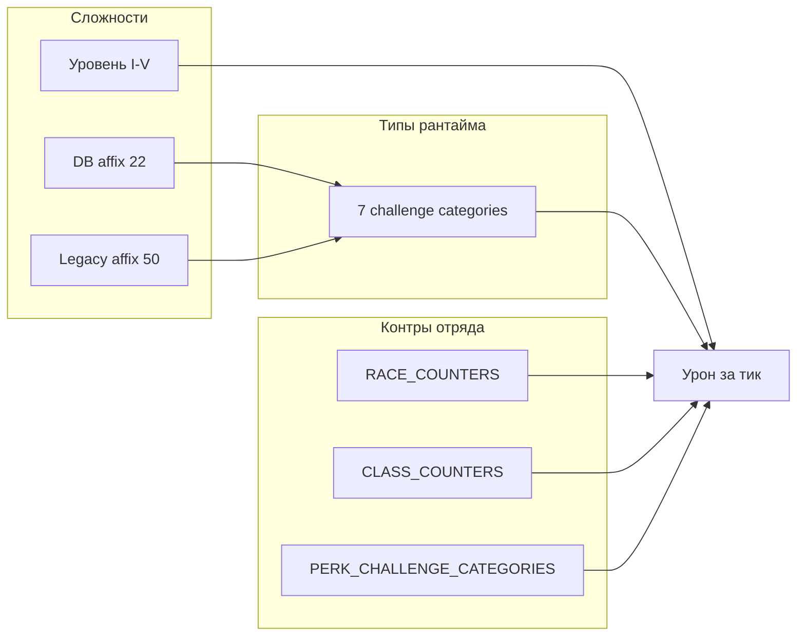

# Анализ системы экспедиций наёмных вайфу

## v2 (2026-06): reward_type + depth_tier + мощь + heal-over-time

С **миграции `0117_expedition_overhaul`** основной цикл экспедиций:

| Параметр | Описание |
|----------|----------|
| **Тип награды** | `gold`, `waifu_exp`, `items`, `enchant`, `merc_exp`, `mixed` — выбор игрока при старте |
| **Тир глубины** | 5 тиров (`DEPTH_TIERS`): события, длительность, множители урона/награды; гейт по **суммарной мощи** отряда |
| **Мощь** | `compute_hired_power(level, rarity)` на `hired_waifus.power`; пересчёт при найме и левелапе |
| **Лечение** | Платное heal-over-time (`heal_started_at`, `heal_complete_at`, `heal_start_hp`); **без бесплатной регенерации** |
| **Лог** | `gate_log` в `tick_state` — пункт на препятствие; итог в claim |
| **Слоты дня** | Убраны из UI/API; лимит — только `EXPEDITION_MAX_CONCURRENT` и здоровье наёмниц |

Код: `game/expedition_overhaul.py`, `services/expedition_v2_start.py`, `services/expedition_rewards.py`, `services/hired_waifu_state.py`.

---

Документ описывает, как в коде устроены сложности, перки, расы и классы наёмниц, и как они взаимодействуют при экспедициях v1.3 (тики каждые 15 мин) и в legacy-схеме (шанс успеха).

**Источники:** `src/waifu_bot/game/expedition_redesign.py`, `expedition_data.py`, `expedition_perk_resolve.py`, `services/expedition.py`, `services/expedition_ticks.py`, миграция `0026_expedition_affixes_and_slot_naming.py`.

---

## 0. Введение и глоссарий

### Три таксономии «типов»

В проекте одновременно существуют **три несовместимых слоя** названий. Их нельзя смешивать без явного маппинга.

| Слой | Ключи | Где задано | Назначение |
|------|-------|-----------|------------|
| **DB category** | `elemental`, `enemy`, `hazard`, `cursed`, `blessed` | Таблица `expedition_affixes` | Категория префикса/суффикса карты дня |
| **Legacy affix category** | `environment`, `creatures`, `location`, `magical`, `psychological` | `expedition_data.AFFIXES` (50 шт.) | Старые слоты; штраф −15% к шансу без контр-перка |
| **Challenge category** | `cursed`, `enemy`, `hazard`, `knowledge`, `magic`, `nature`, `social` | `CHALLENGE_CATEGORIES` | Категория **одного события** за тик v1.3; контры расы/класса/перка |

**Маппинг DB → challenge** (`_db_category_to_challenge_categories`):

| DB category | Challenge categories |
|-------------|---------------------|
| `enemy` | `enemy` |
| `hazard` | `hazard` |
| `cursed` | `cursed` |
| `elemental` | `magic`, `nature` |
| `blessed` | `knowledge`, `social` |

### Три слоя «сложности»

| Слой | Формула / значения | Влияние |
|------|-------------------|---------|
| **Суммарная сложность слота** | `difficulty = 1 + Σ difficulty_add` | Бейдж Лёгкая/Средняя/Тяжёлая; effective level для legacy-шанса |
| **Уровень аффикса I–V** | 6% / 10% / 15% / 20% / 28% HP отряда за событие | Базовый урон тика (`AFFIX_LEVEL_BASE_HP_PCT`) |
| **Категория испытания за тик** | Случайный выбор из 7 challenge | Множители контра расы/класса/перка; веса в `weighted_challenge_category` |

### Восемь игровых типов (дизайн-оверлей)

Для сопоставления с ТЗ («Монстры», «Нежить», «Тёмная магия») в этом документе используется **надстройка** — не реализована в коде:

| Игровой тип | Challenge | Legacy category | Примеры |
|-------------|-----------|-----------------|---------|
| Монстры | `enemy` | `creatures` | гоблины, орки, «с нежитью» (DB) |
| Нежить | `enemy` + `cursed` | `creatures` (`undead`) | «с нежитью», «с призраками», legacy «Нежить» |
| Тёмная магия | `cursed`, `magic` | `magical`, prefix `cursed` | Проклятая, Тёмная, Зачарованный |
| Стихии | `magic`, `nature` | `environment`, `elemental` | Огненная, Затопленная |
| Ловушки | `hazard` | `location` | ловушки, головоломки, Заброшенная |
| Проклятия | `cursed` | `magical`, `psychological` | Проклятый, ментальные атаки |
| Знания | `knowledge` | `location`, `blessed` | Древняя, с сокровищами |
| Социум | `social` | `psychological`, `blessed` | паранойя, депрессия |

### Модель v1.4 (реализовано)

С **v1.4** целевая модель тегов внедрена в [`expedition_difficulty_tags.py`](../src/waifu_bot/game/expedition_difficulty_tags.py):

| Аспект | Поведение |
|--------|-----------|
| Теги на слот | Union `difficulty_tags` по всем DB-аффиксам слота (8 id: `monsters`, `undead`, …) |
| Отключение типа | `tag_mult = Π_{t∈active∩covered}(1 - 1/N)`, N = \|active_tags\| |
| Гибридный урон | `damage = HP × affix_lv% × tag_mult × (1 + tick_adj) × rand`; tick_adj = −10% / 0 / +10% |
| Ангел / Лекарь | Покрывают тег `dark_magic` |
| Перк `priest` | Покрывает `undead`; алиас `monster_slayer` → `monsters` |

Legacy `calc_event_damage` (−8%/−15%/−35%) **не используется в тиках** — только `calc_event_damage_v14`.

Далее: **(A)** слои данных, **(B)** оверлей тегов, **(C)** исторический roadmap (§6 обновлён).



---

## 1. Система сложностей экспедиций

### 1.1. DB-аффиксы (22 записи, карты дня)

Слот собирается из **базовой локации** + до 2 аффиксов (префикс + суффикс). Генератор не ставит два аффикса с одинаковой парой `(type, category)`.

| ID | Название | Тип | DB cat | +diff | ×dmg | ×rew | Challenge | Игровые теги | Канон. paired_perks (выборка) |
|----|----------|-----|--------|-------|------|------|-----------|--------------|-------------------------------|
| 1 | Огненная | prefix | elemental | 1 | 1.2 | 1.1 | magic, nature | Стихии | magic_resistance, mana_shield, exorcist, … |
| 2 | Ледяная | prefix | elemental | 1 | 1.2 | 1.1 | magic, nature | Стихии | frostproof, navigator, wind_walker, … |
| 3 | Ядовитая | prefix | elemental | 1 | 1.2 | 1.1 | magic, nature | Стихии | chemist, gas_filter, mushroom_expert, … |
| 4 | Проклятая | prefix | cursed | 2 | 1.4 | 1.3 | cursed | Тёмная магия, Проклятия | curse_removal, exorcist, strong_spirit, priest |
| 5 | Тёмная | prefix | cursed | 1 | 1.2 | 1.1 | cursed | Тёмная магия, Проклятия | strong_spirit, mental_shield, exorcist, … |
| 6 | Заброшенная | prefix | hazard | 0 | 0.9 | 0.9 | hazard | Ловушки | scout, spider_hunter, archaeologist, … |
| 7 | Древняя | prefix | blessed | 0 | 1.0 | 1.3 | knowledge, social | Знания | archaeologist, photographic_memory, trusting |
| 8 | Туманная | prefix | hazard | 1 | 1.1 | 1.0 | hazard | Ловушки | scout, spider_hunter, navigator, … |
| 9 | Затопленная | prefix | elemental | 2 | 1.3 | 1.2 | magic, nature | Стихии | navigator, desert_walker, swamp_walker, … |
| 10 | Горящая | prefix | elemental | 2 | 1.5 | 1.4 | magic, nature | Стихии | magic_resistance, chemist, … |
| 11 | с гоблинами | suffix | enemy | 1 | 1.2 | 1.1 | enemy | Монстры | goblin_shaker, orc_hunter, elf_slayer |
| 12 | с разбойниками | suffix | enemy | 1 | 1.2 | 1.2 | enemy | Монстры | orc_hunter, troll_slayer, goblin_shaker, … |
| 13 | с пауками | suffix | enemy | 1 | 1.3 | 1.1 | enemy | Монстры | scout, spider_hunter, mushroom_expert, … |
| 14 | со змеями | suffix | enemy | 1 | 1.2 | 1.1 | enemy | Монстры | chemist, gas_filter, mushroom_expert |
| 15 | **с нежитью** | suffix | enemy | 2 | 1.4 | 1.3 | enemy | **Монстры, Нежить** | exorcist, curse_removal, **priest**, mana_shield |
| 16 | с демонами | suffix | enemy | 2 | 1.5 | 1.4 | enemy | Монстры | exorcist, priest, magic_resistance, … |
| 17 | с ловушками | suffix | hazard | 1 | 1.3 | 1.1 | hazard | Ловушки | scout, spider_hunter, mountain_engineer |
| 18 | с огненными реками | suffix | hazard | 2 | 1.4 | 1.3 | hazard | Ловушки, Стихии | magic_resistance, mountain_engineer, … |
| 19 | с призраками | suffix | enemy | 1 | 1.3 | 1.2 | enemy | Монстры, Нежить | priest, exorcist, curse_removal, … |
| 20 | с охраной | suffix | enemy | 2 | 1.4 | 1.3 | enemy | Монстры | scout, mental_clarity, trusting, … |
| 21 | с головоломками | suffix | hazard | 0 | 0.8 | 1.4 | hazard | Ловушки, Знания | photographic_memory, magic_researcher, … |
| 22 | с сокровищами | suffix | blessed | 0 | 1.0 | 1.8 | knowledge, social | Знания | lucky, trusting |

Черновые id в БД (`spirit_ward`, `combat_strike`, …) нормализуются через `DRAFT_EXPEDITION_PERK_TO_CANONICAL` в `expedition_perk_resolve.py`.

**Пример составного слота:** «Тёмная Потерянные Руины с нежитью» → challenge primary: `{cursed}` ∪ `{enemy}`; игровые теги: Тёмная магия, Проклятия, Монстры, Нежить; `difficulty_add` = 1 + 2 = 3 → слот «Средняя» (если base = 1).

### 1.2. Legacy-аффиксы (50 записей)

Используются в старых слотах (`slot.affixes` — строковые id). Каждый даёт **−15% к шансу успеха**, если в отряде нет перка из поля `counter`.

#### environment (10)

| id | Название | Counter perk |
|----|----------|--------------|
| smelly | Вонючий | gas_mask |
| flooded | Затопленный | diver |
| hot | Жаркий | fireproof |
| icy | Ледяной | frostproof |
| foggy | Туманный | navigator |
| stormy | Штормовой | navigator |
| dusty | Пыльный | desert_walker |
| poisonous_air | Ядовитый воздух | gas_filter |
| snowstorm | Снежная буря | snow_warrior |
| acid_rain | Кислотный дождь | acid_proof |

Игровой оверлей: **Стихии** (challenge: hazard, nature, magic).

#### creatures (10)

| id | Название | Counter perk | Оверлей |
|----|----------|--------------|---------|
| evil_elves | Злые эльфы | elf_slayer | Монстры |
| orc_berserkers | Орки-берсеркеры | orc_hunter | Монстры |
| **undead** | **Нежить** | **priest** | **Монстры, Нежить** |
| demons | Демоны | demon_slayer | Монстры, Тёмная магия |
| dragons | Драконы | dragonslayer | Монстры |
| goblins | Гоблины | goblin_shaker | Монстры |
| trolls | Тролли | troll_slayer | Монстры |
| vampires | Вампиры | vampire_hunter | Монстры, Нежить |
| giant_insects | Гигантские насекомые | entomologist | Монстры |
| bats | Летучие мыши | bat_hunter | Монстры |

#### location (10)

| id | Название | Counter perk |
|----|----------|--------------|
| poisonous_mushrooms | Ядовитые грибы | mushroom_expert |
| traps | Ловушки | scout |
| cursed_artifacts | Проклятые артефакты | archaeologist |
| quicksand | Зыбучие пески | desert_walker |
| spiderwebs | Паутина | spider_hunter |
| acid_pools | Кислотные лужи | chemist |
| magical_anomalies | Магические аномалии | magic_researcher |
| ghostly_phenomena | Призрачные явления | exorcist |
| cave_ins | Обвалы | mountain_engineer |
| magnetic_anomalies | Магнитные аномалии | anti_magnet |

Оверлей: **Ловушки** + частично **Тёмная магия** / **Знания**.

#### magical (10)

| id | Название | Counter perk |
|----|----------|--------------|
| cursed | Проклятый | curse_removal |
| enchanted | Зачарованный | anti_mage |
| distorted | Искаженный | spatial_mage |
| blinding | Ослепляющий | light_protection |
| paralyzing | Парализующий | magic_resistance |
| time_slow | Замедление времени | chronomancer |
| time_fast | Ускорение времени | accelerator |
| space_distortion | Искажение пространства | spatial_navigator |
| mana_drain | Магическое истощение | mana_shield |
| luck_curse | Проклятие удачи | lucky |

Оверлей: **Тёмная магия**, **Проклятия**.

#### psychological (10)

| id | Название | Counter perk |
|----|----------|--------------|
| mental_attacks | Ментальные атаки | mental_shield |
| phobias | Навязчивые страхи | strong_spirit |
| hallucinations | Галлюцинации | mental_clarity |
| magic_sleep | Магический сон | sleepless |
| paranoia | Паранойя | trusting |
| amnesia | Амнезия | photographic_memory |
| persecution_complex | Мания преследования | calm |
| depression | Депрессия | optimist |
| aggression | Агрессия | anger_control |
| apathy | Апатия | passionate |

Оверлей: **Социум**, **Проклятия**.

### 1.3. Уровень аффикса I–V

| Уровень | % HP отряда за событие | Римские |
|---------|------------------------|---------|
| I | 6% | I |
| II | 10% | II |
| III | 15% | III |
| IV | 20% | IV |
| V | 28% | V |

Дополнительно при старте: `level_bonus = 1.0 + (affix_level - 1) × 0.06` к золоту/опыту.

### 1.4. Исход экспедиции v1.3 (по HP отряда)

| Доля HP в конце | Исход |
|-----------------|-------|
| &lt; 12% | failure |
| ≥ 52% | success |
| иначе | partial |

Множители награды: success 1.0/1.0, partial 0.7/0.7, failure 0.4/0.5 (gold/exp).

---

## 2. Система перков наёмных вайфу

### 2.1. Три оси классификации

| Ось | Поле / константа | Значения | Роль |
|-----|------------------|----------|------|
| **Affix-counter category** | `ExpeditionPerk.category` | environment, creatures, location, magical, psychological | Группировка; совпадает с legacy-аффиксами |
| **Skill family** | `PERK_SKILL_FAMILIES` | COMBAT, DEFENSE, LUCK, NATURE, STEALTH, MAGIC, SPIRIT, KNOWLEDGE, TRAP, HEALING, TRADE, SOCIAL | Веса при найме по классу (`CLASS_PERK_POOLS`) |
| **Challenge categories** | `PERK_CHALLENGE_CATEGORIES` | подмножество из 7 challenge | Вес тика ×2; снижение урона до −35% |

### 2.2. Группировка по affix-counter category

| Категория | Перков | Skill families (типично) | Challenge-фокус |
|-----------|--------|--------------------------|-------------------|
| environment | 10 | DEFENSE, NATURE, LUCK, COMBAT | hazard, nature, magic |
| creatures | 10 | COMBAT, HEALING, NATURE | enemy, cursed, magic |
| location | 10 | NATURE, STEALTH, KNOWLEDGE, MAGIC, SPIRIT, TRAP | hazard, enemy, knowledge, magic, cursed |
| magical | 10 | MAGIC, SPIRIT, LUCK | magic, cursed, hazard, knowledge |
| psychological | 10 | SOCIAL, SPIRIT, KNOWLEDGE | social, cursed, magic, knowledge |

### 2.3. Полная таблица 50 перков

| id | RU-имя | Affix cat | Skill | Challenge cats | Legacy counters (affix id) |
|----|--------|-----------|-------|----------------|---------------------------|
| gas_mask | Газовая маска | environment | DEFENSE | hazard, nature | smelly, poisonous_air |
| diver | Водолаз | environment | NATURE | hazard | flooded |
| fireproof | Огнестойкий | environment | DEFENSE | hazard, magic | hot |
| frostproof | Морозостойкий | environment | DEFENSE | hazard, nature | icy |
| navigator | Штурман | environment | LUCK | hazard, knowledge | foggy, stormy |
| desert_walker | Пустынник | environment | NATURE | hazard, nature | dusty, quicksand |
| gas_filter | Газовый фильтр | environment | DEFENSE | hazard | poisonous_air |
| snow_warrior | Снежный воин | environment | COMBAT | enemy, nature | snowstorm |
| acid_proof | Кислотостойкий | environment | DEFENSE | hazard | acid_rain |
| wind_walker | Ветроход | environment | NATURE | nature | stormy |
| elf_slayer | Убийца эльфов | creatures | COMBAT | enemy | evil_elves |
| orc_hunter | Охотник на орков | creatures | COMBAT | enemy | orc_berserkers |
| **priest** | **Священник** | creatures | HEALING | **cursed, enemy** | **undead** |
| demon_slayer | Демоноборец | creatures | COMBAT | enemy, magic | demons |
| dragonslayer | Драконоборец | creatures | COMBAT | enemy | dragons |
| goblin_shaker | Гоблинотряс | creatures | COMBAT | enemy | goblins |
| troll_slayer | Троллеубийца | creatures | COMBAT | enemy | trolls |
| vampire_hunter | Охотник на вампиров | creatures | COMBAT | cursed, enemy | vampires |
| entomologist | Энтомолог | creatures | NATURE | enemy, nature | giant_insects |
| bat_hunter | Охотник на летучих мышей | creatures | COMBAT | enemy | bats |
| mushroom_expert | Грибник-знаток | location | NATURE | hazard, nature | poisonous_mushrooms |
| scout | Разведчик | location | STEALTH | hazard | traps |
| archaeologist | Археолог | location | KNOWLEDGE | cursed, hazard, knowledge | cursed_artifacts |
| swamp_walker | Болотный ходок | location | NATURE | hazard, nature | quicksand |
| spider_hunter | Охотник на пауков | location | STEALTH | enemy, hazard | spiderwebs |
| chemist | Химик | location | KNOWLEDGE | hazard, knowledge | acid_pools |
| magic_researcher | Маг-исследователь | location | MAGIC | knowledge, magic | magical_anomalies |
| exorcist | Экзорцист | location | SPIRIT | cursed, magic | ghostly_phenomena |
| mountain_engineer | Горный инженер | location | TRAP | hazard | cave_ins |
| anti_magnet | Анти-магнит | location | MAGIC | hazard, magic | magnetic_anomalies |
| curse_removal | Снятие проклятий | magical | SPIRIT | cursed, magic | cursed |
| anti_mage | Антимаг | magical | MAGIC | magic | enchanted |
| spatial_mage | Пространственный маг | magical | MAGIC | hazard, magic | distorted |
| light_protection | Защита от света | magical | MAGIC | hazard, magic | blinding |
| magic_resistance | Сопротивление магии | magical | MAGIC | magic | paralyzing |
| chronomancer | Хрономант | magical | MAGIC | knowledge, magic | time_slow |
| accelerator | Ускоритель | magical | MAGIC | magic | time_fast |
| spatial_navigator | Пространственный навигатор | magical | MAGIC | hazard, magic | space_distortion |
| mana_shield | Мана-щит | magical | MAGIC | magic | mana_drain |
| lucky | Удачливый | magical | LUCK | knowledge, social | luck_curse |
| mental_shield | Ментальный щит | psychological | SOCIAL | cursed, social | mental_attacks |
| strong_spirit | Стойкий дух | psychological | SPIRIT | cursed, social | phobias |
| mental_clarity | Ясность разума | psychological | SOCIAL | cursed, social | hallucinations |
| sleepless | Бессонный | psychological | SOCIAL | magic, social | magic_sleep |
| trusting | Доверчивый | psychological | SOCIAL | social | paranoia |
| photographic_memory | Фотографическая память | psychological | KNOWLEDGE | knowledge | amnesia |
| calm | Спокойствие | psychological | SOCIAL | social | persecution_complex |
| optimist | Оптимист | psychological | SOCIAL | social | depression |
| anger_control | Контроль гнева | psychological | SOCIAL | social | aggression |
| passionate | Страстный | psychological | SOCIAL | social | apathy |

### 2.4. Генерация перков при найме

- Редкость: Common 1 перк … Epic 3 перка.
- `pick_perk_id_for_class`: веса семейств из `CLASS_PERK_POOLS` по `WaifuClass`.
- Уровень перка: `perk_levels` на `HiredWaifu`, макс. 5 (улучшение в таверне).

| Класс | Веса семейств (сумма 1.0) |
|-------|---------------------------|
| Рыцарь / Воин | COMBAT 0.50, DEFENSE 0.25, LUCK 0.10, other 0.15 |
| Лучник | NATURE 0.40, STEALTH 0.25, COMBAT 0.20, other 0.15 |
| Маг | MAGIC 0.45, SPIRIT 0.25, KNOWLEDGE 0.20, other 0.10 |
| Ассассин | STEALTH 0.40, TRAP 0.25, LUCK 0.20, other 0.15 |
| Лекарь | HEALING 0.45, SPIRIT 0.25, NATURE 0.15, other 0.15 |
| Торговец | TRADE 0.40, SOCIAL 0.30, KNOWLEDGE 0.20, other 0.10 |

---

## 3. Раса и класс наёмной вайфу

Enum: `WaifuRace` 1–7, `WaifuClass` 1–7 (`db/models/waifu.py`).

### 3.1. Расы — матрица контра по challenge

**Эффект:** за каждую наёмницу, чья раса покрывает категорию события: `mult ×= (1 − 0.08)` (стекуется до 3 человек).

| Раса (id) | cursed | enemy | hazard | knowledge | magic | nature | social |
|-----------|:------:|:-----:|:------:|:---------:|:-----:|:------:|:------:|
| 1 Человек | | | | ✓ | | | ✓ |
| 2 Эльф | | | | | ✓ | ✓ | |
| 3 Зверолюд | | ✓ | | | | ✓ | |
| 4 **Ангел** | **✓** | | | | | | |
| 5 Вампир | ✓ | ✓ | | | | | |
| 6 Демон | ✓ | | | | ✓ | | |
| 7 Фея | | | | ✓ | | ✓ | ✓ |

**Оверлей «Тёмная магия»:** частично через `cursed` (Ангел, Вампир, Демон); **не** покрывает `magic` у Эльфа/Демона для стихийных префиксов.

### 3.2. Классы — матрица контра по challenge

**Эффект:** `mult ×= (1 − 0.15)` за каждую подходящую наёмницу.

| Класс (id) | cursed | enemy | hazard | knowledge | magic | nature | social |
|------------|:------:|:-----:|:------:|:---------:|:-----:|:------:|:------:|
| 1 Рыцарь | | ✓ | | | | | |
| 2 Воин | | ✓ | | | | | |
| 3 Лучник | | ✓ | | | | ✓ | |
| 4 Маг | ✓ | | | | ✓ | | |
| 5 Ассассин | | | ✓ | | | | ✓ |
| 6 **Лекарь** | **✓** | | **✓** | | | | |
| 7 Торговец | | | | ✓ | | | ✓ |

**Оверлей:** Лекарь контрит **Проклятия** (`cursed`) и **Ловушки** (`hazard`), не «Тёмная магия» (`magic`) напрямую.

### 3.3. Стакинг контров (пример)

Отряд 3× Ангел-Лекарь, событие `cursed`:

- race_counters = 3 → `0.92³ ≈ 0.779`
- class_counters = 3 → `0.85³ ≈ 0.614`
- Итого без перка: `0.779 × 0.614 ≈ 0.478` (−52% к базовому урону)

---

## 4. Перекрытие перков / расы / класса со сложностями

### 4.1. Формулы (код v1.3)

**Урон за тик:**

```
mult = (1 - 0.08)^race_n × (1 - 0.15)^class_n × (1 - 0.35 × min(1, perk_lv / affix_lv)) × rand(0.85..1.15)
damage = max(1, round(squad_hp_total × AFFIX_LEVEL_BASE_HP_PCT[affix_lv] × mult))
```

**Выбор категории события** (`weighted_challenge_category`):

- Базовый вес каждой из 7 категорий: 100
- ×2 если категория есть у перков отряда (`squad_perk_challenge_categories`)
- ×1.35 если категория в primary set слота (union DB-аффиксов)

**Legacy / превью шанса** (`expedition.py`):

- Перк из `paired_perks` слота или пересечение `PERK_CHALLENGE_CATEGORIES` с challenge union слота: `+10% × (1 + 0.30×(level−1))`, cap 30% на компонент перков
- Legacy affix без counter-перка: −15% каждый
- Слоты с `affix_ids` (DB): штраф к шансу не начисляется — урон в тиках

### 4.2. Сопоставление с примером «Встреча с Нежитью»

| Элемент ТЗ | Аналог в коде | Поведение |
|------------|---------------|-----------|
| Сложность «Встреча с Нежитью» | DB «с нежитью» + legacy `undead` | Разные id; нет composite |
| Тип «Монстры» | challenge `enemy` | Один тег, не −⅓ |
| «Победитель монстров» | `goblin_shaker`, `orc_hunter`, … | Только `enemy`, не глобальный тип |
| «Боец с нежитью» | `priest` | Legacy: снимает −15%; v1.3: `enemy`+`cursed`, до −35% урона |
| Лекарь / Ангел | `cursed` | Не отключают `magic` (стихии/антимагия) |

**Целевая формула отключения типа (не в коде):**

Для сложности с N активными игровыми тегами `{T₁…Tₙ}` и отрядом, покрывающим подмножество S:

```
effective_mult = base_mult × Π_{Tᵢ ∈ S} (1 - 1/N)
```

Пример N=3 (Монстры, Нежить, Тёмная магия), покрыты Монстры + Нежить:

```
effective_mult = base × (1 - 1/3) × (1 - 1/3) = base × 4/9  (≈ −56% к «полной» сложности)
```

В коде при rolled `enemy` и отряде priest lv3 + affix III: только perk-компонент `1 - 0.35 × min(1, 3/3) = 0.65` к mult (ещё race/class/rand).

### 4.3. Числовой пример: «Тёмная … с нежитью», affix III

**Условия:**

- Слот: prefix «Тёмная» (`cursed`) + suffix «с нежитью» (`enemy`)
- Primary challenge: `{cursed, enemy}`
- Affix level III → base 15% HP
- Отряд: 1× Ангел-Лекарь, priest perk level 3, squad_hp_total = 300
- rand = 1.0 (середина)

**Событие `cursed`:**

| Множитель | Значение |
|-----------|----------|
| race (ангел) | ×0.92 |
| class (лекарь) | ×0.85 |
| perk (priest, lv3/III) | ×0.65 |
| **Итого mult** | **0.508** |
| Урон | 300 × 0.15 × 0.508 ≈ **23 HP** |

**Событие `enemy` (без class/race на enemy у Ангела/Лекаря):**

| Множитель | Значение |
|-----------|----------|
| perk only | ×0.65 |
| Урон | 300 × 0.15 × 0.65 ≈ **29 HP** |

**Без контров (голый отряд):** 300 × 0.15 = **45 HP**.

**Веса категорий** (priest → squad cats include cursed, enemy):

| category | weight |
|----------|--------|
| cursed | 100×2×1.35 = 270 |
| enemy | 270 |
| hazard | 100 |
| knowledge | 100 |
| magic | 100 |
| nature | 100 |
| social | 100 |

P(cursed) = P(enemy) ≈ 270 / (270+270+500) ≈ **25.2%** каждая.

---

## 5. Глобальные кросс-таблицы

### Матрица A — Сложности → типы (сводка)

Легенда игровых тегов: М=Монстры, Н=Нежить, Т=Тёмная магия, С=Стихии, Л=Ловушки, П=Проклятия, З=Знания, О=Социум.

| Источник | Примеры | DB/Legacy cat | Challenge | М Н Т С Л П З О |
|----------|---------|---------------|-----------|-----------------|
| DB suffix enemy | гоблины, нежить, демоны | enemy | enemy | М; +Н для нежить/призраки |
| DB prefix cursed | Проклятая, Тёмная | cursed | cursed | Т, П |
| DB prefix elemental | Огненная, … | elemental | magic, nature | С |
| DB suffix hazard | ловушки, головоломки | hazard | hazard | Л; +З для головоломок |
| DB prefix blessed | Древняя | blessed | knowledge, social | З, О |
| Legacy creatures | undead, goblins | creatures | enemy (+cursed) | М; Н для undead/vampires |
| Legacy magical | cursed, enchanted | magical | magic, cursed | Т, П |
| Legacy psychological | paranoia, … | psychological | social, cursed | О, П |

### Матрица B — Контры → challenge (✓ = покрытие)

**Расы** (сила −8%/наёмницу): см. §3.1.

**Классы** (сила −15%/наёмницу): см. §3.2.

**Перки** (сила до −35% при perk_lv ≥ affix_lv): полная таблица в §2.3; наиболее широкие по challenge:

| Перк | cursed | enemy | hazard | knowledge | magic | nature | social |
|------|:------:|:-----:|:------:|:---------:|:-----:|:------:|:------:|
| priest | ✓ | ✓ | | | | | |
| vampire_hunter | ✓ | ✓ | | | | | |
| demon_slayer | | ✓ | | | ✓ | | |
| archaeologist | ✓ | | ✓ | ✓ | | | |
| exorcist | ✓ | | | | ✓ | | |
| curse_removal | ✓ | | | | ✓ | | |
| mental_shield | ✓ | | | | | | ✓ |

### Матрица C — Прямые пары affix ↔ perk (legacy 1:1)

Каждая строка legacy `AFFIXES`: `affix.id` → `affix.counter` (см. §1.2).

Дополнительно DB `paired_perks` (нормализованные) — см. колонку «Канон. paired_perks» в §1.1.

**Ключевые пары для нежити:**

| Affix | Perk (прямой counter) | Challenge overlap |
|-------|----------------------|-------------------|
| undead (legacy) | priest | enemy, cursed |
| DB «с нежитью» | exorcist, curse_removal, priest, mana_shield (paired) | enemy (+ cursed через перки) |
| DB «с призраками» | priest, exorcist, curse_removal, … | enemy, cursed |

### Heatmap: кто закрывает игровые типы

| Игровой тип | Расы | Классы | Типичные перки |
|-------------|------|--------|----------------|
| Монстры | Зверолюд | Рыцарь, Воин, Лучник | goblin_shaker, orc_hunter, priest, … |
| Нежить | Вампир (cursed+enemy) | — | priest, vampire_hunter, exorcist |
| Тёмная магия | Ангел, Демон (частично) | Маг | anti_mage, curse_removal, magic_resistance |
| Стихии | Эльф | Лучник | fireproof, frostproof, magic_researcher |
| Ловушки | — | Ассассин, Лекарь | scout, mountain_engineer |
| Проклятия | Ангел, Вампир, Демон | Маг, Лекарь | strong_spirit, curse_removal |
| Знания | Человек, Фея | Торговец | archaeologist, photographic_memory |
| Социум | Человек, Фея | Ассассин, Торговец | trusting, optimist, mental_shield |

---

## 6. Реализация v1.4 (выполнено)

| Компонент | Файл / миграция |
|-----------|-----------------|
| 8 тегов, маппинги, формулы | `src/waifu_bot/game/expedition_difficulty_tags.py` |
| Урон тика | `calc_event_damage_v14` в `expedition_redesign.py` |
| Тики | `services/expedition_ticks.py` |
| БД | `0066_expedition_difficulty_tags.py` |
| API | `difficulty_tags` на слотах/аффиксах; preview: `active_tags`, `covered_tags`, `tag_effectiveness_pct` |
| UI | `#esm-difficulty-tags`, зачёркивание покрытых типов |
| Тесты | `tests/test_expedition_difficulty_tags.py` |

**Возможные доработки v1.5:** уровень перка влияет на «полноту» покрытия тега; отдельная запись `monster_slayer` в `PERKS` для найма; баланс-кап `tag_mult` снизу.

---

## Приложение: файлы и константы

| Файл | Содержимое |
|------|------------|
| `game/expedition_redesign.py` | CHALLENGE_CATEGORIES, RACE/CLASS_COUNTERS, PERK_CHALLENGE_CATEGORIES, calc_event_damage |
| `game/expedition_data.py` | AFFIXES (50), PERKS (50) |
| `game/expedition_perk_resolve.py` | DRAFT → canonical perk ids |
| `services/expedition_ticks.py` | Цикл тика v1.3 |
| `services/expedition.py` | Слоты, шанс, paired_perks |
| `alembic/versions/0026_*.py` | Seed 22 DB affixes |
| `info/cursor_plan_expedition_redesign.md` | ТЗ v1.3, примеры урона |

*Документ сгенерирован по состоянию кода waifu-bot-REBORN.*
