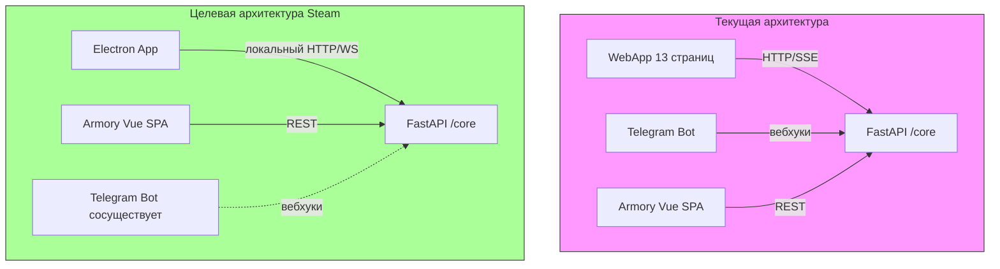

2. Клиенты и каналы взаимодействия

Взаимодействие с игровой вселенной Waifu Bot REBORN обеспечивается тремя основными клиентскими каналами: Telegram WebApp, Telegram Bot и Armory. Каждый обслуживает специфические сценарии игрока и опирается на изолированный от транспорта слой игровой логики. При миграции на Steam стратегия взаимодействия перестраивается так, чтобы сохранить все функции поверх нового клиента, не затрагивая ядро.

2.1 Telegram WebApp — основное игровое окно

WebApp реализован как набор из 13 HTML-страниц, встроенных в интерфейс Telegram Mini App. Игрок перемещается между страницами с помощью навигации в подвале и «Основного чердака» (ОЧ) — верхней панели, служащей хабом для доступа ко всем ключевым механикам. Страницы охватывают:
- бой и подземелья (включая endless-режимы),
- инвентарь, экипировку, крафтинг, зачарование,
- здания и их улучшения,
- экспедиции,
- гильдейские функции,
- групповые события (Global Dungeon, бездна).

Каждая страница взаимодействует с FastAPI backend через HTTP-запросы. Для боевого процесса используется Server-Sent Events (SSE) — real-time канал, по которому сервер пушит состояние боя (логи атак, здоровье, эффекты) без постоянного поллинга. Это позволяет реализовать динамичный пошаговый бой прямо внутри мессенджера.

2.2 Telegram Bot — социальное и уведомительное измерение

Помимо визуального WebApp, бот выполняет роль асинхронного управления и уведомлений в групповых чатах и личных сообщениях:
- Групповые чаты: совместные механики — глобальный урон (Global Dungeon), бездна, награды за активность (chat rewards). Бот публикует сводки о ходе GD, объявляет о появлении мини-боссов, распределяет поощрения за участие в беседе. Социальная среда телеграм-групп становится частью геймплея.
- Личные сообщения: персональные уведомления о завершении экспедиций, изменении статуса GD, важных событиях гильдии и личных квестах. Через ЛС также может приходить информация для модераторов и администраторов.

Вся обработка команд бота происходит через aiogram-диспетчер, который после фильтрации делегирует вызовы в универсальное игровое ядро (`core/`), не содержащее знаний о Telegram.

2.3 Armory — публичная браузерная статистика

Armory — это внешнее одностраничное приложение (Vue SPA), доступное по адресу `https://shimmirpgbot.ru/armory`. Оно выполняет роль «зала славы»: публичные профили игроков, рейтинги (PvE, гильдии, достижения), поиск по нику и сравнение сборок. Авторизация происходит через виджет Telegram Login, поэтому приложение остаётся тесно связанным с учётными записями игроков, но не зависит от WebApp-интерфейса. Armory обращается к отдельной группе API-методов, агрегирующих данные из PostgreSQL и Redis, обслуживая исключительно read-нагрузку.

2.4 Транспортный слой vs игровое ядро

Принципиальная архитектурная идея: Telegram является лишь транспортным уровнем, а вся игровая логика сосредоточена в изолированном модуле `core/`. Это позволяет заменить канал доставки, не переписывая ни одной строчки в механиках боя, лута, экспедиций и т.д.

```
┌──────────────────────────────────────────────┐
│                   Клиенты                     │
│  Telegram WebApp / Bot / Armory / Steam       │
└───────┬──────────────┬──────────────┬─────────┘
        │              │              │
        ▼              ▼              ▼
┌────────────────────────────────────────────────┐
│                API / SSE слои                  │
│  • REST-эндпоинты для игровых действий         │
│  • SSE-канал боя                               │
│  • Аутентификация                              │
└─────────────────────┬──────────────────────────┘
                      │
                      ▼
┌────────────────────────────────────────────────┐
│          core/ — игровая логика                │
│  battle.py dungeon.py loot.py expedition.py    │
│  character.py skills.py openrouter.py          │
└────────────────────────────────────────────────┘
```

В текущей реализации запросы от WebApp и Bot приходят через вебхуки Telegram, обрабатываются FastAPI-роутами и направляются в нужный модуль `core/`. Для Steam транспортным слоем станет локальный HTTP/SSE или WebSocket, поднимаемый Electron-приложением, которое запускает тот же FastAPI-инстанс на `localhost`. Боевой SSE при этом либо сохраняется, либо заменяется на локальный WebSocket — в обоих случаях устраняются ограничения Telegram-инфраструктуры.

2.5 Маршрутизация страниц и миграция на Steam

Ключевой шаг миграции — отображение текущих WebApp-страниц на аналогичные UI-компоненты в Steam-клиенте. Таблица показывает назначение страницы, концептуальную привязку к модулям `core/` и предполагаемую замену.

| WebApp-страница | Назначение | Backend-сервис (core/модуль) | Замена в Steam |
|-----------------|------------|------------------------------|----------------|
| Бой (PvE / подземелья) | Пошаговый бой с монстрами, endless-режимы | `battle.py`, `dungeon.py` | Окно боя в Electron, интерактивный интерфейс, локальный SSE / WebSocket |
| Инвентарь / Экипировка | Управление предметами, экипировка | `character.py`, `loot.py`, `skills.py` | Панель инвентаря, drag-and-drop, локальные REST-запросы |
| Здания | Улучшение построек, бонусы | `character.py` (расширение) | Вкладка «База» или внутриигровое меню |
| Экспедиции | Отправка отряда, получение наград | `expedition.py` | Окно экспедиций, push-уведомления через Steamworks |
| Крафтинг / Зачарование | Создание и улучшение предметов | `loot.py`, `skills.py` | Интерфейс крафта, локальные API-вызовы |
| Гильдии | Гильдейские навыки, доски | `guild.py` (часть core) | Панель гильдии во внутриигровом браузере |
| Global Dungeon / Бездна | Кооперативный урон, рейтинги | `battle.py`, `dungeon.py` | Окно GD, синхронизация через API |
| Чат-события (chat rewards) | Награды за активность в чате | `chat_rewards.py` (адаптируется) | В Steam — интеграция со встроенным Steam Chat или гибридное решение на переходный период |
| Профиль / Статистика | Локальный просмотр статов | `character.py`, агрегация | Внутриигровой профиль; публичная часть вынесена в Armory |

Таким образом, для каждой страницы WebApp будет создан либо отдельный оверлейный виджет в Electron, либо интегрированный экран. Вместо внешнего бота и WebApp игрок взаимодействует с единым приложением, которое напрямую обращается к тем же `core`-сервисам через локальный FastAPI.

Групповые социальные механики (GD, бездна, chat rewards) либо переносятся во внутриигровой чат Steam, либо остаются доступными в Telegram для гибридной аудитории на переходный период. Сам бот продолжает работу параллельно, делегируя все действия тем же API, что и Steam, — это гарантирует синхронизацию состояния игры.

2.6 Архитектурный сдвиг (схема)



В целевой схеме транспортный слой меняется с внешних Telegram вебхуков на локальное взаимодействие, но игровое ядро остаётся тем же. Клиент на Electron загружает UI, аналогичный WebApp-страницам, но исполняет его в собственном веб-окне, обеспечивая более отзывчивое управление и независимость от ограничений Telegram Mini Apps.

2.7 Итоговый контекст для миграции

Все каналы взаимодействия проектируются с расчётом на дальнейшее разделение: транспортный слой (Telegram API → локальный HTTP) заменяется полностью, слой представления (HTML-страницы, SPA) адаптируется под стиль Steam, а игровые сервисы (`core/`) остаются нетронутыми. Детали баланса боевых механик, лута и экспедиций вынесены в отдельные документы (COMBAT_FORMULAS, game_config), не включённые в этот обзор. Архитектура гарантирует, что один и тот же сеанс игрока может одновременно обслуживаться через Telegram и Steam без десинхронизации, а все ключевые сценарии сохранятся при переходе на новую платформу. Все изменения в дизайне интерфейсов должны соответствовать архитектурным ограничениям, изложенным в ARCHITECTURE.md.
