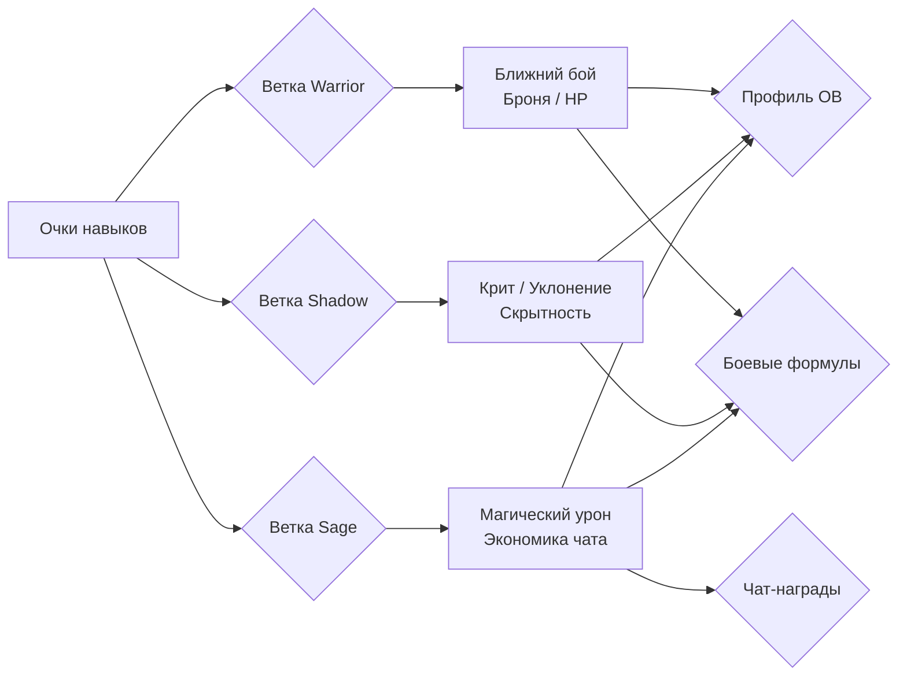

5. Пассивные и скрытые навыки

Система прогрессии персонажа опирается на два взаимодополняющих механизма: открытое пассивное дерево навыков, управляемое игроком, и скрытые навыки, отражающие стиль игры и накопленный опыт. Обе системы предоставляют постоянные бонусы к бою, экономике и взаимодействию с миром, не требуя ручной активации, и synergируют с экипировкой и классом персонажа.

5.1. Пассивное дерево навыков
Пассивное дерево навыков представляет собой структурированную систему развития, разделенную на три тематические ветки: Воин (Warrior), Тень (Shadow) и Мудрец (Sage). Выбор узлов не ограничен классом персонажа, что позволяет создавать гибридные билды. Визуально дерево реализовано как сеть узлов, требующих последовательной разблокировки (родительский узел должен быть изучен).

Типы эффектов и их применение. Бонусы от пассивных узлов делятся на три категории:
   Профильные (статические): Всегда активны и отображаются в карточке персонажа. Включают прирост атаки (ближней, дальней, магической), брони, максимального HP, шанс критического удара, уклонение, снижение входящего урона, а также плоский бонус к основным характеристикам (`main_stats_flat`) и получаемому опыту.
   Боевые (ситуативные): Срабатывают непосредственно в бою. Сюда входят общий процент к урону, бонус к урону активных навыков, шанс нанести гарантированный крит на определённом ударе комбо-атаки, снижение расхода умений, а также специальный множитель для VN-сражений (`media_fight_dmg`).
*   Экономические: Влияют на активность вне боя. Примеры: узел «Болтун» (`sa_chatter`, ветка Sage) увеличивает награду золотом за общение в групповых чатах, а «Теневой собеседник» (`sh_lurker`, ветка Shadow) повышает количество опыта ОВ за ту же активность.

Механика развития и интерфейс. Игрок получает очки пассивных навыков (`skill_points`) при повышении уровня своей Основной Вайфу (ОВ). Количество очков за уровень — фиксированный параметр из `game_config`. Тренировочный зал (`training_hall.html`) служит веб-интерфейсом для осмотра и покупки узлов. Игрок видит стилизованное дерево на тёмном фоне, где каждый узел показывает текущий бонус, стоимость изучения и эффект следующего уровня. Изучение происходит по нажатию на узел. Предусмотрен сброс всей ветки или отдельных узлов с возвратом очков (стоимость сброса регулируется `game_config`), что позволяет адаптировать билд под актуальные вызовы, например, переход от PvE-фарма к PvP. На той же странице вкладка «?» отображает уже открытые скрытые навыки.

5.2. Скрытые навыки (Hidden Skills)
Скрытые навыки — это динамическая система достижений, которые открываются и прокачиваются автоматически при выполнении определённых игровых действий, без затрат очков навыков. Система включает 29 перков, каждый из которых имеет от 1 до 5 уровней с линейно или ступенчато усиливающимся эффектом.

Категории и условия открытия. Скрытые навыки группируются по источнику прогресса:
1.  Активность (7 навыков): Завязаны на частоту взаимодействия (ранние/поздние входы в игру, отправка сообщений, длительность онлайна). Счётчики срабатывают в фоне при совершении событий.
2.  Убийства (8 навыков): Учитывают тип поверженного противника или особые условия (финишеры, убийства одноручным/двуручным оружием, магией, в одиночку). Прогресс фиксируется из логов боя при завершении сражения.
3.  Крафт / Экономика (4 навыка): Открываются за использование мастерской, накопление и трату золота. Могут снижать стоимость крафта или давать бонусы к находимым предметам.
4.  Социальные / Особые (10 навыков): Связаны с гильдийными рейдами, экспедициями, событиями в таверне («Пивной живот»), чтением лора. Некоторые имеют уникальные триггеры, например, бонус к урону первым ударом в час (`first_hit_hour`), использующий Redis-ключ с TTL для предотвращения злоупотреблений.

API и Визуализация. Данные о скрытых навыках доступны через эндпоинт `GET /skills/hidden`. API возвращает текущий прогресс по каждому навыку, список всех эффектов с их значениями, суммарный текстовый бонус и URL иконки. В бою каждый применяемый бонус логируется отдельным полем в `damage_breakdown`.

Связь с классом и экипировкой. Скрытые навыки косвенно тяготеют к определённым классам через требования к стилю игры (воину проще качать убийства в ближнем бою, магу — магические финишеры), но формальных ограничений нет. Ряд навыков требует соблюдения условий экипировки (например, конкретный тип оружия) для активации бонуса. Каждый навык обладает статусом жизненного цикла (от «Активен» до «В разработке»), что позволяет модульно подключать новые механики.

5.3. Связь с экипировкой и классом
Система пассивных навыков не существует в вакууме. При расчете итоговых характеристик (`compute_details`) учитывается аддитивная и мультипликативная связь между:
1.  Базовыми атрибутами (СИЛ, ЛОВ и др.).
2.  Бонусами от надетой экипировки.
3.  Пассивными узлами дерева навыков.
4.  Активными бонусами от скрытых навыков.
Эта связка обеспечивает «мягкую» кастомизацию: если игрок выбирает класс, ориентированный на магию, пассивные навыки «Мудреца» и скрытые бонусы к магическому урону будут синергировать с соответствующей экипировкой, создавая выраженную специализацию персонажа.

5.4. Гильдейские навыки
Помимо индивидуальных навыков, игроки имеют доступ к Гильдейским навыкам (детальное описание см. в §10). Они действуют как глобальные модификаторы для всех участников гильдии, дополняя персональный билд игрока и стимулируя командное взаимодействие. Эти навыки не требуют микро-менеджмента от игрока и лишь накладываются общим пулом поверх персональных бонусов, что делает выбор гильдии важным стратегическим решением.

Примечание: Для глубокого анализа влияния навыков на конкретные механики боя необходимо обратиться к `COMBAT_FORMULAS` и актуальному `game_config`.
