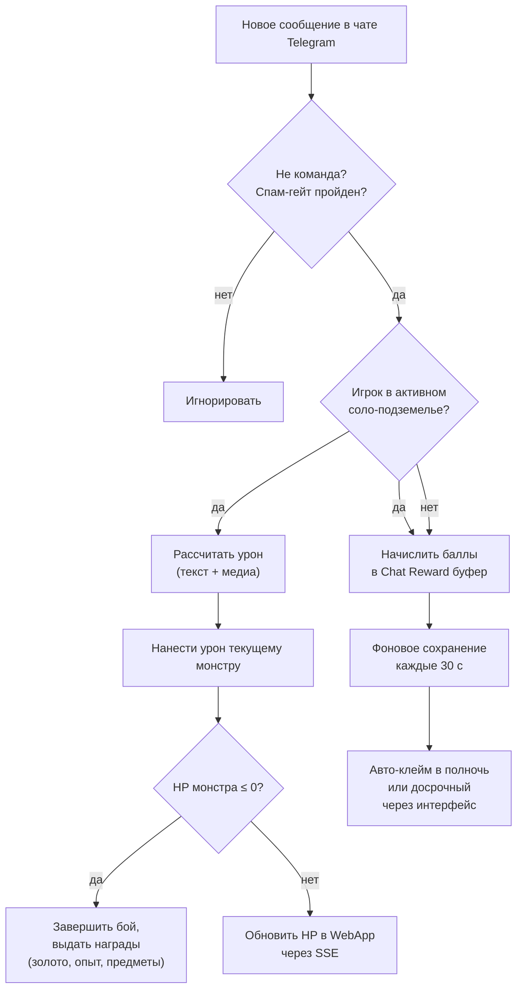

6. Соло-подземелья

Соло-подземелья — это ключевой PvE-режим, рассчитанный на индивидуальное прохождение. Игрок в одиночку сражается с последовательностью монстров, путешествуя по актам и биомам. Механика намеренно допускает два параллельных канала нанесения урона: традиционный для Telegram — сообщения в групповом чате, и интерактивный WebApp-бой с SSE-событиями. Такая архитектура позволяет вовлекать игрока как в текстовое общение, так и в прямое взаимодействие с интерфейсом.

6.1 Мировая прогрессия: акты и биомы

Все подземелья организованы в несколько актов, каждый из которых представляет собой тематическую главу сюжета со своим набором биомов. Биом определяет визуальное окружение, список доступных монстров-шаблонов и общие условия прохождения. Переход между актами обычно требует победы над сюжетным боссом, что гарантирует постепенное усложнение контента.

Продвижение линейно, но вариативность возникает за счёт процедурной компоновки встреч. В рамках одного биома игрок может столкнуться с разными комбинациями обычных, элитных врагов и случайными аффиксами, поэтому повторные забеги не становятся рутиной.

6.2 Запуск подземелья через WebApp

Интерфейс для выбора и старта реализован на странице `dungeons.html`. Игрок видит карту актов, доступные биомы и может регулировать уровень сложности с помощью механики Dungeon Plus («+»). Повышение сложности усиливает монстров, но пропорционально увеличивает награды и шанс выпадения редких предметов. Настройка сложности доступна только до начала забега.

После запуска создаётся активная сессия забега, фиксируется выбранный уровень сложности и формируется цепочка монстров на основе шаблонов текущего пула. Прогресс сохраняется сразу, поэтому прерывание связи или закрытие WebApp не приводит к потере состояния.

6.3 Нанесение урона

Уникальность соло-подземелий — поддержка двух независимых каналов атаки. Они могут использоваться одновременно и не блокируют друг друга, что позволяет игроку комбинировать общение в чате с прямыми действиями в интерфейсе.

6.3.1 Урон из группового чата Telegram

Любое осмысленное сообщение в супергрупповом чате (где бот является участником) может трансформироваться в урон по текущему монстру. Система анализирует текст и вложения:

- базовая величина урона растёт с длиной текста (количеством символов);
- наличие изображений, стикеров или видеосообщений умножает вклад;
- короткие или командные сообщения (например, `/help`) отфильтровываются и не засчитываются.

Действует защита от спама (spam gate): у каждого игрока есть скрытый кулдаун и дневной лимит засчитываемых сообщений. Превышение лимита не даёт урона, но и не наказывает — сообщение просто обрабатывается как обычное.

Урон применяется мгновенно: обновляется текущее здоровье монстра в активной сессии забега. Если здоровье падает до нуля, засчитывается победа, и игрок продвигается к следующему противнику.

6.3.2 Бой в WebApp (SSE‑канал)

Альтернативный путь — встроенный боевой интерфейс `battle.html`, работающий через Server-Sent Events (SSE). Игрок видит анимированную сцену боя с полосами здоровья, таймерами способностей и логами событий. Основные элементы управления:

- ручные атаки (обычный удар, специальные умения);
- автоматический режим для пассивного прохождения;
- визуальное отображение входящих событий от сервера (урон, срабатывание аффиксов, применение способностей монстра).

SSE‑поток в реальном времени сообщает клиенту обо всех изменениях: урон от основной вайфу, ответные атаки врага, эффекты статусов. Такой подход сохраняет единый источник истины на сервере и не требует от клиента постоянного опроса.

Прямой WebApp-бой и чат-урон суммируются — игрок может «добить» монстра текстовым сообщением, даже если в интерфейсе сейчас не активен.

6.4 Монстры: аффиксы, элиты и способности

Каждый монстр генерируется из шаблона, задающего базовые характеристики, а затем обогащается случайными элементами:

- Обычные мобы получают от одного до нескольких аффиксов — свойств-модификаторов, которые изменяют поведение или добавляют пассивные эффекты (например, усиление брони, отражение урона, вампиризм).
- Элитные версии отличаются повышенными параметрами и гарантированным набором особых аффиксов. Элиты встречаются реже, но дают значительно лучшие награды.
- Способности — активные или реактивные умения монстра. Они могут срабатывать по таймеру (например, мощная атака раз в 10 секунд) или при определённых условиях (порог здоровья, критическое попадание игрока). Способности описаны в шаблонах и частично зависят от выбранного уровня сложности.

Таким образом, даже знакомый по предыдущим забегам биом способен преподнести сюрпризы за счёт новой комбинации аффиксов на элитном враге.

6.5 Награды и добыча

После победы над монстром игрок немедленно получает золото и опыт основной вайфу. Дополнительно срабатывает система дропа предметов. Правила выдачи опираются на таблицы дропа, привязанные к шаблону монстра и текущему уровню сложности (Dungeon Plus). Предметы могут включать:

- экипировку (оружие, броня, аксессуары) с различной редкостью;
- расходуемые предметы (зелья, свитки);
- сундуки различных категорий, которые открываются отдельно через инвентарь.

Уровень сложности напрямую влияет на шансы получения редких и эпических предметов, благодаря чему опытные игроки сознательно рискуют, выбирая высокие значения «+».

6.6 Активность в чате как дополнительный доход

Параллельно с соло-подземельем работает система наград за активность в чате (`chat activity rewards`). Даже если игрок не находится в активном забеге, его сообщения приносят баллы, которые накапливаются в специальном Redis-буфере.

- Баллы рассчитываются по аналогичному с чат-уроном принципу: вклад текста и медиа, фильтрация команд и учёт дневного лимита.
- Фоновый процесс каждые 30 секунд сбрасывает буфер в постоянное хранилище.
- В полночь по московскому времени происходит автоматический клейм всех накопленных баллов: игрок получает золото, опыт основной вайфу и, при пересечении определённых вех, сундуки.
- Игрок может забрать награды досрочно через кнопку в профиле, не дожидаясь полуночи.

Эта механика работает независимо от текущего контента: во время рейда гильдии, обычного общения или активного соло-забега. Важно, что сообщения в чате одновременно приносят и мгновенный урон (если активен забег), и баллы активности. Система сама определяет, когда применить прямой урон по монстру, а когда только увеличить счётчик общего прогресса.

6.7 Конкуренция каналов: GD и Solo

В текущей архитектуре GD (Group Dungeon v1) и соло-подземелье являются взаимоисключающими режимами по одной причине: у игрока может быть только одна активная боевая сессия. Если игрок состоит в гильдейском рейде GD, запуск соло-забега потребует выхода из GD, и наоборот. Ограничение продиктовано необходимостью чётко интерпретировать входящий чат-урон: каждое сообщение должно направляться либо в GD-событие, либо в текущего соло-монстра. Двусмысленность исключена, когда активен только один режим.

Однако ничто не мешает игроку чередовать сессии: завершить дневной лимит GD, а затем отправиться в соло-подземелье (или наоборот). Обе механики пользуются общей инфраструктурой накопления chat‑активности, поэтому переключение не обнуляет прогресс буфера.

6.8 Steam-адаптация: трекинг ввода вместо чата

На платформе Steam отсутствует концепция «группового чата с ботом», следовательно механика чат-урона в её текущем виде неработоспособна. Для сохранения сути «активность → боевой вклад» планируется замена на систему отслеживания ввода (input tracker). Основная идея:

- Каждое нажатие клавиш атаки, использование способностей, а также определённый уровень активности мыши (или контроллера) генерируют события урона.
- Эти события, аналогично сообщениям в Telegram, проходят спам-гейт (защита от автокликеров и макросов) и применяются к текущему монстру или пополняют буфер наград.
- Вместо Telegram-хуков используется клиент-серверный WebSocket‑канал: игровой клиент непрерывно сообщает серверу о пользовательском вводе, сервер обрабатывает и возвращает обновлённое состояние боя.

Графическая реализация боя в WebApp (SSE) может быть сохранена в рамках оверлея Steam-клиента или встроена непосредственно в игру как часть интерфейса. Chat-activity rewards преобразуются в «награды за игровую активность», по-прежнему начисляясь фоново и выдаваясь один раз в сутки либо по запросу через игровое меню.

Таким образом, основная механика «игрок генерирует урон через действия вне прямого боя» остаётся, но адаптируется под реалии десктопной платформы без использования внешних мессенджеров.

