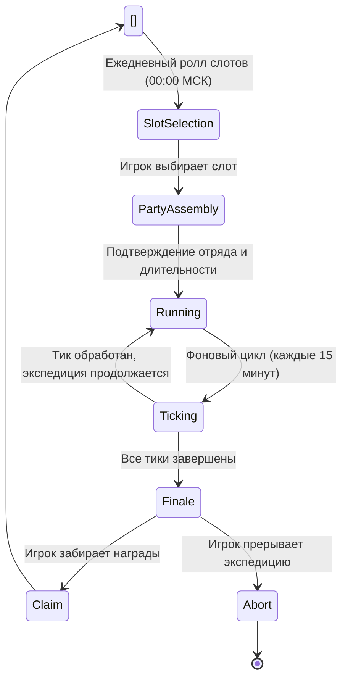

7. Экспедиции

Экспедиции — это асинхронный PvE-режим, в котором игрок отправляет отряд из нескольких наёмниц на задание. В отличие от пошаговых подземелий, экспедиция протекает в фоновом режиме реального времени: после старта игра автоматически генерирует события (тики), наносящие урон и требующие реакции отряда. Финальный исход зависит от синергии класса, расы и перков наёмниц с испытаниями конкретного слота.

Ежедневные слоты  
Каждый игровой день (обновление в 00:00 МСК) игроку становится доступно три слота экспедиций. Слоты обновляются автоматически — старые удаляются, и генерируется новая тройка. Каждый слот представляет собой уникальную карту со своим набором параметров:

- Narrative archetype — стиль повествования ИИ (deranged, cosmic horror, military, gag и др.), определяющий тон брифингов и описаний событий.  
- Biome / Setting — биом слота (пещера, руины, болото, храм, пустыня, крепость, город и т.д.), к которому привязаны визуальные эмодзи и генерация иллюстраций.  
- Affixes (префикс/суффикс) — пара модификаторов, каждый из которых принадлежит к одной из DB-категорий (`elemental`, `enemy`, `hazard`, `cursed`, `blessed`). Аффиксы имеют уровень (I–V) и определяют, какие категории испытаний будут доминировать.  
- Affix tags — система тегов на аффиксах для предварительного просмотра сложности: слот получает `active_tags` (ключевые угрозы), а наёмницы своими пассивными свойствами могут `covered_tags` перекрывать, снижая эффективную опасность.

Сложность слота  
Каждый слот получает расчётный параметр сложности, который визуализируется через звёзды или цветовую индикацию. На сложность влияют:

1. Уровни аффиксов — чем выше уровень (I → V), тем больше базовый процент урона, наносимый отряду при каждом событии.  
2. Active tags слота — набор тегов угроз, которым отряд должен противостоять.  
3. Рейтинг отряда — агрегированный показатель силы выбранных наёмниц, который сравнивается с требованиями слота для предпросчёта шанса на успех.

Детали балансировки см. в COMBAT_FORMULAS, не включённых в этот документ.

Выбор отряда  
Игрок выбирает отряд из числа нанятых вайфу. Каждая наёмница привносит в экспедицию:

- Расовые контр-способности — раса даёт бонус (снижение получаемого урона) против определённых категорий испытаний. Например, одни расы эффективны против `enemy` и `hazard`, другие — против `magic` и `knowledge`, третьи — против `nature` и `social` (точные маппинги рас см. в game_config).  
- Классовые контр-способности — класс аналогично даёт бонус против своего набора категорий. Расовый и классовый бонусы суммируются, создавая перекрытие.  
- Перки — наёмница может иметь экспедиционные перки, дающие прямой контр против конкретных категорий испытаний либо специальные эффекты (снижение урона от всех источников, иммунитет к критическим провалам и т.д.).  
- Система coverage — интерфейс показывает `covered_tags` (перекрытые теги) и `tag_effectiveness_pct` — насколько эффективно отряд в целом закрывает угрозы слота. Перекрытые теги визуально зачёркиваются.

Перед стартом игрок видит сводку по отряду, активные/перекрытые теги и прогнозируемый уровень опасности.

Длительность и количество событий  
Экспедиции имеют фиксированную длительность, выбираемую игроком перед стартом (несколько вариантов в минутах). Количество событий (тиков) прямо пропорционально длительности: чем дольше экспедиция, тем больше тиков, и, следовательно, выше суммарный урон и потенциальные награды.

Жизненный цикл экспедиции  
Жизненный цикл состоит из фаз: ежедневный ролл слотов, сбор отряда, фоновое выполнение с периодическими тиками и финализация.

Фоновые тики  
После старта экспедиция переходит в пассивный фоновый режим. Сервер обрабатывает тики каждые 15 минут реального времени. Каждый тик включает:

1. Выбор события — из пула возможных событий выбирается одно, релевантное категориям аффиксов слота.  
2. Расчёт урона — на основе категории события определяется, кто из отряда подвергается опасности. Итоговый урон вычисляется с учётом:
   - базового процента от HP отряда для уровня аффикса,
   - расовых и классовых контр-бонусов попавших под удар наёмниц,
   - перков, релевантных категории события,
   - модификаторов `covered_tags` (перекрытые теги дают частичный или полный иммунитет).  
3. Применение урона — HP наёмниц снижается. Если HP какой-либо наёмницы достигает нуля, она выбывает из экспедиции (не погибает навсегда, но перестаёт участвовать в оставшихся тиках и не учитывается в финале).  
4. Генерация нарратива — ИИ создаёт короткое описание события в стиле, заданном narrative archetype слота. Текст отображается в интерфейсе экспедиции.  
5. Уведомление игрока — сообщение содержит описание события, пострадавших, потерянные HP и текущее состояние отряда.

Финал и клейм  
Когда все тики обработаны, экспедиция переходит в статус финализированной. Игрок получает уведомление и может:

- Claim (забрать награды) — если хотя бы одна наёмница осталась с HP > 0, игрок получает награды, сгенерированные на основе слота, сложности и выживаемости отряда. Награды масштабируются пассивными бонусами наёмниц (например, перк «увеличение наград экспедиций»). После клейма слот освобождается.  
- Abort (прервать) — возможно досрочное прерывание в любой момент. При прерывании награды не выдаются, но наёмницы возвращаются с текущим уровнем HP (не погибают). Слот не возвращается, но не блокирует новый день.

Если финализированная экспедиция не забрана до сброса слотов (00:00 МСК), срабатывает авто-клейм: все незабранные экспедиции принудительно завершаются с выдачей наград.

AI-нарратив и иллюстрации  
Все текстовые описания генерируются ИИ:

- Start brief — при старте игрок видит развёрнутый брифинг: описание слота, условий, аффиксов и ощущение предстоящей миссии в выбранном narrative style.  
- Tick narratives — каждое событие тика получает короткое (2–4 предложения) описание: что произошло, как отреагировали наёмницы, какой урон получен. Стилистика варьируется от grotesque до military в зависимости от архетипа слота.  
- Finale event — финальное описание исхода: чем завершилась вылазка, какие трофеи добыты, какой ценой.

Дополнительно может генерироваться изображение (через OpenRouter) для брифинга или финала, визуализирующее сцену в стилистике биома слота. Изображения сохраняются и показываются в интерфейсе.

Лимиты и UI  
- Дневной лимит: ровно 3 слота в день, без возможности расширения за донат или другие механики.  
- Интерфейс: вкладка экспедиций расположена в `dungeons.html` как подраздел или параллельная вкладка. Для каждого слота карточка содержит:
  - эмодзи биома,
  - название нарративного архетипа,
  - сложность (звёзды/цвет),
  - активные теги с визуализацией перекрытия,
  - кнопки «Собрать отряд» / «Продолжить» / «Забрать».  
- История: игрок видит список активных и завершённых экспедиций за текущий день.
