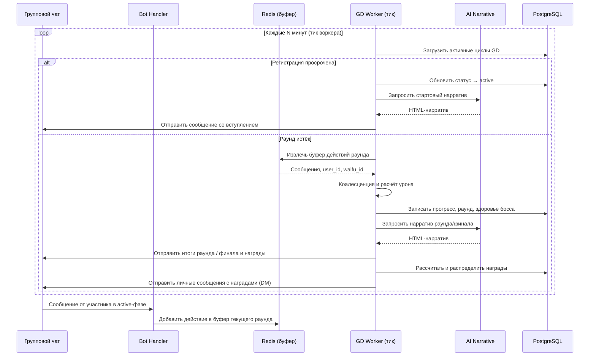

8. Групповые подземелья GD v1

GD v1 — переработанная система еженедельных групповых рейдов, работающая по фиксированному временному циклу. Она заменяет устаревшие сценарии и реализует асинхронную модель: вклад участников определяется их естественной активностью в чате, а не прямыми командами атаки.

8.1. Архитектура цикла
Цикл состоит из трёх фаз:
- Registration (Регистрация): игроки присоединяются командой `/gd_join` в групповом чате. Запись закрывается по дедлайну, после чего состав участников фиксируется.
- Active Rounds (Активные раунды): основная фаза, разбитая на фиксированные временные интервалы (стандартная длительность раунда — около 15 минут, точные значения в `game_config`). Внутри раунда сообщения участников накапливаются в Redis.
- Finale (Финал): наступает при победе над боссом или после завершения всех раундов. Проводится расчёт вклада, распределение наград и генерация эпилога.

Фазы сменяются автоматически под управлением фонового воркера; вмешательство администратора требуется только для экстренного сброса или отладки.

8.2. Цикл раунда (взаимодействие компонентов)

Воркер циклично проверяет необходимость смены фазы или завершения раунда. Все временные параметры и пороги задаются в `game_config`.

8.3. Механика действия и коалесценция
- Пассивное участие: любой текст, отправленный зарегистрированным участником в групповой чат во время активной фазы, считается атакующим действием. Специальные префиксы или форматы не требуются.
- Буферизация: сообщения накапливаются в Redis с привязкой к `user_id` и `waifu_id`.
- Коалесценция: при завершении раунда воркер группирует сообщения по игрокам, объединяя фрагментированный ввод и рассчитывая совокупный вклад. Это сглаживает разницу между многословными и лаконичными участниками. Конкретные коэффициенты и минимальные пороги описаны в `COMBAT_FORMULAS` и `game_config`.
- Урон и стилистика: каждое действие преобразуется в урон по боссу. Тип атаки может варьироваться в зависимости от класса вайфу (см. `COMBAT_FORMULAS`) — это добавляет разнообразие в нарратив, не требуя от игрока выбора умений.

8.4. AI-нарратив
Для создания атмосферы используется генеративный ИИ (при наличии конфигурации LLM, например, через OpenRouter). Предусмотрены три типа запросов:
1. Стартовый нарратив — описание подземелья, босса и завязка сюжета. Отправляется при переходе в фазу `active`.
2. Нарратив раунда — итоги прошедшего отрезка: состояние босса, реакция окружения, результаты действий. В промпт передаются обезличенные сводки (топ по активности, суммарный урон, оставшееся здоровье).
3. Финальный эпилог — подведение итогов, выделение MVP и наименее активного участника, эпическая концовка.

Все сообщения используют Telegram HTML-разметку (жирный, курсив и пр.). Тон повествования — приключенческий с элементами гротескного юмора. При недоступности LLM подставляются жёстко заданные русскоязычные заглушки, чтобы цикл не прерывался.

8.5. Взаимодействие с другими режимами
- Гильдейские рейды: имеют более высокий приоритет. Если персонаж уже участвует в гильдейском рейде, он не может быть зарегистрирован в GD v1. Попытка входа вернёт сообщение об ошибке.
- Соло-подземелья: полностью совместимы с GD v1. Игрок может одновременно иметь активный одиночный поход и участвовать в групповом рейде. Это два независимых пути прогрессии, не влияющие на лимиты друг друга.

Таким образом, GD v1 — еженедельный дополнительный контент, не исключающий обычные одиночные вылазки, но конфликтующий с внутренними рейдами гильдии.

8.6. Команды и права
Пользовательские команды:
- `/gd_join` — запись в текущий цикл GD v1. Отправляется в групповом чате. Повторная отправка безопасна: дублирования регистрации не происходит. Если цикл уже находится в фазе `active` или `finale`, бот уведомит о невозможности присоединиться.

Служебные и отладочные команды (доступны только администраторам или пользователям из списка `GD_V1_MANUAL_TEST_USER_IDS`):
- `/gd_v1_test_join` — имитация массовой регистрации.
- `/gd_v1_test_start` — принудительный немедленный старт цикла, игнорирующий таймеры и дедлайны.
- `/gd_v1_test_reset` — полный сброс цикла: очистка всех регистраций и буферов в Redis.
- `/gd_v1_force_round` — досрочное завершение текущего раунда.
- `/gd_v1_battle_status` — диагностика: вывод текущей фазы, списка участников, очков вклада и здоровья босса.
- `/gd_v1_admin_force_victory` — мгновенное объявление победы и завершение цикла с выдачей всех наград.

При расследовании нештатных ситуаций (например, отсутствие реакции бота на сообщения) следует обращаться к журналу трассировки `TELEGRAM_TRACE_LOG`, в котором фиксируется полный путь сообщения от вебхука до обработчика `process_message_damage`.

8.7. WebApp и статус GD
Мини-приложение WebApp выполняет роль информационной панели игрока. Если пользователь зарегистрирован в активном цикле GD v1, через WebApp он может:
- видеть текущий статус цикла (регистрация, активная фаза, завершён);
- просматривать данные своего вайфу, участвующего в рейде;
- отслеживать свою позицию в рейтинговой таблице и текущие очки вклада.

WebApp не подменяет собой управление рейдом — для регистрации по-прежнему используется только команда `/gd_join` в групповом чате. Задача мини-приложения — дать возможность быстро проверить состояние своего группового похода, не листая историю чата.
