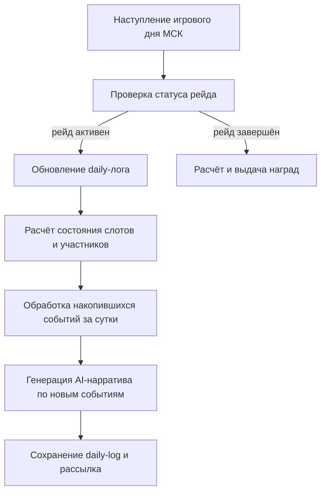

10. Гильдия

Гильдия — это коллективный социальный слой игры, связывающий игроков в постоянную группу для совместного развития, выполнения заданий и противостояния другим гильдиям. Доступ ко всем ключевым механикам осуществляется через интерфейс Гильдейского холла (`guild_hall.html`), куда игрок попадает из навигационной панели по иконке `🏛️`. В клиенте Steam данный интерфейс встроен в десктопное окружение, предоставляя полноценный интерактивный хаб.

Создание, вступление и роли

Игрок может создать гильдию с уникальным тегом или подать заявку в существующую. Роли в гильдии трёхуровневые:

- Лидер — обладает всеми полномочиями: начинать войны и рейды, назначать офицеров, тратить ресурсы банка на прокачку умений.
- Офицер — может приглашать/исключать рядовых участников, запускать голосование по еженедельным целям и выполнять оперативное управление в отсутствие лидера.
- Участник — вносит вклад во все коллективные активности, зарабатывая личную репутацию внутри гильдии.

Передача лидерства возможна только добровольно действующим лидером.

Гильдейский холл (Guild Hall)

Гильдейский холл — центральный узел всей гильдейской активности. Он реализован как одностраничное приложение (SPA) с переключением вкладок и динамическим обновлением данных. В холле отображаются:

- список участников с ролями и статусом (онлайн/офлайн);
- текущие гильдейские квесты (ежедневные, еженедельные и вехи);
- информация о банке гильдии и гильдейских навыках;
- активный рейд или война с кнопками участия;
- летопись последних событий (AI-нарративы по рейдам и войнам).

Для новых игроков предусмотрен встроенный туториал, объясняющий базовую навигацию и механику гильдий.

Банк гильдии и GXP

Каждая гильдия владеет общим банком, куда поступают коллективные ресурсы. Основная валюта гильдейского прогресса — Guild XP (GXP). GXP начисляется за:

- выполнение ежедневных и еженедельных гильдейских квестов всеми участниками;
- завершение вех (milestones);
- успешные фазы в гильдейских войнах;
- рейдовые операции.

GXP является общим ресурсом гильдии и не привязан к конкретному игроку. Участники могут делать личные взносы ресурсов в банк, что также конвертируется в GXP по внутренним правилам. Логирование вкладов позволяет лидерам отслеживать активность каждого участника. (Детали баланса и формулы конвертации определены в `game_config` и `COMBAT_FORMULAS`, не включённых в этот документ.)

Гильдейские навыки (Guild Skills)

GXP расходуется на прокачку специализированных умений гильдии. Навыки активируются для всех участников одновременно и усиливают типовые игровые взаимодействия: повышают эффективность экспедиций, улучшают качество предметов в караване, увеличивают шанс встреч в таверне и т.п.

Прокачка нелинейна — каждый следующий уровень требует больше ресурса, чем предыдущий. Решение о том, какой навык повышать, принимает лидер или офицер, ориентируясь на консенсус гильдии и её стратегические приоритеты. Механика стимулирует коллективное обсуждение: «качаем караван — всем больше золота, качаем таверну — быстрее отношения с вайфу».

Гильдейские квесты

Система квестов имеет три слоя, каждый со своей периодичностью и функцией (точные формулы начисления GXP и лимиты см. в `game_config`):

- Вехи (Milestones) — не сбрасываются никогда. Каждая веха состоит из 3–5 тиров с нарастающими целями, например «стикер-марафон», «битвы в данже», «голос гильдии». Прогресс накапливается пассивно по мере активности участников: отправка стикера в чат гильдии, завершение данжа, запись голосового сообщения — всё засчитывается. После завершения тира гильдия получает крупную порцию GXP и открывает следующий. Это «вечный двигатель» гильдейского прогресса.
- Ежедневные квесты — 3–4 задания, сбрасываются в 00:00 МСК. Дают умеренный GXP и начисляют личный бонус участнику (например, процент к опыту на день). Основная цель — создать точку ежедневного сбора и минимальную кооперацию: «победи N монстров в данже», «используй общий склад», «помоги другому участнику».
- Еженедельные квесты — 2–3 задачи на неделю, сброс и выдача происходят синхронно с игровыми циклами. Лидер или офицер выбирает одну цель из трёх предложенных системой с помощью голосования, что порождает внутригильдийную дискуссию и чувство собственного выбора. Еженедельный квест даёт значительный GXP и уникальную награду (редкий предмет в банк гильдии или временный глобальный баф).

Рейд гильдии v2 (Guild Raid)

Рейд — ключевое PvE-событие гильдии с недельным циклом и ежедневным тактическим конвейером.

- Muster (сбор) — в начале недели объявляется рейд на конкретную цель (босса или локацию). Количество слотов ограничено. Лидер или офицер добавляет игроков в активную группу, участники подтверждают участие.
- Chronicle и AI-нарратив — каждое действие рейда логируется в общий журнал. Специальный сервис периодически генерирует текстовый нарратив на основе этих событий (через LLM-модель с игровым промптом), превращая механическое «игрок А нанёс N урона» в батальную сцену с контекстом мира. Нарратив сохраняется в летописи и рассылается участникам.
- Ежедневный MSK-конвейер:

- Тактики — игроки могут предлагать тактический план на день, голосуя за варианты: агрессивный штурм, осторожная разведка, поддержка союзников. Выбранная тактика влияет на эффективность действий в текущей фазе (детали баланса в `COMBAT_FORMULAS`).
- Завершение рейда — при победе гильдия получает уникальную награду (редкие предметы, GXP, специальную косметику). При поражении награда урезана, но часть ресурсов возвращается.

Гильдейская война (Guild War)

Война — структурированное PvP-противостояние двух гильдий, проходящее через заданные фазы.

1. Поиск и объявление — лидер выбирает цель через систему поиска. Цель должна соответствовать критериям (уровень гильдии, количество участников — точные лимиты см. в `game_config`).
2. Принятие / отклонение — лидер цели получает уведомление и принимает решение.
3. Активная фаза — длится фиксированное время. Игроки обеих гильдий вносят вклад через обычную активность в игре (победы в данжах, выполнение квестов, отправка сообщений). Вклад конвертируется в очки войны.
4. Завершение и награды — по итогам победившая гильдия получает GXP и уникальный трофей в банк; проигравшая получает утешительный приз.

Часовой бонус — в определённые часы (временные окна МСК) очки войны начисляются с повышенным коэффициентом, стимулируя пики активности.

AI War Narrative — аналогично рейду, сервис генерирует текстовое описание хода войны на основе агрегированных событий. Текст включает упоминания ключевых игроков с обеих сторон, сравнение тактик и драматическую развязку. Каждый нарратив отмечен временной меткой и сохраняется в историю гильдии.

Системные команды и администрирование

Для модерации сообщества предусмотрен концептуальный набор административных команд (реализован через командный интерфейс бота/консоли; детали не раскрываются):

- Принудительный запуск ежедневных/еженедельных квестов вне расписания (для отладки или компенсации).
- Принудительный сброс или завершение активного рейда.
- Очистка и перегенерация AI-нарратива.
- Прямое зачисление/списание GXP на конкретную гильдию.
- Просмотр расширенного лога действий гильдии для расследования жалоб.

Эти команды недоступны обычным игрокам и выполняются операторами через специальный интерфейс.

Общий итог

Гильдия в своей совокупности представляет собой самоподдерживающуюся социальную экосистему: пассивные вехи мотивируют регулярную активность, ежедневные квесты создают ритуал сбора, еженедельные цели и голосование укрепляют внутреннюю коммуникацию, рейды и войны дают пиковую мобилизацию и нарративный контент. GXP и навыки замыкают петлю «активность → ресурс → усиление → более эффективная активность», делая гильдию не просто чатом, а полноценной ячейкой игрового прогресса.
