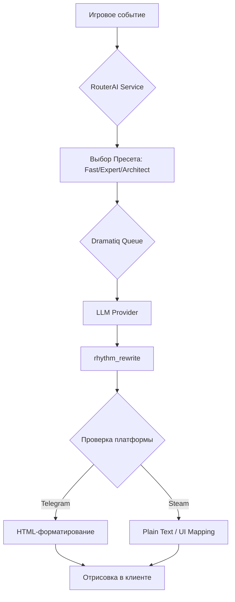

12. AI-слой

При переносе игры на платформу Steam архитектура взаимодействия с ИИ претерпевает изменения, направленные на повышение производительности, качества генеративного контента и стабильности работы в условиях настольного клиента. Центральным узлом является RouterAI, который обеспечивает унифицированный интерфейс для всех типов текстовых генераций.

12.1. Концепция пресетов и специализация моделей

Работа с ИИ-моделями разделена на три логических пресета, каждый из которых настроен под конкретные задачи системы:

| Функция | ИИ-функция | Пресет | Канал |
| :--- | :--- | :--- | :--- |
| Runtime (Геймплей) | Генерация событий в реальном времени | `fast` | WebApp / Steam UI |
| Content (Баланс/Имена) | Создание контента, легендарных названий | `expert` | Offline / CLI |
| Architect (Инфраструктура) | Проектирование, документация, дизайн | `architect` | CLI / Разработка |

- Fast (`fast`): Оптимизирован для высокой скорости отклика. Используется во всех игровых процессах, где требуется мгновенная реакция: описание таверны, торговые операции, отчеты об экспедициях, взаимодействия в рамках механики GD (General Dungeon) и рейдов.
- Expert (`expert`): Использует механизм `fusion` (параллельный запуск нескольких экспертных моделей с последующим судейством). Применяется для задач, требующих высокой креативной точности: генерации уникальных имен, аффиксов предметов и описаний редких сущностей.
- Architect (`architect`): Сложная система `fusion_roles`, где несколько ролей (архитектор, ведущий разработчик, QA-инженер) анализируют запрос под надзором ИИ-судьи. Применяется для генерации архитектурных решений, анализа кода и обновления проектной документации.

12.2. Runtime-генерация и Dramatiq Offload

Для обеспечения плавности игрового процесса на Steam, тяжелые операции генерации текста, которые не требуют мгновенного отклика (например, развернутые описания экспедиций, прогресс гильдейских войн или масштабные отчеты GD), выносятся за пределы основного цикла обработки запросов.

- Dramatiq Worker: Использование специализированных воркеров позволяет выполнять запросы к LLM асинхронно. Игровой сервер отправляет задачу в очередь, и результат подтягивается интерфейсом по мере готовности, что исключает блокировку основного потока отрисовки Steam-клиента.
- rhythm_rewrite: После первичной генерации текста системой включается обязательный второй проход (`rhythm_rewrite`). Это слой полировки, который адаптирует стиль текста под динамику игрового процесса, обеспечивая единообразие подачи независимо от того, какая базовая модель была использована.

12.3. Форматирование контента: Telegram vs Steam

ИИ-агент адаптирует структуру выходных данных в зависимости от целевой платформы:
1.  Telegram WebApp: ИИ генерирует текст с использованием HTML-разметки, поддерживаемой Telegram (теги для выделения жирным, курсивом, ссылками).
2.  Steam (Plain Text): При работе с нативным клиентом Steam, ИИ переключается на генерацию структурированного plain text с использованием кастомных разделителей. HTML-теги подавляются, чтобы обеспечить корректное отображение в игровом UI без артефактов верстки.

12.4. Обработка отказов (Fallback)

Надежность системы обеспечивается многоуровневой стратегией обработки ошибок:
- API Key Validation: При инициализации сессии система проверяет наличие `ROUTERAI_API_KEY`. Если ключ отсутствует или сервис недоступен, активируется режим «безопасного приземления» (fallback).
- Fallback-логика: В случае сбоя API игра переключается на использование предустановленных шаблонов контента (static strings), хранящихся в локальном кэше. Это позволяет избежать полного прерывания геймплея и сохраняет функциональность интерфейса, хотя и с потерей «живого» характера ИИ-генерации.
- Таймауты: Для всех сетевых запросов к ИИ установлены жесткие лимиты ожидания (настраиваются через `timeout_sec`), после которых вызывается процедура повторного запроса или переключение на статический ответ.

12.5. Схема потока AI-генерации (концептуально)

Примечание: детали баланса и конкретные формулы, влияющие на вероятность успеха экспедиций или рейдов, определяются в `game_config` и не являются частью данного ИИ-слоя.
