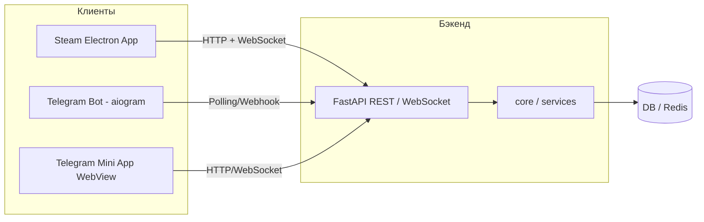

13. Steam-миграция  

Цель переноса Waifu Bot REBORN в Steam — дать игрокам PC-клиент с полноценным клавиатурно-мышиным вводом, real-time обратной связью и экосистемой Steam (авторизация, достижения, оверлей), сохраняя уже работающую игровую логику. Базовый принцип миграции — изоляция транспортного слоя: всё, что относится к механикам (бой, подземелья, экспедиции, гильдии, GD v1, бездна, предметы), остаётся в модулях `core/` и сервисах без изменений, а Telegram-специфичный код (aiogram-хендлеры, WebApp-авторизация, чат-транспорт урона) заменяется новыми PC-интерфейсами. Допускается гибридный режим, при котором единый бэкенд одновременно обслуживает и Telegram-бота, и Steam-клиент.

13.1 Фундамент: что остаётся неизменным  

- Игровое ядро `core/` и слой сервисов — боевые расчёты, генерация предметов, механики экспедиций, гильдий, GD v1, бездны и LLM-взаимодействий (OpenRouter). Все детали баланса и формул описаны в отдельных документах (`COMBAT_FORMULAS`, `game_config`) и здесь не дублируются.  
- Единый бэкенд FastAPI — уже реализованный слой REST/WebSocket, обслуживающий Telegram Mini App. Он становится точкой входа и для Steam-клиента, без раздвоения кодовой базы.  
- Структуры данных и ORM — модель персонажа, инвентаря, прогресса подземелий и гильдий не требует изменений (конкретные имена таблиц и колонок находятся вне данного брифа).  

13.2 Компоненты, подлежащие изоляции или замене  

| Компонент | Telegram сейчас | Steam target | Сложность |
|-----------|----------------|--------------|-----------|
| Авторизация | Проверка initData (хэш, ID чата) через aiogram | Проверка Steam-билета через Steamworks Web API / ISteamUserAuth | Средняя |
| Ввод урона | Сообщения в чате / тапы WebApp | Клавиатурно-мышиный трекер (pynput), отправка батчей на бэкенд | Низкая |
| Игровая логика | Модули battle/dungeon/expedition (через aiogram-хендлеры) | Те же модули через FastAPI-роуты (уже реализованы) | Сохраняется |
| Real-time обновления | Периодический поллинг в WebApp или апдейты через Telegram API | WebSocket-подключение из Electron, пуш состояний (HP, энергия, таймеры) | Высокая (частично реализовано) |
| Социальное взаимодействие | Групповые чаты, GD v1 через команды бота | Внутриигровое лобби (UI), интеграция Steam Friends / Steam Chat (опционально) | Высокая |
| Frontend | HTML/JS Mini App (Telegram WebView) | Переиспользованная HTML/JS кодовая база внутри Electron, адаптация под клавиатурные шорткаты и оконный режим | Низкая |
| Команды и навигация | BotFather-команды /dungeon, /expedition и т.д., клавиатуры aiogram | Игровые UI-кнопки, тулбары, окна в Electron | Средняя |
| Экономика и награды | Триггеры чат-активности, ежедневные бонусы через бота | Внутриигровые события (нажатия, фокус окна), локальные таймеры | Средняя |
| Упаковка и доставка | Не применимо | electron-builder + PyInstaller для Python-части, инсталлятор для Steam | Средняя |

13.3 Архитектура PC-клиента  

Клиент собирается как Electron-приложение со встроенным Python-рантаймом. Electron загружает фронтенд (HTML/JS/CSS) и управляет окнами. Параллельно запускается Python-процесс с FastAPI на локальном хосте. Коммуникация между Electron и Python идёт через WebSocket (real-time события) и HTTP REST (команды).  

Клавиатурный/мышиный трекер реализуется на `pynput` (отдельный Python-тред или процесс). Он фиксирует нажатия (например, последовательности клавиш для атаки) и отправляет агрегированные батчи на FastAPI с заданным интервалом, заменяя чат-ввод урона и тапы WebApp.  

Steam-авторизация встраивается в старт клиента: Electron получает Steam ID и сессионный билет через Steamworks API (или Greenworks/Steamworks.js) и передаёт их на FastAPI, где соответствующий auth-роут проверяет билет по Steam Web API и привязывает персонажа к Steam ID. Зависимость от Telegram initData при этом полностью снимается.

13.4 Что теряется и приобретается  

- Потеря: Групповая динамика Telegram — урон генерировался сообщениями в общих чатах, GD v1 запускался командой в группе, игра была вписана в живое общение. В Steam-клиенте эта механика заменяется внутриигровым лобби и, возможно, интеграцией Steam-чата. BotFather-команды исчезают — весь UX переносится в экранные интерфейсы (главное меню, панели, кнопки). Снижается виральность: в Telegram бот распространяется через ссылки и каталоги, тогда как Steam требует полноценной публикации и маркетинга.  
- Приобретение: Полноэкранный режим без ограничений WebView, горячие клавиши на способности, минимальные задержки ввода (локальный бэкенд), интеграция со Steam Overlay и системой достижений Steam, единый установщик без необходимости отдельной установки Python или БД.

13.5 Поэтапный план миграции  

Фаза 0: Аудит и документирование  
- Инвентаризация всех точек входа в aiogram-хендлерах: какие функции из `core/` вызываются, как передаются параметры, где есть побочные эффекты (кеш, Redis, очереди).  
- Фиксация текущей архитектуры в `ARCHITECTURE.md`.  
- Выявление всех Telegram-зависимых участков (авторизация, отправка сообщений, inline-клавиатуры, WebApp-валидация).  
- Результат: карта зависимостей для следующих фаз.

Фаза 1: Изоляция игровой логики  
- Перенос всех хендлеров aiogram из `telegram/handlers/` в абстрактный слой вызовов: каждый обработчик заменяется на чистую Python-функцию с типизированными параметрами, без ссылок на `Message`, `CallbackQuery` и т.п.  
- Telegram-бот остаётся работоспособным: aiogram-хендлеры становятся тонкой обёрткой над вызовами `core/`.  
- Создаются Pydantic-модели запросов/ответов для последующего использования в FastAPI.  
- На этом этапе уже можно проводить миграционные тесты: вызовы через HTTP вместо хендлеров дают идентичный игровой результат.

Фаза 2: FastAPI как основной транспорт  
- Реализация (или дополнение) роутов для battle, dungeon, expedition, guild, GD v1, abyss и т.д. (концептуальные группы, полный перечень не входит в бриф).  
- Интеграция WebSocket-endpoint для real-time: пуш текущего HP, энергии, таймеров GD v1 и экспедиций.  
- Параллельный запуск Telegram-бота и FastAPI на одном экземпляре приложения: бот продолжает принимать Webhook/поллинг, FastAPI обрабатывает запросы от Mini App и будущего Steam-клиента.  
- Аутентификация для Mini App пока остаётся Telegram initData, для Steam добавляется отдельный провайдер.

Фаза 3: Electron-клиент, трекер ввода и Steamworks-интеграция  
- Создание Electron-оболочки, загружающей существующий фронтенд (HTML/JS Mini App).  
- Встраивание Python-рантайма (PyInstaller-сборка FastAPI + core) в ресурсы приложения.  
- Реализация клавиатурно-мышиного трекера на `pynput` с отправкой батчей на localhost FastAPI.  
- Подключение WebSocket в Electron для real-time обновлений HP, энергии и системных сообщений.  
- Интеграция авторизации через Steamworks (проверка билета, привязка Steam ID).  
- Замена Telegram-специфичного UI на полноэкранные игровые меню с сохранением общего JS-кода для WebView.  
- Сборка и упаковка инсталлятора с помощью electron-builder и PyInstaller, настройка деплоя в Steamworks (SteamPipe).

13.6 Риски и зависимости  

- Совместимость упаковки: PyInstaller должен корректно собрать asyncio-приложение (uvicorn) и все зависимости (`pynput`, `fastapi`, `sqlalchemy` и др.). Ошибки упаковки могут вызывать падения на целевых системах.  
- Потеря социальной виральности: без групповых чатов и встроенной аудитории Telegram удержание игроков может снизиться. Требуется внутриигровой чат и интеграция со Steam Friends.  
- Двойная кодовая база авторизации: при параллельной поддержке Telegram и Steam необходимо чёткое разделение провайдеров, исключающее конфликты учётных записей.  
- Производительность локального Python-сервера: Electron и Python-процесс делят ресурсы на машине игрока; необходим мониторинг потребления памяти и CPU.  
- Зависимость от Steamworks SDK: публикация в Steam требует прохождения ревью, настройки достижений, облачных сохранений, что добавляет организационные и технические издержки.  
- Адаптация GD v1: если в гильдейских событиях присутствуют элементы, завязанные на чат-тайминги, их необходимо синхронизировать через серверное время, а не полагаться на локальные часы.

13.7 Диаграмма целевого потока данных  

