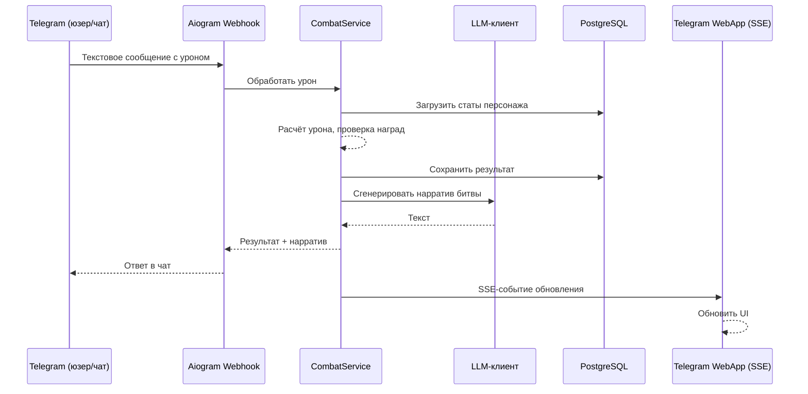
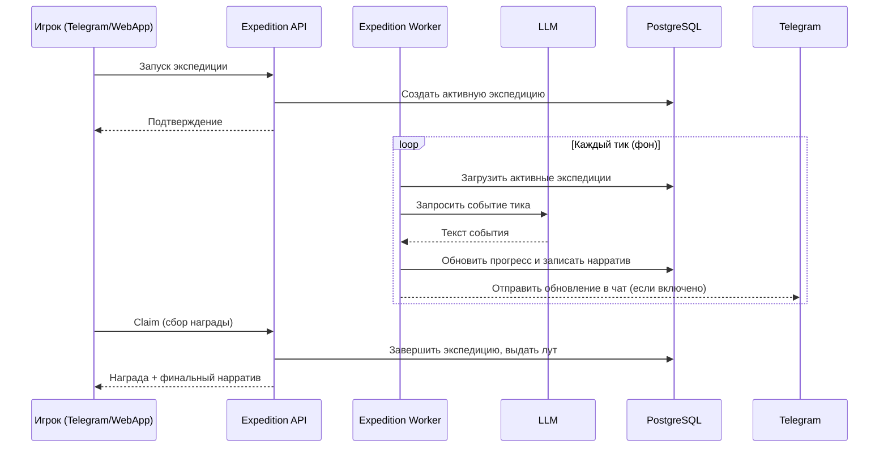
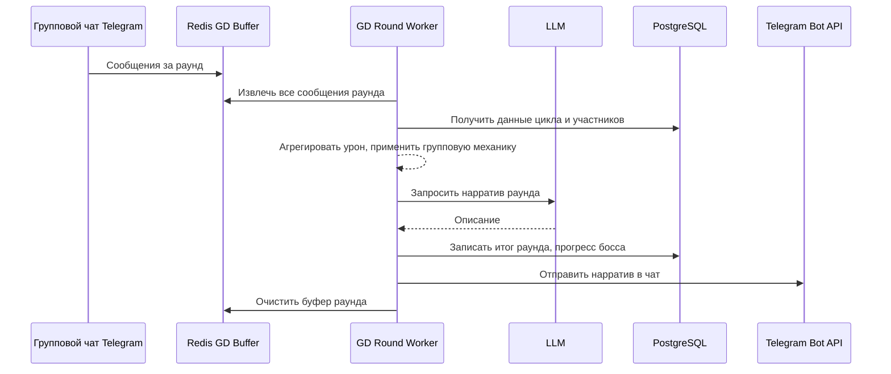
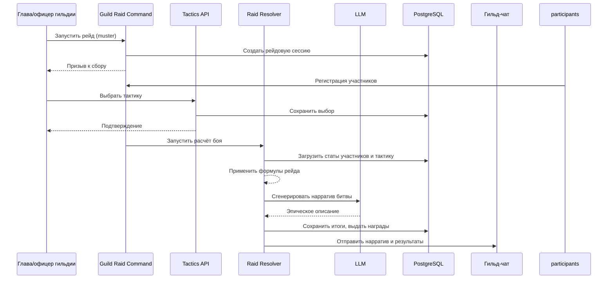
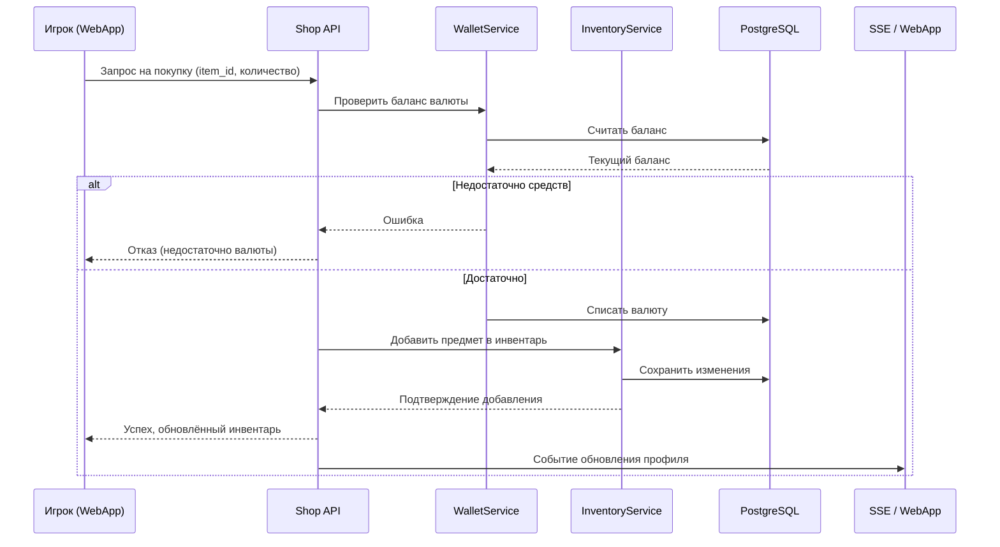
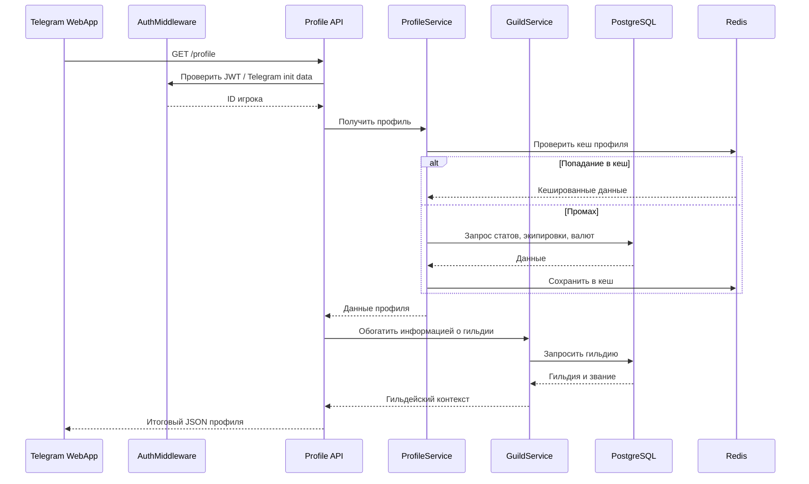

14. Карта взаимодействий

14.1 Соло-атака через Telegram-сообщение



Сообщение с уроном, отправленное в групповой чат или в бот, преобразуется в боевой расчёт. Система применяет формулы, сопоставляемые с `game_config`, генерирует LLM-описание и одновременно отправляет результат через Telegram и SSE-канал WebApp. Это обеспечивает синхронизацию для всех клиентов.

14.2 Экспедиция (старт, тики, LLM-повествование, сбор)



Фоновый воркер с заданным интервалом обновляет состояние всех активных экспедиций, получая нарративные вставки через LLM. Игроки наблюдают ход экспедиции в чате или в WebApp и могут прервать её досрочно или забрать итоговую награду. Детали длительности и наград настраиваются в `game_config`.

14.3 Раунд Group Dungeon v1



Сообщения, отправленные игроками во время активного окна GD v1, накапливаются в Redis-буфере. Специальный воркер обрабатывает буфер в конце раунда, обсчитывает совокупный урон (формулы см. `COMBAT_FORMULAS`) и формирует LLM-повествование, которое публикуется в групповом чате. Такой поток гарантирует, что ни одно сообщение не потеряется даже при высокой нагрузке.

14.4 Ежедневный рейд гильдии



Ежедневный рейд начинается со сбора подтвердивших участие членов гильдии. Глава или офицер выбирает тактику, после чего специальный расчётчик применяет боевые формулы к агрегированным статам. LLM создаёт уникальное повествование, отражающее выбранную стратегию и общий вклад гильдии. Точные коэффициенты синхронизированы с `game_config`.

14.5 Покупка в магазине



Покупка выполняется атомарно: проверка и списание валюты, выдача предмета и уведомление всех клиентов о новом состоянии инвентаря. Магазин использует те же сервисы кошелька и инвентаря, что и остальная экономика. Конкретные цены и ассортимент определяются конфигурацией магазина, но логика взаимодействия неизменна.

14.6 Загрузка профиля (WebApp → API → сервисы)



Профиль собирается из нескольких сервисов: основная боевая и экономическая информация кешируется в Redis, данные гильдии подгружаются отдельно. Это позволяет WebApp быстро отрисовать интерфейс, при этом гильдейская принадлежность обновляется реже и не задерживает первичную загрузку. Идентификация игрока ведётся через Telegram WebApp init data или JWT.

14.7 Целевая архитектура миграции на Steam

```mermaid
flowchart LR
    subgraph SteamClient [Steam Client / Deck]
        SC[Steam Client]
    end
    subgraph SteamPlatform [Steam Platform]
        Auth[Steam Auth]
        Leader[Steam Leaderboards]
        Stats[Steam Stats/Achievements]
        Cloud[Steam Cloud]
    end
    subgraph Backend [Game Backend (API + Worker)]
        GW[Gateway - FastAPI]
        Core[Core Game Services Python]
        DB[(PostgreSQL)]
        Cache[(Redis)]
        LLM[LLM Service]
    end
    subgraph Admin [Operators]
        Armory[Armory SPA]
        Tools[Admin Tools]
    end

    SC -->|HTTP/WS| GW
    GW --> Core
    Core --> DB
    Core --> Cache
    Core --> LLM
    Core <-->|Steamworks SDK| Auth
    Core <-->|API| Leader
    Core <-->|API| Stats
    Core <-->|Save Sync| Cloud
    Armory --> GW
    Tools --> GW
```

При миграции на Steam существующий бэкенд остаётся ядром, но обогащается слоем Steamworks-интеграции. Игровая логика, экономика и LLM-нарративы переиспользуются без изменений. Новый шлюз Steam принимает авторизацию через платформу, а достижения, лидерборды и облачные сохранения подключаются через стандартные API Steam. Это сохраняет Telegram WebApp как дополнительного клиента либо позволяет полностью переключиться на Steam.
