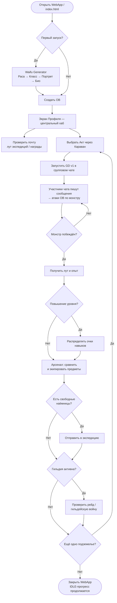

GAME_AGENT_BRIEF — Waifu Bot REBORN

0. Введение

Waifu Bot REBORN — многопользовательская IDLE RPG с аниме-фэнтезийным уклоном, изначально реализованная как Telegram-бот с полноценным HTML WebApp (Telegram Mini App). Ключевая особенность игры — интеграция с групповыми чатами Telegram: каждое текстовое сообщение участника чата действует как атака по монстру, а медиаконтент активирует уникальные умения. Такой подход превращает живое общение в основную боевую механику, создавая органичный и юмористичный ритм игровой сессии.

Настоящий документ — GAME_AGENT_BRIEF — является презентационным брифом игровых механик. Он адресован ИИ-агенту или разработчику, которому поручено перенести игру с платформы Telegram WebApp на Steam. Документ описывает что делает игра и как устроены её системы с точки зрения геймдизайна — но не является руководством по эксплуатации сервера, не содержит схем баз данных и не воспроизводит числовой баланс. Все конкретные коэффициенты, формулы урона и пороговые значения вынесены в отдельные артефакты — COMBAT_FORMULAS и game_config, на которые при необходимости даются ссылки по тексту.

Тон и сеттинг

Мир Waifu Bot REBORN — это пастиш фэнтези с нескрываемым аниме-влиянием: эльфийки-лучницы, демонессы-берсерки, кошкодевочки-воровки и прочие архетипы жанра «исекай». Нарратив намеренно не воспринимает себя слишком серьёзно: тексты квестов написаны с самоиронией, монстры имеют абсурдные имена, а гильдейские войны могут разгораться из-за дележа золота в таверне. Аудитория проекта — игроки, которые ценят лёгкий юмор, коллекционирование персонажей и ощущение прогресса без необходимости играть в полную силу каждый день. IDLE-механика гарантирует, что вайфу продолжает работать, пока игрок спит.

При переносе на Steam этот тон должен быть сохранён: локализация, UI-копирайтинг и маркетинговые материалы обязаны транслировать ту же смесь иронии, фансервиса и искреннего увлечения жанром.

Роль документа

GAME_AGENT_BRIEF выполняет три функции:

1. Карта механик — системное описание всех игровых подсистем в порядке, отражающем путь игрока от туториала до эндгейма.
2. Словарь понятий — единый глоссарий, исключающий разночтения при общении агента с кодовой базой, дизайн-документами и командой.
3. Ориентир для Steam-адаптации — каждый раздел явно отмечает, что меняется при переходе с Telegram на Steam (платформенные хуки, авторизация, монетизация, социальные функции).

Документ не содержит: инструкций по деплою, схем БД, секретов окружения, полного списка API-эндпоинтов и числового баланса.

Глоссарий

| Аббревиатура / термин | Расшифровка и краткое пояснение |
|---|---|
| ОВ | Основная Вайфу — главный персонаж игрока, создаётся один раз при старте, прокачивается на протяжении всей игры |
| GD | Group Dungeon (Групповое Подземелье) — боевая активность, привязанная к групповому чату; в документе используется только версия GD v1 |
| GD v1 | Актуальная реализация групповых подземелий: сообщения в чате конвертируются в атаки ОВ по монстру |
| SSE | Server-Sent Events — механизм push-уведомлений от сервера к WebApp без полинга; в Steam-версии заменяется на иной транспорт реального времени |
| Armory | Арсенал — раздел интерфейса для управления экипировкой ОВ и наёмниц; хранит все предметы игрока, а также является точкой доступа к крафту и улучшению предметов |
| Act | Акт — крупный географический/сюжетный регион с набором подземелий и нарастающей сложностью; открываются последовательно по мере прогресса |
| Tier | Уровень качества предмета или монстра; определяет диапазон характеристик и возможные аффиксы |
| Affix | Аффикс — дополнительный модификатор на предмете (префикс или суффикс), изменяющий характеристики персонажа или добавляющий эффект |
| Наёмница | Вторичный персонаж (не ОВ), нанимаемый в таверне; участвует в экспедициях и может занимать слоты в отряде |
| Экспедиция | Автономная вылазка наёмниц без участия игрока; завершается по таймеру, возвращает лут |
| Бездна | Endgame-активность с бесконечно масштабируемой сложностью; открывается после прохождения базовых актов; служит индикатором силы персонажа и приносит эксклюзивную валюту |
| Гильдия | Объединение игроков; открывает коллективные активности — рейды, гильдейские войны, общий банк, древо гильдейских навыков |
| Рейд | Многоэтапная гильдейская активность против особо мощного монстра; требует координации нескольких участников |
| Гильдейская война | PvP-событие между двумя гильдиями; победитель получает ресурсы из заявленной ставки |
| Караван | Мета-прогрессионная структура, связывающая акты; открывает новые локации и здания по мере продвижения |
| Таверна | Здание для найма и управления наёмницами; с развитием таверны растёт максимальный размер отряда и качество доступных наёмниц |
| Магазин | Интерфейс покупки предметов, ресурсов и косметики за игровую или премиальную валюту; ассортимент частично обновляется по расписанию |
| SP | Skill Points — очки навыков, тратятся на изучение и улучшение гильдейских умений |
| GXP | Guild Experience Points — опыт гильдии, начисляется за рейды и совместные активности |
| WebApp | Telegram Mini App — встроенный HTML/JS-интерфейс игры, работающий внутри мессенджера |
| index.html | Точка входа WebApp; отображает титульный экран с выбором «новая игра / продолжить» |
| Waifu Generator | Экран создания ОВ: выбор расы, класса, портрета и биографии |
| IDLE | Жанровый признак: прогресс продолжается в отсутствие активных действий игрока |

1. Сквозной игровой цикл

Игровой цикл Waifu Bot REBORN устроен как концентрические кольца активности: короткая сессия из пяти минут, ежедневный обход всех систем и долгосрочный прогресс через акты и эндгейм. Все кольца вращаются вокруг единственного постоянного объекта — Основной Вайфу игрока.

Первый запуск: от титула до первого боя

Игрок открывает `index.html` и видит титульный экран с двумя кнопками: «Новая игра» и «Продолжить». При первом запуске «Продолжить» неактивна. Нажатие «Новая игра» запускает Waifu Generator — пошаговый мастер создания ОВ.

В генераторе игрок последовательно выбирает:

- Расу — определяет базовые статы и пассивную расовую способность (например, эльфийки получают бонус к дальнобойным атакам, демонессы — к тёмной магии).
- Класс — задаёт боевую роль (ближний бой, дальний бой, магия, поддержка), тип наносимого урона, доступное оружие и стартовый набор активных навыков.
- Портрет — визуальное представление ОВ из предустановленного набора иллюстраций; в Steam-версии предполагается расширенный каталог с возможной кастомизацией.
- Биографию — короткий флавор-текст, который отображается в профиле и влияет на характерные фразы в бою, но не на механику.

После подтверждения создаётся профиль игрока, ОВ получает начальный комплект экипировки и стартовый запас золота. Игрок попадает на экран Профиля — центральный хаб с нижней панелью навигации: Профиль, Таверна, Магазин, Гильдия, Караван.

Основной цикл: подземелье как ядро сессии

Ядро каждой игровой сессии — прохождение подземелья текущего акта. Поток выглядит следующим образом:

1. Выбор акта и подземелья.
Через раздел «Караван» игрок перемещается к доступному акту. Каждый акт — это набор подземелий с нарастающей сложностью и уникальным лором. Новый акт открывается после победы над боссом предыдущего.

2. Запуск GD v1.
Подземелье активируется в контексте группового чата Telegram. Каждое текстовое сообщение любого участника чата конвертируется в атаку ОВ по текущему монстру. Медиа-сообщения (изображения, стикеры, GIF, голосовые) активируют специальные навыки ОВ — AoE-удары, хилы, дебаффы, временные баффы. Это превращает живой чат в боевой интерфейс без каких-либо дополнительных команд от участников. У монстра есть запас HP; по достижении нуля он падает, и появляется следующий противник. В фоновом режиме SSE-соединение обновляет состояние HP, выпавший лут и события в реальном времени.

3. Победа и лут.
После уничтожения монстра (или цепочки монстров в многоволновом подземелье) игрок получает:
- предметы с рандомизированными аффиксами соответствующего Tier;
- опыт для ОВ и повышение уровня;
- золото, специальные ресурсы акта и, возможно, фрагменты для усиления наёмниц.

4. Экипировка и улучшения.
В Арсенале игрок сравнивает выпавшие предметы с надетыми, экипирует лучшее, продаёт или разбирает лишнее на материалы для крафта. На экране навыков тратятся полученные при повышении уровня очки.

5. Возврат к выбору подземелья — и цикл повторяется.

Параллельные активности

Пока игрок занят основным циклом или отсутствует в игре, работают параллельные системы, обеспечивающие IDLE-прогресс:

Экспедиции наёмниц. Нанятые в таверне наёмницы отправляются в автономные вылазки на фиксированное время. По истечении таймера экспедиция завершается автоматически, а лут ждёт в почтовом ящике. Чем выше уровень и тир наёмницы, тем ценнее добыча. Игрок может одновременно держать несколько активных экспедиций.

GD v1 в групповом чате. Подземелье живёт в чате независимо от того, держит ли игрок WebApp открытым. Монстр получает урон от сообщений, таймер сессии идёт — при возвращении игрок видит актуальное состояние боя.

Бездна. Endgame-активность для игроков, прошедших базовые акты. Представляет собой бесконечную серию всё более сложных этажей с уникальными модификаторами и таблицами лута. Бездна не имеет финала — только личный рекорд глубины; прохождение этапов приносит эксклюзивную валюту для высокоуровневых улучшений.

Гильдия. Объединившись в гильдию, игроки получают доступ к:
- Рейдам — многоэтапным боям против боссов, требующим совместного участия нескольких членов;
- Гильдейским войнам — PvP-событиям между двумя гильдиями с заявленной ставкой ресурсов;
- Гильдейским навыкам — пассивным бонусам для всех членов (например, «+% к золоту в подземельях», «снижение времени экспедиций»), изучаемым на GXP и SP;
- Общему банку — хранилищу ресурсов гильдии.

Мета-прогрессия: здания и инфраструктура

Долгосрочный прогресс выражается не только в уровне ОВ, но и в развитии инфраструктуры игрока:

- Акты и Караван. Прохождение финального подземелья акта разблокирует следующий регион. Каждый новый акт открывает новые подземелья, монстров, лутовые таблицы с более высокими тирами и иногда — новые механики.
- Таверна. С развитием таверны растёт максимальный размер отряда и качество доступных наёмниц.
- Магазин. Позволяет приобретать предметы, ресурсы и косметику; ассортимент частично обновляется по расписанию.
- Арсенал. Не просто инвентарь, но и точка доступа к крафту, улучшению предметов и управлению резервом наёмниц.

Все системы связаны в единую петлю роста: прогресс в одном направлении открывает возможности в других. Игрок выбирает между вертикальным прогрессом (глубина Бездны, сложность рейдов), горизонтальным (сбор коллекции наёмниц, полный Арсенал эндгейм-предметов) и социальным (лидерство в гильдии, победы в войнах).

Диаграмма типичной игровой сессии

Путь к эндгейму

Игрок движется через акты, последовательно повышая уровень ОВ и качество экипировки. Переход между актами нелинеен в том смысле, что параллельные активности (Бездна, гильдейские рейды) доступны задолго до прохождения всех актов — они масштабируются под текущую мощь персонажа. Эндгейм не имеет жёсткой финальной точки: игрок сам выбирает направление развития.

> Steam-адаптация. Ключевым архитектурным решением является замена механики «сообщения в чате = атаки» на эквивалентный Steam-нативный ввод: например, нажатия клавиш, действия в оверлее или выделенный чат-интерфейс внутри клиента. Социальная составляющая гильдий реализуется через Steam Friends API или собственный серверный матчмейкинг. SSE-транспорт заменяется на WebSocket или Steam Networking Sockets в зависимости от выбранной архитектуры клиента. Благодаря IDLE-механикам (экспедиции, пассивные гильдейские бонусы) прогресс не останавливается даже в офлайн-режиме, что обеспечивает комфортный темп игры на десктопе.
