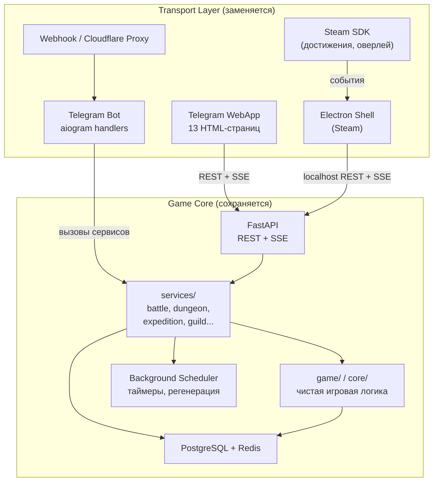
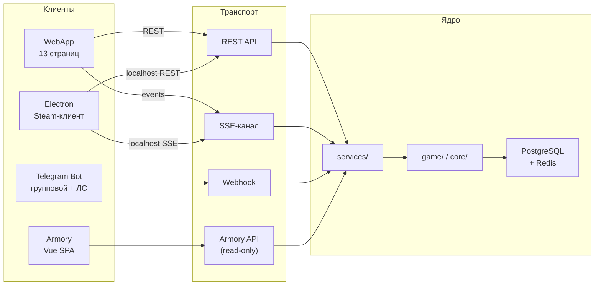

2. Клиенты и каналы

Игра существует в нескольких точках входа одновременно. Каждая из них решает свою задачу, использует собственный транспортный механизм и предъявляет уникальные требования к адаптации при переносе на Steam. Понимание этой карты клиентов — обязательное условие для корректной изоляции игрового ядра от инфраструктуры доставки.

2.1 Архитектурный принцип: Transport Layer vs Game Core

Ключевой принцип всей миграции — чёткое разделение транспортного слоя и игрового ядра.

Transport Layer — всё, что знает о том, как доставить сообщение или действие до пользователя:
- Telegram WebApp (`initData`, Telegram JS SDK, `tg.MainButton`, `tg.BackButton`)
- aiogram handlers и keyboards (inline/reply)
- Webhook-маршруты для приёма Telegram Updates
- SSE-соединения с публичным URL
- Cloudflare Worker как прокси Telegram API

Transport Layer заменяется целиком при переезде на Steam. Вместо него появляются: Electron main process, локальный HTTP-сервер, Steam SDK для достижений и оверлея.

Game Core — всё, что знает о правилах игры, но не знает о доставке:
- `game/` и `core/` — механики боя, данжей, экспедиций, навыков, лута
- `services/` — бизнес-логика (character service, battle service, expedition service и т.д.)
- Фоновый планировщик задач (регенерация, таймеры экспедиций, GD-раунды)
- Слой данных (PostgreSQL + Redis)

Game Core не трогается при миграции. Он принимает чистые Python-типы, возвращает чистые Python-типы, не импортирует aiogram, не знает об HTML-страницах. Одни и те же вызовы `/api/battle/start`, `/api/dungeon/explore` и т.д. обслуживают и WebApp, и будущий Steam-клиент.

2.2 Telegram WebApp — основной игровой интерфейс

WebApp представляет собой набор из 13 HTML-страниц, встроенных непосредственно в Telegram-клиент через механизм Mini App. Навигация между страницами осуществляется через подвал (bottom navigation bar). Особое место занимает ОЧ (Основной Чердак) — центральный хаб, с которого игрок попадает в бой, экспедиции, здания и прочие активности.

Технически каждая страница — это отдельный HTML-файл со своим JavaScript-контекстом, который общается с бэкендом через REST API и получает real-time обновления через SSE (Server-Sent Events). Авторизация происходит через `initData` от Telegram — подписанный объект, который WebApp передаёт в заголовке каждого запроса.

Принципиально важно: WebApp не содержит игровой логики. Он является тонким клиентом — отображает состояние, отправляет команды, получает события. Вся логика живёт в `services/` и `game/` на бэкенде. Это делает замену WebApp на Steam-клиент концептуально чистой операцией: нужно заменить транспорт и UI, не трогая ядро.

2.3 Telegram Bot — групповой и личный каналы

Бот работает параллельно с WebApp на базе aiogram 3 через webhook и обслуживает два режима взаимодействия.

Групповые чаты — основная арена социальной механики:
- Урон в бою — бот публикует результаты атак в чат, создавая живую хронику сражения для всех участников группы.
- GD v1 (Групповой Данж) — координация, объявление раундов, сбор участников, публикация итогов. Бот выступает «ведущим» этого режима.
- Бездна — аналогичная механика; бот транслирует прогресс и результаты.
- Chat Rewards — система начисления наград за активность в чате; бот отслеживает сообщения участников и триггерит начисления.

Личные сообщения (ЛС):
- Уведомления экспедиций — когда экспедиция завершается, бот отправляет игроку личное сообщение с результатами.
- GD v1 в ЛС — индивидуальные уведомления о статусе группового данжа, приглашения, результаты раунда для конкретного игрока.

С точки зрения миграции: групповые функции бота остаются нетронутыми — они привязаны к Telegram-сообществам и не имеют эквивалента в Steam-контексте. Steam-версия не заменяет бота, а добавляет альтернативный интерфейс; оба транспорта сосуществуют, обращаясь к единому Game Core.

2.4 Armory — браузерный портал статистики

Armory — это отдельное Vue SPA, доступное по независимому маршруту (`/armory`). Это полноценный браузерный портал в стиле WoW Armory:
- публичные профили игроков;
- рейтинги и таблицы лидеров;
- поиск по никнейму;
- авторизация через Telegram Login (OIDC popup).

Armory читает данные через отдельную группу агрегированных API-эндпоинтов (без побочных эффектов, только чтение). При миграции на Steam Armory не переносится — он остаётся браузерным инструментом для всего сообщества, включая Telegram-игроков. Steam-клиент может ссылаться на него как на внешний ресурс.

2.5 SSE — real-time канал боя

Server-Sent Events — механизм однонаправленной потоковой передачи данных от сервера к клиенту. SSE используется прежде всего для обновлений состояния боя в реальном времени: анимации ударов, изменения HP, события смерти/победы приходят в WebApp без опроса (polling).

Сервис `services/sse.py` управляет реестром активных соединений и рассылкой событий нужным клиентам. При переезде на Steam SSE-механизм сохраняется без изменений: Electron-оболочка загружает локальный `localhost`, FastAPI продолжает отдавать SSE-поток — с точки зрения протокола ничего не меняется. Единственное отличие — соединение становится локальным, а не публичным.

2.6 Таблица миграции: WebApp → Steam

| Страница WebApp | Назначение | Backend-сервис (концептуально) | Статус в Steam |
|---|---|---|---|
| Основной Чердак (ОЧ) | Хаб: вход в бой, здания, активности | character, session | Переносится → главный экран Steam-клиента |
| Бой | Интерфейс сражения, лог ударов, SSE | battle, sse | Переносится → SSE через localhost |
| Инвентарь / Предметы | Управление предметами, экипировка | inventory, items, enchanting | Переносится |
| Персонаж / Стат | Характеристики, прогресс, уровень | character, stats | Переносится |
| Навыки | Дерево навыков, прокачка | skills | Переносится |
| Данж / Подземелья | Выбор данжа, прогресс, награды | dungeon | Переносится |
| Экспедиции | Отправка, таймер, получение наград | expedition | Переносится (уведомления — через Steam Overlay вместо ЛС бота) |
| Гильдия | Состав, навыки гильдии, GD v1 | guild, gd | Частично: профиль гильдии — в Steam; чат-трансляция GD остаётся в Telegram |
| Магазин / Крафт | Покупка расходников, крафт | shop, craft | Переносится (платежи → Steam Microtransactions API) |
| Рейтинг / Лидерборд | Таблицы лучших игроков | leaderboard, armory | Переносится или ссылка на Armory |
| Бездна | Режим бездны, прогресс | abyss | Переносится (без чат-трансляции) |
| Настройки | Профиль, язык, уведомления | user settings, config | Переносится (нотификации → OS/Steam Overlay) |
| Онбординг / Туториал | Первый вход, обучение | onboarding | Переносится (адаптируется под Steam First Launch) |

> Страницы, отмеченные «Частично», сохраняют свой backend-сервис полностью, но часть UX-механики (чат-трансляция, групповая координация) остаётся эксклюзивом Telegram.

2.7 Критические точки при миграции

1. Race conditions при SSE: необходимо убедиться, что локальный процесс Electron не создаёт задержек при обработке событий, которые могут привести к рассинхронизации HP/Energy между клиентом и `core/battle.py`.

2. Изоляция зависимостей: после рефакторинга в `core/` не должно остаться импортов `aiogram`. Любое наличие Telegram-специфичного кода в игровом ядре приведёт к ошибкам при сборке для Steam.

3. Управление сессиями: необходимо разграничить сессии между активным Telegram-ботом и Steam-клиентом, исключив одновременную обработку одного события (например, начала боя) с двух разных клиентов — для предотвращения дублирования наград.

4. Авторизация: перенос с Telegram `initData` на Steamworks SDK требует переработки `services/auth.py`. Armory при этом сохраняет Telegram Login без изменений.

5. Безопасность локального API: при работе через Electron необходимо исключить возможность подмены API-запросов пользователем. Game Core должен всегда валидировать входящие данные, даже если они приходят с «доверенного» localhost.

2.8 Сводная карта клиентов

Каждый клиент — сменная обёртка. Game Core остаётся неизменным центром. Steam-версия и Telegram-версия работают на одном бэкенде одновременно — это не теоретическое допущение, а практическое требование: Telegram-бот продолжает обслуживать существующих игроков, пока Steam-клиент проходит Early Access. Никакого «большого взрыва» с переключением не происходит; оба транспорта сосуществуют.
