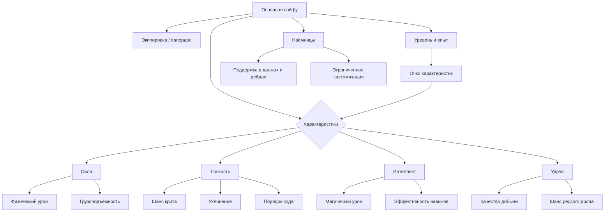

3. Основная вайфу и профиль

3.1 Архитектурная концепция: ОВ и наёмницы

Основная вайфу (ОВ) — единственный постоянный аватар игрока с уникальным идентификатором и привязкой к глобальному состоянию профиля. Именно она накапливает опыт, носит снаряжение, прокачивает характеристики и продвигается по сюжетной линии. ОВ не может быть продана, заменена или передана — это неотчуждаемое ядро прогресса.

Наёмницы (hired waifus) — вспомогательные единицы, нанимаемые в Таверне. Они участвуют в рейдах гильдии, усиливают отряд в особых режимах и генерируют пассивный доход в Караване. Их характеристики и бонусы интегрируются в общие расчёты, однако глубокая кастомизация (ручное распределение stat points, полноценный папердол) для них недоступна. Если ОВ — это персонаж, то наёмница — инструмент с характером.

> Требование к интерфейсу: карточка ОВ и карточки наёмниц никогда не должны смешиваться в одном списке без явного визуального разделения — ни в браузерной, ни в Steam-версии.




3.2 Характеристики Основной вайфу

ОВ обладает четырьмя основными атрибутами, каждый из которых участвует в нескольких расчётных цепочках одновременно.

| Характеристика | Концептуальная роль |
|---|---|
| Сила (STR) | Физический урон в ближнем бою; грузоподъёмность (ограничение по весу снаряжения) |
| Ловкость (AGI) | Шанс критического удара; уклонение; порядок хода в бою |
| Интеллект (INT) | Магический урон; эффективность стихийных навыков |
| Удача (LCK) | Шанс редкого дропа; качество добычи; вероятность особых триггеров |

> Конкретные формулы и коэффициенты масштабирования — см. COMBAT_FORMULAS / game_config.

Производные параметры

- HP (здоровье) — пул живучести в бою. Восстанавливается между сессиями подземелий; при достижении нуля бой завершается поражением.
- Энергия — расходуемый ресурс, ограничивающий количество активных действий за сессию (вход в данж, применение активных навыков). Восстанавливается со временем или расходниками.
- Опыт (XP) и уровень — накопленный XP переводится в уровни по нелинейной шкале. Каждый уровень даёт stat points для распределения и может открывать новые слоты пассивных навыков. Уровень также служит «ключом доступа» к контенту: ряд данжей и наёмниц открывается только при достижении порогового значения.

> ⚠️ QA-риск — Stat Overflow: при накоплении множества бонусов (`passive_mult × hidden_mult × equipment_bonus`) значения могут выйти за пределы ожидаемого диапазона, что приведёт к некорректным расчётам (отрицательный урон, деление на ноль при критах). Рекомендация: внедрить «мягкие» и «жёсткие» лимиты (caps) на все процентные модификаторы до их применения к базовым характеристикам.


3.3 Страница профиля (profile.html)

Профиль — главная информационная страница игрока. В Steam-версии сохраняется трёхвкладочная структура, адаптированная под мышь и клавиатуру.

Вкладка «Краткая информация»

Отображает:
- Аватар ОВ (пресет или загруженное изображение; поддерживаются форматы WebP, PNG, JPEG с ограничением по размеру файла).
- Имя, уровень, текущий XP до следующего уровня (прогресс-бар).
- Сводку основных характеристик с учётом бонусов от снаряжения и пассивных навыков.
- Текущие HP и энергию; активные эффекты.
- Позицию в нарративной линии.
- Публичный статус: принадлежность к гильдии, звание, счётчик трофеев.

Вкладка «Инвентарь»

Все предметы в сумке ОВ: оружие, броня, расходники, квестовые предметы. Сетка с цветовой кодировкой редкости. Из этой вкладки можно перетащить предмет в папердол (drag-and-drop) или выбросить / продать его. Поддерживается переключение между компактным и расширенным режимами отображения.

Вкладка «Статистика»

Агрегированная история игрока: количество пройденных данжей, суммарный урон, убитые боссы, рекорды скорости прохождения, история войн гильдии, накопленное золото, количество смертей. В Steam-версии часть этих данных целесообразно связать с Steam Achievements.

> ⚠️ QA-риск — загрузка аватаров: несмотря на проверку типов, возможны атаки через маскировку исполняемых файлов под изображения или загрузку «тяжёлых» метаданных, вызывающих DoS при парсинге на клиенте. Рекомендация: обязательная серверная перекодировка всех загружаемых изображений в заданный формат с удалением метаданных.


3.4 Экипировка: папердол и режимы отображения

ОВ имеет шесть слотов снаряжения:

```
┌──────────────────────────────────────┐
│  [Голова]          [Ожерелье]        │
│  [Тело]            [Кольцо]          │
│  [Перчатки]        [Обувь]           │
│  [Оружие (осн.)]   [Оружие (доп.)]   │  ← dual wield
└──────────────────────────────────────┘
```

> Dual Wield: двуручное оружие занимает оба слота; при комбинации «основная рука + дополнительная рука» бонус от оружия в дополнительной руке применяется частично. Детали масштабирования — см. COMBAT_FORMULAS.

Каждый предмет имеет редкость и набор прибавок к атрибутам, защите, сопротивлению стихиям или особым эффектам.

Режимы интерфейса папердола

| Режим | Описание |
|---|---|
| Compact | Слоты в виде небольших иконок вокруг силуэта ОВ. Быстрый обзор. |
| Expanded | Каждый слот разворачивается в карточку с полными параметрами, аффиксами и сравнением с текущим снаряжением. В Steam-версии — основной режим. |

В Steam-версии папердол реализуется как отдельная панель в левой части экрана профиля, инвентарь — в правой, с поддержкой drag-and-drop между ними.

> ⚠️ QA-риск — Race Condition при Dual Wield: если игрок инициирует смену предметов в момент активного расчёта урона (например, при авто-бою), возможна манипуляция множителями (double-dipping). Рекомендация: реализовать блокировку изменений экипировки в момент активных боевых расчётов. Также необходима строгая валидация при смене двуручного оружия на два одноручных во избежание «зависания» бонусов статов.


3.5 Генератор вайфу (waifu_generator.html)

Генератор — отдельная страница для создания облика и начального архетипа ОВ. Доступна при первом запуске и при «реролле» (за внутриигровую валюту или особый предмет — свиток реролла).

Этапы генерации

1. Выбор визуального стиля — набор пресетов внешности (причёска, цвет волос, форма и цвет глаз, тип лица, варианты одежды и аксессуаров). В Steam-версии пресеты могут быть расширены через DLC или мастерскую.
2. Выбор класса-архетипа — предопределяет стартовое распределение базовых характеристик и начальный набор пассивных навыков. Архетип не блокирует дальнейшее развитие.
3. Присвоение имени — текстовый ввод с фильтрацией.
4. Предпросмотр — перед подтверждением игрок видит итоговый облик и стартовые параметры.

После подтверждения генератор недоступен без специального ресурса. Это решение сохраняет ценность выбора и предотвращает тривиальный «сброс персонажа».

Альтернативно поддерживается загрузка собственного файла-аватара (с соблюдением ограничений по размеру и типу), заменяющего портрет.

> ⚠️ QA-риск: необходима валидация входных данных для предотвращения генерации «невозможных» комбинаций характеристик и обеспечения консистентности внешнего вида с начальными навыками.


3.6 Распределение stat points

При каждом повышении уровня ОВ получает очки характеристик, которые игрок распределяет вручную через интерфейс профиля (кнопки «+» рядом с каждой характеристикой). Нераспределённые очки сохраняются и не сгорают.

Ключевые принципы

- Необратимость — вложенные очки нельзя перераспределить стандартными средствами. Существует специальный предмет «Книга забвения», позволяющий полностью сбросить распределение (детали получения — в game_config).
- Синергии — ряд пассивных навыков усиливается при достижении порогового значения конкретной характеристики, что создаёт стимул к специализации.
- Отображение эффекта в реальном времени — интерфейс показывает, как изменится производный параметр (урон, шанс крита и т.д.) при добавлении одного очка.
- Предотвращение билд-лока — возможность сброса очков через «Книгу забвения» не наказывает за эксперименты и позволяет адаптировать персонажа под изменяющийся контент.

Архетипы специализации

| Стиль | Приоритет | Эффект |
|---|---|---|
| Танк | STR | Высокий HP, сокрушительный физический урон |
| Убийца | AGI | Частые криты, высокое уклонение |
| Маг | INT | Мощные заклинания, большой резерв энергии |
| Счастливчик | LCK | Редкие эффекты, повышенное качество добычи |


3.7 Секретный босс эха (концепт)

«Эхо» — скрытый эндгейм-контент, доступный только ОВ, достигшим определённой глубины прогресса. Доступ строго ограничен (по уровню или прогрессу в подземельях) во избежание преждевременного столкновения с боссом.

Механика

- Персонализация угрозы — босс-эхо является зеркальной версией самой ОВ: его характеристики фиксируются на момент первого входа игрока в особую зону, формируя уникальный вызов для каждого билда. Это исключает универсальную «мета-стратегию».
- Единственный слепок — первая встреча фиксирует параметры босса; все последующие попытки сражаются с той же копией, а не с текущим состоянием ОВ.
- Нарративный контекст — встреча с эхом встроена в линейную историю и подаётся как кульминационный момент личной дуги персонажа, а не просто как механика испытания. Возможен вариант, когда Эхо пробуждается при выполнении скрытых условий (многократное прохождение данжа без смертей, сбор «фрагментов эха»).
- Уникальная награда — победа открывает косметический элемент, нарративный фрагмент или редчайшие предметы экипировки, недоступные иными путями.

В Steam-версии этот контент оформляется как отдельное достижение с редкой плашкой, подчёркивая его эксклюзивность.


Приложение: сводная таблица QA-рисков

| № | Риск | Область | Рекомендация |
|---|---|---|---|
| 1 | Race Condition при Dual Wield | Боевая система / экипировка | Блокировка изменений экипировки в момент активных расчётов |
| 2 | DoS через метаданные аватара | Загрузка изображений | Серверная перекодировка с удалением метаданных |
| 3 | Stat Overflow | Расчёт характеристик | Мягкие и жёсткие лимиты на процентные модификаторы |
| 4 | Клиентская манипуляция (Steam) | Архитектура клиент-сервер | Серверная валидация всего игрового цикла; клиент только отображает |
| 5 | Неавторизованный апгрейд гильдейских навыков | Guild Skills API | Аудит прав доступа на стороне сервера для всех гильдейских эндпоинтов |
