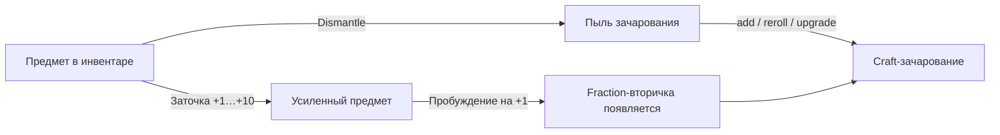

4. Предметы и аффиксы

4.1 Типы предметов и экипировочные слоты

Экипировка персонажа распределена по слотам, каждый из которых принимает строго определённый тип предметов:

- Оружие — основной источник атаки; определяет базовый урон персонажа. Канал заточки — урон.
- Броня (нагрудник, шлем, перчатки, ботинки и прочие защитные слоты) — основной источник выживаемости. Канал заточки — броня.
- Аксессуары (два кольца и амулет) — влияют преимущественно на вторичные характеристики. Канал заточки — fraction-вторичка. Именно на аксессуарах работает механика пробуждения.

Каждый предмет принадлежит ровно одному слоту; надеть два предмета одного слота одновременно нельзя. Слот определяется шаблоном предмета и не меняется после генерации.

4.2 Редкость, тир и уровень предмета

Система использует три независимые, но взаимосвязанные оси:

| Ось | Что описывает |
|---|---|
| Редкость (rarity 1–5) | Качество предмета: от обычного до легендарного. Влияет на количество аффиксов, множитель базовых статов и вес при разборе |
| Тир (tier 1–10) | «Поколение» шаблона; влияет на базовые статы и потолок fraction-вторичек. Фиксируется в момент генерации и не меняется |
| Item level | Отражает уровень зоны или данжа, из которого выпал предмет; определяет доступный пул шаблонов и допустимые тиры |

Редкость и тир вместе формируют силу конкретного экземпляра: один и тот же тир при более высокой редкости получает лучшие аффиксы и больше роллов. Детали числовых множителей см. в `game_config` (не включено в этот документ).

4.3 Аффиксы: префиксы и суффиксы

Аффикс — модификатор, добавляемый к базовым статам предмета при его генерации. Система разделяет аффиксы на два семантических слоя:

- Префиксы — как правило, усиливают наступательные характеристики: урон, критический шанс, бонус против конкретной семьи монстров.
- Суффиксы — чаще отвечают за защиту и утилиту: броня, уклонение, регенерация, бонусы к опыту и золоту.

Каждый аффикс принадлежит семье и имеет `exclusive_group`: два аффикса из одной группы не могут оказаться на одном предмете одновременно. Суммарное количество аффиксов ограничено редкостью: обычные предметы получают один-два аффикса, редкие — до четырёх.

Отображение в UI. На карточке предмета аффиксы перечисляются в секции «Подробно» с человекочитаемыми названиями и итоговыми значениями. Аффиксы, влияющие на боевые характеристики, также отражаются в сводной панели персонажа.

4.4 Вторичные бонусы (fraction-secondary)

Предметы имеют два слоя дополнительных свойств, которые хранятся непосредственно на экземпляре и не перезаписываются при смене шаблона:

- Пассивная вторичка — статическое усиление, заданное шаблоном предмета (например, небольшое постоянное увеличение здоровья). Не изменяется при заточке.
- Fraction-вторичка — динамическая характеристика, добавляемая пробуждением или зачарованием и растущая при заточке аксессуара.

Существующие типы fraction-вторичек: шанс критического удара, уклонение, снижение входящего урона, бонус к максимуму HP, бонус к опыту, бонус к золоту, бонус к шансу найти магический предмет (magic find). Значения хранятся в виде дробей; UI показывает их как проценты (4 знака точности).

Потолок fraction-вторички определяется тиром предмета; детали баланса см. в `game_config`.

4.5 Легендарные предметы и уникальные бонусы

Редкость 5 (легендарная) делится на два подтипа:

Curated legendary — предметы с заранее закреплёнными уникальными бонусами, созданные вручную дизайнерами. При генерации движок предпочитает именно такие шаблоны: если пул curated-шаблонов доступен для данного слота и тира, вероятность выпадения «curated» выше, чем «generic». Уникальных бонусов на одном предмете может быть один или два; они фиксированы и не перероллятся зачарованием.

Generic legendary — легендарные предметы без уникального бонуса. Получают усиленные базовые статы (тот же множитель редкости, что и curated), но лишены специальной механики. Ценны преимущественно через заточку и зачарование.

Уникальные бонусы реализуют один из следующих типов механик:

- Условный proc — срабатывает единожды за бой при выполнении триггера (например, шанс выжить при смертельном ударе, форсированный критический удар на N-м ударе).
- Пассивный усилитель — постоянно действующий модификатор, не зависящий от хода боя.
- Фазовая механика — активируется в определённое «окно» боя; конфликты с другими proc-эффектами разрешаются по правилам приоритетов (`compat`-слой).

Несовместимые пары уникальных бонусов определяются на этапе генерации и экипировки: движок запрещает надеть два предмета, чьи уникальные бонусы взаимоисключают друг друга. Конкретные легендарные предметы и их бонусы являются частью балансного каталога и не раскрываются в этом документе.

4.6 Заточка (+1…+10)

Производится в кузнице на вкладке «Заточка» за золото. Каждая успешная заточка повышает уровень предмета, усиливая один основной канал в зависимости от слота:

- Оружие → прямое увеличение урона.
- Броня → увеличение показателя брони.
- Аксессуары → увеличение fraction-вторички.

Пробуждение происходит автоматически при первой успешной заточке до +1 на аксессуаре (или пассивной легендарке), у которого ещё нет fraction-вторички: система случайным образом назначает один из доступных типов вторички и присваивает начальное значение. После пробуждения вторичка растёт при каждом следующем уровне заточки в рамках потолка тира.

Начиная с +8 появляется риск неудачи с откатом на шаг назад. Камень защиты позволяет смягчить или полностью предотвратить откат. Пассивные вторичные бонусы и уникальные легендарные свойства от заточки не растут.

4.7 Craft-зачарование (пыль зачарования)

Производится на вкладке «Зачарование» за пыль зачарования. Поддерживает три операции над fraction-вторичкой:

- add — добавить вторичку, если её ещё нет (случайный тип, начальное значение).
- reroll — изменить тип существующей вторички на другой случайный.
- upgrade — увеличить значение вторички на фиксированный шаг, не превышая потолок тира.

Механика даёт игроку целенаправленно настраивать аксессуары под свой билд, не полагаясь только на случайность дропа. Стоимость операций и точные шаги значений берутся из `game_config`.

4.8 Разбор предметов (Dismantle)

Любой предмет в инвентаре, не надетый и не выставленный на активную продажу, можно разобрать. Результат — пыль зачарования, количество которой зависит от редкости и тира предмета: базовое значение модифицируется множителем редкости и множителем от тира. Заточка и зачарование самого предмета на итоговый выход пыли не влияют. Разобранный предмет уничтожается безвозвратно.

4.9 Codex предметов

Codex — внутриигровая энциклопедия, которая открывает записи по мере того, как игрок впервые получает предметы определённых шаблонов. Каждая запись содержит:

- визуальное представление и описание предмета;
- слот, тип и диапазон редкости;
- список возможных аффиксов (без конкретных числовых значений конкретного дропа);
- для легендарок — описание уникального бонуса в текстовом виде;
- источники получения предмета.

Codex не раскрывает балансные числа; он служит навигационным инструментом и коллекционным элементом. Прогресс заполнения Codex отображается в профиле игрока.

4.10 Получение предметов: лут и Gamble

Лут из подземелий — предметы выпадают по завершении этажей и из боссов. Пул доступных шаблонов определяется item level зоны: более глубокие этажи открывают шаблоны высоких тиров. Боссы имеют повышенный шанс выпадения редких и легендарных предметов, а также curated-легендарок, привязанных к конкретному боссу. Параметр magic find (из fraction-вторичек или аффиксов) увеличивает вероятность выпадения предметов высокой редкости по всему контенту.

Gamble — покупка предмета неизвестной редкости и аффиксов за золото у специального торговца. Слот предмета известен заранее, но редкость и аффиксы скрыты до момента покупки. Диапазон возможного тира и редкости ограничен прогрессом игрока. Это основной источник случайного лута вне боевого контента.

Оба способа подчиняются единой системе генерации предметов; при дропе легендарных предметов система предпочитает curated-шаблоны, если они доступны для выпавшего слота. Баланс вероятностей и дроп-таблицы вынесены в `game_config` (не приводятся).
