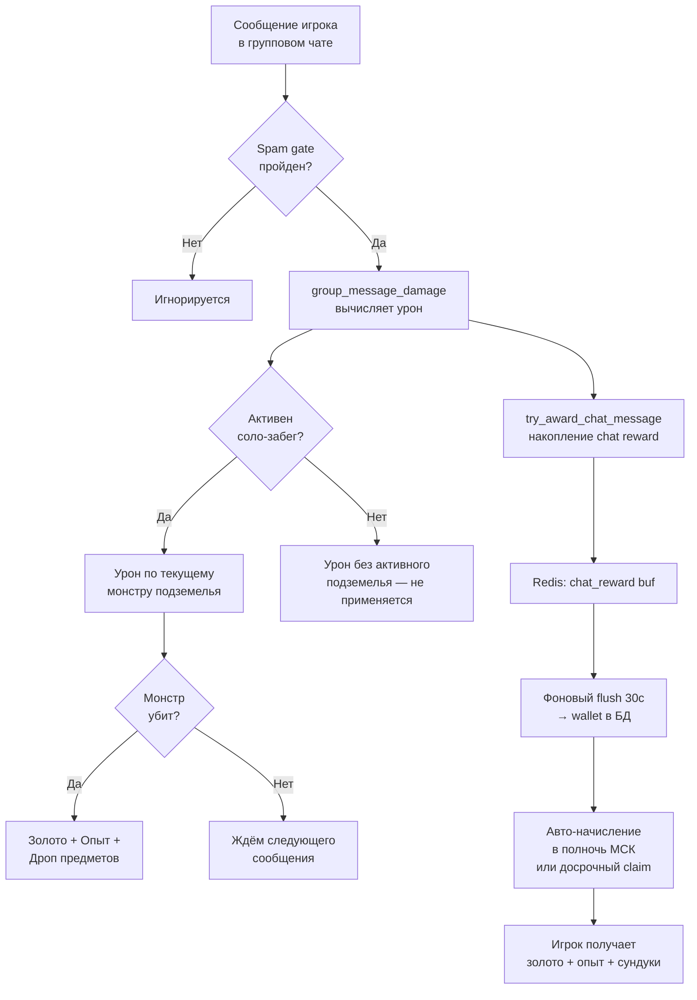

6. Соло-подземелья

Соло-подземелья — основной PvE-контент одиночного прохождения. Игрок ведёт свою главную вайфу через последовательность монстров, получая золото, опыт и предметы. Принципиальная особенность системы: урон по монстрам наносится двумя независимыми каналами — активностью в групповом чате Telegram и через WebApp-интерфейс боя. Это решение, органичное для мессенджера, требует полного переосмысления при переносе на Steam.

6.1 Акты и биомы — прогрессия мира

Мир подземелий разбит на акты, каждый из которых объединяет несколько тематических биомов. Биом задаёт визуальный стиль локации, пул монстров и нарративный контекст. Прогрессия линейна: завершение последнего этажа акта открывает следующий акт и сопровождается встречей со сюжетным боссом (Story Boss).

Первое убийство сюжетного босса фиксируется отдельно (`PlayerStoryBossFirstKill`) и даёт уникальную награду; повторные прохождения — стандартный лут.

Внутри акта подземелья формируются из пула комнат: каждая комната содержит одного монстра или мини-босса. Порядок комнат в рамках одного запуска фиксируется при старте и не меняется до завершения или сброса. Уровень сложности (`Dungeon+`) масштабирует характеристики монстров и качество наград — детали баланса см. `COMBAT_FORMULAS` / `game_config`.

6.2 Запуск подземелья через WebApp (`dungeons.html`)

Точка входа игрока — страница `dungeons.html`, открываемая как Telegram WebApp. Интерфейс предоставляет:

- Обзорную карту актов и биомов с индикацией прогресса и рекомендуемой силой.
- Детальный просмотр выбранного подземелья: возможные награды, особые свойства монстров.
- Выбор уровня `Dungeon+` через нижний лист (bottom sheet) с предупреждением о росте сложности.
- Кнопку старта, инициирующую создание `DungeonRun` на сервере и переход к `battle.html`.

При старте сервер фиксирует активный забег в Redis-кэше (`solo_active_cache`), что позволяет другим подсистемам знать о текущем состоянии игрока без обращения к базе данных. Повторный старт при уже активном забеге невозможен — интерфейс блокирует кнопку.

6.3 Урон из группового чата Telegram

Механика chat damage

Каждое не-командное сообщение игрока в групповом или супергрупповом чате с ботом обрабатывается хуком `group_message_damage`. Хук срабатывает до ветвления по типу активности (GD, рейд, соло), то есть урон от чата и накопление наград за чат-активность происходят параллельно любому другому игровому процессу.

Величина урона зависит от длины текста и типа медиавложения. Медиасообщения (фото, стикеры, GIF) имеют повышающий коэффициент. Детали формул см. `COMBAT_FORMULAS` / `game_config`.

Spam gate

Чтобы исключить злоупотребления флудом, система применяет spam gate — набор проверок перед засчитыванием сообщения как урона:

- Команды вида `/help` игнорируются полностью.
- Слишком короткие тексты (ниже порогового числа символов) не засчитываются.
- Индивидуальный кулдаун между засчитываемыми сообщениями одного игрока.
- Суточный лимит количества атак через чат.

Поток: сообщение в чате → урон → награда

6.4 WebApp battle (SSE, `battle.html`) — альтернативный канал

`battle.html` реализует полноценный интерактивный бой в браузере WebApp. Игрок видит:

- Текущего монстра с анимированным портретом, полосой HP и активными аффиксами.
- Характеристики своей вайфу (текущее и максимальное HP, активные баффы/дебаффы).
- Панель активных действий (атака, навыки, использование расходуемых предметов).

Сервер транслирует обновления состояния боя через Server-Sent Events (SSE). Каждое действие игрока отправляет POST-запрос к боевому API, сервер пересчитывает состояние, публикует событие в Redis pub/sub, и SSE-стрим доставляет его клиенту.

Таким образом, `battle.html` и чат-урон воздействуют на один и тот же объект `DungeonProgress` — это и есть dual-path архитектура. Игрок может в любой момент нанести удар через сообщение в чате, и состояние немедленно отобразится в веб-интерфейсе, и наоборот, без рассинхронизации.

6.5 Монстры: аффиксы, элиты, способности

Каждый монстр создаётся на основе шаблона (`MonsterTemplate`) и может получить набор аффиксов (`MonsterAffix`), модифицирующих его поведение:

| Категория аффикса | Эффект |
|---|---|
| Защитные | Повышают броню, снижают входящий урон |
| Агрессивные | Увеличивают урон по вайфу, добавляют яды/дебаффы |
| Проклятые (Cursed) | Резко усиливают монстра; имеют повышенный весовой множитель при генерации |
| Элитные | Комбинация нескольких аффиксов, уникальные способности |

Элитные монстры — усиленные версии рядовых противников с расширенным набором способностей. Они имеют визуальную метку, собственные фазы боя и могут применять активные умения (knockback, щит, регенерация HP, периодический урон по вайфу). Шанс встретить элитного монстра растёт с уровнем `Dungeon+`. Элиты гарантированно дают повышенные награды.

Сюжетные боссы являются отдельной категорией с уникальными `StoryBossDefinition` и механикой первого убийства.

6.6 Награды: золото, опыт, дроп предметов

При победе над монстром сервис `dungeon.py` начисляет:

- Золото — базовая валюта; масштабируется с уровнем подземелья, `Dungeon+` и элитностью убитого монстра.
- Опыт основной вайфу — идёт в пул прокачки, влияет на характеристики в будущих боях; боссы биомов дают значительно больше опыта.
- Дроп предметов — определяется правилами `DropRule`, привязанными к шаблону монстра. Вероятность и качество предметов растут с уровнем `Dungeon+`; элитные монстры и боссы имеют отдельные, более богатые таблицы.

Завершение всего забега (`DungeonRun`) даёт дополнительный бонус за зачистку. Полученные предметы попадают в инвентарь и могут быть экипированы, разобраны или зачарованы.

6.7 Chat Activity Rewards — связь активности в чате с наградами

Помимо прямого урона по монстрам, сообщения в чате формируют отдельный кошелёк наград (`chat_reward_wallet`). Система функционирует одновременно с соло-боем и любой другой активностью.

Логика накопления:

1. Каждое засчитанное сообщение добавляет баллы в Redis-буфер (`chat_reward:buf`) через хук `try_award_chat_message`.
2. Фоновая задача каждые 30 секунд сливает буфер в персистентное хранилище.
3. В полночь по МСК фоновый процесс автоматически выдаёт накопленное — золото, опыт и сундуки на вехах — всем игрокам.
4. Игрок может забрать награды досрочно через `profile.html`, нажав кнопку «Забрать» (`POST /api/chat-rewards/claim`).

Вехи — пороговые значения накопленных баллов за день, при достижении которых игрок получает сундук с предметами. Детали порогов и коэффициентов см. `COMBAT_FORMULAS` / `game_config`.

> Важно: накопление идёт независимо от того, находится ли игрок в подземелье, рейде или вне боя. Сообщение, нанёсшее урон монстру в забеге, также увеличивает счётчик активности и участвует в расчёте наград за чат.

6.8 Dual-path: конфликт каналов GD и Solo

Когда игрок одновременно состоит в активном GD v1 (групповое подземелье гильдии) и имеет открытый соло-забег, возникает коллизия каналов урона.

Архитектурное решение:

- Хук `group_message_damage` проверяет наличие активного соло-забега через Redis-кэш.
- Если соло активно — урон направляется в соло-монстра; GD-босс не получает урона от этого сообщения.
- Если активного соло нет — сообщение уходит в общий пул урона GD (при условии, что рейд гильдии активен и игрок участвует).
- Chat Activity Rewards начисляются всегда, вне зависимости от того, в какой режим ушёл урон.

Соло-режим имеет приоритет перед GD по захвату сообщений — осознанное дизайнерское решение: соло-забег требует персонального внимания игрока. По завершении соло игрок немедленно возвращается к нанесению урона в групповое событие без дополнительных действий.

> Это концептуальное противоречие dual-path требует явной документации при портировании: в Steam-версии оба канала должны быть явно разделены в UX.

6.9 Steam-заметка: chat damage → input tracker / WebSocket

Ключевая проблема переноса: вся механика chat damage фундаментально завязана на Telegram как транспорт пользовательского ввода. В Steam этот канал отсутствует.

| Telegram-механика | Steam-эквивалент |
|---|---|
| Сообщение в групповом чате → урон | Input tracker: любое активное действие игрока (клик, нажатие клавиши, ввод текста во внутреннем чате) генерирует событие урона |
| SSE-стрим обновлений боя | WebSocket-соединение между игровым клиентом и сервером; либо полностью локальный игровой цикл без сетевого roundtrip |
| Spam gate по кулдауну сообщений | Rate limiter на стороне input tracker с аналогичным кулдауном; защита от макросов по аналогии с защитой чата от ботов |
| Chat Activity Rewards за сообщения | Переосмыслить как «Activity Rewards» за любые игровые действия в сессии; вехи сохраняются, триггер меняется |
| Redis pub/sub для SSE | Для Steam: локальный event bus внутри процесса или лёгкий WS-сервер при сохранении клиент-серверной архитектуры |
| Dual-path (чат + WebApp) | Единый боевой цикл с явными действиями игрока как единственным источником урона; мультиплексирование соло/GD через единый WebSocket |

Если Steam-версия реализуется как офлайн-first (без постоянного сервера), весь боевой цикл переносится в локальный игровой процесс, а синхронизация с облаком происходит при наличии соединения. В этом случае SSE и Redis полностью заменяются внутренним состоянием приложения.

Dual-path в Steam теряет смысл в исходной форме: нет группового чата, нет двух независимых каналов. Рекомендуется единый боевой цикл с явными действиями игрока как единственным источником урона, а Chat Activity Rewards трансформировать в систему «бонус за активную сессию».

QA-заметки: потенциальные уязвимости

- Race Conditions: при высокочастотном сбросе данных из Redis в БД возможны коллизии при расчёте HP монстра. Требуется строгая атомарность транзакций при обновлении `DungeonRunMonster`.
- Spam Gate Bypass: имитация активности в Steam-версии (Input Tracker) должна быть защищена от макросов так же эффективно, как чат — от ботов.
- Синхронизация WebSocket: при разрыве соединения в `battle.html` состояние HP на клиенте может десинхронизироваться с сервером. Необходимо внедрить принудительную сверку (re-sync) при переподключении.
- Redis-зависимость: в случае падения Redis или переполнения буфера накопленный чат-урон может быть потерян до момента записи в БД. Необходимо предусмотреть логирование ошибок `SQLAlchemyError` в сервисе подземелий.
