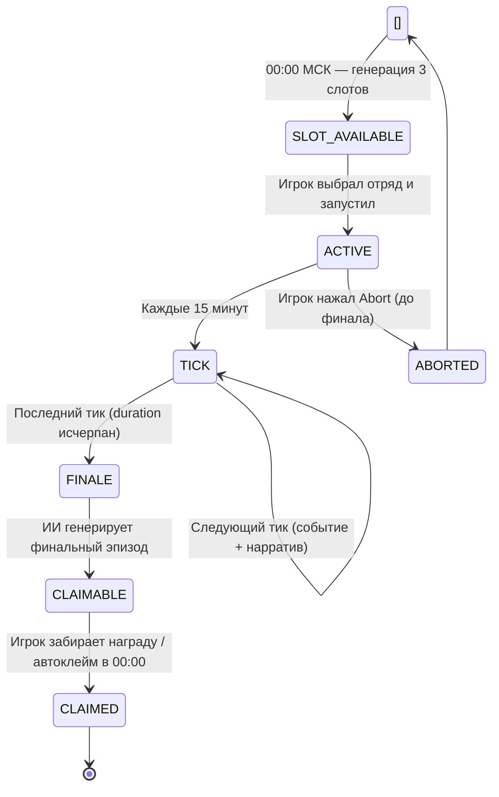

7. Экспедиции

Экспедиции — автономный PvE-режим прогрессии, в котором отряд наёмниц уходит в поход на заданное время, а игрок получает нарративные обновления и финальную награду без прямого управления боем. В отличие от обычных подземелий, здесь важен не пошаговый бой, а совокупность контр-способностей отряда, снижающих урон от испытаний выбранной миссии. Механика построена по принципу «отправил — жди — забери»: игрок принимает стратегические решения до старта, затем система самостоятельно разворачивает события через тиковый цикл.

7.1 Ежедневные слоты

Каждые сутки в 00:00 МСК сервер генерирует ровно три слота экспедиций. Слоты привязаны к текущей дате и уникальному seed-нонсу, что исключает повторение комбинации аффиксов при перегенерации. Все неиспользованные и незавершённые активные экспедиции предыдущего дня автоматически клеймятся (или отменяются) до момента создания новых слотов.

Каждый слот характеризуется:

| Атрибут слота | Описание |
|---|---|
| Biome tag | Биом локации (пещера, лес, руины, вулкан и др.) — задаёт визуальный тон и эмодзи-метку |
| Difficulty | Уровень сложности, определяющий базовую нагрузку на отряд |
| Duration | Длительность в минутах: 30 / 45 / 60 / 90 / 120 |
| Affixes | Набор активных аффиксов (префиксы и суффиксы) с уровнем I–V |
| Narrative archetype | Стилистический профиль нарратива (см. §7.4) |

Игрок видит все три слота одновременно и выбирает, в какой (или какие) отправить наёмниц. Одновременно у игрока может быть не более одной активной экспедиции, однако за сутки можно выполнить до трёх вылазок — по одной на каждый слот, последовательно запуская и завершая их. Лимит запущенных экспедиций в день и прочие параметры баланса определены в `game_config`.

7.2 Аффиксы, биомы и архетипы

Аффиксы — ключевой источник сложности. Каждый аффикс имеет:

- Категорию — одну из семи `CHALLENGE_CATEGORIES`: `cursed`, `enemy`, `hazard`, `knowledge`, `magic`, `nature`, `social`, либо расширенный набор DB-категорий (`elemental`, `blessed` и др.);
- Уровень I–V — определяет базовый процент урона от суммарного HP отряда за событие (детали баланса см. `COMBAT_FORMULAS` / `game_config`);
- Иконку-эмодзи — визуальная метка категории в UI.

Аффиксы могут комбинироваться: слот способен нести несколько аффиксов разных категорий, создавая многомерную угрозу. Например, комбинация `enemy` + `cursed` означает, что враги усилены тёмной магией, а `hazard` + `nature` — природную катастрофу.

Биом (`cave`, `forest`, `ruins`, `temple`, `volcano` и др.) — нарративная обёртка, определяющая декорации и тематику ИИ-текстов. Биом не влияет на механику урона, но визуально отражается в интерфейсе иконкой-эмодзи.

Нарративный архетип управляет тоном и структурой генерируемых историй: от гротескного юмора до мрачного эпика, от лёгкой иронии до серьёзного приключенческого повествования. Конкретный набор архетипов и их промпт-блоки определены в `expedition_narrative_catalog.py`. Архетип постоянен для конкретного слота и не меняется после генерации.

7.3 Выбор отряда и контр-механики

Перед стартом игрок формирует отряд из нанятых наёмниц. Система предварительно рассчитывает, насколько состав отряда покрывает категории испытаний слота:

- Расовый и классовый контр — каждая раса и класс наёмницы даёт снижение урона по одной или нескольким категориям. Например, эльфийская раса может давать защиту от `magic`, а класс воина — от `enemy`.
- Перки наёмниц — дополнительно перекрывают категории, не покрытые расой/классом. Некоторые перки также повышают вероятность благоприятных исходов событий или увеличивают награду.

В UI при выборе отряда отображается превью:

- какие теги слота покрыты (`covered_tags`), а какие остаются открытыми (`active_tags`);
- итоговая эффективность покрытия (`tag_effectiveness_pct`) в процентах;
- покрытые теги визуально зачёркиваются — игрок сразу видит слабые места состава и может скорректировать его до старта.

> Важно: проверка покрытия выполняется строго на сервере; данные с клиента не являются доверенными.

Именно поэтому разнообразие состава отряда (разные расы, классы, перки) стратегически важнее, чем «стак» одного типа контра. Детали коэффициентов контр-категорий и весов перков вынесены в `COMBAT_FORMULAS` и `game_config`.

7.4 Жизненный цикл экспедиции

SLOT_AVAILABLE — слот существует, экспедиция не запущена. Игрок может изучить аффиксы, подобрать отряд, сравнить слоты между собой.

ACTIVE → TICK — после старта сервис `expedition_ticks.py` обрабатывает тики с шагом 15 минут. На каждом тике:

1. Вычисляется урон от аффиксов с учётом расового / классового / перкового контра отряда. Значение `tag_mult` ограничено сверху (`cap`), что исключает отрицательный урон (эффект лечения) и деление на ноль.
2. ИИ-сервис (`expedition_events_ai.py`) генерирует короткий нарративный фрагмент в стиле архетипа слота. При недоступности внешнего API автоматически подставляется заглушка (`fallback narrative`).
3. Игрок получает уведомление (DM в Telegram на этапе WebApp / нативное уведомление Steam после переноса) с текстом события и текущим состоянием отряда.

FINALE — последний тик. ИИ генерирует финальный эпизод, подводящий итог похода. Формируется пакет наград.

CLAIMABLE — экспедиция ожидает клейма. Игрок может забрать награду вручную через UI. Если до 00:00 МСК клейм не произошёл — система клеймит автоматически перед ротацией слотов, чтобы игрок не терял прогресс из-за бездействия. Начисление наград выполняется атомарно: повторный запрос на клейм отклоняется на уровне сервера.

ABORTED — досрочная отмена. Условия частичного вознаграждения при аборте определяются балансом — детали см. `game_config`.

7.5 ИИ-нарратив

Генерация текста выполняется через `expedition_events_ai.py`, обращающийся к языковой модели через OpenRouter. Входные данные для каждого запроса включают:

- состав отряда — имена, расы, классы и перки наёмниц;
- аффиксы и биом слота — категории угроз и их уровни;
- narrative style block — промпт-инструкция архетипа, задающая стиль и запрещённые приёмы;
- контекст тика — номер события, предыдущий нарративный фрагмент (для связности).

Три типа генерируемого контента:

| Тип | Когда | Объём |
|---|---|---|
| Brief | Старт экспедиции | Короткий абзац-завязка |
| Tick narrative | Каждый тик | 2–4 предложения события |
| Finale event | Последний тик | Развёрнутый финальный эпизод |

После генерации текст проходит через `rhythm_rewrite_narrative` — постпроцессинг, выравнивающий ритм и стиль без потери смысла.

Генерация иллюстраций (при наличии) вынесена в асинхронную фоновую очередь и не блокирует основной цикл обработки тиков. Иллюстрации не влияют на геймплей.

7.6 UI: вкладка экспедиций

В интерфейсе (`dungeons.html`) экспедиции выделены в отдельную вкладку. Основные элементы:

- Карточки трёх слотов — биом, сложность, длительность, список аффиксов с иконками и уровнями, нарративный архетип.
- Конфигуратор отряда — список доступных нанятых наёмниц с фильтрацией; превью покрытия тегов (`#esm-difficulty-tags`) с зачёркиванием покрытых категорий и индикатором эффективности (`tag_effectiveness_pct`).
- Мониторинг активной экспедиции — прогресс-бар времени, лог последних нарративных тиков, кнопки «Claim» / «Abort».
- История — завершённые экспедиции текущего дня с итоговым нарративом и наградами.

При переносе на Steam вкладка сохраняет ту же логику: вместо Telegram DM используется нативная система уведомлений Steam Overlay или внутриигровой журнал событий, доступный без выхода из игры.

7.7 Ограничения и сброс

- Ежедневный лимит запущенных экспедиций — детали баланса см. `game_config`.
- Слоты не переносятся между днями: незапущенный слот исчезает при ротации.
- Автоклейм срабатывает на все завершённые, но не забранные экспедиции до создания новых слотов.
- Повторная генерация слотов того же дня (при технических сбоях) использует новый nonce, гарантируя уникальность комбинации аффиксов.
- Сброс в 00:00 МСК выполняется транзакционно: существующие активные экспедиции клеймятся или отменяются до создания новых слотов, исключая «зависание» в промежуточных состояниях.
