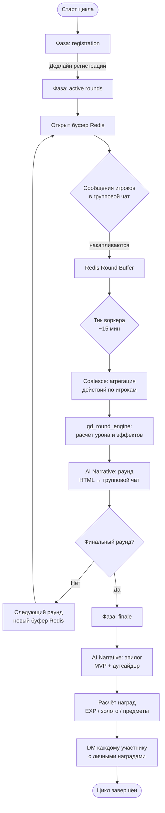

8. Групповые подземелья GD v1

Групповые подземелья (GD v1) — еженедельный кооперативный PvE-режим, в котором несколько игроков совместно проходят тематическое подземелье на протяжении серии раундов. Режим полностью заменяет устаревшие механики (`/gd_start`, `/engage`) и строится вокруг недельного цикла с чёткими фазами, буферизацией действий в Redis и AI-нарративом.

8.1 Недельный цикл и фазы

GD v1 существует в трёх последовательных фазах:

| Фаза | Описание | Ключевое действие |
|---|---|---|
| `registration` | Открытая запись в текущий цикл | Игроки отправляют `/gd_join` в групповой чат |
| `active rounds` | Серия игровых раундов (~15 мин каждый) | Воркер тикует раунды, буфер действий в Redis |
| `finale` | Подведение итогов, выдача наград | AI-нарратив эпилога, рассылка DM с наградами |

Цикл стартует автоматически по расписанию или принудительно через admin-команду, переходя из фазы в фазу без участия игроков. Один цикл охватывает одно тематическое подземелье, выбранное из шаблонов (`GDDungeonTemplate`).

8.2 Регистрация: `/gd_join`

Единственная публичная команда для входа в GD v1 — `/gd_join`, вводимая в групповом чате в период фазы `registration`. Бот фиксирует заявку в базе данных, связывая пользователя, его активного вайфу и текущий GD-цикл, после чего подтверждает запись в чат. Повторный вызов идемпотентен — игрок не записывается дважды.

После закрытия регистрации и перехода в `active rounds` новые участники не принимаются. Если игрок не успел зарегистрироваться — он наблюдает за ходом похода, но не получает наград.

> Команда `/gd_join` входит в основной список команд BotFather (scope: default) и отображается в меню команд Telegram.

8.3 Цикл раунда

Каждый раунд длится около 15 минут и управляется фоновым воркером (`gd_v1_worker`). Архитектура раунда строится на двух принципах.

Буфер действий в Redis. Все сообщения игроков в групповом чате, поступившие в течение раунда, накапливаются в Redis-буфере текущего раунда. Воркер читает буфер по тику — это исключает гонку состояний и позволяет корректно агрегировать активность всех участников перед расчётом.

Coalesce сообщений. Множественные сообщения одного игрока за раунд сворачиваются в единый вклад. Это снижает нагрузку на движок боя и делает вклад каждого участника детерминированным вне зависимости от частоты ввода.

Расчёт урона опирается на параметры активного вайфу игрока: расу, класс, уровень и экипировку, а также применяемые навыки и модификаторы (подробности — в `COMBAT_FORMULAS`, не включено в этот документ).

После обработки буфера воркер публикует в групповой чат HTML-сообщение с нарративом раунда и переходит к следующему раунду с новым буфером. По завершении последнего раунда цикл переходит в фазу `finale`.

8.4 AI-нарратив

GD v1 использует три точки генерации нарратива через `gd_narrative_ai`:

- Старт похода — вводный текст при переходе в `active rounds`: описание подземелья, состав группы с расами и классами вайфу.
- Нарратив раунда — после каждого тика воркер публикует в групповой чат HTML-сообщение с описанием событий раунда: кто нанёс удары, какие эффекты сработали, как изменилось состояние босса.
- Финальный эпилог — после последнего раунда генерируется эпилог: выделяется MVP (наибольший вклад) и наименее активный участник. Текст оформляется в 2 абзаца, 4–6 предложений.

Все нарративные тексты отправляются в формате HTML (Telegram HTML parse mode). После генерации текст прогоняется через `rhythm_rewrite_narrative` для улучшения ритмики — это второй LLM-вызов с инструкцией сохранить HTML-разметку (`preserve_html=True`). Стиль нарратива задаётся константами (`AI_NARRATIVE_GROTESQUE_HUMOR_RU`, `GD_NARRATIVE_FORMATTING_RU`).

При недоступности LLM каждая точка имеет fallback-заглушку — поход продолжается без AI-текста, раунды идут в штатном режиме.

8.5 Команды игрока и admin/test команды

Публичные команды (все пользователи группы):

| Команда | Где | Назначение |
|---|---|---|
| `/gd_join` | Групповой чат | Запись в текущий регистрационный цикл |

Активное участие в раундах не требует дополнительных команд — любые сообщения игрока в групповой чат в период `active rounds` попадают в буфер и засчитываются как активность.

Admin и test команды (доступны пользователям из `ADMIN_IDS` или `GD_V1_MANUAL_TEST_USER_IDS`):

| Команда | Назначение |
|---|---|
| `/gd_v1_test_join` | Принудительная регистрация тестового игрока |
| `/gd_v1_test_start` | Немедленный старт цикла (пропуск ожидания расписания) |
| `/gd_v1_force_round` | Принудительный тик раунда без ожидания таймера |
| `/gd_v1_battle_status` | Текущее состояние раунда: участники, буфер, счёт |
| `/gd_v1_admin_force_victory` | Немедленный переход в финал (пропуск оставшихся раундов) |
| `/gd_v1_peek_round_buffer` | Просмотр содержимого Redis-буфера текущего раунда |
| `/gd_v1_test_reset` | Удаление активных циклов и очистка Redis-буферов |

Типовой порядок тестового прогона: `gd_v1_test_join` → `gd_v1_test_start` → `gd_v1_force_round` (несколько раз) → `gd_v1_admin_force_victory` → `gd_v1_test_reset`.

При отсутствии прав на admin/test команды бот отвечает текстом отказа. Полная тишина в ответ на команды — признак проблемы с доставкой webhook или исходящих сообщений (см. диагностику `GROUP_CHAT_SOLO_AND_GD_DIAGNOSTICS`).

8.6 Приоритеты режимов и dual-path

Guild Raid блокирует Solo. Если для игрока активен Guild Raid, одиночное подземелье недоступно — персонаж занят рейдом гильдии.

GD v1 + Solo — dual-path. Групповое подземелье и одиночное подземелье могут существовать параллельно как два независимых пути прогрессии. Участие в GD v1 не блокирует одиночный прогресс игрока и наоборот: игрок, зарегистрированный в GD v1, продолжает получать урон по тексту в одиночном режиме в том же групповом чате. Урон и активность учитываются в отдельных Redis-структурах, не конфликтуя между режимами.

8.7 Награды и уведомления

По завершении финала воркер рассчитывает индивидуальные награды каждого участника: опыт, золото и возможные предметы. Размер награды зависит от места участника в рейтинге активности (очков) и применяет масштабирование по уровню персонажа (`gd_scaling.reward_level_multip`).

Сводный результат публикуется в групповой чат. Дополнительно каждый участник получает личное DM с итогами: место в группе, количество набранных очков активности, начисленный опыт с прогрессом до следующего уровня, золото и выпавшие предметы. Отправка DM управляется настройками уведомлений игрока (`player_notification_prefs`, тип `"group_dungeon"`). Если игрок отключил уведомления этого типа — DM не отправляется.

После начисления всех наград сессия фиксируется, все Redis-буферы очищаются, цикл переходит в завершённое состояние и ожидает следующего недельного тика.

> Детали формул расчёта урона, очков активности и масштабирования наград по уровню см. `COMBAT_FORMULAS` / `game_config` (не включено в этот документ).

8.8 WebApp: отображение статуса GD

В Telegram WebApp предусмотрен информационный экран статуса GD v1 для зарегистрированного участника. Если для текущего игрока существует активный цикл (фаза `registration` или `active rounds`), WebApp отображает:

- название текущего подземелья;
- текущую фазу и номер раунда;
- место игрока в рейтинге активности (если раунды уже шли);
- краткую сводку последнего нарратива.

Если активного цикла нет — блок GD скрыт или показывает дату следующего старта. WebApp не предоставляет управляющих действий для GD (вся интерактивность — через команды в групповом чате), выполняя исключительно информационную функцию.

8.9 Архитектурные компоненты GD v1

Разделение ответственности между сервисами:

| Компонент | Ответственность |
|---|---|
| `gd_cycle_service` | Управление жизненным циклом цикла: создание, переходы фаз, регистрация участников |
| `gd_v1_worker` | Фоновый воркер: тики раундов, чтение Redis-буфера, запуск движка боя, публикация нарратива, расчёт и выдача наград |
| `gd_round_engine` | Детерминированный движок расчёта раунда: агрегация действий, применение эффектов, обновление счёта |
| `gd_narrative_ai` | Генерация AI-текстов трёх типов с fallback-заглушками |
| `gd_scaling` | Масштабирование наград по уровню участников |
| `bot_handlers` | Приём команд и сообщений из групповых чатов, маршрутизация в буфер |

При переносе на Steam Telegram-специфичный транспорт (групповой чат, webhook, HTML-сообщения) заменяется на игровой UI, однако логика воркера, движка раунда и нарративного модуля остаётся переносимой без изменений при условии абстракции транспортного слоя. Рекомендуется вынести `gd_v1_worker` в отдельный микросервис, независимый от стабильности основного транспорта, и использовать push-обновления (WebSockets) для отображения статуса GD в реальном времени.
