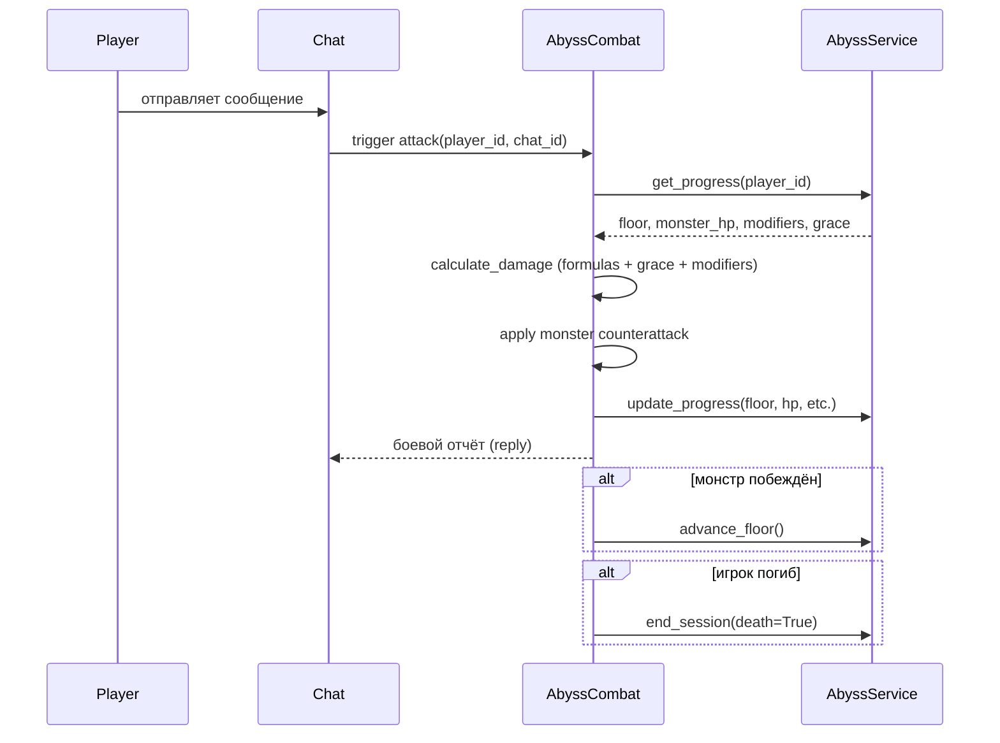

9. Бездна (Abyss)

Бездна — это эндгейм-активность в формате бесконечной башни с процедурно генерируемыми этажами. В отличие от стандартных подземелий (Solo Dungeon) и GD v1, Бездна сфокусирована на долгосрочном индивидуальном прогрессе, соревновательной составляющей и уникальных механиках усиления персонажа. Если в GD v1 группа синхронно штурмует одного общего босса и победа фиксируется коллективно, то в Бездне каждый игрок движется по собственной «ветке» башни — чужая смерть не прерывает вашу сессию.

9.1. Концепция и отличие от других режимов

| Параметр | Solo Dungeon | GD v1 | Бездна |
|---|---|---|---|
| Число участников | 1 | Группа | Группа (личный прогресс) |
| Прогресс | Общий по актам | Общий босс | Индивидуальный этаж |
| Атака | Команда / кнопка | Команда | Одно сообщение = одна атака |
| Скейлинг сложности | Фиксированный | Статичный | Бесконечный (модификаторы этажа) |
| Усиления | Нет | Нет | Выбор «Милостей» (Graces) |
| Сброс | Нет (проходится) | Ежедневный | Ежедневный + еженедельный |
| Лут | Предметы актов | GD-награды | Shards + предметы Бездны |
| Конец | Финальный босс | Победа / поражение | Смерть или выход |

9.2. Вход и жизненный цикл сессии

Игрок попадает в Бездну через соответствующую точку входа в интерфейсе. При первом посещении система инициирует новую сессию — создаётся запись текущего прогресса (`AbyssProgress`), и игрок переносится на первый этаж. При повторном входе, если сессия не была завершена смертью или истекла по таймауту простоя, прогресс возобновляется с того же этажа и состояния боя.

Перед входом система проверяет:
- наличие активной `AbyssProgress`-записи для данного игрока;
- не исчерпан ли дневной лимит этажей (детали — см. `game_config`);
- отсутствие активной сессии в другом чате.

Сессия завершается в трёх случаях:
- Поражение — HP основного вайфу падает до нуля; рекорд этажа сохраняется, прогресс сессии сбрасывается;
- Ручной выход — незавершённый бой сохраняется, игрок может вернуться позже;
- Таймаут простоя — автоматическое завершение при долгом отсутствии действий.

9.3. Боевая механика: одно сообщение — одна атака

Это центральная и намеренно простая механика Бездны. Любое текстовое сообщение в чате засчитывается как атака — игроку не нужно нажимать кнопки или вводить команды. Это снижает порог входа и органично встраивает боёвку в живой групповой чат.

Расчёт урона использует те же базовые строительные блоки, что и в обычных данжах (`calculate_message_damage`, `calculate_crit_chance`, `calculate_damage_reduction`), но поверх них накладываются модификаторы текущего этажа и активная Милость (Grace). После каждого удара монстр наносит ответный урон. Все числовые параметры скейлятся с ростом номера этажа. Детали формул — см. `COMBAT_FORMULAS` / `game_config`.

9.4. Этажи: генерация, модификаторы и рубежные боссы

Каждый этаж генерируется динамически при входе на него. Алгоритм определяет:
- группу монстров (одиночная цель или несколько);
- базовый шаблон противника из пула, соответствующего текущей глубине;
- один или несколько модификаторов этажа — постоянных эффектов на весь бой (например, усиление урона монстров, отражение части атак, замедление игрока).

Модификаторы случайны и масштабируются с ростом номера этажа, обеспечивая нарастающий вызов без ручного создания контента.

Через фиксированное число этажей игрок встречает рубежного босса (checkpoint boss). Победа над ним открывает экран выбора Милости (Grace) — временного мощного усиления, действующего фиксированное число последующих этажей. Игроку предлагается до трёх случайных вариантов; после выбора система генерирует следующий этаж и применяет эффект. Если игрок проигрывает боссу — он остаётся на том же рубежном этаже до победы или ручного выхода.

9.5. Ежедневный и еженедельный сброс (МСК)

Бездна использует двойной цикл сброса, привязанный к московскому времени.

Ежедневный сброс — 00:00 МСК:
- обнуляется счётчик дневных этажей (лимит продвижения за сутки);
- сбрасываются временные штрафы и флаги сессии;
- текущий бой сохраняется — возобновить можно сразу после сброса.

Еженедельный сброс — 00:00 МСК в понедельник:
- фиксируется и архивируется еженедельный лидерборд (`AbyssWeeklyLeaderboard`);
- начисляются shard-награды за занятые позиции;
- рекорды этажа за неделю обнуляются, начинается новый рейтинговый цикл.

Личный рекорд максимального этажа (all-time) не сбрасывается никогда — хранится отдельно и отображается в профиле игрока. Точные значения лимитов — см. `game_config`.

9.6. Лидерборд и Shard Rewards

Еженедельный лидерборд ранжирует игроков по максимальному этажу, достигнутому за текущую неделю. При равенстве этажа учитывается время достижения — кто дошёл раньше, тот выше.

По итогам недели игроки из топ-позиций получают Осколки Бездны (Abyss Shards) — особую валюту, недоступную в Solo Dungeon и GD v1. Oskolки используются в отдельном магазине или для крафта уникальных предметов Бездны. Точные пороги наград — см. `game_config`.

Лидерборд доступен как командой в чате, так и через личное меню бота.

9.7. Уведомления в личных сообщениях

Поскольку боевые события происходят в групповом чате и могут теряться в потоке сообщений, Бездна поддерживает систему уведомлений в ЛС. Игрок получает личное сообщение в следующих случаях:

- Смерть — сессия завершена, указан достигнутый этаж и личный рекорд;
- Победа над рубежным боссом — предложен выбор Милости (дублируется в ЛС, если игрок не отреагировал в чате);
- Ожидание выбора Милости — напоминание, если `pending_grace_choices` не закрыты долгое время;
- Еженедельная награда — начислены Shards, указана занятая позиция в лидерборде;
- Ежедневный сброс — информирование о снятии дневного ограничения;
- Дроп редкого предмета — уведомление с характеристиками выпавшего предмета Бездны.

Уведомления отправляются только тем игрокам, которые запустили бота в ЛС (стандартное ограничение Telegram). Все уведомления могут быть отключены в настройках аккаунта.

9.8. Особенности переноса на Steam

При переносе Бездны на Steam необходимо учесть следующее:

- Триггер атаки — механика «сообщение = атака» специфична для мессенджера. В Steam-версии потребуется явный UI-элемент (кнопка «Атаковать» или горячая клавиша) либо внутриигровой текстовый чат с аналогичным триггером. Необходимо реализовать rate limiting — ограничение частоты обработки входящих команд в рамках одной сессии для защиты от макросов и скриптов.
- Групповой чат — в Telegram это нативная среда; в Steam потребуется интеграция со Steam Chat или собственная комнатная система с лобби.
- ЛС-уведомления — заменяются Steam Notifications или внутриигровым журналом событий. Критически важно обеспечить доставку уведомлений о выборе Милости, чтобы сессия не зависала в ожидании.
- Временны́е зоны — сброс по МСК остаётся серверной логикой; клиент отображает локальное время сброса.
- Лидерборд — может быть интегрирован со Steam Leaderboards API как дополнительный канал отображения; основная логика остаётся на бэкенде.
- Целочисленное переполнение — при бесконечном скейлинге `plus_level` и характеристик монстров рекомендуется провести нагрузочное тестирование формул на экстремально высоких значениях этажей во избежание integer overflow.
- Атомарность операций — при высокой нагрузке необходимо обеспечить атомарность обновлений `AbyssProgress` и `AbyssCombat` в базе данных во избежание race conditions при одновременной обработке нескольких действий.
